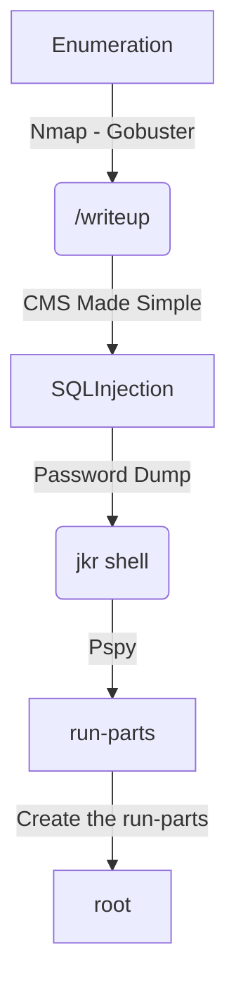

This was a "easy" box from HackTheBox. Yeah, it's really easy, if you explore it with a script which exists on exploit-db. If you try to reach the vulnerability without getting spoiler on it, with a code review, is very hard.

The vulnerability is a SQLInjection Blind Time-Based, extremelly hard to reproduce, maybe in the future I return here and do that without looking at the exploit and finding it on the source code. Now my knowledge about it is not enough for it.

# Diagram

Here is the diagram for this machine. It's a resume from it.



# Enumeration

First step is to enumerate the box. For this we'll use `nmap`

```sh
nmap -sV -sC -Pn 10.10.10.138
```

> -sV - Services running on the ports

> -sC - Run some standart scripts

> -Pn - Consider the host alive


## Port 80

Once we found just the port 80 opened, so let's focus on this one to enumerate it.

We open it on the browser and see what is being shown.


We look at the source code, nothing useful

We take a look on robots.txt and it take us to the writeup page


We look at the source code of it and get `CMS Made Simple`


We look for it's folder structure on the internet and find the CHANGELOG.txt file


It's `Version 2.2.9.1`

We search the exploit on searchsploit

```sh
searchsploit CMS Made Simple 2.2.9.1
```


## SQLInjection

Now we start building our script to explore this Blind Sqlinjetion Time-Based

For this on we will use one exploit already done. Since this vulnerability is not easy to see or to explore.

https://www.exploit-db.com/exploits/46635

```sh
python3 46635.py -u http://10.10.10.138/writeup --crack --wordlist /usr/share/wordlists/rockyou.txt
```


We "got" the credentials

```
jkr:raykayjay9
```

Sure

# jrk --> root

So, we ssh in it


And get a root shell, to better analyze the code


Now, with [pspy](https://github.com/DominicBreuker/pspy) we got the running proccesses


We see something interstring runninh each 3 minutes


Something is being cleaned... We try to ssh on the machine again

It seems to be executing the `run-parts`


We are member of the `staff` group.


We can write this `run-parts`!!!

Which are being executed as root

When a user logs in, root runs sh, which runs /usr/bin/env, which provides a specific path and runs run-parts on the update-motd.d folder. I'll immediately notice that the $PATH includes at the front the two folders I can write to.

I will write a script to /usr/local/bin/run-parts, make sure it's executable, and then ssh in again:


We are root!


# Conclusion

This box has a SQLInjection Blind Time-Based vulnerability, which are very hard to get. So I prefer to procced on studies and after, when I got more knowledge and practice with this kind of SQLI, I'll return here.